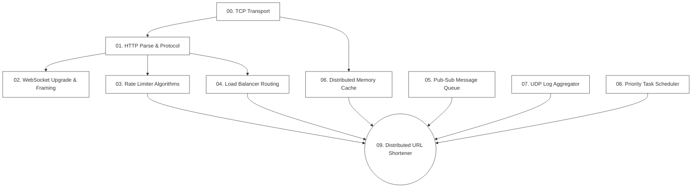

# 📚 System Design Laboratory: Learn by Building

Welcome to your personal hands-on **System Design Laboratory**. 

This repository is designed for developers who want to move beyond superficial system design interviews and actually understand how core infrastructure components function under the hood. You won't just draw boxes and arrows; you will write the actual code that parses bytes, routes packets, buffers logs, coordinates concurrent workers, and encodes URLs.

By building these 10 progressive projects from scratch, you will learn the foundational concepts of networking, concurrency, protocols, distributed storage, and event-driven architectures.

---

## 🗺️ The Learning Path

Each project is structured to take you from a raw network layer up to a fully cohesive, distributed system.



---

## 🛠️ The 10 Laboratories

| Lab | Project Name | Focus Concepts | Production Real-Life Equivalent |
| :--- | :--- | :--- | :--- |
| **00** | [Implement TCP from Scratch](./projects/00-implement-tcp) | Sockets, FD limits, Buffers, Streams, Keep-Alive | Raw TCP Sockets, OS Kernel Networking |
| **01** | [HTTP/1.1 Web Server](./projects/01-http-server) | Request/Response parsing, RFC compliance, Chunked encoding | Nginx, Node.js HTTP Module, httpd |
| **02** | [WebSocket Chat Broker](./projects/02-websocket-chat) | Handshake upgrades, Frame masking/unmasking, Broadcasts | Socket.io, WS servers, pusher.com |
| **03** | [Rate Limiter Engines](./projects/03-rate-limiters) | Token/Leaky Buckets, Fixed/Sliding Windows, Concurrency | Cloudflare WAF, Redis Rate Limiting |
| **04** | [Reverse Proxy & Load Balancer](./projects/04-load-balancer) | Round Robin, Weighted algorithms, Active Health Checking | HAProxy, Nginx Upstreams, Envoy |
| **05** | [Pub-Sub Message Queue](./projects/05-message-queue) | Offsets, FIFO queues, Broker topology, ACK/NACK | RabbitMQ, Apache Kafka, Amazon SQS |
| **06** | [Distributed Cache](./projects/06-distributed-cache) | RESP protocol, Hash maps, LRU/LFU eviction, TTL timers | Redis, Memcached |
| **07** | [Log Aggregator Server](./projects/07-log-aggregator) | UDP vs TCP throughput, Ring buffers, Structured queries | ELK Stack, Logstash, Vector, Fluentd |
| **08** | [Priority Task Scheduler](./projects/08-task-scheduler) | Min-heaps, Exponential backoff retries, Worker pools | BullMQ, Celery, Quartz Scheduler |
| **09** | [Distributed URL Shortener](./projects/09-url-shortener) | Base62 encoding, Storage design, Full system integration | Bitly, TinyURL |

---

## 🔬 How Each Lab is Structured

To help you learn conceptually from scratch without copy-pasting, every folder contains:

1. **A Conceptual Handbook (`README.md`)**:
   - **How it Works**: Deep dive into the theory, network layers, and state machines.
   - **Why We Use It**: Real-life production architectures and trade-offs.
   - **Diagrams**: High-fidelity, clean, white-background textbook illustrations.
   - **Add-ons & Advanced Challenges**: Topics to push your understanding further.
2. **A Starter Project Template (`/starter`)**:
   - **TypeScript/JavaScript Boilerplate**: Pre-configured directory with clean interfaces and typed contracts.
   - **Unit Tests (`index.test.ts`)**: Exhaustive, robust tests written to test **behavior** (TDD-style) instead of internal implementation details.
   - **Skeletal Code (`index.ts`)**: Clean structure with `// TODO` blocks and inline comments guiding your logic.

---

## 🚀 Getting Started

1. Navigate to the project directory you want to start with (e.g. `cd projects/00-implement-tcp`).
2. Read the conceptual handbook (`README.md`) to understand the underlying architecture and physics of the system.
3. Open the `/starter` folder.
4. Install dependencies:
   ```bash
   npm install
   ```
5. Run the tests in watch mode:
   ```bash
   npm test
   ```
6. Implement the `// TODO` items in `index.ts` until all the test cases turn **GREEN**!

Happy coding! You are about to master backend engineering at its deepest levels.