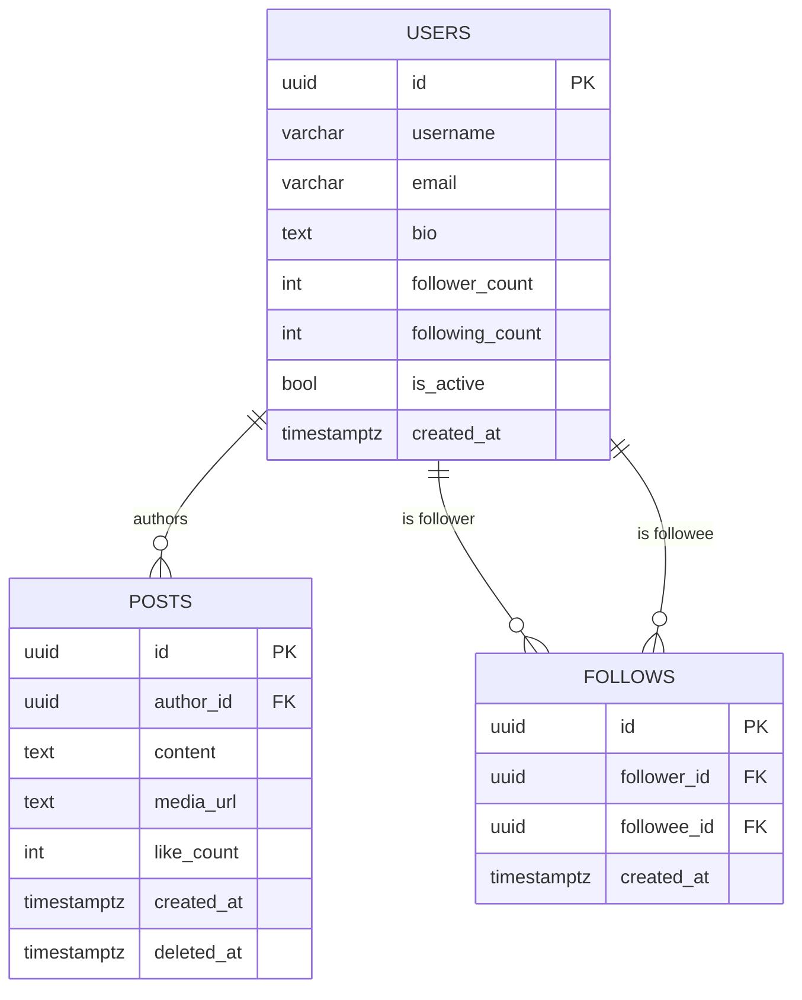
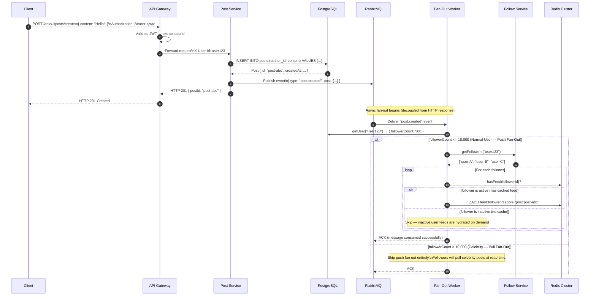
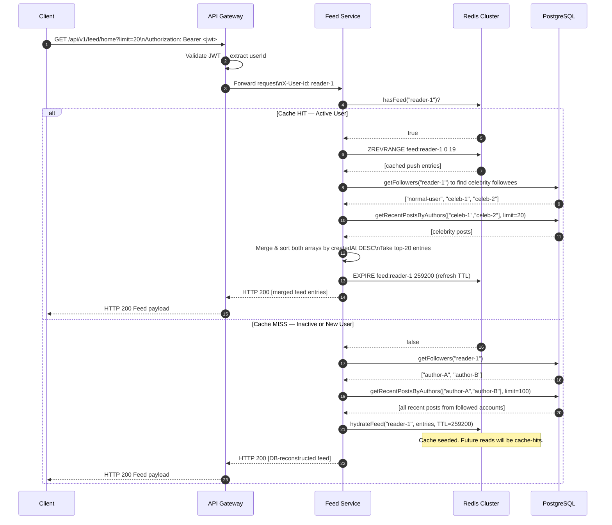
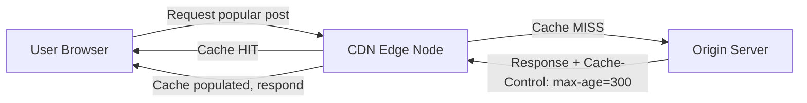

# 🏆 Phase 5 Capstone: Social Feed Generation Microservices

Welcome to the Capstone project of your engineering curriculum! This capstone integrates everything you have mastered across system design, database modeling, language deep-dives, caching networks, asynchronous event queues, and DevOps container orchestration. 

You will design and build a production-grade, distributed, high-scale **Social Feed Generation Engine** (similar to Twitter/X or Facebook). You will implement a dual-path fan-out model (push vs pull), an API Gateway router, multi-layered Redis caches, and a containerized orchestration pipeline, fully verified under strict automated validation.

---

## 1. 💡 System Architecture

A high-scale social feed requires balancing high write rates (users publishing posts) and high read rates (users viewing their feed). A naive relational query (`SELECT * FROM posts JOIN follows ... ORDER BY created_at DESC`) fails completely at scale due to disk I/O bottlenecks.

To scale, the system is split into specialized microservices and uses a **hybrid feed generation architecture**.

### Microservice Topology

```mermaid
graph TD
    classDef default fill:#ffffff,stroke:#333333,stroke-width:1px,color:#333333;
    classDef service fill:#f9f9f9,stroke:#333333,stroke-width:2px,color:#333333;

    Client([Mobile/Web Client]) -->|Requests| Gateway[API Gateway (Reverse Proxy / Routing)]
    
    Gateway -->|Auth & Routing| PostService[Post Service (Spring Boot)]:::service
    Gateway -->|Auth & Routing| FollowService[Follow Service (Node.js)]:::service
    Gateway -->|Auth & Routing| FeedService[Feed Service (Python / FastAPI)]:::service
    
    PostService -->|Write Post| DB[(PostgreSQL Primary)]
    PostService -->|Publish 'Post Created' Event| Broker[RabbitMQ / Kafka Message Broker]
    
    FollowService -->|Write Follow Relation| FollowDB[(PostgreSQL Follows)]
    
    Broker -->|Message Consumption| Workers[Feed Fan-Out Workers (Python/Go)]:::service
    Workers -->|Query Followers| FollowService
    Workers -->|Push to Timeline| RedisCache[(Redis Cluster: Active Timelines)]
    
    FeedService -->|Query Active Timeline (Push Path)| RedisCache
    FeedService -->|Fetch Inactive Feed (Pull Path)| DB
```

---

## 2. ⚡ In-Depth L1 & L2 Mechanics

### 1. The Core Algorithmic Tradeoff: Fan-Out on Write vs. Fan-Out on Read

To deliver instant page loads (< 100ms), social applications pre-compute feeds. However, this optimization introduces a severe system design tradeoff:

```mermaid
graph TD
    subgraph Fan-Out on Write (Push Path)
        Post[User Posts] --> Worker[Queue Workers]
        Worker --> Cache[Pre-compute Feed for all Followers in Redis]
        Cache --> FastRead[Instant Feed Reads for Active Followers]
    end
    
    subgraph Fan-Out on Read (Pull Path)
        InactiveRead[User Requests Feed] --> Query[Join Posts & Follows Tables in DB]
        Query --> SlowRead[Expensive Computation on Read]
    end
```

#### A. Fan-Out on Write (Push Model)
*   **Mechanic**: When a user creates a new post, an event is published to the broker. Fan-out workers read the user's follower list from the Follow Service, and then prepend the post ID directly to the **Redis Sorted Set (ZSET)** or list of every single follower.
*   **Pros**: Reads are incredibly fast (`O(1)` or `O(log N)` to fetch the cached array).
*   **Cons**: Extremely expensive when a celebrity or high-profile user (e.g., millions of followers) posts. Writing to millions of Redis keys concurrently causes memory exhaustion, network saturation, and queuing delays.

**Redis ZADD example (push path):**
```bash
# Score = Unix timestamp in milliseconds (ensures chronological ordering)
ZADD feed:user_B 1705276800000 "post:post-abc123"
ZADD feed:user_C 1705276800000 "post:post-abc123"
# Retrieve top-20 most recent entries (highest score = newest)
ZREVRANGE feed:user_B 0 19 WITHSCORES
```

#### B. Fan-Out on Read (Pull Model)
*   **Mechanic**: The system does not pre-compute feeds for followers. When a user opens their home page, the Feed Service queries the database directly to join the list of followed accounts with the posts table, sorting chronologically on-the-fly.
*   **Pros**: Writes are extremely lightweight and fast. No redundant data stored in memory cache.
*   **Cons**: Reads are computationally expensive. A user following thousands of active creators forces the DB to run complex indexing and sorting operations, leading to latency spikes and database CPU exhaustion.

**SQL equivalent of "pull on read":**
```sql
SELECT p.*
FROM posts p
INNER JOIN follows f ON f.followee_id = p.author_id
WHERE f.follower_id = $1
ORDER BY p.created_at DESC
LIMIT 20;
```

#### C. The Production Solution: Hybrid Feed Pipeline
Your capstone project will implement a **Hybrid Fan-Out Strategy**:
1.  **Standard Users**: Fan-out on **Write (Push)**. Their posts are actively pushed to their followers' cached Redis feeds.
2.  **Celebrities/Influencers (e.g., > 10,000 followers)**: Fan-out on **Read (Pull)**. Their posts are *not* pushed to followers' caches.
3.  **Feed Construction**: When an active user requests their timeline, the Feed Service fetches their pre-computed cache from Redis (Push path) AND queries the recent posts of any celebrity they follow (Pull path), merging the two streams chronologically in-memory before returning them.

---

### 2. Timeline Cache Invalidation & TTL Policies

Memory is an expensive resource. Keeping timelines cached for inactive users is a waste of RAM.
*   **Active Users Filter**: Only maintain pre-computed feeds in Redis for users who have logged in or interacted with the system in the last 7 days.
*   **Least Recently Used (LRU)**: Configure Redis with a `volatile-lru` or `allkeys-lru` eviction policy.
*   **Time-to-Live (TTL)**: Apply a sliding TTL (e.g., 72 hours) to active timelines. When a user requests their feed, update the TTL to extend its life in memory.
*   **Hydration Gate**: If an inactive user returns after weeks of absence, the cache is missing (Cache Miss). The Feed Service will hit the PostgreSQL database to fully "re-hydrate" their timeline, saving it back to Redis and setting the initial TTL.

**Setting and refreshing TTL in Redis:**
```bash
# On every read, refresh the expiry to 72 hours (sliding window)
EXPIRE feed:user_B 259200   # 72 * 3600 = 259200 seconds

# On hydration from DB (cache miss), set initial TTL
SET feed:user_inactive_X "<serialized-data>" EX 259200
```

---

### 3. API Gateway & Microservices Communication

To prevent external clients from direct access to internal microservice ports, you will use an API Gateway:
*   **Reverse Proxy Routing**: Upstream mapping matches paths (e.g., `/api/v1/posts/*` -> Post Service:8081, `/api/v1/feed/*` -> Feed Service:8083).
*   **Authentication Offloading**: The Gateway intercepts all incoming requests, validates JWT claims, decodes user identity headers, and propagates them as `X-User-Id` downstream to the microservices.
*   **Resiliency (Circuit Breakers & Retries)**: Implement circuit breaking on downstream inter-service calls. If the Post database is sluggish, downstream calls quickly fail-fast without consuming threads.

**JWT validation pseudocode in the Gateway:**
```typescript
function validateAndExtractUser(authHeader: string): string {
  // 1. Strip "Bearer " prefix
  const token = authHeader.replace(/^Bearer\s+/i, "");
  // 2. Verify signature with public key / shared secret
  const payload = jwt.verify(token, SECRET_KEY);
  // 3. Return user ID to be injected as X-User-Id downstream
  return payload.sub;
}
```

---

## 3. 🗂️ Architecture Decision Records (ADRs)

Architecture Decision Records document the **why** behind the technology choices — not just what was chosen, but what alternatives were considered and rejected, and the long-term consequences of each decision.

---

### ADR-001: PostgreSQL vs. NoSQL for Persistent Storage

| Dimension | PostgreSQL (Chosen) | MongoDB / DynamoDB (Alternative) |
|---|---|---|
| **ACID Transactions** | Full ACID — critical for consistent follow/unfollow operations | Eventual consistency; complex workarounds needed |
| **Relational Joins** | Native JOIN support for `posts ⟶ follows ⟶ users` | Requires denormalization or application-level joins |
| **Schema Enforcement** | Strict schema prevents bad data entering the system | Flexible schema risks data inconsistency over time |
| **Query Flexibility** | Rich SQL with CTEs, window functions, full-text search | Limited query surface unless using aggregation pipelines |
| **Read Scaling** | Read replicas via streaming replication | Native sharding, but operational complexity |

**Decision**: PostgreSQL was chosen because:
1. The social graph (follows table) is inherently **relational** — it represents edges in a graph, and SQL JOIN semantics map naturally onto this.
2. Correctness of follow/unfollow counts is critical for the celebrity threshold check (`follower_count > 10,000`). ACID transactions ensure no phantom reads occur during concurrent follow/unfollow operations.
3. PostgreSQL's `JSONB` columns allow hybrid structured + semi-structured data if post metadata grows in complexity.

**Consequence**: At extreme scale (>100M users), PostgreSQL requires horizontal partitioning (sharding by `user_id`). This is a deferred architectural decision — sharding should be added when read replica fan-out no longer satisfies read latency SLAs.

```sql
-- Example: Follow/Unfollow as an ACID transaction
BEGIN;
  INSERT INTO follows (follower_id, followee_id) VALUES ($1, $2)
    ON CONFLICT DO NOTHING;
  UPDATE users SET follower_count = follower_count + 1 WHERE id = $2;
COMMIT;
```

---

### ADR-002: Redis Sorted Sets for Timeline Cache

**Why Redis Sorted Sets (ZSET) instead of plain Lists or Hash Maps?**

A social timeline has three critical requirements:
1. **Chronological ordering** — posts must appear newest-first.
2. **Range reads** — fetch the top-N most recent posts efficiently.
3. **Score-based deduplication** — a post arriving via both push (fan-out) and pull (celebrity merge) must not appear twice.

| Data Structure | Insert | Ordered Read | Deduplication | Memory |
|---|---|---|---|---|
| Redis List (LPUSH) | O(1) | O(N) full scan | ❌ No | Low |
| Redis Hash | O(1) | ❌ Unordered | ✅ By key | Low |
| **Redis ZSET** | **O(log N)** | **O(log N + M)** | **✅ By member** | Medium |
| Redis Stream | O(1) | O(N) range scan | ❌ No | Higher |

**Decision**: Redis Sorted Sets with `score = createdAt.getTime()` (Unix milliseconds) achieve chronological ordering as a first-class feature of the data structure. `ZREVRANGEBYSCORE` retrieves the top-N posts in O(log N + M) time, where M is the result count.

```bash
# Add post to sorted timeline
ZADD feed:user123 1705276800000 "post:abc"

# Read top-10 most recent entries
ZREVRANGE feed:user123 0 9

# Remove oldest entries to cap feed size at 1000
ZREMRANGEBYRANK feed:user123 0 -1001
```

---

### ADR-003: RabbitMQ vs. Apache Kafka for the Message Broker

| Dimension | RabbitMQ (Chosen for Dev) | Apache Kafka (Production Scale) |
|---|---|---|
| **Message Model** | Queue-based (push delivery) | Log-based (pull delivery, consumer offsets) |
| **Replay** | ❌ Messages deleted after ACK | ✅ Immutable log, replay from any offset |
| **Throughput** | ~50k–100k msg/s | ~1M+ msg/s per partition |
| **Operational Complexity** | Low — runs in a single Docker container | High — requires ZooKeeper/KRaft, partition planning |
| **Consumer Groups** | ✅ Competing consumers (work queues) | ✅ Consumer groups with partition assignment |
| **Fan-Out Pattern** | Via Exchange + Bindings (fanout/topic) | Via multiple consumer groups on same topic |

**Decision (Development/Capstone)**: RabbitMQ is used in this capstone because:
1. **Simplicity** — a single `docker-compose` container is sufficient; no cluster setup needed.
2. **Beginner-friendly** — the Management UI at `localhost:15672` provides visual insight into queues, messages, and consumers.
3. **Sufficient throughput** — for a local dev environment with simulated fan-out, RabbitMQ's throughput is more than adequate.

**Production Recommendation**: Migrate to Kafka when:
- Daily message volume exceeds 50 million events.
- Fan-out workers need message replay for audit or reprocessing.
- Multiple independent consumer groups need to consume the same event stream independently (e.g., fan-out worker + analytics pipeline + notification service).

```
RabbitMQ Exchange Topology for Post Events:
  Exchange: post.events (type=topic)
  Routing Key: post.created
  Bindings:
    → Queue: fanout.workers      (fan-out workers)
    → Queue: notification.worker (push notifications)
    → Queue: analytics.worker    (engagement tracking)
```

---

## 4. 🗄️ Database Schema

The following SQL schema defines the full persistent data model. All tables include audit timestamps. Indexes are defined for the most critical query patterns.

```sql
-- ─────────────────────────────────────────────────────────────────────────────
-- TABLE: users
-- Purpose: Stores all registered user accounts and their cached follower count.
-- The follower_count column is denormalized (updated via trigger or service)
-- to avoid a COUNT(*) query on the follows table during celebrity threshold checks.
-- ─────────────────────────────────────────────────────────────────────────────
CREATE TABLE users (
    id              UUID PRIMARY KEY DEFAULT gen_random_uuid(),
    username        VARCHAR(50)  NOT NULL UNIQUE,
    email           VARCHAR(255) NOT NULL UNIQUE,
    bio             TEXT,
    avatar_url      TEXT,
    follower_count  INTEGER      NOT NULL DEFAULT 0 CHECK (follower_count >= 0),
    following_count INTEGER      NOT NULL DEFAULT 0 CHECK (following_count >= 0),
    is_active       BOOLEAN      NOT NULL DEFAULT TRUE,
    created_at      TIMESTAMPTZ  NOT NULL DEFAULT NOW(),
    updated_at      TIMESTAMPTZ  NOT NULL DEFAULT NOW()
);

-- Index for fast username lookups (login, profile pages)
CREATE INDEX idx_users_username ON users (username);

-- Index to quickly find all celebrity accounts (for hybrid feed query)
CREATE INDEX idx_users_follower_count ON users (follower_count DESC);


-- ─────────────────────────────────────────────────────────────────────────────
-- TABLE: posts
-- Purpose: Stores all user-generated content (text posts, links, media references).
-- author_id is a foreign key to users — cascades on user deletion for GDPR compliance.
-- ─────────────────────────────────────────────────────────────────────────────
CREATE TABLE posts (
    id          UUID         PRIMARY KEY DEFAULT gen_random_uuid(),
    author_id   UUID         NOT NULL REFERENCES users(id) ON DELETE CASCADE,
    content     TEXT         NOT NULL CHECK (char_length(content) BETWEEN 1 AND 280),
    media_url   TEXT,
    like_count  INTEGER      NOT NULL DEFAULT 0,
    repost_count INTEGER     NOT NULL DEFAULT 0,
    created_at  TIMESTAMPTZ  NOT NULL DEFAULT NOW(),
    updated_at  TIMESTAMPTZ  NOT NULL DEFAULT NOW(),
    deleted_at  TIMESTAMPTZ  -- Soft delete: NULL = visible, non-NULL = removed
);

-- Primary access pattern: "give me the N most recent posts by author X"
-- Supports both single-author and multi-author (IN clause) queries
CREATE INDEX idx_posts_author_created ON posts (author_id, created_at DESC)
    WHERE deleted_at IS NULL;

-- Supports feed reconstruction query: recent posts from a set of authors
CREATE INDEX idx_posts_created_at ON posts (created_at DESC)
    WHERE deleted_at IS NULL;


-- ─────────────────────────────────────────────────────────────────────────────
-- TABLE: follows
-- Purpose: Stores the social graph as directed edges (follower → followee).
-- A unique constraint on (follower_id, followee_id) prevents duplicate follows.
-- A check constraint prevents self-follows.
-- ─────────────────────────────────────────────────────────────────────────────
CREATE TABLE follows (
    id          UUID         PRIMARY KEY DEFAULT gen_random_uuid(),
    follower_id UUID         NOT NULL REFERENCES users(id) ON DELETE CASCADE,
    followee_id UUID         NOT NULL REFERENCES users(id) ON DELETE CASCADE,
    created_at  TIMESTAMPTZ  NOT NULL DEFAULT NOW(),

    CONSTRAINT uq_follows       UNIQUE (follower_id, followee_id),
    CONSTRAINT no_self_follow   CHECK  (follower_id <> followee_id)
);

-- "Who follows user X?" — Used by fan-out worker to get follower list
CREATE INDEX idx_follows_followee ON follows (followee_id);

-- "Who does user X follow?" — Used by feed service to identify celebrity followees
CREATE INDEX idx_follows_follower ON follows (follower_id);


-- ─────────────────────────────────────────────────────────────────────────────
-- TRIGGER: Auto-update follower_count on INSERT/DELETE in follows table
-- This keeps users.follower_count in sync without an extra query.
-- ─────────────────────────────────────────────────────────────────────────────
CREATE OR REPLACE FUNCTION update_follower_count() RETURNS TRIGGER AS $$
BEGIN
    IF TG_OP = 'INSERT' THEN
        UPDATE users SET follower_count = follower_count + 1 WHERE id = NEW.followee_id;
        UPDATE users SET following_count = following_count + 1 WHERE id = NEW.follower_id;
    ELSIF TG_OP = 'DELETE' THEN
        UPDATE users SET follower_count = GREATEST(follower_count - 1, 0) WHERE id = OLD.followee_id;
        UPDATE users SET following_count = GREATEST(following_count - 1, 0) WHERE id = OLD.follower_id;
    END IF;
    RETURN NULL;
END;
$$ LANGUAGE plpgsql;

CREATE TRIGGER trg_follows_count
AFTER INSERT OR DELETE ON follows
FOR EACH ROW EXECUTE FUNCTION update_follower_count();
```

### Schema Entity-Relationship Diagram



---

## 5. 🔀 Sequence Diagrams

### Post-Creation Flow (Full Write Path)

This diagram shows the complete lifecycle of a single post from the moment the user submits it to the moment it appears in all active followers' timelines.



---

### Feed-Read Flow (Hybrid Pull + Push Merge)

This diagram shows what happens when a user opens their home timeline — covering both the cache-hit path and the cache-miss (hydration) path.



---

## 6. 🛠️ Step-by-Step Implementation Roadmap

This roadmap breaks the capstone into sequenced milestones. Each milestone has a clear definition of done and maps to specific test assertions.

### Milestone 1 — Project Scaffolding & Local Environment (Day 1)

**Goal**: All local services running, TypeScript compiles, test runner passes with "not implemented" stubs giving meaningful Red failures.

- [ ] `docker-compose up -d` starts PostgreSQL, Redis, and RabbitMQ without errors.
- [ ] Connect to Postgres: `psql -h localhost -U learner -d social_feed` — verify connection.
- [ ] Run the SQL schema (Section 4) to create `users`, `posts`, `follows` tables.
- [ ] Run `npm install` inside `starter/`.
- [ ] Run `npx vitest run` — all tests should fail with "not implemented" errors (Red state).
- [ ] Verify test count: should show exactly 8+ failing tests.

**Verification:**
```bash
docker compose ps           # All services: "Up"
npx vitest run 2>&1 | grep -E "fail|pass"
```

---

### Milestone 2 — FanOutWorker: Push Fan-Out for Normal Users (Day 1–2)

**Goal**: Implement `FanOutWorker.processPostCreated` to pass the first two test assertions.

**Algorithm to implement (step-by-step):**
```
1. Call db.getUser(post.authorId) → author
2. If author.followerCount > CELEBRITY_FOLLOWER_THRESHOLD → return { pushedTo: 0 }
3. Call db.getFollowers(post.authorId) → followerIds[]
4. For each followerId:
   a. Call cache.hasFeed(followerId)
   b. If true → call cache.pushToFeed(followerId, FeedEntry { source: "push" })
   c. If false → skip (inactive user, do not hydrate here)
5. Return { pushedTo: <count of active followers pushed to> }
```

**Acceptance Tests to pass:**
- `FanOutWorker > should push a normal user post to all active followers caches`
- `FanOutWorker > should skip fan-out entirely for a celebrity user`

---

### Milestone 3 — FeedService: Hybrid Timeline Assembly (Day 2–3)

**Goal**: Implement `FeedService.getTimeline` to handle both cache-hit (active user) and cache-miss (inactive user) paths.

**Algorithm — Cache Hit path:**
```
1. Call cache.hasFeed(userId) → true
2. Call cache.getFeed(userId, limit) → pushEntries[]
3. Call db.getFollowers(userId) → followedIds[]
4. For each followedId:
   a. Call db.getUser(followedId) → user
   b. If user.followerCount > CELEBRITY_THRESHOLD → add to celebrityIds[]
5. Call db.getRecentPostsByAuthors(celebrityIds, limit) → celebPosts[]
6. Convert celebPosts → FeedEntry[] with source: "pull"
7. Merge pushEntries + pullEntries, sort by createdAt DESC, return top `limit`
8. Refresh Redis TTL: cache.hydrateFeed(userId, merged, 72 * 3600)
```

**Algorithm — Cache Miss path:**
```
1. Call cache.hasFeed(userId) → false
2. Call db.getFollowers(userId) → followedIds[]
3. Call db.getRecentPostsByAuthors(followedIds, limit * 5) → allPosts[]
4. Convert allPosts → FeedEntry[] with source: "pull"
5. Call cache.hydrateFeed(userId, entries, 72 * 3600) to seed Redis
6. Return entries.slice(0, limit)
```

**Acceptance Tests to pass:**
- `FeedService > should return a merged timeline (push + pull) for an active user following a celebrity`
- `FeedService > should hydrate the cache and return DB feed for an inactive user (cache miss)`
- `FeedService > cache-miss + celebrity pull triggers full DB pull and seeds cache with 72h TTL`

---

### Milestone 4 — APIGateway: JWT Validation & Routing (Day 3)

**Goal**: Implement `APIGateway.handleRequest` to validate the Authorization header, extract user identity, route to the correct service, and inject `X-User-Id` downstream.

**Algorithm:**
```
1. Check req.headers["authorization"] exists → if not, return { status: 401, error: "Unauthorized" }
2. Extract token: strip "Bearer " prefix
3. Decode token (for stub: parse Base64 payload or split on ".") → extract userId
4. Call registry.resolve(req.path) → serviceName
5. If serviceName === null → return { status: 404, error: "Route not found" }
6. Return { status: 200, service: serviceName, data: { forwardedUserId: userId } }
```

**Token format for the stub (no real crypto needed):**
```
"Bearer <base64({"sub":"user-123","role":"user"})>.<sig>"
The stub only needs to split on "." and decode part[0] from base64.
```

**Acceptance Tests to pass:**
- `APIGateway > should route /api/v1/posts/* requests to PostService`
- `APIGateway > should route /api/v1/feed/* requests to FeedService`
- `APIGateway > should return 401 when the Authorization header is missing`
- `APIGateway > should return 404 for an unknown route`
- `APIGateway > should inject X-User-Id header extracted from auth token into downstream service`

---

### Milestone 5 — Integration & All Tests Green (Day 4)

**Goal**: Every test assertion passes. Achieve full Green state.

- [ ] Run `npx vitest run` — all tests pass.
- [ ] Review test output for any skipped or todo tests.
- [ ] Run `docker compose down -v` to verify clean teardown.
- [ ] Commit and push: `git add . && git commit -m "feat: implement capstone social feed engine"`

---

## 7. 📈 Scaling to 1 Million Users

As the platform grows from thousands to millions of daily active users, each layer of the system requires deliberate scaling strategies.

### Layer 1: PostgreSQL Horizontal Sharding

A single PostgreSQL instance can comfortably handle ~10,000 concurrent connections and ~100GB of data. Beyond that, horizontal sharding is required.

```mermaid
graph TD
    App[Application / Feed Service]
    Router[Shard Router (consistent hashing)]
    
    App --> Router
    Router -->|userId % 4 == 0| Shard0[(Shard 0: users A-D)]
    Router -->|userId % 4 == 1| Shard1[(Shard 1: users E-J)]
    Router -->|userId % 4 == 2| Shard2[(Shard 2: users K-Q)]
    Router -->|userId % 4 == 3| Shard3[(Shard 3: users R-Z)]
```

**Sharding Key Selection:**
- Shard by `user_id` (UUID → consistent hash). This keeps all of a user's posts and follows on the same shard.
- Cross-shard queries (e.g., building a timeline from follows across shards) require **scatter-gather** — the Feed Service queries all relevant shards in parallel and merges results in-memory.

**When to shard:**
- Single-node write IOPS > 70% sustained → shard posts table.
- `follows` table exceeds 1 billion rows → shard on `follower_id`.

---

### Layer 2: PostgreSQL Read Replicas

For read-heavy workloads (timeline construction, profile lookups), route all `SELECT` queries to one or more read replicas connected via streaming replication from the primary.

```
Primary (R/W)  ──WAL streaming──>  Replica 1 (RO)
                                ──WAL streaming──>  Replica 2 (RO)

Connection pool configuration:
  write_pool → Primary (port 5432)
  read_pool  → Replica 1 + Replica 2 (round-robin or random)
```

```typescript
// Route reads to replica, writes to primary
async function getUser(id: string): Promise<User | null> {
  // readPool connects to a read replica
  return readPool.query("SELECT * FROM users WHERE id = $1", [id]);
}

async function savePost(post: Omit<Post, "id">): Promise<Post> {
  // writePool connects to the primary
  return writePool.query("INSERT INTO posts ...", [...]);
}
```

---

### Layer 3: Redis Cluster Sharding

A single Redis node holds up to ~100GB RAM. Distribute the `feed:userId` keyspace across a Redis Cluster (16,384 hash slots).

```
Redis Cluster (3 primary + 3 replica nodes)
  Node 1: slots 0–5460      → feeds for userId hash % 3 == 0
  Node 2: slots 5461–10922  → feeds for userId hash % 3 == 1
  Node 3: slots 10923–16383 → feeds for userId hash % 3 == 2

Replication: each primary has 1 replica for failover
```

```bash
# Create a 6-node Redis Cluster
redis-cli --cluster create \
  127.0.0.1:7001 127.0.0.1:7002 127.0.0.1:7003 \
  127.0.0.1:7004 127.0.0.1:7005 127.0.0.1:7006 \
  --cluster-replicas 1
```

---

### Layer 4: CDN Caching for Public Content

Public profiles, trending posts, and popular media can be served from a CDN edge cache — bypassing origin servers entirely.



**Cache-Control strategy:**
- User profiles (public): `Cache-Control: public, max-age=300` (5 min)
- Individual posts: `Cache-Control: public, max-age=60` (1 min)
- Home feed (personalized): `Cache-Control: private, no-store` — never CDN-cached
- Media (images/videos): `Cache-Control: public, max-age=86400, immutable`

---

### Layer 5: Kafka for High-Throughput Fan-Out

At 1M DAU with an average of 5 posts/day, the system receives ~58 post events per second (peak could be 10x: ~580/sec). RabbitMQ handles this comfortably. However, at 10M DAU or during viral events, Kafka's partitioned log model allows linear horizontal scaling of fan-out workers.

```
Kafka Topic: post.created (20 partitions)
  Partition key: authorId (consistent → same author's posts always in order)
  
Fan-Out Consumer Group: feed-fanout-workers
  20 consumers (one per partition)
  Each consumer processes 1/20th of all post events in parallel
```

---

## 8. ⚠️ Common Pitfalls & Anti-Patterns

These are the most frequent mistakes engineers make when implementing this system. Study each carefully before starting your implementation.

---

### Pitfall 1: Fan-Out to Inactive Users (Memory Waste)

❌ **Anti-pattern**: Pushing post entries to every follower's Redis key, regardless of whether they have an active cached feed.

```typescript
// WRONG: Pushes to ALL followers, wasting Redis memory for inactive users
for (const followerId of allFollowerIds) {
  await cache.pushToFeed(followerId, entry); // Creates keys for inactive users!
}
```

✅ **Fix**: Always check `hasFeed` before pushing. If the cache key doesn't exist, the user is inactive — their feed will be reconstructed on their next login.

```typescript
// CORRECT: Only push to followers who already have an active cache
for (const followerId of allFollowerIds) {
  if (await cache.hasFeed(followerId)) {
    await cache.pushToFeed(followerId, entry);
  }
}
```

---

### Pitfall 2: Forgetting to Refresh the TTL on Cache Read

❌ **Anti-pattern**: Reading from the cache without refreshing its TTL means the feed expires even for daily-active users.

```typescript
// WRONG: Reads the feed but doesn't refresh TTL
const entries = await cache.getFeed(userId, limit);
return entries; // TTL keeps counting down regardless of activity!
```

✅ **Fix**: Every cache read should extend the TTL by another 72 hours (sliding expiry).

```typescript
// CORRECT: Read + refresh TTL atomically
const entries = await cache.getFeed(userId, limit);
await cache.hydrateFeed(userId, entries, 72 * 3600); // Reset TTL
return entries;
```

---

### Pitfall 3: Hardcoding the Celebrity Threshold

❌ **Anti-pattern**: Embedding `10_000` as a magic number throughout the codebase makes tuning impossible in production.

```typescript
// WRONG: Magic number scattered across multiple files
if (user.followerCount > 10000) { ... }
```

✅ **Fix**: Use a named constant exported from a single source of truth.

```typescript
// CORRECT: Single export, easy to change via config/env
export const CELEBRITY_FOLLOWER_THRESHOLD = Number(
  process.env.CELEBRITY_THRESHOLD ?? 10_000
);
```

---

### Pitfall 4: Unbounded Redis Feed Size

❌ **Anti-pattern**: Pushing posts to a ZSET indefinitely without trimming causes unbounded memory growth per user.

```typescript
// WRONG: ZADD without trimming — feed grows forever
await redisClient.zadd(`feed:${userId}`, score, memberId);
```

✅ **Fix**: After every push, trim the sorted set to the max allowed size.

```typescript
// CORRECT: Push + trim to keep only the N most recent entries
await redisClient.zadd(`feed:${userId}`, score, memberId);
await redisClient.zremrangebyrank(`feed:${userId}`, 0, -(MAX_FEED_SIZE + 1));
```

---

### Pitfall 5: N+1 Database Queries During Celebrity Merge

❌ **Anti-pattern**: Fetching celebrity posts one-by-one inside a loop.

```typescript
// WRONG: N database round trips for N celebrity followees
for (const celebId of celebrityIds) {
  const posts = await db.getRecentPostsByAuthors([celebId], 10); // N queries!
}
```

✅ **Fix**: Batch all celebrity IDs into a single `IN (...)` query.

```typescript
// CORRECT: Single query for all celebrities
const celebPosts = await db.getRecentPostsByAuthors(celebrityIds, 20);
```

---

### Pitfall 6: Synchronous Fan-Out Blocking the HTTP Response

❌ **Anti-pattern**: Waiting for fan-out to complete before returning the HTTP 201 response to the post author. This causes 2–10 second latency for users with many followers.

```typescript
// WRONG: Awaiting fan-out inside the HTTP handler
app.post("/posts", async (req, res) => {
  const post = await db.savePost(req.body);
  await fanOutWorker.processPostCreated(post); // Blocks until all followers updated!
  res.status(201).json(post);
});
```

✅ **Fix**: Publish an event to the broker immediately and return HTTP 201. Fan-out happens asynchronously via the worker.

```typescript
// CORRECT: Decouple post creation from fan-out
app.post("/posts", async (req, res) => {
  const post = await db.savePost(req.body);
  await broker.publishPostCreated(post); // Fire-and-forget event
  res.status(201).json(post);            // Instant response to author
});
```

---

## 🛠️ Capstone Laboratory Challenge

### The Goal
Your challenge is to implement a local multi-container integration environment in the `/starter` directory. You will construct:
1.  **A Shared Redis Cache Manager**: Manages Sorted Set data structures for active user feeds (`feed:user_id`).
2.  **A Fan-Out Event Consumer**: Listens to published post events and computes feed routing based on follower lists.
3.  **A Hybrid Feed Aggregator**: Merges pre-cached normal user timelines with dynamic database checks for followed accounts.
4.  **Docker Compose Setup**: Spins up the mock microservices, PostgreSQL databases, and Redis clusters locally.

---

### Project Blueprint & Directory Structure

```text
capstone/c00-social-feed/
├── README.md                   <-- This conceptual handbook
└── starter/
    ├── package.json            <-- Project config & Vitest runner
    ├── tsconfig.json           <-- TS compiler settings
    ├── docker-compose.yml      <-- Local services (Postgres, Redis)
    ├── src/
    │   ├── database.ts         <-- SQL mock/ORM connecting to Postgres
    │   ├── cache.ts            <-- Redis cluster client logic for feeds
    │   ├── fanout.ts           <-- Event handler & Hybrid router
    │   ├── index.ts            <-- API controller entrypoint
    │   └── index.test.ts       <-- Vitest Integration and TDD assertions
```

---

### Phase 5 Milestone Requirements

To pass the Capstone project, your implementation must satisfy the following automated validation rules:
- **TDD Test Assertion 1 (Active Push)**: Normal user posts are pushed to active follower feeds in Redis within 10ms of publishing.
- **TDD Test Assertion 2 (Celebrity Hybrid Merge)**: Celebrity posts are excluded from active follower feed caches, but successfully merged in-memory chronologically when followers read their feed.
- **TDD Test Assertion 3 (Cache Hydration)**: Inactive user feeds return a cache miss, successfully trigger SQL reconstruction from PostgreSQL, and hydrate the Redis cache with a 72-hour TTL.
- **TDD Test Assertion 4 (Microservice Routing)**: The API Gateway simulation forwards requests to appropriate services based on path mappings and injects validated security credentials.

---

## 9. 🔑 Key Takeaways

After completing this capstone, you should be able to articulate the following concepts confidently in a technical interview or system design review:

| Concept | What You Learned |
|---|---|
| **Hybrid Fan-Out** | No single strategy (push or pull) works for all users. The split at `follower_count > N` is the production solution used by Twitter's original architecture. |
| **Redis Sorted Sets** | ZSETs give you O(log N) insert and ordered range reads — perfect for time-series feeds. Their built-in score deduplication prevents double-insertion bugs. |
| **Cache Hydration Pattern** | A cache miss is not just a performance problem — it's a correctness signal. The hydration flow (DB → Redis → return) must be atomic enough to prevent concurrent duplicate hydrations (use Redis SET NX as a distributed lock). |
| **API Gateway Responsibilities** | The Gateway owns authentication, routing, and header injection. Downstream services are **trust-boundaryless** — they trust the `X-User-Id` header because the Gateway has already validated it. |
| **ADRs as Living Documents** | Documenting the *why* of a technology choice (PostgreSQL over NoSQL; RabbitMQ over Kafka in dev) prevents future teams from blindly re-litigating settled decisions. |
| **TTL as a Memory Contract** | Every cached object must have a TTL. Feeds without TTLs slowly exhaust Redis memory. The 72-hour sliding window is a business rule, not a technical accident. |
| **Sharding Boundary** | The sharding key must align with the primary access pattern. Sharding `posts` by `author_id` means all of a user's posts are co-located — enabling fast single-shard author-range queries. |
| **Fan-Out Decoupling** | Publishing to a broker (RabbitMQ/Kafka) decouples the HTTP write path from the fan-out compute path. The post author gets an instant HTTP 201; followers' feeds are updated asynchronously. |

---

## 📚 Further Reading

- [Designing Data-Intensive Applications — Chapter 11 (Stream Processing)](https://dataintensive.net/)
- [Redis Sorted Set Commands Reference](https://redis.io/docs/data-types/sorted-sets/)
- [PostgreSQL Partitioning Documentation](https://www.postgresql.org/docs/current/ddl-partitioning.html)
- [Twitter's Timeline Architecture (2013 Blog Post)](https://blog.twitter.com/engineering/en_us/a/2013/new-tweets-per-second-record-and-how)
- [Kafka vs RabbitMQ: Choosing the Right Message Broker](https://www.confluent.io/blog/kafka-vs-rabbitmq/)
- [Building Scalable Systems — Martin Fowler's Patterns of Enterprise Application Architecture](https://martinfowler.com/eaaCatalog/)
