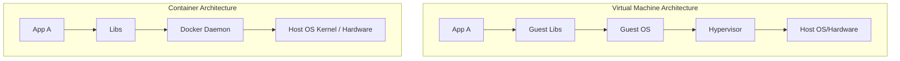
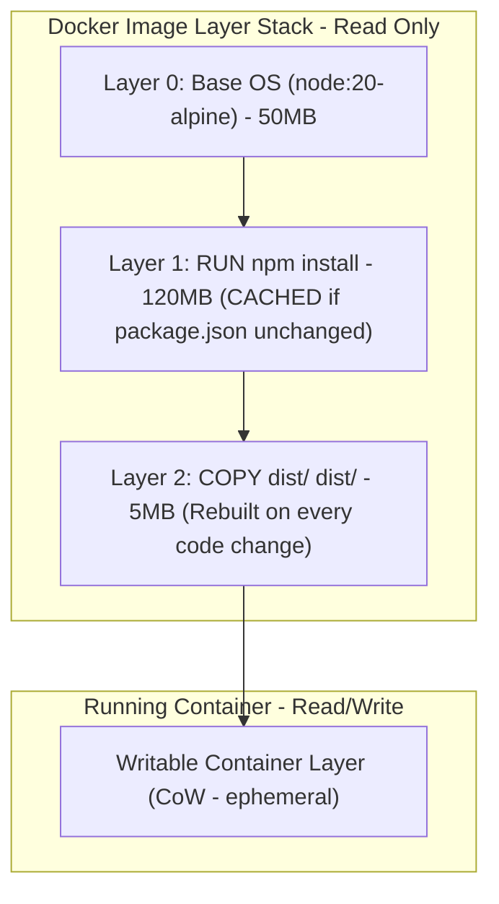
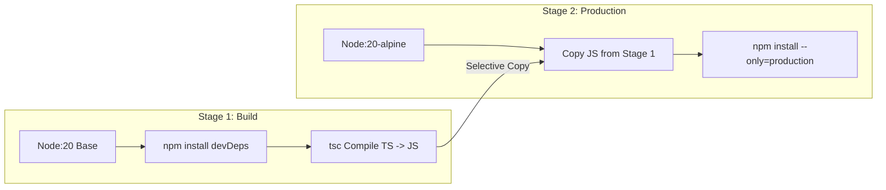
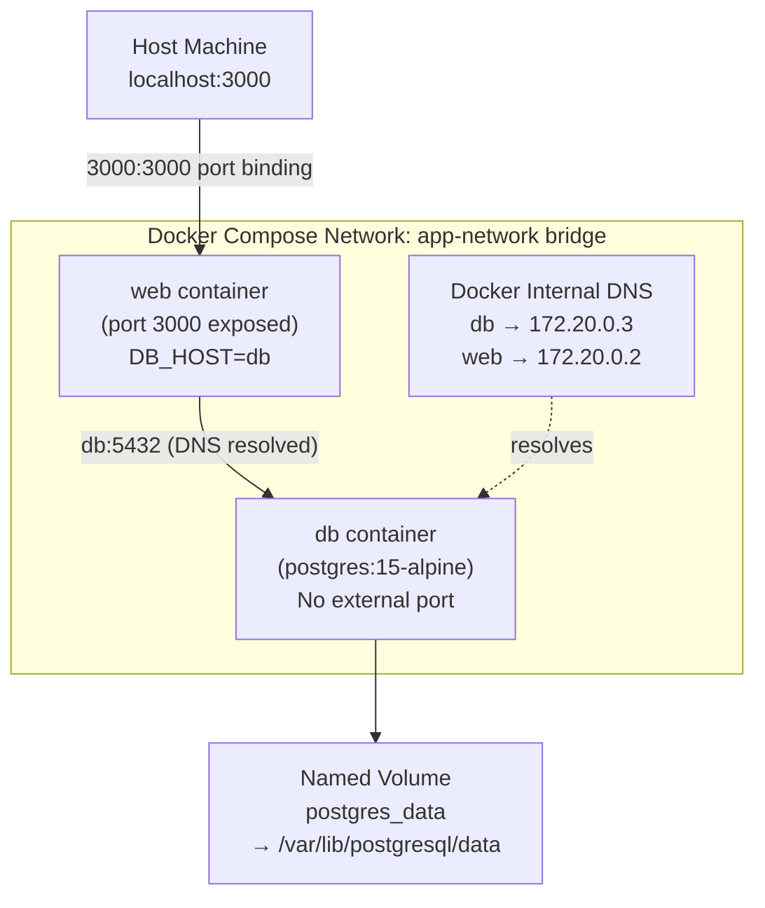
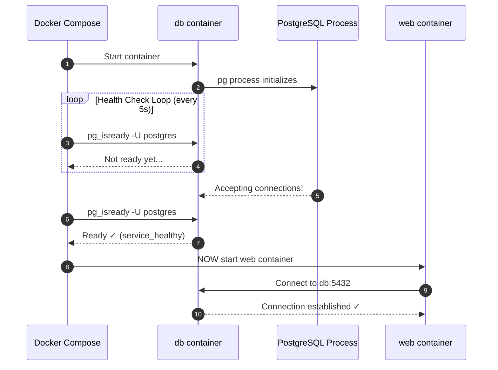

# 🔬 Lab D00: Containerizing the Application Stack (Docker & Compose)

In this hands-on laboratory, you will master the art of packaging, containerizing, and orchestrating a multi-component microservices stack using **Docker** and **Docker Compose**. You will design a production-ready, multi-stage **Dockerfile** for a TypeScript application to achieve minimal image footprints and secure non-root execution, and orchestrate it alongside a persistent **PostgreSQL** database using a robust **Docker Compose** topology.

---

## 1. 💡 The Core Concepts

To run applications reliably across different environments (local development, staging, cloud production), we must isolate them from the underlying operating system. **Docker** solves this using container virtualization.

### Container Virtualization vs. VMs

Unlike Virtual Machines (VMs), which virtualize the physical hardware and run a complete guest OS (with heavy memory/CPU footprints), containers share the host operating system's kernel. They isolate execution environments using Linux kernel namespaces and control groups (cgroups).



**Real-world analogy**: Think of VMs as separate houses on a street — each has its own foundation, plumbing, and electrical wiring. Containers are like apartments in a single building — they share walls, plumbing, and electricity (the kernel), but each tenant has their own locked unit (namespace isolation). Apartments spin up in seconds; building a new house takes months.

**Startup time comparison:**
| Mechanism | Startup Time | Memory Overhead | Isolation Level |
|---|---|---|---|
| Physical Server | Minutes (boot) | None | Full |
| Virtual Machine | 30–120 seconds | 512 MB – 4 GB per VM | Full kernel |
| Docker Container | < 1 second | 5–50 MB per container | Process/namespace |
| Serverless Function | Milliseconds (warm) | Shared pool | Process sandbox |

---

### Deep Dive: L1 & L2 Mechanics

#### 1. Union File System (UnionFS) & Storage Drivers
Docker images are built as a stack of read-only layers. When you run a container, Docker adds a thin, writable layer on top of this stack (the "container layer").
*   **Copy-on-Write (CoW)**: If a file in a lower layer needs to be modified, it is copied up to the writable container layer and modified there. The original file remains untouched.
*   **Layer Caching**: Each instruction in a `Dockerfile` (e.g., `RUN`, `COPY`) creates a new layer. During subsequent builds, Docker reuses cached layers if the instruction and the files it references haven't changed. To leverage this, place instructions that change frequently (like `COPY . .`) *after* instructions that change rarely (like `RUN npm install`).



**Concrete Dockerfile layer ordering example (CORRECT — cache-friendly):**
```dockerfile
# CORRECT: Static layers first (rarely change) → dynamic layers last
FROM node:20-alpine AS build
WORKDIR /app

# Layer 1: package files (only rebuilds if package.json/lock changes)
COPY package.json package-lock.json ./
RUN npm install

# Layer 2: source code (rebuilds on every code change — this is expected)
COPY . .
RUN npm run build
```

**Wrong ordering (cache-busting anti-pattern):**
```dockerfile
# WRONG: Copying ALL files first invalidates npm install cache on every save
FROM node:20-alpine AS build
WORKDIR /app
COPY . .            # ← Every code change busts the cache here
RUN npm install     # ← Now this re-runs even if package.json didn't change!
RUN npm run build
```

#### 2. Multi-Stage Builds
In a compiled or transpiled language like TypeScript or Go, the tools required to build the application (TypeScript compiler, development dependencies) are completely unnecessary to run it in production.
*   **Multi-Stage Build Pattern**: Uses multiple `FROM` statements in a single `Dockerfile`. Each stage can use a different base image and selectively copy artifacts (like transpiled JS files or compiled binaries) from preceding stages.
*   **Benefits**:
    *   Reduces production image sizes from $>1\text{ GB}$ (containing compilers and dev tools) to $<100\text{ MB}$.
    *   Shrinks the security attack surface by excluding unnecessary CLI tools, package managers, and development dependencies.



**Full annotated multi-stage Dockerfile:**
```dockerfile
# ============================
# Stage 1: Build
# Purpose: Has all tools needed to compile TypeScript to JavaScript.
# This image is NEVER shipped to production.
# ============================
FROM node:20 AS builder

WORKDIR /app

# Install ALL dependencies (including devDependencies like typescript, @types/*)
COPY package.json package-lock.json ./
RUN npm ci

# Copy source code and compile
COPY tsconfig.json ./
COPY src/ ./src/
RUN npm run build
# /app/dist/ now contains compiled JavaScript

# ============================
# Stage 2: Production Runtime
# Purpose: Minimal image with ONLY what's needed to run the compiled app.
# ~50MB vs ~800MB for the full build stage.
# ============================
FROM node:20-alpine AS production

# Create a non-root system user (UID 1001 is a safe non-privileged UID)
RUN addgroup -S appgroup && adduser -S appuser -G appgroup

WORKDIR /app

# Install ONLY production dependencies (no typescript, no @types/*)
COPY package.json package-lock.json ./
RUN npm ci --only=production && npm cache clean --force

# Copy ONLY the compiled output from the build stage — no source TS files!
COPY --from=builder /app/dist ./dist

# Switch to non-root user BEFORE the CMD
USER appuser

# Document that the app listens on port 3000 (informational — does not publish)
EXPOSE 3000

# Use exec-form CMD (preferred over shell-form for proper signal handling)
CMD ["node", "dist/index.js"]
```

#### 3. Docker Container Security Best Practices
*   **Never Run as Root**: By default, Docker containers run as the root user. If an attacker escapes the container, they inherit root privileges on the host system. Always create a dedicated system user/group (e.g., `node` or `appuser`) and switch to it using the `USER` instruction.
*   **Use Minimal Base Images**: Prefer `-alpine` or `-slim` distributions (e.g., `node:20-alpine`) which exclude hundreds of vulnerable system utilities.
*   **Read-Only Root Filesystem**: Configure containers to run with a read-only root filesystem to prevent runtime tampering, using volumes/tmpfs for writable directories.

```dockerfile
# Security hardening example
FROM node:20-alpine

# Verify no critical vulnerabilities in the base image
# RUN apk update && apk upgrade

# Set filesystem to read-only at runtime (in docker-compose.yml):
# read_only: true
# tmpfs:
#   - /tmp      # Allow writes only to explicit tmpfs mounts

# Never run as root
USER node
```

---

### Docker Compose & Container Networking

**Docker Compose** is a tool for defining and running multi-container applications. It uses a YAML configuration file to declare services, networks, and volumes.
*   **Isolated Bridge Networks**: Docker Compose automatically creates a dedicated virtual bridge network for your application stack. Containers can resolve each other by their service name (e.g., `http://db:5432`) using Docker's internal DNS server.
*   **Data Persistence with Volumes**: Since container filesystems are ephemeral (wiped out when a container is deleted), databases require persistent **Docker Volumes** mapped from the host to the database's internal storage path (e.g., `/var/lib/postgresql/data`).



**Full annotated docker-compose.yml example:**
```yaml
version: '3.9'

services:
  # ---- Web Application Service ----
  web:
    build:
      context: .
      dockerfile: Dockerfile
      target: production       # Use only the final production stage
    ports:
      - "3000:3000"            # HOST_PORT:CONTAINER_PORT
    environment:
      NODE_ENV: production
      DB_HOST: db              # Docker DNS resolves 'db' service name to its container IP
      DB_PORT: "5432"
      DB_USER: postgres
      DB_PASSWORD: postgres
      DB_NAME: users_db
    depends_on:
      db:
        condition: service_healthy  # Wait until DB health check PASSES before starting web
    networks:
      - app-network
    restart: unless-stopped    # Restart container if it crashes

  # ---- PostgreSQL Database Service ----
  db:
    image: postgres:15-alpine
    environment:
      POSTGRES_USER: postgres
      POSTGRES_PASSWORD: postgres
      POSTGRES_DB: users_db
    volumes:
      - postgres_data:/var/lib/postgresql/data   # Named volume for persistence
    networks:
      - app-network
    healthcheck:
      # pg_isready polls PostgreSQL until it's accepting connections
      test: ["CMD-SHELL", "pg_isready -U postgres -d users_db"]
      interval: 5s       # Poll every 5 seconds
      timeout: 3s        # Wait 3s for response before marking as failed
      retries: 5         # Mark unhealthy after 5 consecutive failures
      start_period: 10s  # Grace period — don't count failures in first 10s of startup

# ---- Named Volumes (persisted across container restarts) ----
volumes:
  postgres_data:
    driver: local

# ---- Networks ----
networks:
  app-network:
    driver: bridge
```

---

### Health Checks: Deep Mechanics

The `depends_on: condition: service_healthy` pattern prevents a race condition where the web application starts before the database is ready to accept connections. This is a critical production pattern:



---

## 2. 🌍 Real-Life Production Applications

*   **Kubernetes Orchestration**: In production, Docker containers form the fundamental deployment unit for Kubernetes clusters. Large platforms run millions of containerized instances across public clouds.
*   **Microservice Isolation**: Isolating billing services, user dashboards, and data pipelines into separate containers prevents dependency conflicts and ensures resource isolation.
*   **Immutable Infrastructure**: Every deployment ships a fully self-contained, versioned image. Rolling back a bad release is as simple as pointing the orchestrator to the previous image tag (e.g., `myapp:v1.2.0`), rather than attempting complex in-place rollback scripts.

**Production multi-service compose example (abbreviated):**
```yaml
# Production pattern: separate compose files per environment
# docker-compose.yml          (base)
# docker-compose.prod.yml     (production overrides)
# docker-compose.dev.yml      (developer overrides with volume mounts for hot-reload)

# Usage:
# Production: docker compose -f docker-compose.yml -f docker-compose.prod.yml up -d
# Dev:        docker compose -f docker-compose.yml -f docker-compose.dev.yml up
```

---

## ⚠️ Common Pitfalls & Anti-Patterns

### Pitfall 1: COPY before npm install (Cache Busting)
```dockerfile
# ❌ BAD: Any file change invalidates the npm install layer
COPY . .
RUN npm install

# ✅ GOOD: Only package.json changes invalidate npm install layer
COPY package.json package-lock.json ./
RUN npm install
COPY . .
```

### Pitfall 2: Running as Root in Production
```dockerfile
# ❌ BAD: Container runs as root — security risk
CMD ["node", "dist/index.js"]

# ✅ GOOD: Switch to non-root user before CMD
USER node
CMD ["node", "dist/index.js"]
```

### Pitfall 3: No Health Check on DB — Race Condition
```yaml
# ❌ BAD: Web starts immediately, DB might not be ready
depends_on:
  - db

# ✅ GOOD: Web waits for DB health check to pass
depends_on:
  db:
    condition: service_healthy
```

### Pitfall 4: Storing Secrets in Dockerfile / docker-compose.yml
```dockerfile
# ❌ BAD: Secret baked into image layer (visible in docker history!)
ENV DB_PASSWORD=supersecret123

# ✅ GOOD: Pass secrets at runtime via environment or Docker secrets
# docker run -e DB_PASSWORD=$DB_PASSWORD myapp
# Or use Docker Secrets in Swarm mode / Kubernetes Secrets
```

### Pitfall 5: Using `latest` Image Tag
```yaml
# ❌ BAD: "latest" is non-deterministic — build may break after upstream update
image: postgres:latest

# ✅ GOOD: Pin to a specific version for reproducible builds
image: postgres:15.3-alpine3.18
```

### Pitfall 6: Shell-form CMD (Poor Signal Handling)
```dockerfile
# ❌ BAD: Shell-form wraps CMD in /bin/sh -c, preventing SIGTERM from reaching node
CMD node dist/index.js

# ✅ GOOD: Exec-form sends signals directly to node process
CMD ["node", "dist/index.js"]
```

---

## 🛠️ Laboratory Challenge: Containerizing the Application Stack

### The Goal
Your challenge is to containerize a TypeScript REST API (a simple user directory service) and connect it to a persistent PostgreSQL database.

Inside `/starter`, you will find a fully configured TypeScript Express application. Your tasks are:
1.  **Write a High-Fidelity `Dockerfile`**:
    *   Use a multi-stage approach (Stage 1: Build, Stage 2: Production).
    *   Target a minimal `node:20-alpine` base image for the runtime stage.
    *   Install only production dependencies in the runtime stage.
    *   Switch execution to the non-root user `node`.
    *   Expose port `3000`.
2.  **Write a robust `docker-compose.yml`**:
    *   Define a service `web` that builds your `Dockerfile`.
    *   Define a service `db` utilizing official `postgres:15-alpine` image.
    *   Configure environment variables, network bridges, volume mounts, and readiness health checks.
    *   Ensure the `web` container waits for the `db` container to be fully healthy before booting up.

---

### Step-by-Step Implementation Guide

#### 1. Analyze the Starter Application
Open `starter/src/index.ts`. Notice that the Express API reads its database connection coordinates from environment variables (`DB_HOST`, `DB_PORT`, `DB_USER`, `DB_PASSWORD`, `DB_NAME`).

#### 2. Implement the Dockerfile
Create `starter/Dockerfile` and implement the multi-stage build.

**Implementation checklist:**
- [ ] Stage 1 (`AS builder`): Use `node:20` base, copy package files, run `npm ci`, copy source, run `npm run build`
- [ ] Stage 2 (`AS production`): Use `node:20-alpine`, copy only `package.json`/lock, run `npm ci --only=production`, copy `dist/` from builder stage
- [ ] Add `USER node` before `CMD`
- [ ] Add `EXPOSE 3000`
- [ ] Use exec-form `CMD ["node", "dist/index.js"]`

#### 3. Implement Docker Compose
Create `starter/docker-compose.yml` defining the `web` and `db` services, including standard database credentials.

**Implementation checklist:**
- [ ] `web` service: `build: .`, port `3000:3000`, all `DB_*` env vars, `depends_on` with `condition: service_healthy`
- [ ] `db` service: `postgres:15-alpine` image, `POSTGRES_USER/PASSWORD/DB` env vars, named volume mount
- [ ] `db` healthcheck: `pg_isready` command, `interval: 5s`, `retries: 5`
- [ ] Named volume `postgres_data` at top-level `volumes:` key
- [ ] Shared `app-network` bridge network

#### 4. Run Verification
Verify compilation and inspect the build configurations. Ensure your container builds successfully and your stack boots up in a local Docker runtime.

```bash
# Build and start the stack in detached mode
docker compose up --build -d

# Check service status and health
docker compose ps

# Stream logs from all services
docker compose logs -f

# Test the health endpoint
curl http://localhost:3000/health

# Test the users endpoint
curl http://localhost:3000/users

# Tear down (remove containers but preserve volumes)
docker compose down

# Tear down AND wipe volumes (reset database)
docker compose down --volumes
```

#### 5. Inspect Image Layers (Bonus)
```bash
# Inspect the final image size
docker images | grep d00-docker-starter

# Inspect individual layers and their sizes
docker history d00-docker-starter-web

# Run a security scan (requires Docker Scout or Snyk)
docker scout cves d00-docker-starter-web
```

---

## 🔑 Key Takeaways

| Concept | Core Insight |
|---|---|
| **Layer Caching** | Rare-change instructions first, frequent-change last. Copy `package.json` before `COPY . .` |
| **Multi-Stage Builds** | Build stage: heavy tools. Production stage: compiled output + prod deps only |
| **Non-Root Execution** | Always add `USER node` (or custom user) before `CMD`. Never ship root containers |
| **Health Checks** | `depends_on: condition: service_healthy` prevents race conditions at startup |
| **Named Volumes** | Database data MUST live in named volumes or it dies with the container |
| **Pinned Tags** | Never use `:latest`. Always pin to specific version tags for reproducibility |
| **Exec-form CMD** | `CMD ["node", "dist/index.js"]` — ensures SIGTERM reaches your Node process |
| **Minimal Base Images** | `node:20-alpine` is ~50MB. `node:20` is ~1GB. Choose alpine for production |

---

## 📚 Further Reading

- [Docker Official: Best practices for writing Dockerfiles](https://docs.docker.com/develop/develop-images/dockerfile_best-practices/)
- [Docker Compose: Health Check Documentation](https://docs.docker.com/compose/compose-file/05-services/#healthcheck)
- [OWASP Docker Security Cheatsheet](https://cheatsheetseries.owasp.org/cheatsheets/Docker_Security_Cheat_Sheet.html)
- [BuildKit: Advanced build caching strategies](https://docs.docker.com/build/buildkit/)
- [Dive: Tool to inspect Docker image layers](https://github.com/wagoodman/dive)
