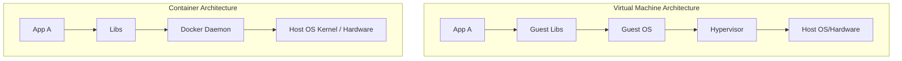
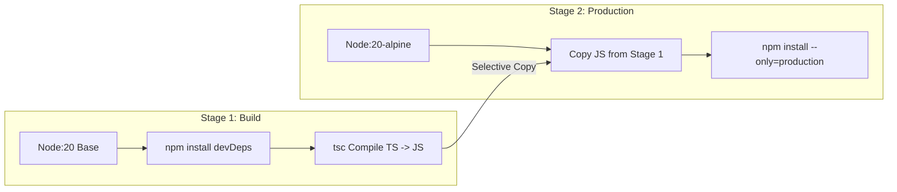

# 🔬 Lab D00: Containerizing the Application Stack (Docker & Compose)

In this hands-on laboratory, you will master the art of packaging, containerizing, and orchestrating a multi-component microservices stack using **Docker** and **Docker Compose**. You will design a production-ready, multi-stage **Dockerfile** for a TypeScript application to achieve minimal image footprints and secure non-root execution, and orchestrate it alongside a persistent **PostgreSQL** database using a robust **Docker Compose** topology.

---

## 1. 💡 The Core Concepts

To run applications reliably across different environments (local development, staging, cloud production), we must isolate them from the underlying operating system. **Docker** solves this using container virtualization.

### Container Virtualization vs. VMs

Unlike Virtual Machines (VMs), which virtualize the physical hardware and run a complete guest OS (with heavy memory/CPU footprints), containers share the host operating system's kernel. They isolate execution environments using Linux kernel namespaces and control groups (cgroups).

---

### Deep Dive: L1 & L2 Mechanics

#### 1. Union File System (UnionFS) & Storage Drivers
Docker images are built as a stack of read-only layers. When you run a container, Docker adds a thin, writable layer on top of this stack (the "container layer").
*   **Copy-on-Write (CoW)**: If a file in a lower layer needs to be modified, it is copied up to the writable container layer and modified there. The original file remains untouched.
*   **Layer Caching**: Each instruction in a `Dockerfile` (e.g., `RUN`, `COPY`) creates a new layer. During subsequent builds, Docker reuses cached layers if the instruction and the files it references haven't changed. To leverage this, place instructions that change frequently (like `COPY . .`) *after* instructions that change rarely (like `RUN npm install`).

#### 2. Multi-Stage Builds
In a compiled or transpiled language like TypeScript or Go, the tools required to build the application (TypeScript compiler, development dependencies) are completely unnecessary to run it in production.
*   **Multi-Stage Build Pattern**: Uses multiple `FROM` statements in a single `Dockerfile`. Each stage can use a different base image and selectively copy artifacts (like transpiled JS files or compiled binaries) from preceding stages.
*   **Benefits**:
    *   Reduces production image sizes from $>1\text{ GB}$ (containing compilers and dev tools) to $<100\text{ MB}$.
    *   Shrinks the security attack surface by excluding unnecessary CLI tools, package managers, and development dependencies.

#### 3. Docker Container Security Best Practices
*   **Never Run as Root**: By default, Docker containers run as the root user. If an attacker escapes the container, they inherit root privileges on the host system. Always create a dedicated system user/group (e.g., `node` or `appuser`) and switch to it using the `USER` instruction.
*   **Use Minimal Base Images**: Prefer `-alpine` or `-slim` distributions (e.g., `node:20-alpine`) which exclude hundreds of vulnerable system utilities.
*   **Read-Only Root Filesystem**: Configure containers to run with a read-only root filesystem to prevent runtime tampering, using volumes/tmpfs for writable directories.

---

### Docker Compose & Container Networking

**Docker Compose** is a tool for defining and running multi-container applications. It uses a YAML configuration file to declare services, networks, and volumes.
*   **Isolated Bridge Networks**: Docker Compose automatically creates a dedicated virtual bridge network for your application stack. Containers can resolve each other by their service name (e.g., `http://db:5432`) using Docker's internal DNS server.
*   **Data Persistence with Volumes**: Since container filesystems are ephemeral (wiped out when a container is deleted), databases require persistent **Docker Volumes** mapped from the host to the database's internal storage path (e.g., `/var/lib/postgresql/data`).

---

## 2. 🌍 Real-Life Production Applications

*   **Kubernetes Orchestration**: In production, Docker containers form the fundamental deployment unit for Kubernetes clusters. Large platforms run millions of containerized instances across public clouds.
*   **Microservice Isolation**: Isolating billing services, user dashboards, and data pipelines into separate containers prevents dependency conflicts and ensures resource isolation.

---

## 🛠️ Laboratory Challenge: Containerizing the Application Stack

### The Goal
Your challenge is to containerize a TypeScript REST API (a simple user directory service) and connect it to a persistent PostgreSQL database.

Inside `/starter`, you will find a fully configured TypeScript Express application. Your tasks are:
1.  **Write a High-Fidelity `Dockerfile`**:
    *   Use a multi-stage approach (Stage 1: Build, Stage 2: Production).
    *   Target a minimal `node:20-alpine` base image for the runtime stage.
    *   Install only production dependencies in the runtime stage.
    *   Switch execution to the non-root user `node`.
    *   Expose port `3000`.
2.  **Write a robust `docker-compose.yml`**:
    *   Define a service `web` that builds your `Dockerfile`.
    *   Define a service `db` utilizing official `postgres:15-alpine` image.
    *   Configure environment variables, network bridges, volume mounts, and readiness health checks.
    *   Ensure the `web` container waits for the `db` container to be fully healthy before booting up.

---

### Step-by-Step Implementation Guide

#### 1. Analyze the Starter Application
Open `starter/src/index.ts`. Notice that the Express API reads its database connection coordinates from environment variables (`DB_HOST`, `DB_PORT`, `DB_USER`, `DB_PASSWORD`, `DB_NAME`).

#### 2. Implement the Dockerfile
Create `starter/Dockerfile` and implement the multi-stage build.

#### 3. Implement Docker Compose
Create `starter/docker-compose.yml` defining the `web` and `db` services, including standard database credentials.

#### 4. Run Verification
Verify compilation and inspect the build configurations. Ensure your container builds successfully and your stack boots up in a local Docker runtime.
