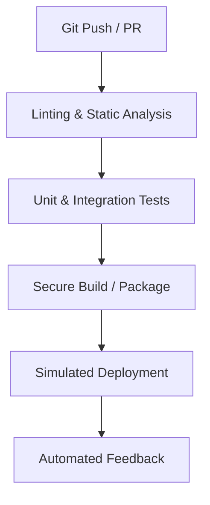
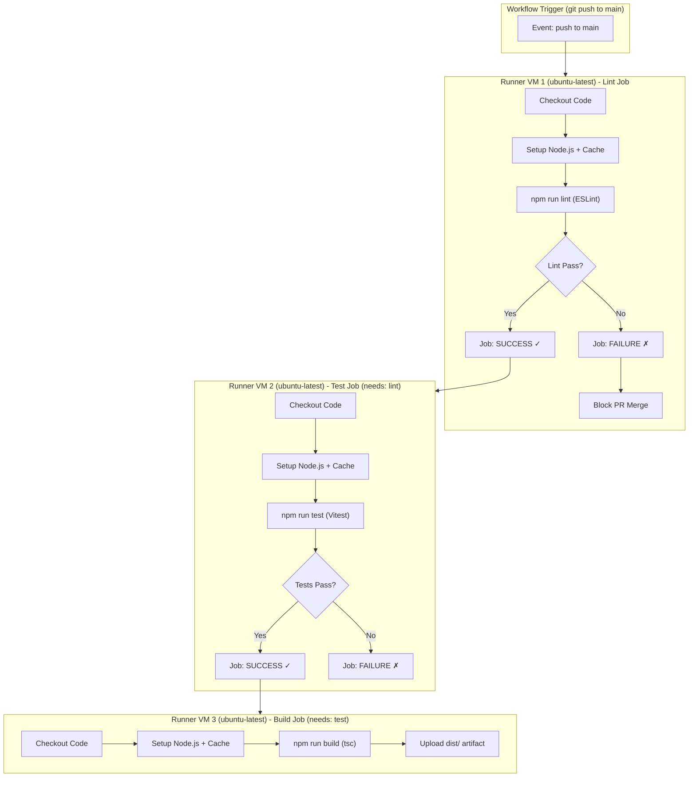
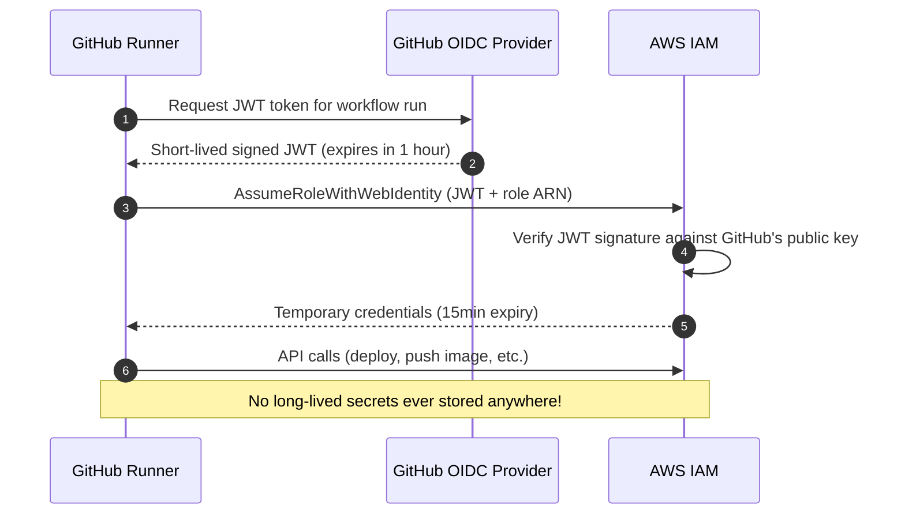
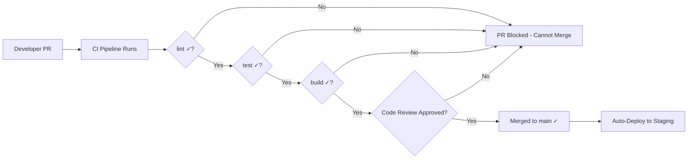

# 🔬 Lab D01: Automated CI/CD Pipelines (GitHub Actions)

In this hands-on laboratory, you will master the art of designing and configuring robust, enterprise-grade **CI/CD Pipelines** using **GitHub Actions**. You will implement a complete, multi-stage automation workflow that enforces code quality, executes test suites, generates build artifacts, and orchestrates simulated deployments, securing secrets and utilizing modern caching optimization patterns.

---

## 1. 💡 The Core Concepts

A **CI/CD (Continuous Integration / Continuous Delivery)** pipeline is the engine that drives modern software delivery. It automates the integration of code changes from multiple developers, builds the software, runs tests, and deploys to production seamlessly.

**Real-world analogy**: Imagine a car assembly line. Each station (welding, painting, quality inspection) must complete its job before the car moves to the next station. CI/CD pipelines are software assembly lines — each job (lint, test, build, deploy) is a station with clear inputs, outputs, and quality gates. If the quality inspection station fails, the car doesn't ship. If the test stage fails, the code doesn't deploy.



---

## Why CI/CD is Non-Negotiable in Modern Engineering

Without a CI/CD pipeline:
- Developers manually run tests (or forget to)
- "It works on my machine" bugs reach production
- Manual deployments take hours and cause downtime
- There is no audit trail of what code reached production when

With a CI/CD pipeline:
- Every commit is automatically verified (linted, tested, built)
- Bad code is blocked before it reaches the main branch
- Deployments are automated, repeatable, and documented
- Mean Time To Recovery (MTTR) drops from hours to minutes

---

### Deep Dive: L1 & L2 Mechanics

#### 1. Runner Virtualization & Job Isolation
When a GitHub Actions workflow is triggered, GitHub provisions a dedicated runner (a virtual machine running Ubuntu, Windows, or macOS, or a self-hosted runner).
*   **Workflow Structure**:
    *   **Workflow**: The overall configuration file (e.g., `ci.yml`) defining trigger events.
    *   **Job**: A set of steps executed on the *same runner*. Jobs run concurrently by default, but can be made sequential using the `needs` keyword.
    *   **Step**: An individual task running a command (shell script) or an Action (reusable plug-in).
*   **Virtual Isolation**: Each job runs on a fresh VM instance, ensuring complete isolation. Files are not automatically shared between jobs; to pass built artifacts (like a transpiled `dist/` directory) from a build job to a deploy job, you must explicitly use `actions/upload-artifact` and `actions/download-artifact`.



**Annotated `ci.yml` full example:**
```yaml
name: CI Pipeline

on:
  push:
    branches: [main]
  pull_request:
    branches: [main]

jobs:
  # ── Job 1: Lint ─────────────────────────────────────────────────────────────
  lint:
    name: "Lint: ESLint Static Analysis"
    runs-on: ubuntu-latest

    steps:
      - name: Checkout repository
        uses: actions/checkout@v4

      - name: Setup Node.js with npm cache
        uses: actions/setup-node@v4
        with:
          node-version: "20"
          cache: "npm"              # Built-in caching via setup-node

      - name: Install dependencies
        run: npm ci                 # ci is faster and stricter than npm install

      - name: Run ESLint
        run: npm run lint

  # ── Job 2: Test ─────────────────────────────────────────────────────────────
  test:
    name: "Test: Vitest Unit & Integration"
    runs-on: ubuntu-latest
    needs: lint                     # This job only runs if lint JOB succeeds

    steps:
      - name: Checkout repository
        uses: actions/checkout@v4

      - name: Setup Node.js with npm cache
        uses: actions/setup-node@v4
        with:
          node-version: "20"
          cache: "npm"

      - name: Install dependencies
        run: npm ci

      - name: Run tests with coverage
        run: npm run test -- --coverage

      - name: Upload coverage report
        uses: actions/upload-artifact@v4
        with:
          name: coverage-report
          path: coverage/

  # ── Job 3: Build ─────────────────────────────────────────────────────────────
  build:
    name: "Build: TypeScript Compilation"
    runs-on: ubuntu-latest
    needs: test                     # This job only runs if test JOB succeeds

    steps:
      - name: Checkout repository
        uses: actions/checkout@v4

      - name: Setup Node.js with npm cache
        uses: actions/setup-node@v4
        with:
          node-version: "20"
          cache: "npm"

      - name: Install dependencies
        run: npm ci

      - name: Compile TypeScript
        run: npm run build

      - name: Upload build artifact
        uses: actions/upload-artifact@v4
        with:
          name: dist-artifact
          path: dist/
          retention-days: 7
```

#### 2. Workflow Caching Optimization
Installing node dependencies (`npm install` or `yarn install`) or Maven dependencies from scratch on every single runner launch introduces significant build latency and network overhead.
*   **Dependency Caching**: GitHub Actions provides `actions/cache`. It hashes your lockfile (e.g., `package-lock.json` or `pom.xml`) and caches the corresponding installation folder (e.g., `node_modules/` or `~/.m2/repository`).
*   **Cache-Key Mechanics**:
    ```yaml
    - name: Cache Node Modules
      uses: actions/cache@v3
      with:
        path: ~/.npm
        key: ${{ runner.os }}-node-${{ hashFiles('**/package-lock.json') }}
        restore-keys: |
          ${{ runner.os }}-node-
    ```
    If the `package-lock.json` hasn't changed, the runner fetches the pre-installed modules from GitHub's cache store in seconds, reducing CI/CD execution time by up to 80%!

**Cache hit vs miss flow:**
```mermaid
flowchart TD
    A[Start Job] --> B["actions/setup-node\ncache: 'npm'"]
    B --> C{Cache Key Match?\nhash(package-lock.json)}
    C -->|Cache HIT| D["Restore ~/.npm from cache\n~5 seconds"]
    C -->|Cache MISS| E["Download all packages\n~60 seconds"]
    D --> F[npm ci]
    E --> F
    F --> G[Run job steps]
    G --> H{Was cache miss?}
    H -->|Yes| I[Save new cache for next run]
    H -->|No| J[Skip save - cache unchanged]
```

#### 3. Secure Secret Management (OIDC & Vaults)
Hardcoding api tokens, cloud credentials, or database passwords in source control is an unacceptable security failure.
*   **GitHub Secrets**: Stored encrypted in the repository settings. Injected into jobs as environment variables using `${{ secrets.MY_SECRET }}`.
*   **OpenID Connect (OIDC)**: Instead of storing long-lived credentials (like AWS IAM Access Keys) as GitHub Secrets, modern workflows use OIDC. The GitHub runner requests a short-lived, cryptographically signed JSON Web Token (JWT) from GitHub's OIDC provider, which it exchanges with AWS/Azure for a temporary IAM role. This eliminates credential leakage vectors!

```yaml
# OIDC-based AWS authentication (no stored credentials!)
- name: Configure AWS credentials via OIDC
  uses: aws-actions/configure-aws-credentials@v4
  with:
    role-to-assume: arn:aws:iam::123456789:role/GitHubActionsRole
    aws-region: us-east-1

# Standard secrets usage
- name: Push Docker image
  run: |
    echo "${{ secrets.REGISTRY_PASSWORD }}" | docker login -u "${{ secrets.REGISTRY_USER }}" --password-stdin
    docker push myapp:latest
```



---

### Branch Protection & Gates

To maintain high repository stability, pipelines act as automated gatekeepers:
*   **Required Status Checks**: Configure GitHub to prevent merging Pull Requests until specified status checks (e.g., your CI linting and testing jobs) pass successfully.
*   **Signed Commits & Review Gates**: Mandate at least one approved code review, require GPG-signed commits, and block direct pushes to the `main` branch.



---

### Advanced: Matrix Builds & Multi-Node Testing
```yaml
# Test against multiple Node.js versions simultaneously
jobs:
  test:
    strategy:
      matrix:
        node-version: [18, 20, 22]
        os: [ubuntu-latest, windows-latest]
    runs-on: ${{ matrix.os }}
    steps:
      - uses: actions/setup-node@v4
        with:
          node-version: ${{ matrix.node-version }}
      - run: npm test
```

This runs 6 parallel jobs (3 Node versions × 2 OS) — catching platform-specific bugs automatically.

---

## 2. 🌍 Real-Life Production Applications

*   **Zero-Touch Deployments**: Committing code to `main` automatically triggers automated tests and pushes verified docker containers straight to production Kubernetes clusters.
*   **Automated Security Scanning**: Integrating tools like **SonarQube** or **Snyk** directly into pipelines to detect vulnerabilities, outdated packages, or exposed API credentials on every commit.
*   **Release Automation**: Automatically generating changelogs, creating GitHub Releases with versioned artifacts, and publishing npm packages — all triggered by pushing a git tag.

**Production deployment pipeline (extended):**
```yaml
# Extended production pipeline with security scanning and deployment
jobs:
  security-scan:
    runs-on: ubuntu-latest
    steps:
      - uses: actions/checkout@v4
      - name: Run Snyk security scan
        uses: snyk/actions/node@master
        env:
          SNYK_TOKEN: ${{ secrets.SNYK_TOKEN }}

  docker-build-push:
    needs: [lint, test, security-scan]
    runs-on: ubuntu-latest
    steps:
      - uses: actions/checkout@v4
      - name: Build and push Docker image
        uses: docker/build-push-action@v5
        with:
          push: true
          tags: myregistry/myapp:${{ github.sha }}

  deploy-staging:
    needs: docker-build-push
    runs-on: ubuntu-latest
    environment: staging             # Requires manual approval if configured
    steps:
      - name: Deploy to Kubernetes
        run: kubectl set image deployment/web web=myregistry/myapp:${{ github.sha }}
```

---

## ⚠️ Common Pitfalls & Anti-Patterns

### Pitfall 1: Using `npm install` Instead of `npm ci` in Pipelines
```yaml
# ❌ BAD: npm install modifies package-lock.json (non-deterministic builds)
- run: npm install

# ✅ GOOD: npm ci installs EXACTLY what's in package-lock.json (deterministic)
- run: npm ci
```

### Pitfall 2: Hardcoding Secrets in Workflow Files
```yaml
# ❌ BAD: Secret committed to git history (visible to all!)
- run: docker login -u admin -p mypassword123

# ✅ GOOD: Use GitHub Secrets
- run: docker login -u ${{ secrets.REGISTRY_USER }} -p ${{ secrets.REGISTRY_PASSWORD }}
```

### Pitfall 3: Not Pinning Action Versions
```yaml
# ❌ BAD: Unpinned action — breaking changes can silently break your pipeline
- uses: actions/checkout@main

# ✅ GOOD: Pin to a specific version or commit SHA
- uses: actions/checkout@v4
# Even better: pin to SHA for full supply-chain security
- uses: actions/checkout@11bd71901bbe5b1630ceea73d27597364c9af683 # v4.2.2
```

### Pitfall 4: Missing `needs` Dependencies Between Jobs
```yaml
# ❌ BAD: build and test run in parallel — build might pass even if tests fail
jobs:
  test:
    runs-on: ubuntu-latest
    steps: [...]
  build:
    runs-on: ubuntu-latest  # Runs simultaneously with test!
    steps: [...]

# ✅ GOOD: Explicit sequential dependency
jobs:
  build:
    needs: test             # Build only runs after test succeeds
    runs-on: ubuntu-latest
    steps: [...]
```

### Pitfall 5: No Cache Invalidation Strategy
```yaml
# ❌ BAD: Cache key never changes — stale cache persists even after package updates
key: node-cache

# ✅ GOOD: Key based on lockfile hash — automatically invalidated when deps change
key: ${{ runner.os }}-node-${{ hashFiles('**/package-lock.json') }}
```

### Pitfall 6: Uploading Secrets in Artifacts
```yaml
# ❌ BAD: .env file contains secrets and gets uploaded as artifact!
- uses: actions/upload-artifact@v4
  with:
    path: .     # Uploads EVERYTHING including .env files

# ✅ GOOD: Only upload the build output
- uses: actions/upload-artifact@v4
  with:
    path: dist/
```

---

## 🛠️ Laboratory Challenge: Designing a CI/CD Pipeline

### The Goal
Your challenge is to design and configure a multi-stage **GitHub Actions Workflow** that automates the verification and packaging of a TypeScript application.

Inside `/starter`, you will find a project. Your task is to write a pipeline file under `starter/.github/workflows/ci.yml` that satisfies the following:
1.  **Triggers**: Fires on `push` and `pull_request` targeting the `main` branch.
2.  **Lint Stage**: Installs dependencies and runs a code linter (`npm run lint`).
3.  **Test Stage**: Runs the test suite (`npm run test`). This stage must only run if the lint stage succeeds (`needs: lint`).
4.  **Build Stage**: Transpiles TypeScript into JavaScript (`npm run build`). This stage must only run if the test stage succeeds (`needs: test`).
5.  **Caching**: Leverages `actions/cache` or setup-node's built-in caching (`cache: 'npm'`) to cache package dependencies.

---

### Step-by-Step Implementation Guide

#### 1. Analyze the Starter Application
Examine `starter/package.json`. Notice it defines `lint`, `test`, and `build` scripts.

#### 2. Create the GitHub Actions Config
Create the directory structure `starter/.github/workflows/` and add `ci.yml`.

```bash
# Create directory if it doesn't exist
mkdir -p .github/workflows
touch .github/workflows/ci.yml
```

#### 3. Implement Workflow Stages
Define three sequential jobs: `lint`, `test`, and `build` utilizing standard Ubuntu runners (`ubuntu-latest`). Use dependency caching to optimize execution time.

**Implementation checklist:**
- [ ] `on.push.branches` includes `main`
- [ ] `on.pull_request.branches` includes `main`
- [ ] `jobs.lint` defined with `runs-on: ubuntu-latest`
- [ ] `jobs.lint` steps: `checkout`, `setup-node` with `cache: 'npm'`, `npm ci`, `npm run lint`
- [ ] `jobs.test.needs: lint` (sequential dependency)
- [ ] `jobs.test` steps: `checkout`, `setup-node` with `cache: 'npm'`, `npm ci`, `npm run test`
- [ ] `jobs.build.needs: test` (sequential dependency)
- [ ] `jobs.build` steps: `checkout`, `setup-node` with `cache: 'npm'`, `npm ci`, `npm run build`

#### 4. Run Verification
Verify compilation and inspect the build configurations. Ensure your workflow file follows valid GitHub Actions YAML structure and runs correctly.

```bash
# Validate YAML syntax locally (requires yq or python-yaml)
python3 -c "import yaml; yaml.safe_load(open('.github/workflows/ci.yml'))" && echo "YAML valid"

# Or use the GitHub CLI to validate
gh workflow view ci.yml

# Check workflow status after pushing
gh run list --workflow=ci.yml
gh run view  # Interactive run viewer
```

#### 5. Local Act Testing (Bonus — runs GitHub Actions locally)
```bash
# Install 'act' tool (https://github.com/nektos/act)
# Run the entire workflow locally without pushing to GitHub
act push --job lint
act push --job test
act push          # Run all jobs
```

---

## 🔑 Key Takeaways

| Concept | Core Insight |
|---|---|
| **Job Isolation** | Each job runs on a fresh VM. Share files between jobs using `upload-artifact`/`download-artifact` |
| **`needs` Keyword** | Creates sequential dependencies. Without it, all jobs run in parallel |
| **`npm ci`** | Always use `npm ci` (not `npm install`) in CI for deterministic, faster installs |
| **Cache Keys** | Hash `package-lock.json` as the cache key — invalidates automatically when deps change |
| **OIDC vs Secrets** | Prefer OIDC for cloud auth — no long-lived credentials stored anywhere |
| **Action Pinning** | Pin action versions (or SHAs) to prevent supply-chain attacks via action updates |
| **Branch Protection** | Enable "required status checks" to block PRs until CI passes |
| **Matrix Builds** | Test against multiple Node versions/OS in parallel to catch cross-platform bugs early |

---

## 📚 Further Reading

- [GitHub Actions Documentation](https://docs.github.com/en/actions)
- [GitHub Actions: Caching dependencies](https://docs.github.com/en/actions/using-workflows/caching-dependencies-to-speed-up-workflows)
- [GitHub Actions: Security hardening](https://docs.github.com/en/actions/security-guides/security-hardening-for-github-actions)
- [OIDC with AWS](https://docs.github.com/en/actions/deployment/security-hardening-your-deployments/configuring-openid-connect-in-amazon-web-services)
- [nektos/act: Run GitHub Actions locally](https://github.com/nektos/act)
- [Snyk: Integrate security scanning into CI](https://docs.snyk.io/integrations/ci-cd-integrations/github-actions-integration)
