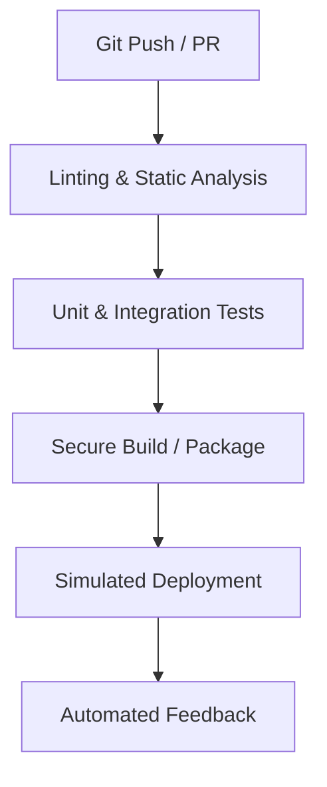

# 🔬 Lab D01: Automated CI/CD Pipelines (GitHub Actions)

In this hands-on laboratory, you will master the art of designing and configuring robust, enterprise-grade **CI/CD Pipelines** using **GitHub Actions**. You will implement a complete, multi-stage automation workflow that enforces code quality, executes test suites, generates build artifacts, and orchestrates simulated deployments, securing secrets and utilizing modern caching optimization patterns.

---

## 1. 💡 The Core Concepts

A **CI/CD (Continuous Integration / Continuous Delivery)** pipeline is the engine that drives modern software delivery. It automates the integration of code changes from multiple developers, builds the software, runs tests, and deploys to production seamlessly.



---

### Deep Dive: L1 & L2 Mechanics

#### 1. Runner Virtualization & Job Isolation
When a GitHub Actions workflow is triggered, GitHub provisions a dedicated runner (a virtual machine running Ubuntu, Windows, or macOS, or a self-hosted runner).
*   **Workflow Structure**:
    *   **Workflow**: The overall configuration file (e.g., `ci.yml`) defining trigger events.
    *   **Job**: A set of steps executed on the *same runner*. Jobs run concurrently by default, but can be made sequential using the `needs` keyword.
    *   **Step**: An individual task running a command (shell script) or an Action (reusable plug-in).
*   **Virtual Isolation**: Each job runs on a fresh VM instance, ensuring complete isolation. Files are not automatically shared between jobs; to pass built artifacts (like a transpiled `dist/` directory) from a build job to a deploy job, you must explicitly use `actions/upload-artifact` and `actions/download-artifact`.

#### 2. Workflow Caching Optimization
Installing node dependencies (`npm install` or `yarn install`) or Maven dependencies from scratch on every single runner launch introduces significant build latency and network overhead.
*   **Dependency Caching**: GitHub Actions provides `actions/cache`. It hashes your lockfile (e.g., `package-lock.json` or `pom.xml`) and caches the corresponding installation folder (e.g., `node_modules/` or `~/.m2/repository`).
*   **Cache-Key Mechanics**:
    ```yaml
    - name: Cache Node Modules
      uses: actions/cache@v3
      with:
        path: ~/.npm
        key: ${{ runner.os }}-node-${{ hashFiles('**/package-lock.json') }}
        restore-keys: |
          ${{ runner.os }}-node-
    ```
    If the `package-lock.json` hasn't changed, the runner fetches the pre-installed modules from GitHub's cache store in seconds, reducing CI/CD execution time by up to 80%!

#### 3. Secure Secret Management (OIDC & Vaults)
Hardcoding api tokens, cloud credentials, or database passwords in source control is an unacceptable security failure.
*   **GitHub Secrets**: Stored encrypted in the repository settings. Injected into jobs as environment variables using `${{ secrets.MY_SECRET }}`.
*   **OpenID Connect (OIDC)**: Instead of storing long-lived credentials (like AWS IAM Access Keys) as GitHub Secrets, modern workflows use OIDC. The GitHub runner requests a short-lived, cryptographically signed JSON Web Token (JWT) from GitHub's OIDC provider, which it exchanges with AWS/Azure for a temporary IAM role. This eliminates credential leakage vectors!

---

### Branch Protection & Gates

To maintain high repository stability, pipelines act as automated gatekeepers:
*   **Required Status Checks**: Configure GitHub to prevent merging Pull Requests until specified status checks (e.g., your CI linting and testing jobs) pass successfully.
*   **Signed Commits & Review Gates**: Mandate at least one approved code review, require GPG-signed commits, and block direct pushes to the `main` branch.

---

## 2. 🌍 Real-Life Production Applications

*   **Zero-Touch Deployments**: Committing code to `main` automatically triggers automated tests and pushes verified docker containers straight to production Kubernetes clusters.
*   **Automated Security Scanning**: Integrating tools like **SonarQube** or **Snyk** directly into pipelines to detect vulnerabilities, outdated packages, or exposed API credentials on every commit.

---

## 🛠️ Laboratory Challenge: Designing a CI/CD Pipeline

### The Goal
Your challenge is to design and configure a multi-stage **GitHub Actions Workflow** that automates the verification and packaging of a TypeScript application.

Inside `/starter`, you will find a project. Your task is to write a pipeline file under `starter/.github/workflows/ci.yml` that satisfies the following:
1.  **Triggers**: Fires on `push` and `pull_request` targeting the `main` branch.
2.  **Lint Stage**: Installs dependencies and runs a code linter (`npm run lint`).
3.  **Test Stage**: Runs the test suite (`npm run test`). This stage must only run if the lint stage succeeds (`needs: lint`).
4.  **Build Stage**: Transpiles TypeScript into JavaScript (`npm run build`). This stage must only run if the test stage succeeds (`needs: test`).
5.  **Caching**: Leverages `actions/cache` or setup-node's built-in caching (`cache: 'npm'`) to cache package dependencies.

---

### Step-by-Step Implementation Guide

#### 1. Analyze the Starter Application
Examine `starter/package.json`. Notice it defines `lint`, `test`, and `build` scripts.

#### 2. Create the GitHub Actions Config
Create the directory structure `starter/.github/workflows/` and add `ci.yml`.

#### 3. Implement Workflow Stages
Define three sequential jobs: `lint`, `test`, and `build` utilizing standard Ubuntu runners (`ubuntu-latest`). Use dependency caching to optimize execution time.

#### 4. Run Verification
Verify compilation and inspect the build configurations. Ensure your workflow file follows valid GitHub Actions YAML structure and runs correctly.
