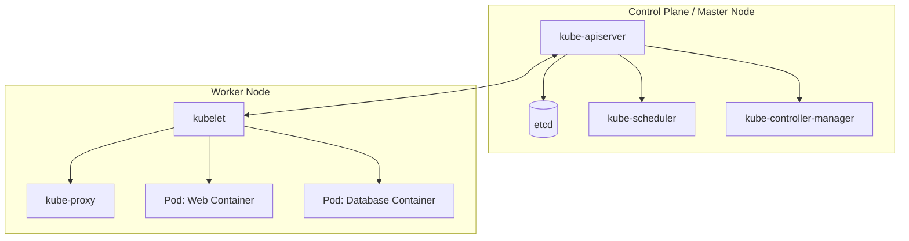
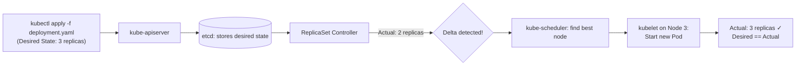
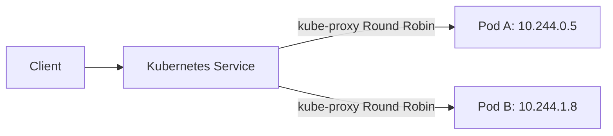
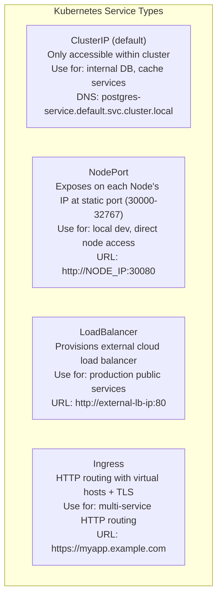
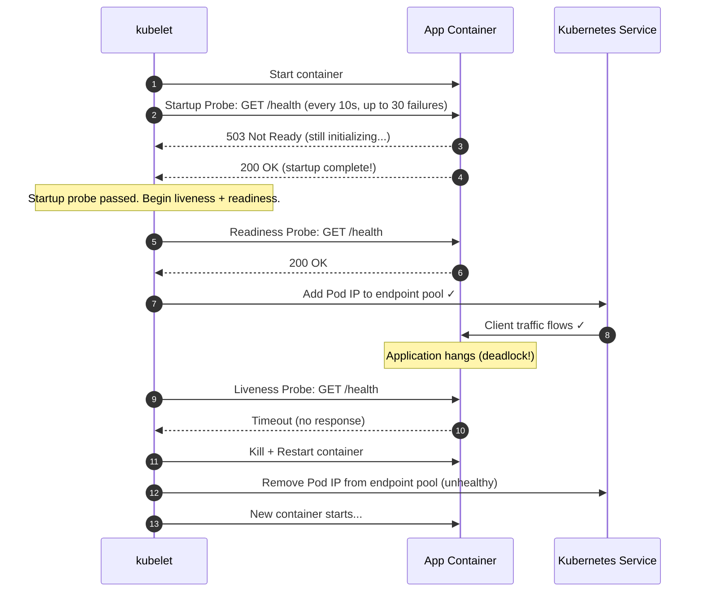
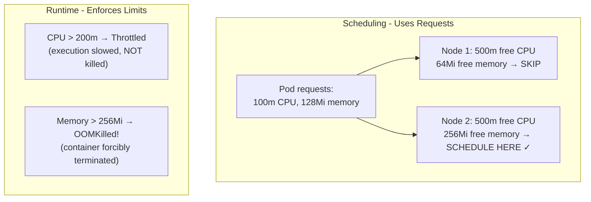
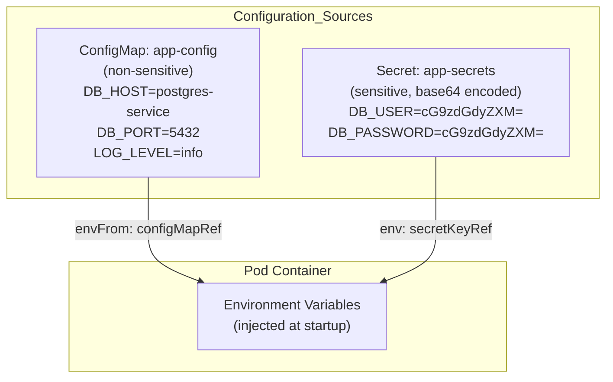

# 🔬 Lab D02: Local Kubernetes Deployment (Minikube / Kind)

In this hands-on laboratory, you will master the principles of container orchestration by deploying a resilient, multi-component application stack onto a local **Kubernetes** cluster utilizing **Minikube** or **Kind**. You will design declarative manifest files (`YAML`) for deployments, services, configuration maps, and encrypted secrets, enforcing resource scheduling limits and configuring robust self-healing health probes.

---

## 1. 💡 The Core Concepts

**Kubernetes (K8s)** is an open-source container orchestration platform designed to automate the deployment, scaling, and management of containerized applications. It shifts the infrastructure model from imperative scripting to declarative state management.

**Real-world analogy**: Kubernetes is like an airline operations center managing a fleet of planes (containers). You don't tell each plane exactly what to do — you declare the desired schedule ("I need 3 planes on the London route, 5 on New York"). The operations center (control plane) constantly monitors the actual state, and if a plane is grounded (container crash), it automatically reroutes (reschedules a new container) to maintain the desired schedule. You declare *what* you want; Kubernetes figures out *how* to achieve it.



**Control plane components explained:**
| Component | Role |
|---|---|
| `kube-apiserver` | The REST API frontend. All `kubectl` commands hit this. Validates and persists state changes to etcd. |
| `etcd` | Distributed key-value store. The single source of truth for ALL cluster state (deployments, secrets, config). |
| `kube-scheduler` | Watches for new unscheduled Pods, calculates the best node (based on resource availability, affinity, taints), assigns the Pod to that node. |
| `kube-controller-manager` | Runs control loops. The `ReplicaSet controller` maintains desired replica count. The `Endpoint controller` updates service routing. |
| `kubelet` | Node-level agent. Receives Pod specs from API server, tells container runtime (Docker/containerd) to start/stop containers. |
| `kube-proxy` | Updates iptables/IPVS rules on every node to route Service traffic to the correct Pod IPs. |

---

### Deep Dive: L1 & L2 Mechanics

#### 1. The Control Loop & Declarative State
At the heart of Kubernetes is a continuous reconciliation loop.
*   **Declarative Model**: You declare the *Desired State* of your system in YAML files (e.g., "I want 3 replicas of my web app running, with 200m CPU limit").
*   **Reconciliation Loop**: The Control Plane constantly compares the *Actual State* (from node telemetry) with the *Desired State*. If a worker node crashes and actual replica count drops to 2, the `kube-controller-manager` and `kube-scheduler` immediately launch a new pod on an active node to restore the desired count of 3.



**Full annotated Deployment manifest:**
```yaml
apiVersion: apps/v1
kind: Deployment
metadata:
  name: web-deployment
  labels:
    app: web
    environment: production
    version: "2.1.0"
spec:
  replicas: 3                        # Desired state: always keep 3 Pods running

  selector:                          # How the Deployment finds its managed Pods
    matchLabels:
      app: web                       # Must match .spec.template.metadata.labels

  strategy:
    type: RollingUpdate              # Zero-downtime: replace Pods one at a time
    rollingUpdate:
      maxUnavailable: 1              # At most 1 Pod offline during update
      maxSurge: 1                    # Allow 1 extra Pod above replicas during update

  template:                          # Pod template — every created Pod looks like this
    metadata:
      labels:
        app: web                     # Used by Service selector to route traffic
    spec:
      containers:
        - name: web
          image: myapp:2.1.0         # Always pin to specific tag — never :latest!
          ports:
            - containerPort: 3000

          # Environment from ConfigMap (non-sensitive config)
          envFrom:
            - configMapRef:
                name: app-config

          # Individual secret env vars (sensitive data)
          env:
            - name: DB_PASSWORD
              valueFrom:
                secretKeyRef:
                  name: app-secrets
                  key: DB_PASSWORD

          # Resource constraints (scheduler uses requests, kubelet enforces limits)
          resources:
            requests:
              cpu: "100m"            # 100 millicores = 0.1 CPU cores
              memory: "128Mi"        # 128 Mebibytes
            limits:
              cpu: "200m"            # Throttled (not killed) at 200 millicores
              memory: "256Mi"        # OOMKilled if exceeded!

          # Health probes
          startupProbe:              # Prevents liveness from killing slow-starting apps
            httpGet:
              path: /health
              port: 3000
            failureThreshold: 30     # Allow 30 x 10s = 5 minutes to start
            periodSeconds: 10

          livenessProbe:             # Kills + restarts unresponsive containers
            httpGet:
              path: /health
              port: 3000
            initialDelaySeconds: 15
            periodSeconds: 20
            failureThreshold: 3

          readinessProbe:            # Removes from Service if not ready to serve
            httpGet:
              path: /health
              port: 3000
            initialDelaySeconds: 5
            periodSeconds: 10
            failureThreshold: 3
```

#### 2. Pod Networking & Service Proxies
*   **The Pod**: The smallest deployable unit in Kubernetes. A Pod hosts one or more containers that share the same network namespace, IP address, loopback interface, and storage volumes.
*   **Overlay Networks**: Every Pod gets a unique, cluster-routable IP address. Since Pods are ephemeral (frequently destroyed and rescheduled), their IPs are highly volatile.
*   **Services**: Abstractions that define a logical set of Pods and a policy to access them. A Service provides a stable IP address and DNS name (e.g., `http://my-service`) and load-balances traffic across target Pods using **kube-proxy** (which updates system `iptables` or IPVS rules on every node).



**Service types explained:**


**Full Service manifests:**
```yaml
# ClusterIP Service (internal — for database)
apiVersion: v1
kind: Service
metadata:
  name: postgres-service
spec:
  type: ClusterIP
  selector:
    app: postgres          # Routes to Pods with label app=postgres
  ports:
    - port: 5432           # Service port (what callers use)
      targetPort: 5432     # Container port (what the Pod listens on)

---
# NodePort Service (external — for web app in local dev)
apiVersion: v1
kind: Service
metadata:
  name: web-service
spec:
  type: NodePort
  selector:
    app: web
  ports:
    - port: 80             # Service cluster-internal port
      targetPort: 3000     # Container port in the Pod
      nodePort: 30080      # External port on every node's IP (30000-32767)
```

#### 3. Pod Lifecycle & Self-Healing Probes
Kubernetes guarantees high availability using container health probes executed by the node's **kubelet**:
*   **Startup Probe**: Determines if the container has started up successfully. All other probes are disabled until the startup probe succeeds, preventing premature kills of slow-starting services.
*   **Liveness Probe**: Determines if the container is healthy and running. If the liveness probe fails (e.g., application locks up or enters an infinite loop), the kubelet kills the container and restarts it according to the Pod's `restartPolicy`.
*   **Readiness Probe**: Determines if the container is ready to accept incoming network traffic. If it fails (e.g., loading config or database migration in progress), the endpoint controller removes the Pod's IP from the corresponding Service's routing pool, preventing clients from receiving HTTP errors.



---

### Resource Requests, Limits, & OOMKilled

When defining container resource specifications, you must configure:
*   **Resources Requests**: The minimum amount of CPU/Memory the container needs to run. The scheduler uses this value to determine which node has enough unallocated capacity to host the Pod.
*   **Resources Limits**: The absolute maximum CPU/Memory the container can consume.
    *   **CPU limits** are enforced by throttling (cgroups shares/quota). If a container hits its CPU limit, its execution is throttled, but it is *not* terminated.
    *   **Memory limits** are hard thresholds. If a container exceeds its memory limit, the Linux kernel terminates it with an **OOMKilled** (Out Of Memory) event.



**CPU units explained:**
```
1000m = 1 CPU core
500m  = 0.5 CPU cores (half a core)
100m  = 0.1 CPU cores (10% of a core)
1     = 1 CPU core (shorthand)
```

**Memory units:**
```
128Mi = 128 Mebibytes  (1Mi = 1024 × 1024 bytes = 1,048,576 bytes)
256Mi = 256 Mebibytes
1Gi   = 1 Gibibyte     (1Gi = 1024 × 1024 × 1024 bytes)
1G    = 1 Gigabyte     (NOT the same as 1Gi! 1G = 1,000,000,000 bytes)
```

---

### ConfigMaps & Secrets: Configuration Management



**ConfigMap vs Secret — when to use which:**
| Config Type | Use ConfigMap | Use Secret |
|---|---|---|
| Database hostname | ✓ | |
| Database port number | ✓ | |
| Log level (info/debug) | ✓ | |
| Feature flags | ✓ | |
| Database username | | ✓ |
| Database password | | ✓ |
| API keys / tokens | | ✓ |
| TLS certificates | | ✓ |

**Important:** Kubernetes Secrets are base64-encoded, NOT encrypted. For true encryption-at-rest and access control, use external secret managers (HashiCorp Vault, AWS Secrets Manager) or Sealed Secrets.

---

## 2. 🌍 Real-Life Production Applications

*   **Elastic Auto-scaling**: Automatically spinning up hundreds of new Pod instances during high-traffic shopping sales using the Horizontal Pod Autoscaler (HPA), and scaling down when traffic subsides.
*   **Zero-Downtime Rolling Updates**: Replacing old version containers with new versions sequentially, verifying the readiness probe of each new Pod before tearing down the old one.
*   **Multi-Tenant Isolation**: Using Kubernetes Namespaces to logically isolate teams — the payments team's database Pods cannot be accidentally accessed by the analytics team's services.

**Horizontal Pod Autoscaler (HPA) example:**
```yaml
# Automatically scale web Deployment based on CPU utilization
apiVersion: autoscaling/v2
kind: HorizontalPodAutoscaler
metadata:
  name: web-hpa
spec:
  scaleTargetRef:
    apiVersion: apps/v1
    kind: Deployment
    name: web-deployment
  minReplicas: 2          # Always maintain at least 2 Pods for HA
  maxReplicas: 20         # Scale up to 20 Pods during traffic spikes
  metrics:
    - type: Resource
      resource:
        name: cpu
        target:
          type: Utilization
          averageUtilization: 70  # Scale when avg CPU > 70%
```

---

## ⚠️ Common Pitfalls & Anti-Patterns

### Pitfall 1: Using image:latest in Deployments
```yaml
# ❌ BAD: Kubernetes caches the old 'latest' image — updates don't deploy
image: myapp:latest

# ✅ GOOD: Tag with git SHA or version for deterministic updates
image: myapp:2.1.0
# Or use the git commit SHA for immutable traceability:
image: myapp:a3f9c2d
```

### Pitfall 2: No Resource Limits (Noisy Neighbor Problem)
```yaml
# ❌ BAD: Container can consume all node CPU/memory, starving other Pods
containers:
  - name: web
    image: myapp:2.1.0

# ✅ GOOD: Always set requests AND limits
containers:
  - name: web
    image: myapp:2.1.0
    resources:
      requests:
        cpu: "100m"
        memory: "128Mi"
      limits:
        cpu: "500m"
        memory: "256Mi"
```

### Pitfall 3: No Readiness Probe — Traffic Sent to Unready Pods
```yaml
# ❌ BAD: Service routes traffic immediately after container starts
# — before the app has connected to database or loaded config
spec:
  containers:
    - name: web
      # No readinessProbe!

# ✅ GOOD: Only route traffic after the health endpoint responds 200
readinessProbe:
  httpGet:
    path: /health
    port: 3000
  initialDelaySeconds: 5
  periodSeconds: 10
```

### Pitfall 4: Storing Plaintext Secrets in YAML Files
```yaml
# ❌ BAD: Secrets visible in plaintext in version control
data:
  password: mypassword123   # This is NOT base64, and NOT encrypted!

# ✅ REQUIRED: Use base64 encoding (echo -n 'password' | base64)
data:
  DB_PASSWORD: cGFzc3dvcmQxMjM=   # base64 encoded — still not encrypted!

# ✅ PRODUCTION: Use external secret manager + Sealed Secrets or CSI driver
# Never commit real secrets to git, even base64-encoded
```

### Pitfall 5: Single Replica Deployments for Stateless Services
```yaml
# ❌ BAD: Single replica means downtime during updates and node failures
spec:
  replicas: 1

# ✅ GOOD: Minimum 2 replicas enables zero-downtime rolling updates
spec:
  replicas: 2
  strategy:
    type: RollingUpdate
    rollingUpdate:
      maxUnavailable: 0   # Never take a Pod offline during update (requires replicas: 2+)
      maxSurge: 1
```

### Pitfall 6: Using ClusterIP for External-Facing Services
```yaml
# ❌ BAD: ClusterIP is only accessible inside the cluster — external users can't reach it
spec:
  type: ClusterIP

# ✅ GOOD for local dev: NodePort exposes on node's IP
spec:
  type: NodePort
  ports:
    - port: 80
      nodePort: 30080

# ✅ GOOD for production cloud: LoadBalancer provisions a cloud LB
spec:
  type: LoadBalancer
```

---

## 🛠️ Laboratory Challenge: Declaring a Kubernetes Stack

### The Goal
Your challenge is to write declarative Kubernetes manifests for a microservice stack.

Inside `/starter`, you will find empty manifest templates. Your tasks are:
1.  **Write `configmap.yaml` & `secrets.yaml`**:
    *   Store non-sensitive configurations (like database host names, ports, logging levels).
    *   Store encrypted base64 secrets (like database passwords and api keys).
2.  **Write `postgres-deployment.yaml` & `postgres-service.yaml`**:
    *   Create a single-replica PostgreSQL database deployment.
    *   Expose it internally on port `5432` using a ClusterIP Service.
3.  **Write `web-deployment.yaml` & `web-service.yaml`**:
    *   Create a 2-replica Web Application deployment (representing your TypeScript API).
    *   Inject configurations and secrets from ConfigMap/Secret.
    *   Configure resource requests and limits.
    *   Add robust `livenessProbe` and `readinessProbe` checking the `/health` endpoint.
    *   Expose it externally on port `80` using a NodePort or LoadBalancer Service.

---

### Step-by-Step Implementation Guide

#### 1. Analyze the Declarative Structure
Open the `/starter` folder. Notice the collection of empty YAML templates.

#### 2. Declare Configurations & Credentials

**configmap.yaml (non-sensitive config):**
```yaml
apiVersion: v1
kind: ConfigMap
metadata:
  name: app-config
data:
  DB_HOST: "postgres-service"    # Service DNS name (Kubernetes internal DNS)
  DB_PORT: "5432"
  DB_NAME: "users_db"
  LOG_LEVEL: "info"
  NODE_ENV: "production"
```

**secrets.yaml (sensitive — base64 encoded):**
```bash
# Encode values:
echo -n "postgres" | base64    # outputs: cG9zdGdyZXM=
echo -n "mysecretpass" | base64
```

```yaml
apiVersion: v1
kind: Secret
metadata:
  name: app-secrets
type: Opaque
data:
  DB_USER: cG9zdGdyZXM=        # base64 of "postgres"
  DB_PASSWORD: cG9zdGdyZXM=    # base64 of "postgres"
```

In `configmap.yaml`, declare your configuration environment variables. In `secrets.yaml`, declare base64-encoded credential parameters.

#### 3. Define PostgreSQL Database Pods
In `postgres-deployment.yaml`, construct the container spec using the official `postgres:15-alpine` image. Ensure you bind the credentials from your secret, map the persistent volume, and declare the `postgres-service.yaml` to expose the db.

#### 4. Define Web Application Pods
In `web-deployment.yaml`, configure two replicas. Map environment variables to the ConfigMap/Secrets. Specify resources (`cpu: "100m"` request / `"200m"` limit, `memory: "128Mi"` request / `"256Mi"` limit). Set up the readiness probe on path `/health`. Configure `web-service.yaml` to route external traffic to your Pods.

#### 5. Run Verification
Verify compilation and validate all Kubernetes YAML syntax schema patterns.

```bash
# Start local cluster
minikube start
# OR
kind create cluster

# Apply all manifests
kubectl apply -f configmap.yaml
kubectl apply -f secrets.yaml
kubectl apply -f postgres-deployment.yaml
kubectl apply -f postgres-service.yaml
kubectl apply -f web-deployment.yaml
kubectl apply -f web-service.yaml

# Watch rollout progress
kubectl rollout status deployment/web-deployment
kubectl rollout status deployment/postgres-deployment

# Check pod health
kubectl get pods
kubectl describe pod <pod-name>

# Test web service (NodePort)
minikube service web-service --url
curl http://<url>/health

# View application logs
kubectl logs -l app=web --follow

# Cleanup
kubectl delete -f .
```

---

## 🔑 Key Takeaways

| Concept | Core Insight |
|---|---|
| **Declarative Model** | Declare desired state in YAML; Kubernetes reconciles actual state to match |
| **Reconciliation Loop** | Control plane continuously monitors and self-heals — no manual intervention needed |
| **Pod Ephemerality** | Pods are cattle, not pets. Never rely on a specific Pod's IP or hostname |
| **Services** | Stable DNS + IP for accessing a dynamic set of Pods. The glue between microservices |
| **Readiness vs Liveness** | Readiness = "ready for traffic?" | Liveness = "still healthy?" — they serve different purposes |
| **Resource Requests** | Used by scheduler to place Pods. Set too low = multiple Pods on one node = OOMKill cascade |
| **Resource Limits** | CPU limit → throttled. Memory limit → OOMKilled. Always set both. |
| **ConfigMap vs Secret** | ConfigMap for non-sensitive config. Secret for credentials (still needs external encryption for true security) |
| **Rolling Updates** | Default strategy: replaces Pods one at a time. Readiness probe must pass before old Pod is removed |
| **Never use :latest** | Pin to specific image tags. `kubectl rollout restart` won't do anything if tag doesn't change |

---

## 📚 Further Reading

- [Kubernetes Official Documentation](https://kubernetes.io/docs/home/)
- [Kubernetes: Configure Liveness, Readiness and Startup Probes](https://kubernetes.io/docs/tasks/configure-pod-container/configure-liveness-readiness-startup-probes/)
- [Kubernetes: Resource Management for Pods and Containers](https://kubernetes.io/docs/concepts/configuration/manage-resources-containers/)
- [Kubernetes: ConfigMaps](https://kubernetes.io/docs/concepts/configuration/configmap/)
- [Kubernetes: Secrets](https://kubernetes.io/docs/concepts/configuration/secret/)
- [Minikube: Local Kubernetes Setup](https://minikube.sigs.k8s.io/docs/start/)
- [Kind: Kubernetes in Docker](https://kind.sigs.k8s.io/)
- [kubectl Cheatsheet](https://kubernetes.io/docs/reference/kubectl/cheatsheet/)
