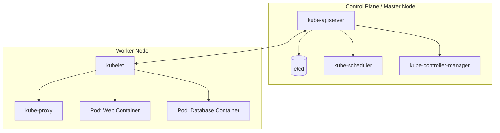
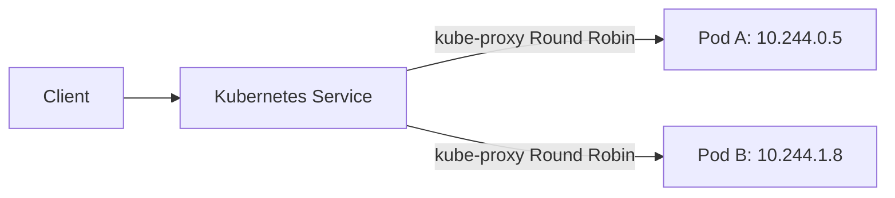

# 🔬 Lab D02: Local Kubernetes Deployment (Minikube / Kind)

In this hands-on laboratory, you will master the principles of container orchestration by deploying a resilient, multi-component application stack onto a local **Kubernetes** cluster utilizing **Minikube** or **Kind**. You will design declarative manifest files (`YAML`) for deployments, services, configuration maps, and encrypted secrets, enforcing resource scheduling limits and configuring robust self-healing health probes.

---

## 1. 💡 The Core Concepts

**Kubernetes (K8s)** is an open-source container orchestration platform designed to automate the deployment, scaling, and management of containerized applications. It shifts the infrastructure model from imperative scripting to declarative state management.

---

### Deep Dive: L1 & L2 Mechanics

#### 1. The Control Loop & Declarative State
At the heart of Kubernetes is a continuous reconciliation loop.
*   **Declarative Model**: You declare the *Desired State* of your system in YAML files (e.g., "I want 3 replicas of my web app running, with 200m CPU limit").
*   **Reconciliation Loop**: The Control Plane constantly compares the *Actual State* (from node telemetry) with the *Desired State*. If a worker node crashes and actual replica count drops to 2, the `kube-controller-manager` and `kube-scheduler` immediately launch a new pod on an active node to restore the desired count of 3.

#### 2. Pod Networking & Service Proxies
*   **The Pod**: The smallest deployable unit in Kubernetes. A Pod hosts one or more containers that share the same network namespace, IP address, loopback interface, and storage volumes.
*   **Overlay Networks**: Every Pod gets a unique, cluster-routable IP address. Since Pods are ephemeral (frequently destroyed and rescheduled), their IPs are highly volatile.
*   **Services**: Abstractions that define a logical set of Pods and a policy to access them. A Service provides a stable IP address and DNS name (e.g., `http://my-service`) and load-balances traffic across target Pods using **kube-proxy** (which updates system `iptables` or IPVS rules on every node).

#### 3. Pod Lifecycle & Self-Healing Probes
Kubernetes guarantees high availability using container health probes executed by the node's **kubelet**:
*   **Startup Probe**: Determines if the container has started up successfully. All other probes are disabled until the startup probe succeeds, preventing premature kills of slow-starting services.
*   **Liveness Probe**: Determines if the container is healthy and running. If the liveness probe fails (e.g., application locks up or enters an infinite loop), the kubelet kills the container and restarts it according to the Pod's `restartPolicy`.
*   **Readiness Probe**: Determines if the container is ready to accept incoming network traffic. If it fails (e.g., loading config or database migration in progress), the endpoint controller removes the Pod's IP from the corresponding Service's routing pool, preventing clients from receiving HTTP errors.

---

### Resource Requests, Limits, & OOMKilled

When defining container resource specifications, you must configure:
*   **Resources Requests**: The minimum amount of CPU/Memory the container needs to run. The scheduler uses this value to determine which node has enough unallocated capacity to host the Pod.
*   **Resources Limits**: The absolute maximum CPU/Memory the container can consume.
    *   **CPU limits** are enforced by throttling (cgroups shares/quota). If a container hits its CPU limit, its execution is throttled, but it is *not* terminated.
    *   **Memory limits** are hard thresholds. If a container exceeds its memory limit, the Linux kernel terminates it with an **OOMKilled** (Out Of Memory) event.

---

## 2. 🌍 Real-Life Production Applications

*   **Elastic Auto-scaling**: Automatically spinning up hundreds of new Pod instances during high-traffic shopping sales using the Horizontal Pod Autoscaler (HPA), and scaling down when traffic subsides.
*   **Zero-Downtime Rolling Updates**: Replacing old version containers with new versions sequentially, verifying the readiness probe of each new Pod before tearing down the old one.

---

## 🛠️ Laboratory Challenge: Declaring a Kubernetes Stack

### The Goal
Your challenge is to write declarative Kubernetes manifests for a microservice stack.

Inside `/starter`, you will find empty manifest templates. Your tasks are:
1.  **Write `configmap.yaml` & `secrets.yaml`**:
    *   Store non-sensitive configurations (like database host names, ports, logging levels).
    *   Store encrypted base64 secrets (like database passwords and api keys).
2.  **Write `postgres-deployment.yaml` & `postgres-service.yaml`**:
    *   Create a single-replica PostgreSQL database deployment.
    *   Expose it internally on port `5432` using a ClusterIP Service.
3.  **Write `web-deployment.yaml` & `web-service.yaml`**:
    *   Create a 2-replica Web Application deployment (representing your TypeScript API).
    *   Inject configurations and secrets from ConfigMap/Secret.
    *   Configure resource requests and limits.
    *   Add robust `livenessProbe` and `readinessProbe` checking the `/health` endpoint.
    *   Expose it externally on port `80` using a NodePort or LoadBalancer Service.

---

### Step-by-Step Implementation Guide

#### 1. Analyze the Declarative Structure
Open the `/starter` folder. Notice the collection of empty YAML templates.

#### 2. Declare Configurations & Credentials
In `configmap.yaml`, declare your configuration environment variables. In `secrets.yaml`, declare base64-encoded credential parameters.

#### 3. Define PostgreSQL Database Pods
In `postgres-deployment.yaml`, construct the container spec using the official `postgres:15-alpine` image. Ensure you bind the credentials from your secret, map the persistent volume, and declare the `postgres-service.yaml` to expose the db.

#### 4. Define Web Application Pods
In `web-deployment.yaml`, configure two replicas. Map environment variables to the ConfigMap/Secrets. Specify resources (`cpu: "100m"` request / `"200m"` limit, `memory: "128Mi"` request / `"256Mi"` limit). Set up the readiness probe on path `/health`. Configure `web-service.yaml` to route external traffic to your Pods.

#### 5. Run Verification
Verify compilation and validate all Kubernetes YAML syntax schema patterns.
