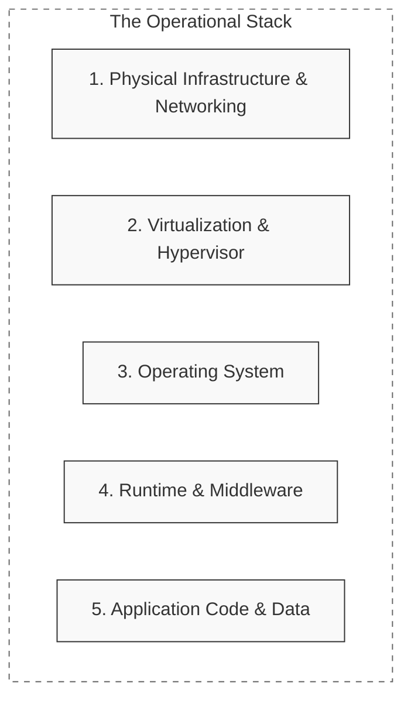
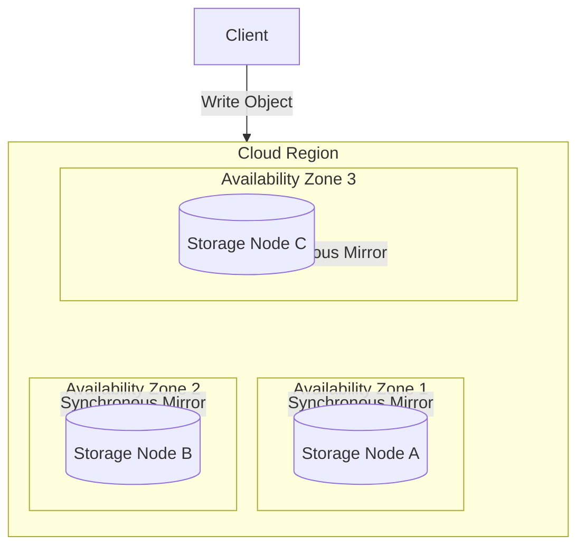
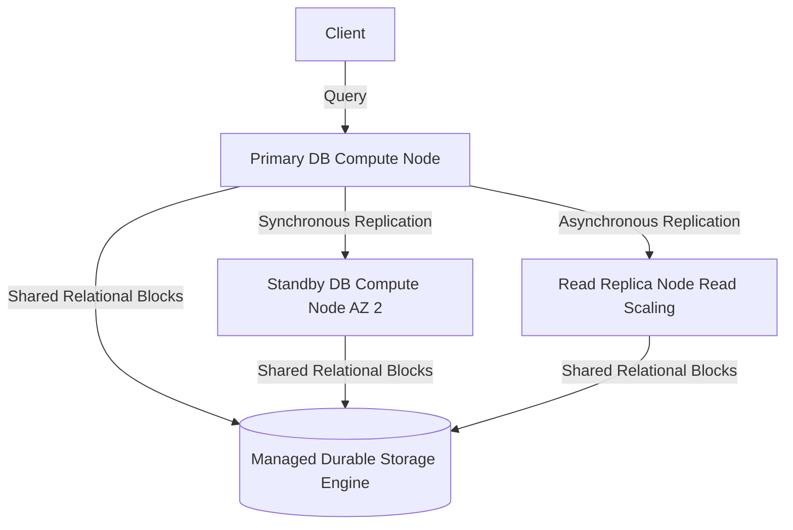

# 📖 Lab D03: Cloud Architecture (AWS & Azure Deep Dive)

Welcome to the **Cloud Architecture & Managed Services** conceptual handbook. This textbook-grade guide explores the foundational paradigms of modern cloud-native system design, comparing key hyperscaler architectures (**Amazon Web Services (AWS)** and **Microsoft Azure**). You will dive deep into cloud service models (IaaS vs. PaaS vs. SaaS), master high-durability storage topologies, and explore managed database design patterns.

---

## 1. 💡 The Core Paradigms: Service Models

In on-premises data centers, you own and manage the entire physical and logical stack—from sub-floor cooling and fiber conduits to application runtimes. Cloud computing shifts this ownership dynamically based on the service model:

### Comparative Analysis of Cloud Models

#### 1. Infrastructure as a Service (IaaS)
*   **Hyperscaler Products**: AWS EC2 (Elastic Compute Cloud), Azure VM (Virtual Machines).
*   **Shared Responsibility**: The cloud provider manages the physical hardware, virtualization hypervisor, and networking infrastructure. **You** manage the guest operating system, patching, firewall rules (Security Groups), runtime engines, and data storage.
*   **Best For**: Legacy system migration ("lift-and-shift"), custom operating system kernels, or applications requiring precise hardware access control.

#### 2. Platform as a Service (PaaS)
*   **Hyperscaler Products**: AWS Elastic Beanstalk / App Runner, Azure App Services.
*   **Shared Responsibility**: The cloud provider completely automates the OS, server patching, middleware runtime, and capacity scaling. **You** only provide the packaged application code (e.g., a ZIP file or a Docker container) and configurations.
*   **Best For**: Rapid development, standard web applications, APIs, and microservices where minimizing operating overhead is crucial.

#### 3. Software as a Service (SaaS)
*   **Hyperscaler Products**: Microsoft 365, Salesforce, Google Workspace.
*   **Shared Responsibility**: The provider manages the entire stack. **You** only configure settings and control user access (IAM).

---

## 2. 🗄️ Storage Classes: High-Durability Architectures

Object storage is the backbone of cloud-scale data durability. Unlike traditional block storage (hard drives mounted to a single server), object storage is decoupled from compute and treats files as keys mapped to binary blobs.

### AWS S3 (Simple Storage Service) vs. Azure Blob Storage

Both S3 and Azure Blob Storage are designed for **eleven nines (99.999999999%) of data durability** by automatically replicating objects across multiple physical data centers (Availability Zones) within a single region.

### Storage Tiers & Cost Optimization

Storage cost scales with access latency. Standardizing your lifecycle policies is critical to preventing explosive cloud bills:

| Tier | AWS Class | Azure Tier | Ideal Use Case | Access Latency |
| :--- | :--- | :--- | :--- | :--- |
| **Hot** | S3 Standard | Hot Blob | Active, frequently read user assets (avatars, PDFs). | Milliseconds |
| **Cool** | S3 Standard-IA | Cool Blob | Infrequently accessed data, backups, audit logs. | Milliseconds |
| **Cold** | S3 Glacier | Archive Blob | Decades-long regulatory archival (financials, HIPAA). | Minutes to Hours |

---

## 3. 🛢️ Managed Databases: RDS & Azure SQL

Deploying databases on virtual servers (IaaS) requires manual setup of replication, read replicas, backups, and point-in-time recovery. Managed database engines automate these operations.

### AWS RDS (Relational Database Service) & Azure SQL

Managed databases separate **compute** (CPU/RAM parsing queries) from **storage** (relational database blocks).

### Key Capabilities

*   **Multi-AZ High Availability**: Synchronous mirroring of write transactions to a secondary compute standby node in a different Availability Zone. If the primary node crashes, a DNS failover seamlessly redirects traffic to the standby node within seconds.
*   **Read Replicas**: Asynchronous replication to separate read-only compute nodes to offload intensive reporting queries and read-heavy traffic spikes from the primary master database.
*   **Automated Backups**: Continuous streaming of transaction logs to S3/Blob, enabling Point-in-Time Recovery (PITR) to restore your database to any exact millisecond over the retention period.

---

## 4. 🗺️ Hyperscaler Service Mapping Matrix

To navigate multi-cloud topologies, engineers must translate core service blocks between major providers:

| Architectural Block | AWS Service | Azure Service | Open-Source / Local Alternative |
| :--- | :--- | :--- | :--- |
| **Compute (VMs)** | EC2 | Virtual Machines | QEMU / VirtualBox |
| **Serverless Functions** | Lambda | Azure Functions | OpenFaaS / LocalStack |
| **Managed Container Engine** | ECS / EKS | AKS (Azure Kubernetes Service) | Kind / Minikube |
| **Relational Database** | RDS (PostgreSQL/MySQL) | Azure Database for PostgreSQL | Raw PostgreSQL / MySQL Docker |
| **NoSQL Database** | DynamoDB | Cosmos DB | MongoDB / Cassandra |
| **Distributed Cache** | ElastiCache | Azure Cache for Redis | Redis Docker |
| **Object Storage** | S3 | Blob Storage | MinIO |
| **Identity & Access** | IAM | Microsoft Entra ID (Azure AD) | Keycloak |
