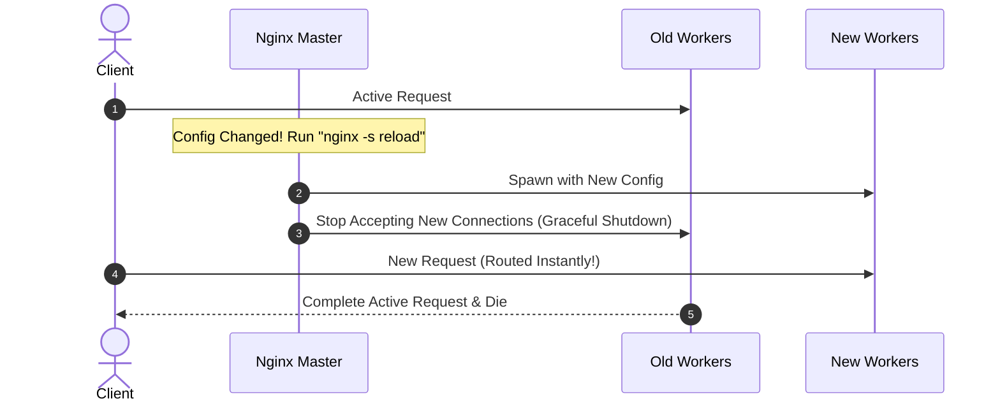

# 🔬 Lab D04: Blue-Green & Canary Deployer (Nginx Routing)

In this hands-on laboratory, you will master advanced zero-downtime deployment strategies by building a custom **Blue-Green & Canary Deployer** from scratch. You will design a control orchestrator that deploys application versions in isolated slots, validates environment health using sequential probes, and dynamically hot-reloads an **Nginx** reverse proxy to shift traffic seamlessly between active configurations with zero packets dropped.

---

## 1. 💡 The Core Concepts

A major challenge in production systems is updating software without interrupting active users. Direct deployment ("in-place deployment") requires stopping the application, replacing files, and restarting—resulting in system downtime. **Blue-Green Deployment** solves this by maintaining two identical production-grade environments.

```mermaid
graph TD
    subgraph Inactive_Slot [Blue Environment (V1.0 - Inactive)]
        B[Blue Container Slot Port 3001]
    end

    subgraph Active_Slot [Green Environment (V2.0 - Active)]
        G[Green Container Slot Port 3002]
    end

    Router[Nginx Reverse Proxy] -->|Routes Traffic| G
    Client --> Router
```

---

### Deep Dive: L1 & L2 Mechanics

#### 1. Nginx Process Architecture & Hot-Reloading
Traditional proxies require a complete process restart to update routing configurations, which kills active connections. **Nginx** eliminates this through a master-worker process architecture:
*   **The Master Process**: Responsible for reading and validating configurations, and managing worker processes.
*   **Worker Processes**: Handle actual client connections and request-response cycles.
*   **Hot-Reload (`nginx -s reload`)**:
    1.  When you trigger a reload, the Master process checks the syntax of the new configuration file.
    2.  If valid, the Master spawns a *new* set of worker processes running the new configuration.
    3.  The Master instructs the *old* worker processes to gracefully shut down.
    4.  The old workers stop accepting new incoming connections but finish processing all active requests in flight.
    5.  This guarantees a seamless transition with **zero downtime and zero dropped packets**!



#### 2. The Verification Gate (Smoke Testing)
Before routing production user traffic to a newly deployed environment, you must guarantee that the environment is fully operational.
*   **Active Slot Probe**: The deployer triggers internal HTTP probes (e.g. `GET /health` or `GET /api/v1/ping`) against the inactive environment's raw port (e.g., port `3002` for Green) while the router is still pointing to the active environment (e.g., port `3001` for Blue).
*   **Automated Rollback**: If the probe returns an error (e.g. status code `500` or connection timeout) after a set number of retries, the deployer aborts the deployment and logs a failure, leaving the stable, active slot running untouched.

#### 3. Canary Deployments: Progressive Traffic Shifting
Instead of shifting 100% of user traffic to the new environment instantly, a **Canary Deployment** routing policy shifts a small percentage (e.g., 10%) of requests to the new version ("the canary") while routing the remaining 90% to the stable version.
*   **Weight-Based Nginx Upstreams**:
    ```nginx
    upstream app_servers {
        server 127.0.0.1:3001 weight=9; # Stable (Blue)
        server 127.0.0.1:3002 weight=1; # Canary (Green)
    }
    ```
    This allows you to monitor telemetry, error rates, and user feedback on a tiny subset of production traffic before scaling the deployment to 100%.

---

## 2. 🌍 Real-Life Production Applications

*   **Continuous Deployment Gates**: Modern CI/CD platforms automatically execute smoke tests on an isolated container slot. Once passing, they flip the traffic router and delete the old container slot.
*   **A/B User Testing**: Using weight-based reverse proxies to test new UI features on exact cohorts of production traffic to audit engagement and performance metrics.

---

## 🛠️ Laboratory Challenge: Blue-Green & Canary Deployer

### The Goal
Your challenge is to build an automated **Blue-Green Deployer** in TypeScript. You will write an orchestrator class that manages slots, executes health check probes, swaps router files, and triggers hot-reloads.

Inside `/starter`, you will find:
1.  **A Mock Environment**: Mocks Nginx routing configurations and Nginx process reloads.
2.  **Your Orchestrator Skeleton (`index.ts`)**:
    *   Class `BlueGreenDeployer` which manages two environments: `blue` (port `3001`) and `green` (port `3002`).
    *   Method `deploy(newVersion: string)`:
        1. Identify the *inactive* slot.
        2. Simulate launching the new version in the inactive slot.
        3. Execute smoke-test probes against the inactive slot's health endpoint.
        4. If health probes pass, rewrite the Nginx config to point to the inactive slot.
        5. Trigger Nginx hot-reload.
        6. If probes fail, abort, log, and perform a rollback.
3.  **TDD Test Suite (`index.test.ts`)**: Asserts correct slot transitions, successful deployments, and rollback protection on smoke-test failures.

---

### 3. Step-by-Step Implementation Guide

#### 1. Open the `/starter` folder
Examine the class interfaces and Nginx shell execution mocks in `index.ts`.

#### 2. Implement Active & Inactive Slot Detection
Write logic inside `BlueGreenDeployer` to determine which slot is currently serving production traffic based on Nginx configuration analysis, and which slot is offline/idle.

#### 3. Implement the Smoke-Testing Probe Loop
Write a sequential retry loop that sends HTTP pings to the inactive slot's health endpoint. Configure thresholds for success and failure timeouts.

#### 4. Implement Nginx Config Rewrite & Graceful Reload
Write code that replaces upstream port numbers in the Nginx config template and invokes the mock hot-reload shell signal.

#### 5. Verify the Rollback Strategy
Ensure that on health-check failure, the deployer leaves the active slot untouched, terminates the failed boot in the inactive slot, and raises an exception. Run the Vitest test suite to verify behavior.

---

## 4. 🧮 Mathematical Modeling of Traffic Shifting

In a Canary Deployment, shifting traffic progressively rather than abruptly reduces risk. We can model the Canary traffic ratio $C(t) \in [0, 1]$ over time $t \ge 0$ as a piecewise linear step function:

$$C(t) = \min\left(1.0, \left\lfloor \frac{t}{\tau} \right\rfloor \cdot \Delta w\right)$$

Where:
*   $\tau$ is the soak time interval between progressive shifts (e.g., $\tau = 5\text{ minutes}$).
*   $\Delta w$ is the step percentage increment (e.g., $\Delta w = 0.10$ for $10\%$ steps).
*   $t$ is the elapsed deployment time since the canary slot passed its smoke test.

Alternatively, for continuous linear progressive routing:

$$C(t) = \begin{cases} 
      0 & t < t_{smoke} \\
      r \cdot (t - t_{smoke}) & t_{smoke} \le t < t_{smoke} + \frac{1}{r} \\
      1.0 & t \ge t_{smoke} + \frac{1}{r}
   \end{cases}$$

Where $r$ is the continuous shifting rate ($\text{sec}^{-1}$). If $r = 0.001$, traffic transitions from $0\%$ to $100\%$ over exactly $1000\text{ seconds}$ ($\approx 16.6\text{ minutes}$).

---

## 5. 📋 Chronological Deployment Trace Table

The following trace table outlines the status of the environment, router, and health validation metrics during each step of a zero-downtime blue-to-green deployment:

| Sequence Step | Action Description | Active Slot | Inactive Slot | Active Port | Inactive Port | Nginx Routing Upstream Configuration | Smoke Test Status | Traffic State |
| :--- | :--- | :--- | :--- | :--- | :--- | :--- | :--- | :--- |
| **0. Idle (Steady)** | System is healthy on v1.0.0. | `blue` | `green` (idle) | `3001` | `3002` | `server 127.0.0.1:3001;` | `N/A` | $100\%$ production on Blue |
| **1. Inactive Spinup** | Deployer boots v2.0.0 on inactive port. | `blue` | `green` (starting) | `3001` | `3002` | `server 127.0.0.1:3001;` | `Pending` | $100\%$ production on Blue |
| **2. Probe Phase 1** | First HTTP ping sent to port 3002. | `blue` | `green` (booting) | `3001` | `3002` | `server 127.0.0.1:3001;` | `Failed` (Connection refused) | $100\%$ production on Blue |
| **3. Probe Phase 2** | Second HTTP ping (retry after delay). | `blue` | `green` (alive) | `3001` | `3002` | `server 127.0.0.1:3001;` | `Passed` (HTTP 200 OK) | $100\%$ production on Blue |
| **4. Traffic Shift** | Config rewrite and dynamic Nginx reload. | `green` | `blue` (drain) | `3002` | `3001` | `server 127.0.0.1:3002;` | `Passed` | $100\%$ production on Green |
| **5. Post-Deployment** | Old active slot (Blue) safely terminated. | `green` | `blue` (stopped) | `3002` | `3001` | `server 127.0.0.1:3002;` | `N/A` | $100\%$ production on Green |

---

## 6. 🛠️ Premium Nginx Routing Configuration & Scripts

Below is an production-grade, extensible Nginx configuration layout that implements dynamic slot routing and weight-based canary divisions.

### 📝 Dynamic Upstream Routing (`nginx.conf`)
```nginx
# Main Nginx process configuration
worker_processes auto;
pid /var/run/nginx.pid;

events {
    worker_connections 1024;
    use epoll;
    multi_accept on;
}

http {
    include /etc/nginx/mime.types;
    default_type application/octet-stream;

    # Performance optimizations
    sendfile on;
    tcp_nopush on;
    tcp_nodelay on;
    keepalive_timeout 65;

    # Load dynamic routing configuration compiled by deployer
    include /etc/nginx/conf.d/active_upstream.conf;

    server {
        listen 80;
        server_name app.internal;

        location / {
            proxy_pass http://backend_servers;
            proxy_set_header Host $host;
            proxy_set_header X-Real-IP $remote_addr;
            proxy_set_header X-Forwarded-For $proxy_add_x_forwarded_for;
            proxy_set_header X-Forwarded-Proto $scheme;
            
            # Disable buffering for WebSockets or real-time event streaming
            proxy_buffering off;
        }

        # Status page for proxy diagnostics
        location /nginx_status {
            stub_status on;
            allow 127.0.0.1;
            deny all;
        }
    }
}
```

### 📝 Active Upstream Config Map (`conf.d/active_upstream.conf`)
This isolated configuration file is overwritten programmatically by the deployer and hot-reloaded:

```nginx
# For Blue-Green Strategy: Points entirely to the active slot
upstream backend_servers {
    server 127.0.0.1:3001; # Pointing to Blue (Active)
}

# OR For Canary Strategy: Weight-based split
# upstream backend_servers {
#     server 127.0.0.1:3001 weight=9; # Stable Blue (90%)
#     server 127.0.0.1:3002 weight=1; # Canary Green (10%)
# }
```

### 📝 Bash Switch Script (`switch.sh`)
This lightweight automation script can be run on corporate environments to switch upstream configs and trigger a graceful reload:

```bash
#!/usr/bin/env bash
set -euo pipefail

# Configurations
NGINX_CONF_DIR="/etc/nginx/conf.d"
UPSTREAM_CONF="${NGINX_CONF_DIR}/active_upstream.conf"

usage() {
    echo "Usage: $0 [blue|green|canary]"
    exit 1
}

if [ $# -lt 1 ]; then
    usage
fi

SLOT=$1

echo "==> Configuring traffic transition to: ${SLOT}"

case "${SLOT}" in
    blue)
        echo -e "upstream backend_servers {\n    server 127.0.0.1:3001;\n}" > "${UPSTREAM_CONF}"
        ;;
    green)
        echo -e "upstream backend_servers {\n    server 127.0.0.1:3002;\n}" > "${UPSTREAM_CONF}"
        ;;
    canary)
        echo -e "upstream backend_servers {\n    server 127.0.0.1:3001 weight=9;\n    server 127.0.0.1:3002 weight=1;\n}" > "${UPSTREAM_CONF}"
        ;;
    *)
        usage
        ;;
esac

echo "==> Validating Nginx configuration syntax..."
nginx -t

echo "==> Dynamic hot-reload: Sending SIGHUP to Master..."
nginx -s reload

echo "==> Zero-Downtime routing update completed successfully!"
```

---

## 7. ⚠️ Common Pitfalls & Anti-Patterns

1.  **Direct Process Termination (SIGKILL)**: Stopping the old environment abruptly (`kill -9`) before connections naturally drain.
    *   *Correction*: Utilize `SIGTERM` signals and allow a connection-drain time window (e.g., 30s) inside application servers.
2.  **Lack of Database Schema Backward Compatibility**: Deploying v2.0.0 (Green) that relies on a schema change which breaks v1.0.0 (Blue) while both are simultaneously alive.
    *   *Correction*: Always perform database migrations in backward-compatible steps: Expand column $\to$ Deploy Code $\to$ Contract old schema.
3.  **Hardcoded Port Allocations**: Restricting port values without modular parametrization, preventing concurrent server launches.
    *   *Correction*: Dynamically assign high-range dynamic ports or pass ports through clean ENV environment variables during launcher instantiation.
4.  **Static Session Sticking without Distributed Storage**: Directing users to v2.0.0 where their authentication sessions don't exist because session data is kept in-memory rather than shared via Redis.
    *   *Correction*: Store user sessions in a centralized, shared key-value store (e.g. Redis Sorted Sets or Redis key-value cache) to guarantee stateless application nodes.

---

## 8. 🔑 Key Takeaways

*   **Zero-Downtime Transitions**: Nginx's master-worker architecture enables reloading configurations dynamically by letting old workers finish in-flight requests while new workers process fresh ones.
*   **Tracer Bullet Testing**: Running smoke tests against the isolated inactive port prevents bad builds from ever reaching a single real-world client.
*   **Dynamic Rollbacks**: On verification failure, stopping the starting server and resetting state is a highly safe, fully automated self-healing action.
*   **Decoupled Components**: Keeping routing configurations separate from routing engines allows scripting code to dynamically manipulate proxy states securely.

