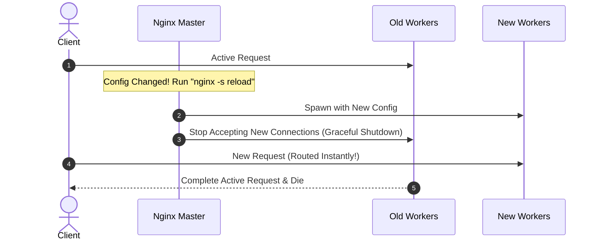

# 🔬 Lab D04: Blue-Green & Canary Deployer (Nginx Routing)

In this hands-on laboratory, you will master advanced zero-downtime deployment strategies by building a custom **Blue-Green & Canary Deployer** from scratch. You will design a control orchestrator that deploys application versions in isolated slots, validates environment health using sequential probes, and dynamically hot-reloads an **Nginx** reverse proxy to shift traffic seamlessly between active configurations with zero packets dropped.

---

## 1. 💡 The Core Concepts

A major challenge in production systems is updating software without interrupting active users. Direct deployment ("in-place deployment") requires stopping the application, replacing files, and restarting—resulting in system downtime. **Blue-Green Deployment** solves this by maintaining two identical production-grade environments.

```mermaid
graph TD
    subgraph Inactive_Slot [Blue Environment (V1.0 - Inactive)]
        B[Blue Container Slot Port 3001]
    end

    subgraph Active_Slot [Green Environment (V2.0 - Active)]
        G[Green Container Slot Port 3002]
    end

    Router[Nginx Reverse Proxy] -->|Routes Traffic| G
    Client --> Router
```

---

### Deep Dive: L1 & L2 Mechanics

#### 1. Nginx Process Architecture & Hot-Reloading
Traditional proxies require a complete process restart to update routing configurations, which kills active connections. **Nginx** eliminates this through a master-worker process architecture:
*   **The Master Process**: Responsible for reading and validating configurations, and managing worker processes.
*   **Worker Processes**: Handle actual client connections and request-response cycles.
*   **Hot-Reload (`nginx -s reload`)**:
    1.  When you trigger a reload, the Master process checks the syntax of the new configuration file.
    2.  If valid, the Master spawns a *new* set of worker processes running the new configuration.
    3.  The Master instructs the *old* worker processes to gracefully shut down.
    4.  The old workers stop accepting new incoming connections but finish processing all active requests in flight.
    5.  This guarantees a seamless transition with **zero downtime and zero dropped packets**!



#### 2. The Verification Gate (Smoke Testing)
Before routing production user traffic to a newly deployed environment, you must guarantee that the environment is fully operational.
*   **Active Slot Probe**: The deployer triggers internal HTTP probes (e.g. `GET /health` or `GET /api/v1/ping`) against the inactive environment's raw port (e.g., port `3002` for Green) while the router is still pointing to the active environment (e.g., port `3001` for Blue).
*   **Automated Rollback**: If the probe returns an error (e.g. status code `500` or connection timeout) after a set number of retries, the deployer aborts the deployment and logs a failure, leaving the stable, active slot running untouched.

#### 3. Canary Deployments: Progressive Traffic Shifting
Instead of shifting 100% of user traffic to the new environment instantly, a **Canary Deployment** routing policy shifts a small percentage (e.g., 10%) of requests to the new version ("the canary") while routing the remaining 90% to the stable version.
*   **Weight-Based Nginx Upstreams**:
    ```nginx
    upstream app_servers {
        server 127.0.0.1:3001 weight=9; # Stable (Blue)
        server 127.0.0.1:3002 weight=1; # Canary (Green)
    }
    ```
    This allows you to monitor telemetry, error rates, and user feedback on a tiny subset of production traffic before scaling the deployment to 100%.

---

## 2. 🌍 Real-Life Production Applications

*   **Continuous Deployment Gates**: Modern CI/CD platforms automatically execute smoke tests on an isolated container slot. Once passing, they flip the traffic router and delete the old container slot.
*   **A/B User Testing**: Using weight-based reverse proxies to test new UI features on exact cohorts of production traffic to audit engagement and performance metrics.

---

## 🛠️ Laboratory Challenge: Blue-Green & Canary Deployer

### The Goal
Your challenge is to build an automated **Blue-Green Deployer** in TypeScript. You will write an orchestrator class that manages slots, executes health check probes, swaps router files, and triggers hot-reloads.

Inside `/starter`, you will find:
1.  **A Mock Environment**: Mocks Nginx routing configurations and Nginx process reloads.
2.  **Your Orchestrator Skeleton (`index.ts`)**:
    *   Class `BlueGreenDeployer` which manages two environments: `blue` (port `3001`) and `green` (port `3002`).
    *   Method `deploy(newVersion: string)`:
        1. Identify the *inactive* slot.
        2. Simulate launching the new version in the inactive slot.
        3. Execute smoke-test probes against the inactive slot's health endpoint.
        4. If health probes pass, rewrite the Nginx config to point to the inactive slot.
        5. Trigger Nginx hot-reload.
        6. If probes fail, abort, log, and perform a rollback.
3.  **TDD Test Suite (`index.test.ts`)**: Asserts correct slot transitions, successful deployments, and rollback protection on smoke-test failures.

---

### Step-by-Step Implementation Guide

#### 1. Open the `/starter` folder
Examine the class interfaces and Nginx shell execution mocks in `index.ts`.

#### 2. Implement Active & Inactive Slot Detection
Write logic inside `BlueGreenDeployer` to determine which slot is currently serving production traffic based on Nginx configuration analysis, and which slot is offline/idle.

#### 3. Implement the Smoke-Testing Probe Loop
Write a sequential retry loop that sends HTTP pings to the inactive slot's health endpoint. Configure thresholds for success and failure timeouts.

#### 4. Implement Nginx Config Rewrite & Graceful Reload
Write code that replaces upstream port numbers in the Nginx config template and invokes the mock hot-reload shell signal.

#### 5. Verify the Rollback Strategy
Ensure that on health-check failure, the deployer leaves the active slot untouched, terminates the failed boot in the inactive slot, and raises an exception. Run the Vitest test suite to verify behavior.
