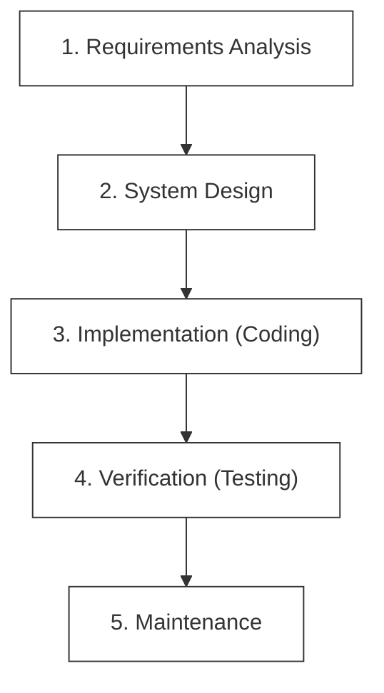
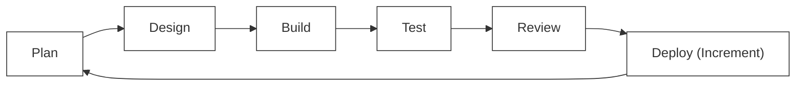
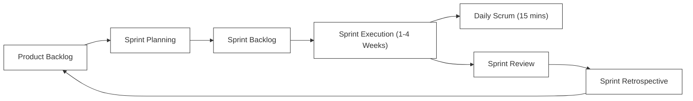
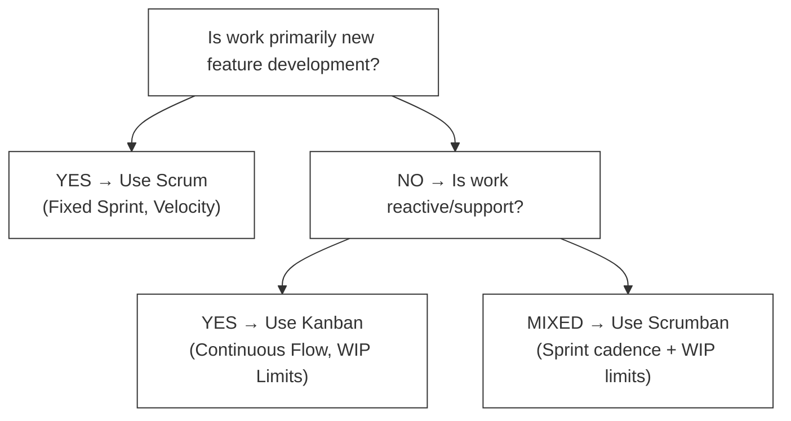

# F-00: SDLC & Agile Principles Handbook

Welcome to the foundation of professional software development! In this handbook, you will learn how modern engineering teams plan, build, and deliver high-quality software at scale, transitioning from historical linear models to highly iterative, value-driven Agile frameworks.

---

## 1. The Evolution of Software Delivery Models

Historically, software was built using the **Waterfall model**—a linear, sequential design process where progress flows steadily downwards like a waterfall through phases (Requirements, Design, Implementation, Verification, Maintenance).



### L1 — What Waterfall Is
The Waterfall model treats software delivery as a one-pass assembly line. Every phase must be fully completed before the next begins. Documentation gates separate each phase, and stakeholder sign-offs are required before advancing.

### L2 — How Waterfall Breaks Down Internally
The model assumes requirements are **perfectly understood at the start** and **will not change**. In practice, market conditions shift, users discover new needs mid-cycle, and technical constraints surface only during implementation. Because validation happens only at the verification stage, errors discovered there propagate backwards through the entire chain — a phenomenon called **late-stage feedback amplification**.

**Real-world production scenario**: A government contract for a benefits-processing portal took 3 years to develop under Waterfall. By delivery, the underlying tax code had changed twice, rendering 40% of the implemented logic obsolete. Re-engineering cost more than the original build.

### The Waterfall Challenge
*   **High Risk**: Testing occurs only at the very end of the cycle. Architectural flaws discovered late are extremely expensive to resolve.
*   **Delayed Feedback**: Users do not see the product until the final release, leading to discrepancies between what was built and what is actually needed.
*   **Rigid to Change**: Adapting to shifting market requirements requires halting the entire process and re-initiating from the planning phase.

> [!CAUTION]
> Research from the Standish Group (CHAOS Report) consistently shows that Waterfall projects have a success rate under 15% for large enterprise initiatives.

### The Agile Solution
Agile breaks down the development lifecycle into short, iterative increments (usually 1 to 4 weeks). Each iteration runs through all development phases, producing a functional, working increment of software.



**Key difference**: In Agile, the loop repeats every 2 weeks. Stakeholders see working software and give feedback at every iteration, catching requirement mismatches before they compound.

---

## 2. The Agile Manifesto & Core Values

In 2001, a group of software pioneers drafted the **Agile Manifesto**, establishing four core values that prioritize human interaction, flexibility, and value delivery over rigid processes:

1.  **Individuals and interactions** over processes and tools.
2.  **Working software** over comprehensive documentation.
3.  **Customer collaboration** over contract negotiation.
4.  **Responding to change** over following a plan.

> [!NOTE]
> While the items on the right have value, modern engineering teams value the items on the left more.

### L2 — The 12 Agile Principles (Internal Mechanics)
The manifesto is backed by 12 principles. The most operationally important ones for engineers are:

| # | Principle | Engineering Impact |
|---|---|---|
| 1 | Deliver working software frequently (weeks, not months) | Sprint cadence forces releasable increments |
| 3 | Deliver working software is the primary measure of progress | Removes vanity metrics (% complete) |
| 9 | Continuous attention to technical excellence | Enforces code quality standards |
| 10 | Simplicity — maximizing work not done | YAGNI / KISS principles |
| 12 | Regular team reflection and adaptation | Sprint Retrospective is mandatory |

```python
# Example: Measuring "done" in Agile
# ❌ Waterfall-style progress report:
progress = {
    "requirements_doc": "100% complete",
    "design_doc": "100% complete",
    "code_written": "60%",
    "working_software": "0%"  # Nothing deliverable yet!
}

# ✅ Agile-style progress:
progress = {
    "sprint_1_features_deployed": ["user login", "product listing"],
    "sprint_2_features_deployed": ["shopping cart", "checkout"],
    "feedback_loops_completed": 2
}
```

---

## 3. The Scrum Framework

Scrum is the most widely adopted Agile framework. It organizes teams into cross-functional units that commit to delivering value at regular intervals called **Sprints**.

### L1 — What Scrum Is
Scrum is a **lightweight empirical process framework** with defined roles, events, and artifacts. It operates on three pillars: **Transparency** (everyone knows what everyone is doing), **Inspection** (regular review of progress), and **Adaptation** (change processes that aren't working).

### L2 — How Scrum Works Internally (The Feedback Engine)
Each Sprint is a miniature SDLC. The real power of Scrum is the **empirical feedback engine**: the retrospective output directly feeds into the next Sprint's planning. Teams don't just iterate on software — they iterate on **how they build software**.



### Roles in a Scrum Team
*   **Product Owner (PO)**: Represents the customer and business. Owns the Product Backlog, defining features and prioritizing tasks based on value.
*   **Scrum Master (SM)**: Facilitates team operations. Removes blockers (impediments), ensures Scrum practices are followed, and coaches the team in productivity.
*   **Developers (Engineering Team)**: Cross-functional members (frontend, backend, QA, DevOps) who design, build, test, and deliver the working software increment.

### Core Scrum Ceremonies (Events)

1.  **Sprint Planning**: The team selects stories from the prioritized Product Backlog and commits to delivering them during the Sprint, creating the Sprint Backlog.
2.  **Daily Standup (Daily Scrum)**: A 15-minute sync where team members address three questions:
    *   *What did I accomplish yesterday?*
    *   *What will I work on today?*
    *   *Are there any blockers in my way?*
3.  **Sprint Review**: A showcase at the end of the Sprint where developers demonstrate the working software increment to stakeholders and gather feedback.
4.  **Sprint Retrospective**: A team-only reflection meeting to review processes:
    *   *What went well?*
    *   *What didn't go well?*
    *   *How can we improve in the next Sprint?*

**Concrete example — A Sprint in a real engineering team:**

```
Sprint Goal: "Enable users to browse and search the product catalog"

Sprint Backlog:
  - DPW-101: Create /products REST API endpoint             [5 pts]
  - DPW-102: Implement full-text search with PostgreSQL     [8 pts]
  - DPW-103: Build product listing UI component            [3 pts]
  - DPW-104: Write integration tests for search endpoint   [3 pts]

Total Commitment: 19 story points

Daily Standup (Day 3):
  Alice: "Finished DPW-101 API, started DPW-104 tests. No blockers."
  Bob:   "DPW-102 in progress. Blocked — need DB read replica access."
  Scrum Master: "I'll escalate DB access with DevOps today."
```

---

## 4. Requirement Gathering: User Stories & Backlog

Requirements in Agile are written from the perspective of the end user as **User Stories** to maintain a user-centric focus:

$$\text{As a } [\text{type of user}], \text{ I want to } [\text{perform an action}] \text{ so that } [\text{I achieve a business benefit}].$$

### L2 — Why User Stories Work (Internal Psychology)
User stories force teams to articulate *who* benefits and *why* before discussing *what* to build. This prevents engineers from building technically elegant solutions to the wrong problem — a failure mode called **gold plating**.

**Example User Story with Acceptance Criteria:**

```
Story: As a library member, I want to search for books by title so that
       I can quickly find materials without browsing every shelf.

Acceptance Criteria (BDD Format):
  GIVEN I am a logged-in member
  WHEN I type "Clean Code" into the search bar
  THEN I see a results list containing books with "Clean Code" in the title
  AND each result shows the author name and availability status
  AND the search responds within 300ms
```

### The INVEST Criteria for Great Stories
*   **I - Independent**: Stories should be self-contained to avoid dependencies.
*   **N - Negotiable**: Stories are not contracts; details are refined through collaboration.
*   **V - Valuable**: Must deliver a visible, clear benefit to the user or business.
*   **E - Estimable**: The team must understand the work well enough to estimate its effort (often using Fibonacci story points).
*   **S - Small**: Should comfortably fit within a single sprint.
*   **T - Testable**: Must have clear **Acceptance Criteria** so developers and QA know exactly when the story is complete.

### Story Point Estimation: Planning Poker

```
Fibonacci Scale: 1, 2, 3, 5, 8, 13, 21 (story points)

Estimation Guide:
  1 pt  = Trivial change (update config value, fix typo)
  2 pts = Simple change (add a new field to a form)
  3 pts = Small feature (new API endpoint with validation)
  5 pts = Medium feature (full CRUD with tests)
  8 pts = Complex feature (third-party integration, pagination)
  13 pts = Large, uncertain work — consider breaking down further
  21 pts = Too large — MUST be decomposed into smaller stories
```

---

## 5. Visualizing Work: Scrum vs. Kanban

To keep work highly visible, teams use physical or digital boards to track the movement of tasks:

### Kanban (Continuous Flow)
Unlike Scrum, Kanban does not use fixed-time sprints. Instead, it focuses on continuous delivery and throughput, utilizing **Work in Progress (WIP) Limits** to prevent team overload.

```
+-------------------+-------------------+-------------------+-------------------+
|      TO DO        |    IN PROGRESS    |    CODE REVIEW    |       DONE        |
|                   |   (WIP Limit: 3)  |   (WIP Limit: 2)  |                   |
+-------------------+-------------------+-------------------+-------------------+
| [Story A]         | [Story B]         | [Story D]         | [Story E]         |
| [Story C]         |                   |                   |                   |
+-------------------+-------------------+-------------------+-------------------+
```

> [!TIP]
> **WIP Limits** ensure that developers finish outstanding tasks before pulling new work. This reduces context-switching and speeds up cycle time.

### Scrum vs. Kanban — When to Use Each

| Dimension | Scrum | Kanban |
|---|---|---|
| Cadence | Fixed sprints (1–4 weeks) | Continuous flow |
| Team size | 3–9 people | Any size |
| Best for | New feature development | Operations/support/maintenance |
| Planning | Sprint planning session | Pull-based (when capacity exists) |
| Metrics | Velocity, burndown | Lead time, cycle time, throughput |
| Change mid-cycle | Not allowed during sprint | Allowed anytime |



---

## 6. The Quality Gates: Definition of Ready (DoR) & Definition of Done (DoD)

To maintain clean code quality and predictability, elite engineering teams enforce strict agreements:

### Definition of Ready (DoR)
A story is ready to be pulled into a sprint only if:
- [x] The story is estimated by the engineering team.
- [x] Clear acceptance criteria are documented.
- [x] External dependencies are resolved.
- [x] Design mockups (if UI is involved) are finalized.

### Definition of Done (DoD)
A story is considered complete and deployable only if:
- [x] The code matches the requested acceptance criteria.
- [x] Unit and integration tests are written and passing.
- [x] The code is peer-reviewed by at least one other engineer.
- [x] No security or lint vulnerabilities are present.
- [x] The feature is successfully deployed to a staging environment.

### L2 — DoD as a Living Contract
The DoD is not a one-time agreement — it evolves as teams mature. A team just starting might only require passing unit tests. A mature team running at DevOps excellence might additionally require:

```yaml
# Example mature DoD checklist (as YAML in a team's wiki):
definition_of_done:
  code:
    - unit_tests_passing: true
    - integration_tests_passing: true
    - code_coverage_minimum: 80%
    - no_linting_errors: true
    - no_security_vulnerabilities: true
  review:
    - peer_reviewed_by: 1+ engineers
    - architecture_review_for_large_changes: true
  deployment:
    - deployed_to_staging: true
    - smoke_tests_passing_on_staging: true
    - performance_benchmarks_within_sla: true
  documentation:
    - api_docs_updated: true
    - runbook_updated_if_ops_change: true
```

---

## 7. Common Pitfalls & Anti-Patterns

### Anti-Pattern 1: Dark Scrum
Teams follow Scrum ceremonies superficially without the underlying Agile values. Standups become status meetings for managers. Retrospectives happen but nothing changes.

```
❌ Dark Scrum standup:
   Manager: "Alice, what's your status on DPW-101?"
   Alice:   "Still in progress."
   Manager: "When will it be done?"

✅ True Scrum standup (team drives, not manager):
   Alice:   "Finished API endpoint, starting tests today. No blockers."
   Bob:     "Blocked on DB credentials — Alice, can you pair with me later?"
```

### Anti-Pattern 2: Sprint Scope Creep
Stakeholders push new requirements into a running sprint, disrupting the sprint goal and team focus. The correct process is to add items to the **backlog** and reprioritize for the next sprint — never mid-sprint.

### Anti-Pattern 3: Story Point Velocity Gaming
Management uses velocity as a performance metric, pressuring teams to inflate story points to show "high velocity." This destroys the predictive value of planning.

> [!WARNING]
> Velocity is a **planning tool**, not a **performance score**. A team that consistently completes 30 points is more predictable and valuable than one that inflates estimates to claim 60.

### Anti-Pattern 4: No Retrospective Action Items
Teams hold retrospectives, identify problems, but never assign action items with owners and due dates. Nothing changes sprint-over-sprint.

```
❌ Ineffective retrospective output:
   "We should communicate better."

✅ Effective retrospective output:
   Action: Create a #dev-blockers Slack channel for async impediment tracking.
   Owner:  Scrum Master (Bob)
   Due:    Before next sprint starts
```

### Anti-Pattern 5: Skipping DoR
Teams pull poorly defined stories into sprints, discover missing acceptance criteria mid-sprint, and either deliver incomplete work or push to the next sprint. The DoR gate prevents this entirely.

---

## 8. Step-by-Step Worked Example: Running a Full Sprint

Here is a complete walkthrough of a 2-week sprint from planning to retrospective.

### Day 0 — Sprint Planning (2 hours)

```
1. PO presents the top 8 stories from the Product Backlog
2. Team discusses each story, asks clarifying questions
3. Team estimates using Planning Poker:
   Story: "As a member, I want to reset my password via email"
   - Dev A: 5 pts  (backend work + email service)
   - Dev B: 3 pts  (straightforward)
   - Dev C: 5 pts
   Discussion → Consensus: 5 pts (email service integration needs time)
4. Team selects stories to fill ~30 points (their velocity)
5. Sprint goal is written: "Enable member account self-service features"
6. Sprint Backlog is created in Jira/board
```

### Days 1–9 — Sprint Execution

```bash
# Day 1: Developer creates branch per issue
git checkout -b feature/DPW-105-password-reset

# Day 3: Standup (15 minutes)
# "Yesterday: implemented token generation. Today: email integration. Blocker: none."

# Day 7: Code complete, opens Pull Request
# PR description links to DPW-105, lists acceptance criteria tested
```

### Day 10 — Sprint Review (1 hour)

```
Attendees: Team + Stakeholders + PO
Demo: Developer shows the password reset flow end-to-end
Stakeholder feedback: "Add a 'back to login' button on the reset confirmation page"
PO: "Good catch — I'll add that as a new story to the backlog"
```

### Day 10 — Retrospective (45 minutes)

```
Format: Start/Stop/Continue

START:
  - Start doing peer code reviews within 4 hours of PR creation
  - Start writing BDD acceptance criteria in story descriptions

STOP:
  - Stop skipping daily standups on Fridays
  - Stop merging PRs without 2 approvals

CONTINUE:
  - Continue sprint goal naming (helps team focus)
  - Continue pair programming on complex stories

Action Item: Bob will add PR review SLA to team working agreement before Day 1 of next sprint.
```

---

## 🚀 Practical Application: Your Next Steps
As you proceed through this curriculum, you will act as a **Developer in a Scrum Team**. You will:
1.  Read user-story-style requirements for each project.
2.  Use the `Definition of Done` (tests pass, clean structure) to complete each lab.
3.  Organize your own progress through `task.md` like a personal Kanban board!

---

## 📚 Key Takeaways

| Concept | One-Line Summary |
|---|---|
| Waterfall | Linear, one-pass, high-risk for anything that changes |
| Agile Manifesto | People & working software over processes & documentation |
| Scrum | Time-boxed sprints with inspect-and-adapt feedback loops |
| Kanban | Continuous flow regulated by WIP limits |
| User Stories | Requirements written from the user's perspective with BDD acceptance criteria |
| INVEST | The six quality criteria for a well-formed user story |
| DoR | Quality gate before pulling a story into a sprint |
| DoD | Quality gate before marking a story as complete |
| Story Points | Relative effort estimates — planning tool, not productivity score |
| Retrospective | The team's mechanism to improve HOW they work, not just WHAT they build |

> [!TIP]
> The single most impactful Agile habit: **never let a sprint end without a retrospective action item with a named owner and a due date**. Teams that do this consistently improve faster than any other intervention.
