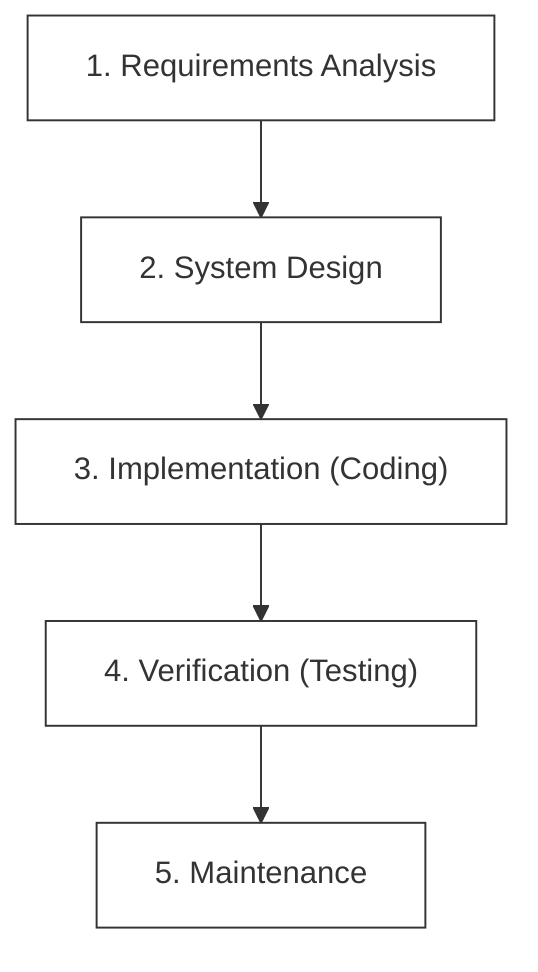
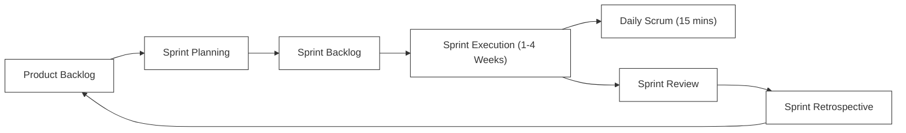

# F-00: SDLC & Agile Principles Handbook

Welcome to the foundation of professional software development! In this handbook, you will learn how modern engineering teams plan, build, and deliver high-quality software at scale, transitioning from historical linear models to highly iterative, value-driven Agile frameworks.

---

## 1. The Evolution of Software Delivery Models

Historically, software was built using the **Waterfall model**—a linear, sequential design process where progress flows steadily downwards like a waterfall through phases (Requirements, Design, Implementation, Verification, Maintenance).



### The Waterfall Challenge
*   **High Risk**: Testing occurs only at the very end of the cycle. Architectural flaws discovered late are extremely expensive to resolve.
*   **Delayed Feedback**: Users do not see the product until the final release, leading to discrepancies between what was built and what is actually needed.
*   **Rigid to Change**: Adapting to shifting market requirements requires halting the entire process and re-initiating from the planning phase.

### The Agile Solution
Agile breaks down the development lifecycle into short, iterative increments (usually 1 to 4 weeks). Each iteration runs through all development phases, producing a functional, working increment of software.

---

## 2. The Agile Manifesto & Core Values

In 2001, a group of software pioneers drafted the **Agile Manifesto**, establishing four core values that prioritize human interaction, flexibility, and value delivery over rigid processes:

1.  **Individuals and interactions** over processes and tools.
2.  **Working software** over comprehensive documentation.
3.  **Customer collaboration** over contract negotiation.
4.  **Responding to change** over following a plan.

> [!NOTE]
> While the items on the right have value, modern engineering teams value the items on the left more.

---

## 3. The Scrum Framework

Scrum is the most widely adopted Agile framework. It organizes teams into cross-functional units that commit to delivering value at regular intervals called **Sprints**.



### Roles in a Scrum Team
*   **Product Owner (PO)**: Represents the customer and business. Owns the Product Backlog, defining features and prioritizing tasks based on value.
*   **Scrum Master (SM)**: Facilitates team operations. Removes blockers (impediments), ensures Scrum practices are followed, and coaches the team in productivity.
*   **Developers (Engineering Team)**: Cross-functional members (frontend, backend, QA, DevOps) who design, build, test, and deliver the working software increment.

### Core Scrum Ceremonies (Events)
1.  **Sprint Planning**: The team selects stories from the prioritized Product Backlog and commits to delivering them during the Sprint, creating the Sprint Backlog.
2.  **Daily Standup (Daily Scrum)**: A 15-minute sync where team members address three questions:
    *   *What did I accomplish yesterday?*
    *   *What will I work on today?*
    *   *Are there any blockers in my way?*
3.  **Sprint Review**: A showcase at the end of the Sprint where developers demonstrate the working software increment to stakeholders and gather feedback.
4.  **Sprint Retrospective**: A team-only reflection meeting to review processes:
    *   *What went well?*
    *   *What didn't go well?*
    *   *How can we improve in the next Sprint?*

---

## 4. Requirement Gathering: User Stories & Backlog

Requirements in Agile are written from the perspective of the end user as **User Stories** to maintain a user-centric focus:

$$\text{As a } [\text{type of user}], \text{ I want to } [\text{perform an action}] \text{ so that } [\text{I achieve a business benefit}].$$

### The INVEST Criteria for Great Stories
*   **I - Independent**: Stories should be self-contained to avoid dependencies.
*   **N - Negotiable**: Stories are not contracts; details are refined through collaboration.
*   **V - Valuable**: Must deliver a visible, clear benefit to the user or business.
*   **E - Estimable**: The team must understand the work well enough to estimate its effort (often using Fibonacci story points).
*   **S - Small**: Should comfortably fit within a single sprint.
*   **T - Testable**: Must have clear **Acceptance Criteria** so developers and QA know exactly when the story is complete.

---

## 5. Visualizing Work: Scrum vs. Kanban

To keep work highly visible, teams use physical or digital boards to track the movement of tasks:

### Kanban (Continuous Flow)
Unlike Scrum, Kanban does not use fixed-time sprints. Instead, it focuses on continuous delivery and throughput, utilizing **Work in Progress (WIP) Limits** to prevent team overload.

```
+-------------------+-------------------+-------------------+-------------------+
|      TO DO        |    IN PROGRESS    |    CODE REVIEW    |       DONE        |
|                   |   (WIP Limit: 3)  |   (WIP Limit: 2)  |                   |
+-------------------+-------------------+-------------------+-------------------+
| [Story A]         | [Story B]         | [Story D]         | [Story E]         |
| [Story C]         |                   |                   |                   |
+-------------------+-------------------+-------------------+-------------------+
```

> [!TIP]
> **WIP Limits** ensure that developers finish outstanding tasks before pulling new work. This reduces context-switching and speeds up cycle time.

---

## 6. The Quality Gates: Definition of Ready (DoR) & Definition of Done (DoD)

To maintain clean code quality and predictability, elite engineering teams enforce strict agreements:

### Definition of Ready (DoR)
A story is ready to be pulled into a sprint only if:
- [x] The story is estimated by the engineering team.
- [x] Clear acceptance criteria are documented.
- [x] External dependencies are resolved.
- [x] Design mockups (if UI is involved) are finalized.

### Definition of Done (DoD)
A story is considered complete and deployable only if:
- [x] The code matches the requested acceptance criteria.
- [x] Unit and integration tests are written and passing.
- [x] The code is peer-reviewed by at least one other engineer.
- [x] No security or lint vulnerabilities are present.
- [x] The feature is successfully deployed to a staging environment.

---

## 🚀 Practical Application: Your Next Steps
As you proceed through this curriculum, you will act as a **Developer in a Scrum Team**. You will:
1.  Read user-story-style requirements for each project.
2.  Use the `Definition of Done` (tests pass, clean structure) to complete each lab.
3.  Organize your own progress through `task.md` like a personal Kanban board!
