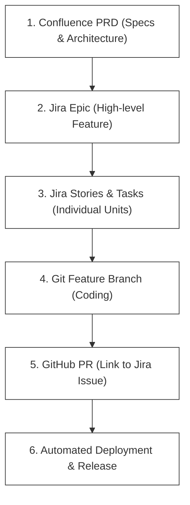
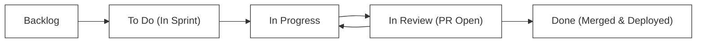
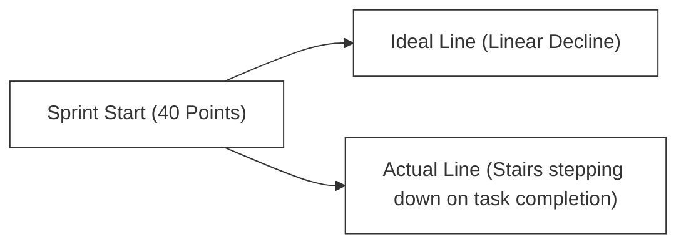

# F-01: Collaboration Tools (Jira & Confluence)

Enterprise engineering teams operate as a unified machine. To coordinate requirements, track development progress, and preserve system knowledge, modern enterprise software organizations rely on **Jira** and **Confluence** (Atlassian Suite). This handbook will show you how to utilize these collaboration platforms effectively to drive engineering clarity.

---

## 1. Requirement Flow: Ideation to Release

Before writing a single line of code, software requirements must be captured, designed, and tracked. A professional requirement flow looks like this:



### L1 — Why This Flow Exists
Without a structured requirement flow, engineering teams fall into **chaos mode**: developers start coding before requirements are clear, scope changes arrive mid-sprint, and nobody can trace why a specific feature was built the way it was. The Confluence → Jira → Git traceability chain creates an unbroken audit trail from business intent to deployed code.

### L2 — Traceability in Practice
Traceability means you can answer these questions at any point in time:
- "Why does this code exist?" → Follow Git commit → Jira story → Confluence PRD
- "What code changed for this user story?" → Follow Jira story → linked Git branches/PRs
- "When was this deployed?" → Follow Jira release version → deployment pipeline logs

```bash
# Real-world traceability example:
# Git commit message links to Jira issue:
git commit -m "feat(auth): DPW-105 implement JWT token refresh endpoint"

# Branch name encodes the Jira issue key:
git checkout -b feature/DPW-105-jwt-token-refresh

# PR title continues the chain:
# "DPW-105: Implement JWT token refresh endpoint"
# PR body: "Closes DPW-105. See PRD: https://wiki.example.com/prd/auth-system"
```

---

## 2. Jira Core Concepts

Jira organizes software development into a structured hierarchy of **Issue Types**. Understanding this hierarchy prevents backlog disorganization:

```
+--------------------------------------------------------+
|                      EPIC                              |
|   (Example: "Implement Core Bookstore Platform")      |
+---------------------------+----------------------------+
                            |
         +------------------+------------------+
         |                                     |
+--------v---------+                 +---------v--------+
|      STORY       |                 |       BUG        |
|  (User Feature)  |                 |  (Defect Fix)    |
+--------+---------+                 +------------------+
         |
    +----+----+
    |         |
+---v---+ +---v---+
| SUB-  | | SUB-  |
| TASK  | | TASK  |
+-------+ +-------+
```

### Hierarchy Breakdown

1.  **Epic**: A large body of work that can be broken down into smaller tasks (e.g., *Build payment gateway integration*). Epics span multiple sprints.
2.  **Story**: A user-facing feature written from an end-user perspective (e.g., *As a shopper, I want to pay with credit card so that I can buy books*).
3.  **Task**: A technical item of work that does not deliver a direct, visible customer benefit (e.g., *Configure PostgreSQL database schema in staging*).
4.  **Bug**: A flaw or malfunction in the system that needs fixing (e.g., *Checkout form crashes on long usernames*).
5.  **Sub-task**: The smallest unit of work, decomposing a Story or Task into granular actions (e.g., *Write SQL table script*, *Create REST API controller*).

### L2 — Epic-to-Story Decomposition in Practice

```
Epic: "Enable User Authentication System" (DPW-EPIC-01)
│
├── Story DPW-20: "As a visitor, I want to register an account with email/password"
│     ├── Sub-task DPW-20a: "Create users table migration script"
│     ├── Sub-task DPW-20b: "Implement POST /api/auth/register endpoint"
│     └── Sub-task DPW-20c: "Write registration integration tests"
│
├── Story DPW-21: "As a registered user, I want to log in and receive a JWT"
│     ├── Sub-task DPW-21a: "Implement POST /api/auth/login endpoint"
│     └── Sub-task DPW-21b: "Configure JWT secret rotation"
│
└── Story DPW-22: "As a logged-in user, I want to reset my password via email"
      ├── Sub-task DPW-22a: "Integrate email service (SendGrid/SES)"
      └── Sub-task DPW-22b: "Implement token-based password reset flow"
```

---

## 3. Managing Agile Sprints in Jira

During active sprints, developers interact daily with Jira Sprint Boards:

### Backlog Refinement
Before a sprint begins, the team meets to groom the backlog:
*   The Product Owner prioritizes issues.
*   Developers estimate effort using **Story Points** (using sizing techniques like Planning Poker based on Fibonacci numbers: `1, 2, 3, 5, 8, 13`).
*   Tasks are refined until they meet the **Definition of Ready (DoR)**.

### Active Sprint Board
During execution, the Sprint Board visualizes the flow of tasks:

```
+-------------------+-------------------+-------------------+-------------------+
|      TO DO        |    IN PROGRESS    |    IN REVIEW      |       DONE        |
+-------------------+-------------------+-------------------+-------------------+
| [DPW-101]         | [DPW-99]          | [DPW-88]          | [DPW-77]          |
| Create API route  | Setup DB Schema   | Fix login crash   | Design homepage   |
+-------------------+-------------------+-------------------+-------------------+
```

> [!IMPORTANT]
> **Issue Keys** (like `DPW-99`) are unique identifiers. You should always include the Jira Issue Key in your **git branch name** and **commit messages** (e.g., `git checkout -b feature/DPW-99-db-schema`, and commit `feat(db): DPW-99 setup core bookstore schema`) to establish automatic traceability!

### Jira Workflow States



### Jira Query Language (JQL) — Finding Issues

```jql
-- Find all open stories assigned to you in the current sprint:
project = DPW AND sprint in openSprints() AND assignee = currentUser() AND issuetype = Story

-- Find all bugs with priority "High" created in the last 7 days:
project = DPW AND issuetype = Bug AND priority = High AND created >= -7d

-- Find all stories in Epic DPW-EPIC-01:
"Epic Link" = DPW-EPIC-01 AND issuetype = Story

-- Find all unresolved blockers:
project = DPW AND status != Done AND labels = blocker
```

---

## 4. Measuring Team Health: Agile Analytics

Jira provides charts to help Scrum Masters and engineering managers analyze velocity and predictability:

### The Burndown Chart
Tracks the completion of work during a sprint. The vertical axis represents remaining story points, and the horizontal axis represents time.



*   **Ideal Burn**: A straight diagonal line from the sprint start points down to zero at the end of the sprint.
*   **Actual Burn**: A stepped line showing when stories are actually marked "Done". If the line stays flat, stories are blocked. If it burns down early, the team was undercommitted.

### Burndown Pattern Interpretation

```
Pattern 1 — Healthy Burn:
Points │40 \
       │    \  .
       │     \.  .
       │      .\   .
       │        \    .
       │    Ideal \ Actual
Day    └──────────────────────>
             1  5  10 (Sprint End)

Pattern 2 — Late Crunch (risk!):
Points │40
       │   ————————
       │            \
       │   Ideal \.   \ Actual
       │            \___\
Day    └──────────────────────>

Pattern 3 — Scope Creep (points added mid-sprint):
Points │40
       │    \  ▲ (scope added!)
       │     \_/\
```

### Team Velocity
The average number of story points completed by a team over past sprints. If a team completes `30`, `32`, and `28` points in their last three sprints, their velocity is **30 points**. The team uses this to confidently commit to exactly 30 points of work during the next sprint planning.

### Cumulative Flow Diagram (CFD)

The CFD shows the volume of work in each workflow state over time. It reveals **bottlenecks** as bands that widen unexpectedly.

```
Volume
  │   ██████████████████████████ Done
  │   ▒▒▒▒▒▒▒▒▒▒▒▒▒▒▒▒▒▒▒▒▒▒▒▒ In Review (widening = PR bottleneck!)
  │   ░░░░░░░░░░░░░░░░░░░░░░░░ In Progress
  │   ▪▪▪▪▪▪▪▪▪▪▪▪▪▪▪▪▪▪▪▪▪▪▪ To Do
  └──────────────────────────────> Time
     Week 1      Week 2     Week 3
```

---

## 5. Confluence: The Engineering Knowledge Hub

While Jira tracks active *tasks*, **Confluence** stores static *knowledge*.

### L1 — What Confluence Is For
Confluence is your team's **institutional memory**. When a developer leaves the company, their knowledge should already be encoded in Confluence pages — not trapped in their head or email inbox.

### L2 — The Knowledge Decay Problem
Without structured documentation, teams experience **knowledge decay**: tribal knowledge concentrates in a few senior engineers who become single points of failure. New hires take 6+ months to onboard. Incident response is slow because nobody knows how the system was designed. Confluence directly combats all three failure modes.

### Recommended Confluence Architecture
Every product or microservice team should establish a structured space in Confluence containing:

1.  **Product Requirements Documents (PRDs)**: Detail the business goals, user personas, mockups, and scope boundaries for major initiatives.
2.  **Architecture Decision Records (ADRs)**: Document significant architectural choices made by the team (e.g., *Choosing PostgreSQL over MongoDB for transactional ledgers*) including context, alternatives, and trade-offs.
3.  **Runbooks & Onboarding Guides**: Step-by-step guides showing how to spin up a local development environment, run test suites, resolve common environment errors, and deploy to staging.
4.  **API Specifications**: Up-to-date documentation of API endpoints, request/response models, and error behaviors (often rendered via Swagger/OpenAPI).

### Example: Architecture Decision Record (ADR) Template

```markdown
# ADR-003: Choose PostgreSQL over MongoDB for Order Data

## Status
Accepted — 2026-03-15

## Context
We need to persist order transactions. Orders require strict referential integrity 
(order → line items → products) and transactional guarantees (ACID). 
The team evaluated both PostgreSQL (RDBMS) and MongoDB (document store).

## Decision
We will use **PostgreSQL**.

## Rationale
- Orders contain complex relational data with foreign key constraints.
- ACID transactions are non-negotiable for financial data.
- The team has strong PostgreSQL expertise.
- MongoDB's eventual consistency model is risky for financial ledgers.

## Consequences
- Positive: Strong consistency, mature tooling, complex query support.
- Negative: Horizontal scaling requires read replicas (not sharding by default).
- Neutral: Schema migrations required via Flyway.
```

### Confluence Page Hierarchy Example

```
📁 Engineering Wiki (Space)
├── 📄 Team Working Agreement
├── 📁 Products
│   ├── 📁 Bookstore Platform
│   │   ├── 📄 PRD: Bookstore v2.0
│   │   ├── 📁 Architecture
│   │   │   ├── 📄 System Architecture Diagram
│   │   │   ├── 📄 ADR-001: Microservices vs Monolith
│   │   │   └── 📄 ADR-003: PostgreSQL vs MongoDB
│   │   ├── 📁 APIs
│   │   │   ├── 📄 Books API Spec
│   │   │   └── 📄 Orders API Spec
│   │   └── 📁 Runbooks
│   │       ├── 📄 Local Dev Setup Guide
│   │       └── 📄 Production Incident Playbook
└── 📁 Processes
    ├── 📄 Definition of Done
    └── 📄 Sprint Cadence & Ceremonies
```

### Best Practices for Confluence Pages
*   **Use Templates**: Standardize documentation using templates (e.g., standard ADR template) to make reading across different systems familiar.
*   **Embedded Jira Filters**: Embed dynamic Jira tables directly inside Confluence documentation to show the real-time status of requirements without copying and pasting data.
*   **Drawings & Diagrams**: Embed system architecture diagrams (like Mermaid or draw.io exports) inside Confluence pages to keep mental models clear.

---

## 6. Git Branch Naming & Commit Message Conventions

### Branch Naming Convention

```bash
# Format: <type>/<JIRA-KEY>-<short-description>
git checkout -b feature/DPW-101-product-listing-api
git checkout -b bugfix/DPW-202-fix-login-null-pointer
git checkout -b chore/DPW-303-upgrade-spring-boot-3
git checkout -b hotfix/DPW-404-critical-payment-timeout
```

### Conventional Commits Format

```bash
# Format: <type>(<scope>): <JIRA-KEY> <short description>
git commit -m "feat(api): DPW-101 add GET /products endpoint with pagination"
git commit -m "fix(auth): DPW-202 resolve null pointer on missing session token"
git commit -m "test(orders): DPW-303 add integration tests for order creation flow"
git commit -m "docs(readme): DPW-404 update local setup instructions for M1 Mac"
git commit -m "refactor(db): DPW-505 extract query builder to repository layer"

# Types: feat, fix, test, docs, refactor, chore, ci, perf, style
```

---

## 7. Common Pitfalls & Anti-Patterns

### Anti-Pattern 1: Jira as a Reporting Tool Only
Managers fill Jira with stories they never review in sprint planning. Developers write code without referencing Jira. The board becomes a graveyard of stale tickets.

> [!WARNING]
> Jira only works when **developers own their tickets**: update status daily, link commits/PRs, log blockers in comments.

### Anti-Pattern 2: Confluence as a Dumping Ground
Unstructured pages with no hierarchy make knowledge impossible to find. Teams stop documenting because "nobody reads it anyway" — a self-fulfilling prophecy.

```
❌ Bad Confluence structure:
   📁 Engineering Wiki
   ├── 📄 Notes from March 3rd meeting
   ├── 📄 DB stuff
   ├── 📄 TODO - update this
   └── 📄 John's rough draft (outdated)

✅ Good Confluence structure:
   📁 Engineering Wiki
   ├── 📁 Products → <service> → Architecture / APIs / Runbooks
   └── 📁 Processes → DoD / Sprint Cadence / On-Call Playbook
```

### Anti-Pattern 3: Orphaned Branches Without Jira Links
Developers create `git checkout -b temp-fix` without a Jira key. Six months later, nobody knows why this code exists, who wrote it, or if it is safe to delete.

### Anti-Pattern 4: Story Point Gambling
Teams estimate stories without discussing them, leading to wildly divergent estimates. Skipping Planning Poker (or doing it without discussion) inflates uncertainty.

### Anti-Pattern 5: Overcrowded Epics
An Epic with 40+ stories that spans 6 months is not an Epic — it is a project plan. Keep Epics focused on a single deliverable outcome that can complete in 1–3 sprints.

---

## 🚀 Practical Application: Your Next Steps
To practice professional documentation and task tracking:
1.  Review the **Architecture Decision Records (ADRs)** or structural outlines provided in the upcoming system design handbooks.
2.  When editing code or starting work on a skeleton, format your git branch names using clean issue prefixes (e.g. `feature/lab-00-java-core`) to mimic true enterprise traceability!
3.  For each lab you complete, write a brief Confluence-style ADR explaining **why** you made the design decisions you did — this builds the documentation habit.

---

## 📚 Key Takeaways

| Concept | One-Line Summary |
|---|---|
| Requirement Flow | Confluence PRD → Jira Epic → Story → Git Branch → PR → Deploy |
| Jira Hierarchy | Epic > Story > Task/Bug > Sub-task |
| Issue Key | The link between Jira, Git, and Confluence — use it everywhere |
| JQL | SQL for your backlog — powerful filtering for any report |
| Burndown Chart | Shows if your sprint is on track — flat lines mean blockers |
| Velocity | Average story points per sprint — used for future planning commitment |
| CFD | Reveals bottlenecks by showing where work accumulates |
| ADR | Documents architectural decisions with context, rationale, and consequences |
| Confluence Hierarchy | Space → Product → Architecture/APIs/Runbooks |
| Conventional Commits | Standardized commit format that feeds automated changelogs |

> [!TIP]
> The single most valuable habit: **include the Jira issue key in every branch name, every commit, and every PR**. This one practice alone saves hours of archaeology when debugging production incidents months later.
