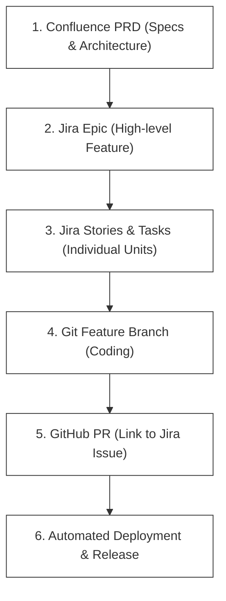
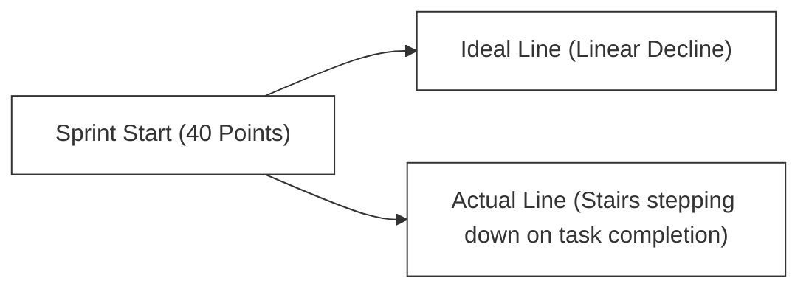

# F-01: Collaboration Tools (Jira & Confluence)

Enterprise engineering teams operate as a unified machine. To coordinate requirements, track development progress, and preserve system knowledge, companies like DP World rely on **Jira** and **Confluence** (Atlassian Suite). This handbook will show you how to utilize these collaboration platforms effectively to drive engineering clarity.

---

## 1. Requirement Flow: Ideation to Release

Before writing a single line of code, software requirements must be captured, designed, and tracked. A professional requirement flow looks like this:



---

## 2. Jira Core Concepts

Jira organizes software development into a structured hierarchy of **Issue Types**. Understanding this hierarchy prevents backlog disorganization:

```
+--------------------------------------------------------+
|                      EPIC                              |
|   (Example: "Implement Core Bookstore Platform")      |
+---------------------------+----------------------------+
                            |
         +------------------+------------------+
         |                                     |
+--------v---------+                 +---------v--------+
|      STORY       |                 |       BUG        |
|  (User Feature)  |                 |  (Defect Fix)    |
+--------+---------+                 +------------------+
         |
    +----+----+
    |         |
+---v---+ +---v---+
| SUB-  | | SUB-  |
| TASK  | | TASK  |
+-------+ +-------+
```

### Hierarchy Breakdown
1.  **Epic**: A large body of work that can be broken down into smaller tasks (e.g., *Build payment gateway integration*). Epics span multiple sprints.
2.  **Story**: A user-facing feature written from an end-user perspective (e.g., *As a shopper, I want to pay with credit card so that I can buy books*).
3.  **Task**: A technical item of work that does not deliver a direct, visible customer benefit (e.g., *Configure PostgreSQL database schema in staging*).
4.  **Bug**: A flaw or malfunction in the system that needs fixing (e.g., *Checkout form crashes on long usernames*).
5.  **Sub-task**: The smallest unit of work, decomposing a Story or Task into granular actions (e.g., *Write SQL table script*, *Create REST API controller*).

---

## 3. Managing Agile Sprints in Jira

During active sprints, developers interact daily with Jira Sprint Boards:

### Backlog Refinement
Before a sprint begins, the team meets to groom the backlog:
*   The Product Owner prioritizes issues.
*   Developers estimate effort using **Story Points** (using sizing techniques like Planning Poker based on Fibonacci numbers: `1, 2, 3, 5, 8, 13`).
*   Tasks are refined until they meet the **Definition of Ready (DoR)**.

### Active Sprint Board
During execution, the Sprint Board visualizes the flow of tasks:

```
+-------------------+-------------------+-------------------+-------------------+
|      TO DO        |    IN PROGRESS    |    IN REVIEW      |       DONE        |
+-------------------+-------------------+-------------------+-------------------+
| [DPW-101]         | [DPW-99]          | [DPW-88]          | [DPW-77]          |
| Create API route  | Setup DB Schema   | Fix login crash   | Design homepage   |
+-------------------+-------------------+-------------------+-------------------+
```

> [!IMPORTANT]
> **Issue Keys** (like `DPW-99`) are unique identifiers. You should always include the Jira Issue Key in your **git branch name** and **commit messages** (e.g., `git checkout -b feature/DPW-99-db-schema`, and commit `feat(db): DPW-99 setup core bookstore schema`) to establish automatic traceability!

---

## 4. Measuring Team Health: Agile Analytics

Jira provides charts to help Scrum Masters and engineering managers analyze velocity and predictability:

### The Burndown Chart
Tracks the completion of work during a sprint. The vertical axis represents remaining story points, and the horizontal axis represents time.



*   **Ideal Burn**: A straight diagonal line from the sprint start points down to zero at the end of the sprint.
*   **Actual Burn**: A stepped line showing when stories are actually marked "Done". If the line stays flat, stories are blocked. If it burns down early, the team was undercommitted.

### Team Velocity
The average number of story points completed by a team over past sprints. If a team completes `30`, `32`, and `28` points in their last three sprints, their velocity is **30 points**. The team uses this to confidently commit to exactly 30 points of work during the next sprint planning.

---

## 5. Confluence: The Engineering Knowledge Hub

While Jira tracks active *tasks*, **Confluence** stores static *knowledge*. 

### Recommended Confluence Architecture
Every product or microservice team should establish a structured space in Confluence containing:

1.  **Product Requirements Documents (PRDs)**: Detail the business goals, user personas, mockups, and scope boundaries for major initiatives.
2.  **Architecture Decision Records (ADRs)**: Document significant architectural choices made by the team (e.g., *Choosing PostgreSQL over MongoDB for transactional ledgers*) including context, alternatives, and trade-offs.
3.  **Runbooks & Onboarding Guides**: Step-by-step guides showing how to spin up a local development environment, run test suites, resolve common environment errors, and deploy to staging.
4.  **API Specifications**: Up-to-date documentation of API endpoints, request/response models, and error behaviors (often rendered via Swagger/OpenAPI).

### Best Practices for Confluence Pages
*   **Use Templates**: Standardize documentation using templates (e.g., standard ADR template) to make reading across different systems familiar.
*   **Embedded Jira Filters**: Embed dynamic Jira tables directly inside Confluence documentation to show the real-time status of requirements without copying and pasting data.
*   **Drawings & Diagrams**: Embed system architecture diagrams (like Mermaid or draw.io exports) inside Confluence pages to keep mental models clear.

---

## 🚀 Practical Application: Your Next Steps
To practice professional documentation and task tracking:
1.  Review the **Architecture Decision Records (ADRs)** or structural outlines provided in the upcoming system design handbooks.
2.  When editing code or starting work on a skeleton, format your git branch names using clean issue prefixes (e.g. `feature/lab-00-java-core`) to mimic true enterprise traceability!
