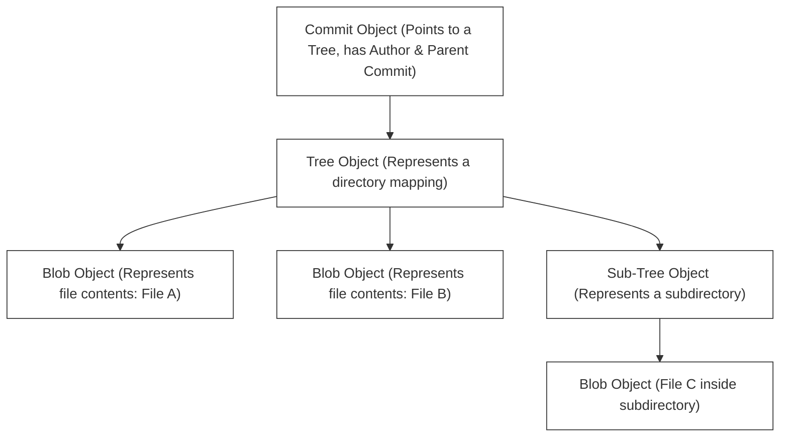
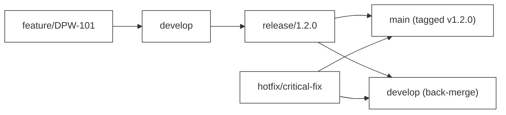
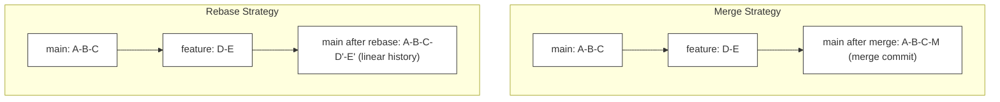

# F-02: Git Mastery Workshop

Welcome to your first hands-on engineering lab! Version control is the heartbeat of collaborative software development. In this workshop, you will move beyond basic `git add` and `git commit` commands to master the advanced version control mechanisms used by elite engineering teams at top-tier software companies.

---

## 1. Git Under the Hood: Plumbing vs. Porcelain

Git commands are divided into two categories:
*   **Porcelain**: User-friendly high-level commands you use daily (`commit`, `checkout`, `branch`, `status`).
*   **Plumbing**: Low-level commands that expose Git's internal content-addressable filesystem (`hash-object`, `cat-file`, `write-tree`).

### L1 — What Git's Object Database Is
Git is fundamentally a **content-addressable key-value store**. Everything — every file, every directory snapshot, every commit — is stored as a compressed object identified by its **SHA-1 hash**. The SHA-1 hash is a 40-character hexadecimal fingerprint of the content. If the content changes by even one character, the hash completely changes.

### L2 — How Git Stores Objects Internally
When you run `git commit`, Git performs the following sequence internally:

```
1. Compute SHA-1 hash of each file's raw content → creates BLOB objects
2. Compute SHA-1 hash of the directory structure (filename → blob SHA mapping) → creates TREE objects
3. Compute SHA-1 hash of the commit metadata (author, message, parent SHA, tree SHA) → creates COMMIT object
4. Store all objects in .git/objects/<first2-of-sha>/<remaining38-of-sha>
```



### Git's Core Object Types
All data in Git is stored inside the `.git/objects` folder as highly compressed files named after their SHA-1 hash. There are only four basic object types:

1.  **Blob**: Stores raw file contents (no metadata, no file name). If two identical files exist in different directories, Git stores only one blob!
2.  **Tree**: Represents a directory. It contains a list of directory entries, mapping file names and modes to their respective blob or subtree SHA-1 hashes.
3.  **Commit**: Represents a specific point in history. It points to a top-level **Tree** object representing the project snapshot, contains metadata (author, committer, date, message), and list of parent commit hashes.
4.  **Tag**: A fixed reference pointing to a specific commit, often used to mark releases (e.g. `v1.0.0`).

### Exploring Git Objects with Plumbing Commands

```bash
# Create a file and add it to staging
echo "hello git" > greet.txt
git add greet.txt

# View the SHA-1 hash of the blob just created
git ls-files --stage
# Output: 100644 8d0e41234f24b6da002d962a26c2495ea16a425f 0	greet.txt

# Inspect the blob object directly
git cat-file -t 8d0e41  # Output: blob
git cat-file -p 8d0e41  # Output: hello git

# After committing, inspect the commit object
git commit -m "add greeting"
git log --oneline
# Output: a1b2c3d add greeting

git cat-file -p a1b2c3d
# Output:
# tree 9f1d2e3b...
# author Dev Name <dev@example.com> 1716345678 +0530
# committer Dev Name <dev@example.com> 1716345678 +0530
#
# add greeting
```

---

## 2. Advanced Git Workflows

Different engineering teams organize collaboration using different branching strategies:

```
Trunk-Based Development (Direct commits/short PRs onto main branch):
main  ===============================================================>
          \ feature A /               \ feature B /
           ===========                 ===========

GitFlow (Multiple long-lived branch tiers - main, develop, release, feature):
main     ============================================================>
             \                             /
develop       ============================/==========================>
               \ feature X /
                ===========
```

### Trunk-Based Development (Recommended for Modern Teams)
*   Developers merge small, frequent commits into a single central branch (usually `main` or `trunk`).
*   Feature branches are short-lived (usually less than 24-48 hours).
*   **Pros**: Minimizes merge conflicts, enables continuous integration, accelerates delivery.
*   **Cons**: Requires high test coverage and feature flags to hide incomplete features in production.

```bash
# Trunk-Based Development daily workflow
git checkout main
git pull origin main                        # Always start from latest main
git checkout -b feature/DPW-101-api         # Short-lived feature branch
# ... write code and tests ...
git add .
git commit -m "feat(api): DPW-101 implement GET /books endpoint"
git push origin feature/DPW-101-api        # Open PR immediately
# PR reviewed → merge → delete branch      # Branch lives < 48 hours
```

### GitFlow
*   Uses strict, long-lived branches: `main` (production), `develop` (integration), `release` (staging), and `feature/*` (development).
*   Features are merged into `develop`. When ready, `develop` is branched into `release`, and eventually merged into both `main` and `develop`.
*   **Pros**: Great for legacy release cycles, highly structured.
*   **Cons**: Leads to massive "merge hell" when merging long-lived branches back together.



---

## 3. The Advanced Command Toolkit

To be an elite engineer, you must master these advanced operations:

### A. Interactive Rebase (`git rebase -i`)
Allows you to rewrite commit history before pushing. You can reorder, squash (combine), edit, or drop commits.

```bash
# Rebase the last 4 commits interactively
git rebase -i HEAD~4
```

This opens an editor with options:
*   `pick`: Keep the commit as is.
*   `reword`: Keep the commit but edit the message.
*   `edit`: Pause the rebase to modify code within the commit.
*   `squash`: Melt this commit into the previous commit.

**Practical example — cleaning up WIP commits before PR review:**

```bash
# Your messy local history:
# abc1234 WIP: trying stuff
# def5678 fix typo
# ghi9012 more fixes
# jkl3456 feat(api): DPW-101 implement GET /books endpoint

# Interactive rebase to clean up:
git rebase -i HEAD~4

# Editor opens with:
# pick jkl3456 feat(api): DPW-101 implement GET /books endpoint
# squash ghi9012 more fixes
# squash def5678 fix typo
# drop abc1234 WIP: trying stuff

# Result: ONE clean commit ready for PR review
```

> [!WARNING]
> Never rewrite history (`git rebase`) on commits that have already been pushed to a shared public branch! This disrupts the commit history of your fellow team members.

### B. Cherry-Picking (`git cherry-pick`)
Copies a specific commit from one branch and applies it onto your current branch.

```bash
git cherry-pick <commit-sha>
```

*   Useful when you need a hotfix that was implemented on a development branch, but you only want that specific fix in production without merging the rest of the development changes.

**Production hotfix scenario:**

```bash
# Developer fixed a critical bug on the develop branch (commit sha: a1b2c3d)
# We need this fix on main immediately WITHOUT merging all of develop

git checkout main
git cherry-pick a1b2c3d    # Apply just that commit to main
git push origin main

# Now develop still has all other WIP, but main has the critical fix
```

### C. Git Bisect (`git bisect`)
A binary search debugging tool that helps you locate the exact commit that introduced a bug.

```bash
git bisect start
git bisect bad                 # Mark current commit as broken
git bisect good <commit-sha>   # Mark an older commit known to work
```

Git will automatically check out commits in the middle of the range. You run your tests, mark the commit as `good` or `bad`, and Git repeats the search until the exact culprit commit is pinpointed.

**Full bisect session example:**

```bash
git bisect start
git bisect bad HEAD                    # Current code is broken
git bisect good v1.0.0                 # This tag was working

# Git checks out the midpoint commit automatically
# Run your test:
npm test -- --grep "payment"
# Test passes → mark good
git bisect good

# Git checks out the next midpoint...
# Test fails → mark bad
git bisect bad

# Git narrows down further... eventually:
# "b3f4a21 is the first bad commit"
git bisect reset    # Return to HEAD when done

# Inspect the culprit commit
git show b3f4a21
```

### D. Git Stash (`git stash`)
Temporarily shelves changes so you can switch context without a commit.

```bash
# Save current work-in-progress
git stash push -m "WIP: implementing search filter"

# Switch to fix a bug on another branch
git checkout bugfix/DPW-202-login-crash
# ... fix the bug, commit, push ...

# Return to your original branch and restore your work
git checkout feature/DPW-150-search
git stash pop
```

### E. Git Reflog — The Safety Net

```bash
# git reflog records EVERY HEAD movement, even after hard resets
git reflog

# Output example:
# a1b2c3d HEAD@{0}: commit: feat: add search endpoint
# b2c3d4e HEAD@{1}: reset: moving to HEAD~1
# c3d4e5f HEAD@{2}: commit: fix: resolve null pointer
# d4e5f6g HEAD@{3}: checkout: moving from main to feature/search

# Recover a "lost" commit after accidental hard reset:
git checkout -b recovery-branch HEAD@{2}
```

---

## 4. Understanding `git merge` vs `git rebase`



| Aspect | `git merge` | `git rebase` |
|---|---|---|
| History | Preserves full branching history | Creates linear history |
| Merge commits | Yes (a new merge commit is created) | No |
| Conflict resolution | Once, during merge | Once per commit being replayed |
| Best for | Long-running feature branches, public branches | Cleaning up local commits before PR |
| Risk | Safe on public branches | Never on shared/public branches |

---

## 🔧 Hands-on Workshop: The Conflict Arena

In this workshop, you will clone a local repository, create branches, intentionally generate merge conflicts, resolve them, and clean up your commit history.

### Step 1: Initialize the Lab Environment
Open your terminal and create a fresh sandbox directory:
```powershell
mkdir git-sandbox
cd git-sandbox
git init
```

### Step 2: Create the Baseline Commit
Create a file named `catalog.txt` and commit it:
```powershell
Echo "Item 1: Core Spring Boot Guide" > catalog.txt
git add catalog.txt
git commit -m "feat: initial catalog baseline"
```

### Step 3: Create Branch conflicts
Now, let's simulate two developers working on the same file simultaneously.

**Developer A (Branch A)**:
```powershell
git checkout -b developer-a
# Edit catalog.txt line 1
echo "Item 1: Core Spring Boot Guide (Updated by Dev A)" > catalog.txt
git add catalog.txt
git commit -m "feat(catalog): update item 1 description by dev a"
```

**Developer B (Branch B)**:
Go back to main, branch off, and make a conflicting edit:
```powershell
git checkout main
git checkout -b developer-b
# Edit catalog.txt line 1 with different content
echo "Item 1: Complete Java Spring Boot Handbook (Updated by Dev B)" > catalog.txt
git add catalog.txt
git commit -m "feat(catalog): rename item 1 by dev b"
```

### Step 4: The Merge Conflict Clash
Now, let's attempt to merge both branches back into `main`.

1.  Merge Developer A's branch (this will merge cleanly because no changes have been made to `main` yet):
    ```powershell
    git checkout main
    git merge developer-a
    ```
2.  Now, try to merge Developer B's branch (this will clash!):
    ```powershell
    git merge developer-b
    ```

**You will see the clash output:**
```
CONFLICT (content): Merge conflict in catalog.txt
Automatic merge failed; fix conflicts and then commit the result.
```

### Step 5: Resolving the Conflict
Open `catalog.txt`. You will see Git's conflict markers:
```txt
<<<<<<< HEAD
Item 1: Core Spring Boot Guide (Updated by Dev A)
=======
Item 1: Complete Java Spring Boot Handbook (Updated by Dev B)
>>>>>>> developer-b
```
*   `<<<<<<< HEAD`: The version currently checked out on `main` (from Developer A).
*   `=======`: The division line.
*   `>>>>>>> developer-b`: The version incoming from Developer B.

**Your Task**: Edit `catalog.txt` to merge the intent of both changes. For example, combine them to:
```txt
Item 1: Complete Java Spring Boot Handbook (Updated by Dev A & B)
```
Delete all conflict markers (`<<<<<<<`, `=======`, `>>>>>>>`).

### Step 6: Complete the Merge
Stage the resolved file and commit:
```powershell
git add catalog.txt
git commit -m "merge: resolve conflict between dev-a and dev-b in catalog"
```

---

## 5. Full Interactive Rebase Session Walkthrough

This is a complete, reproducible session showing how to clean commit history before opening a PR.

### Setup: Create Messy History

```bash
# Start from a clean branch
git checkout main
git checkout -b feature/DPW-150-add-search

# Day 1 - commit some work
echo "function search() {" >> search.js
git add search.js && git commit -m "WIP search"

# Day 1 - quick fix
echo "  // TODO: implement" >> search.js
git add search.js && git commit -m "fix typo"

# Day 2 - more work
echo "  return db.query(term);" >> search.js
git add search.js && git commit -m "more search work"

# Day 2 - final polishing
echo "}" >> search.js
git add search.js && git commit -m "feat(search): DPW-150 implement search function"

# Check current history
git log --oneline
# 4a5b6c7 feat(search): DPW-150 implement search function
# 3b4c5d6 more search work
# 2a3b4c5 fix typo
# 1z2a3b4 WIP search
```

### Clean the History with Interactive Rebase

```bash
git rebase -i HEAD~4

# Editor opens with:
pick 1z2a3b4 WIP search
pick 2a3b4c5 fix typo
pick 3b4c5d6 more search work
pick 4a5b6c7 feat(search): DPW-150 implement search function

# Change to:
squash 1z2a3b4 WIP search
squash 2a3b4c5 fix typo
squash 3b4c5d6 more search work
pick 4a5b6c7 feat(search): DPW-150 implement search function

# Save & close → Git prompts for combined commit message
# Accept or edit the final message

# Result: ONE clean commit
git log --oneline
# 9x8y7z6 feat(search): DPW-150 implement search function
```

---

## 6. Common Pitfalls & Anti-Patterns

### Anti-Pattern 1: Force-Pushing to Shared Branches

```bash
# ❌ NEVER DO THIS on main or develop:
git push --force origin main

# This rewrites the remote history — all team members who pulled
# will have divergent history and cannot push without force-pull.

# ✅ Safe alternative: Only force-push on YOUR OWN feature branch
# before anyone else has pulled it:
git push --force-with-lease origin feature/DPW-101-my-branch
# --force-with-lease fails if someone else pushed to the branch,
# protecting you from overwriting others' work.
```

### Anti-Pattern 2: Giant Commits

```bash
# ❌ Bad: One commit that changes 47 files
git add .
git commit -m "lots of changes"

# ✅ Good: Atomic commits — one logical change per commit
git add src/api/books.js tests/api/books.test.js
git commit -m "feat(api): DPW-101 add GET /books endpoint with pagination"

git add src/api/search.js tests/api/search.test.js
git commit -m "feat(search): DPW-102 add full-text book search"
```

### Anti-Pattern 3: Committing Secrets

```bash
# ❌ Never commit credentials, API keys, or passwords:
echo "DB_PASSWORD=supersecret123" >> .env
git add .env
git commit -m "add config"
# This is now PERMANENTLY in history (even if you delete it in the next commit)!

# ✅ Prevention:
echo ".env" >> .gitignore
echo "*.pem" >> .gitignore
echo "config/secrets.yml" >> .gitignore

# If it happened, use BFG Repo Cleaner or git filter-repo to scrub history.
# Change the compromised credential IMMEDIATELY.
```

### Anti-Pattern 4: Working Directly on Main

```bash
# ❌ Never commit directly to main/master:
git checkout main
git add .
git commit -m "quick fix"
git push origin main

# ✅ Always branch, even for tiny fixes:
git checkout -b hotfix/DPW-404-fix-null-check
# ... make fix ...
git push origin hotfix/DPW-404-fix-null-check
# Open PR → review → merge
```

### Anti-Pattern 5: Ignoring the Staging Area

```bash
# ❌ Blindly adding everything:
git add .   # Might include compiled artifacts, IDE files, node_modules!

# ✅ Stage selectively:
git add src/feature.js tests/feature.test.js
# OR review changes before staging:
git diff --staged   # Review what's in the staging area
git status          # Check tracked/untracked files
```

---

## 🚀 Post-Lab Checklist
Ensure you can answer these questions with confidence:
- [x] Can you explain the difference between a Git Blob, Tree, and Commit object?
- [x] Why is Trunk-Based Development generally favored over GitFlow in continuous integration environments?
- [x] When would you choose to `rebase` instead of `merge`?
- [x] How does `git bisect` work, and when is it useful?
- [x] How do you recover from an accidental `git reset --hard` using `git reflog`?
- [x] What is the difference between `git push --force` and `git push --force-with-lease`?
- [x] Why should you never commit sensitive credentials, and how do you prevent it?

---

## 📚 Key Takeaways

| Concept | One-Line Summary |
|---|---|
| Git object store | SHA-1 content-addressable database of blobs, trees, commits, and tags |
| Blob | Raw file content stored as a compressed object (no filename, no metadata) |
| Tree | Directory snapshot mapping filenames to blob/tree SHA hashes |
| Commit | Snapshot pointer (tree SHA) + metadata + parent SHA |
| Trunk-Based Dev | Short-lived branches (<48h), continuous integration, requires feature flags |
| GitFlow | Long-lived branches (main/develop/release/feature), higher merge risk |
| `rebase -i` | Rewrite local history to produce clean, atomic commits before PR |
| `cherry-pick` | Apply a single specific commit to any branch |
| `bisect` | Binary search through commit history to find the bug-introducing commit |
| `stash` | Temporarily shelve work without committing |
| `reflog` | Complete HEAD movement history — your safety net for recovering "lost" commits |
| Force-push | Only safe with `--force-with-lease` on your own branches, NEVER on shared branches |

> [!TIP]
> The most important Git habit: **commit early, commit often, but clean history before sharing**. Use `rebase -i` before every PR to produce a readable, reviewable commit history that tells a clear story about what changed and why.
