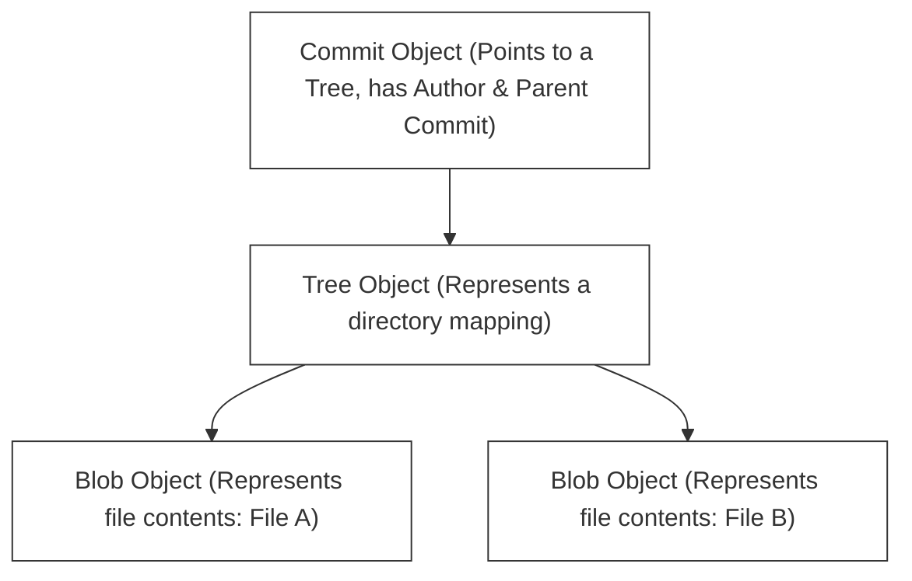

# F-02: Git Mastery Workshop

Welcome to your first hands-on engineering lab! Version control is the heartbeat of collaborative software development. In this workshop, you will move beyond basic `git add` and `git commit` commands to master the advanced version control mechanisms used by elite engineering teams at top-tier software companies.

---

## 1. Git Under the Hood: Plumbing vs. Porcelain

Git commands are divided into two categories:
*   **Porcelain**: User-friendly high-level commands you use daily (`commit`, `checkout`, `branch`, `status`).
*   **Plumbing**: Low-level commands that expose Git's internal content-addressable filesystem (`hash-object`, `cat-file`, `write-tree`).



### Git's Core Object Types
All data in Git is stored inside the `.git/objects` folder as highly compressed files named after their SHA-1 hash. There are only four basic object types:
1.  **Blob**: Stores raw file contents (no metadata, no file name). If two identical files exist in different directories, Git stores only one blob!
2.  **Tree**: Represents a directory. It contains a list of directory entries, mapping file names and modes to their respective blob or subtree SHA-1 hashes.
3.  **Commit**: Represents a specific point in history. It points to a top-level **Tree** object representing the project snapshot, contains metadata (author, committer, date, message), and list of parent commit hashes.
4.  **Tag**: A fixed reference pointing to a specific commit, often used to mark releases (e.g. `v1.0.0`).

---

## 2. Advanced Git Workflows

Different engineering teams organize collaboration using different branching strategies:

```
Trunk-Based Development (Direct commits/short PRs onto main branch):
main  ===============================================================>
          \ feature A /               \ feature B /
           ===========                 ===========

GitFlow (Multiple long-lived branch tiers - main, develop, release, feature):
main     ============================================================>
             \                             /
develop       ============================/==========================>
               \ feature X /
                ===========
```

### Trunk-Based Development (Recommended for Modern Teams)
*   Developers merge small, frequent commits into a single central branch (usually `main` or `trunk`).
*   Feature branches are short-lived (usually less than 24-48 hours).
*   **Pros**: Minimizes merge conflicts, enables continuous integration, accelerates delivery.
*   **Cons**: Requires high test coverage and feature flags to hide incomplete features in production.

### GitFlow
*   Uses strict, long-lived branches: `main` (production), `develop` (integration), `release` (staging), and `feature/*` (development).
*   Features are merged into `develop`. When ready, `develop` is branched into `release`, and eventually merged into both `main` and `develop`.
*   **Pros**: Great for legacy release cycles, highly structured.
*   **Cons**: Leads to massive "merge hell" when merging long-lived branches back together.

---

## 3. The Advanced Command Toolkit

To be an elite engineer, you must master these advanced operations:

### A. Interactive Rebase (`git rebase -i`)
Allows you to rewrite commit history before pushing. You can reorder, squash (combine), edit, or drop commits.
```bash
# Rebase the last 4 commits interactively
git rebase -i HEAD~4
```
This opens an editor with options:
*   `pick`: Keep the commit as is.
*   `reword`: Keep the commit but edit the message.
*   `edit`: Pause the rebase to modify code within the commit.
*   `squash`: Melt this commit into the previous commit.

> [!WARNING]
> Never rewrite history (`git rebase`) on commits that have already been pushed to a shared public branch! This disrupts the commit history of your fellow team members.

### B. Cherry-Picking (`git cherry-pick`)
Copies a specific commit from one branch and applies it onto your current branch.
```bash
git cherry-pick <commit-sha>
```
*   Useful when you need a hotfix that was implemented on a development branch, but you only want that specific fix in production without merging the rest of the development changes.

### C. Git Bisect (`git bisect`)
A binary search debugging tool that helps you locate the exact commit that introduced a bug.
```bash
git bisect start
git bisect bad                 # Mark current commit as broken
git bisect good <commit-sha>   # Mark an older commit known to work
```
Git will automatically check out commits in the middle of the range. You run your tests, mark the commit as `good` or `bad`, and Git repeats the search until the exact culprit commit is pinpointed.

---

## 🔧 Hands-on Workshop: The Conflict Arena

In this workshop, you will clone a local repository, create branches, intentionally generate merge conflicts, resolve them, and clean up your commit history.

### Step 1: Initialize the Lab Environment
Open your terminal and create a fresh sandbox directory:
```powershell
mkdir git-sandbox
cd git-sandbox
git init
```

### Step 2: Create the Baseline Commit
Create a file named `catalog.txt` and commit it:
```powershell
Echo "Item 1: Core Spring Boot Guide" > catalog.txt
git add catalog.txt
git commit -m "feat: initial catalog baseline"
```

### Step 3: Create Branch conflicts
Now, let's simulate two developers working on the same file simultaneously.

**Developer A (Branch A)**:
```powershell
git checkout -b developer-a
# Edit catalog.txt line 1
echo "Item 1: Core Spring Boot Guide (Updated by Dev A)" > catalog.txt
git add catalog.txt
git commit -m "feat(catalog): update item 1 description by dev a"
```

**Developer B (Branch B)**:
Go back to main, branch off, and make a conflicting edit:
```powershell
git checkout main
git checkout -b developer-b
# Edit catalog.txt line 1 with different content
echo "Item 1: Complete Java Spring Boot Handbook (Updated by Dev B)" > catalog.txt
git add catalog.txt
git commit -m "feat(catalog): rename item 1 by dev b"
```

### Step 4: The Merge Conflict Clash
Now, let's attempt to merge both branches back into `main`.

1.  Merge Developer A's branch (this will merge cleanly because no changes have been made to `main` yet):
    ```powershell
    git checkout main
    git merge developer-a
    ```
2.  Now, try to merge Developer B's branch (this will clash!):
    ```powershell
    git merge developer-b
    ```

**You will see the clash output:**
```
CONFLICT (content): Merge conflict in catalog.txt
Automatic merge failed; fix conflicts and then commit the result.
```

### Step 5: Resolving the Conflict
Open `catalog.txt`. You will see Git's conflict markers:
```txt
<<<<<<< HEAD
Item 1: Core Spring Boot Guide (Updated by Dev A)
=======
Item 1: Complete Java Spring Boot Handbook (Updated by Dev B)
>>>>>>> developer-b
```
*   `<<<<<<< HEAD`: The version currently checked out on `main` (from Developer A).
*   `=======`: The division line.
*   `>>>>>>> developer-b`: The version incoming from Developer B.

**Your Task**: Edit `catalog.txt` to merge the intent of both changes. For example, combine them to:
```txt
Item 1: Complete Java Spring Boot Handbook (Updated by Dev A & B)
```
Delete all conflict markers (`<<<<<<<`, `=======`, `>>>>>>>`).

### Step 6: Complete the Merge
Stage the resolved file and commit:
```powershell
git add catalog.txt
git commit -m "merge: resolve conflict between dev-a and dev-b in catalog"
```

---

## 🚀 Post-Lab Checklist
Ensure you can answer these questions with confidence:
- [x] Can you explain the difference between a Git Blob, Tree, and Commit object?
- [x] Why is Trunk-Based Development generally favored over GitFlow in continuous integration environments?
- [x] When would you choose to `rebase` instead of `merge`?
- [x] How does `git bisect` work, and when is it useful?
