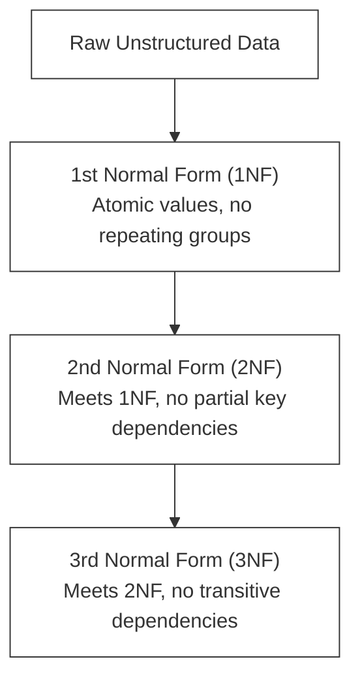

# F-03: SQL Deep Dive (MySQL & PostgreSQL)

Welcome to the Database Engineering lab! Data is the most valuable asset of any enterprise. Knowing how to design relational schemas, write high-performance queries, and manage transactional integrity is a core skill for any professional backend engineer. In this handbook, you will dive deep into relational database design and advanced SQL.

---

## 1. Relational Database Principles & Normalization

A **Relational Database Management System (RDBMS)** stores data in tables (relations) consisting of rows (tuples) and columns (attributes). To prevent data redundancy and anomaly errors (insertion, update, deletion anomalies), we apply **Database Normalization**.



### The Normal Forms in Detail
*   **First Normal Form (1NF)**: 
    *   Each table cell must contain a single, atomic value.
    *   No repeating groups or arrays of values in columns.
    *   Each row must have a unique identifier (Primary Key).
*   **Second Normal Form (2NF)**:
    *   Must be in 1NF.
    *   All non-key columns must depend entirely on the **whole primary key** (no partial dependency). This is relevant when you have composite primary keys.
*   **Third Normal Form (3NF)**:
    *   Must be in 2NF.
    *   No non-key column can depend on another non-key column (no transitive dependency). Every attribute must depend on "the key, the whole key, and nothing but the key, so help me Codd."

---

## 2. Under the Hood: Indexes & Query Performance

Without indexes, a database must perform a **Full Table Scan** (reading every single row on disk) to find a record, which is `O(N)` complexity. An index reduces this to `O(log N)` using a balanced search tree (**B-Tree**).

```
          [ Root Node: 50 ]
             /         \
   [ Branch: 25 ]     [ Branch: 75 ]
     /      \          /       \
  [10, 20] [30, 40] [60, 70]  [80, 90]  <-- Leaf Nodes (contain row data or pointers)
```

### Clustered vs. Non-Clustered Indexes
*   **Clustered Index**: 
    *   Determines the physical order in which data is stored on disk.
    *   Only **one** clustered index can exist per table (automatically created on the Primary Key).
    *   Leaf nodes contain the actual data rows.
*   **Non-Clustered Index**:
    *   A separate structure from the table rows.
    *   Leaf nodes contain the index key columns and pointers (RID or primary key values) to the actual data rows.
    *   You can create multiple non-clustered indexes on search query columns (e.g. `email`, `last_name`).

> [!TIP]
> **Composite Indexes**: When querying using multiple conditions (e.g. `WHERE first_name = 'x' AND last_name = 'y'`), create a composite index on `(first_name, last_name)`. Remember the **Leftmost Prefix Rule**: an index on `(A, B)` will speed up queries on `A` or `(A, B)`, but NOT queries exclusively on `B`!

---

## 3. Transactional Integrity: ACID & Isolation Levels

A database **Transaction** is a sequence of SQL statements executed as a single logical unit of work. To maintain reliability, databases enforce **ACID** properties:

1.  **Atomicity**: "All or nothing." If any statement in the transaction fails, the entire transaction is rolled back.
2.  **Consistency**: A transaction takes the database from one valid state to another, maintaining all constraints (foreign keys, uniques, checks).
3.  **Isolation**: Determines how concurrent transactions see changes made by other transactions.
4.  **Durability**: Once a transaction is committed, it remains saved even in the event of a power failure or system crash (achieved via Write-Ahead Logging).

### Concurrency Anomalies & Isolation Levels
When multiple transactions execute concurrently, they can cause anomalies:
*   **Dirty Read**: Reading uncommitted data from another transaction.
*   **Non-Repeatable Read**: Re-reading a row within a transaction and finding different values because another transaction modified and committed it.
*   **Phantom Read**: Re-running a query returning a set of rows and finding new rows added by another transaction.

| Isolation Level | Dirty Read | Non-Repeatable Read | Phantom Read |
| :--- | :---: | :---: | :---: |
| **Read Uncommitted** | Allowed | Allowed | Allowed |
| **Read Committed** | Prevented | Allowed | Allowed |
| **Repeatable Read** | Prevented | Prevented | Allowed |
| **Serializable** | Prevented | Prevented | Prevented |

> [!NOTE]
> Higher isolation levels prevent more anomalies but reduce concurrency performance by locking more resources. PostgreSQL defaults to **Read Committed**, while MySQL defaults to **Repeatable Read**.

---

## 🔧 Hands-on Lab: Library Database

In this hands-on lab, you will design a schema for a digital library, write complex analytics queries, and analyze query performance using `EXPLAIN`.

### Step 1: Core Schema Setup
Create tables for `books`, `authors`, `members`, and `loans`.

```sql
-- PostgreSQL / MySQL compatible schema
CREATE TABLE authors (
    author_id INT AUTO_INCREMENT PRIMARY KEY,
    name VARCHAR(150) NOT NULL,
    nationality VARCHAR(100)
);

CREATE TABLE books (
    book_id INT AUTO_INCREMENT PRIMARY KEY,
    title VARCHAR(255) NOT NULL,
    isbn VARCHAR(20) UNIQUE NOT NULL,
    author_id INT,
    published_year INT,
    FOREIGN KEY (author_id) REFERENCES authors(author_id) ON DELETE SET NULL
);

CREATE TABLE members (
    member_id INT AUTO_INCREMENT PRIMARY KEY,
    first_name VARCHAR(100) NOT NULL,
    last_name VARCHAR(100) NOT NULL,
    email VARCHAR(150) UNIQUE NOT NULL,
    join_date DATE NOT NULL
);

CREATE TABLE loans (
    loan_id INT AUTO_INCREMENT PRIMARY KEY,
    book_id INT NOT NULL,
    member_id INT NOT NULL,
    loan_date DATE NOT NULL,
    return_date DATE,
    FOREIGN KEY (book_id) REFERENCES books(book_id),
    FOREIGN KEY (member_id) REFERENCES members(member_id)
);
```

### Step 2: Seed the Tables
Populate the database with test data:
```sql
INSERT INTO authors (name, nationality) VALUES 
('Martin Fowler', 'British'),
('Joshua Bloch', 'American'),
('Robert C. Martin', 'American');

INSERT INTO books (title, isbn, author_id, published_year) VALUES 
('Refactoring', '978-0134757599', 1, 2018),
('Effective Java', '978-0134685991', 2, 2017),
('Clean Code', '978-0132350884', 3, 2008);

INSERT INTO members (first_name, last_name, email, join_date) VALUES 
('Alice', 'Smith', 'alice@library.org', '2025-01-15'),
('Bob', 'Johnson', 'bob@library.org', '2025-02-10'),
('Charlie', 'Brown', 'charlie@library.org', '2025-03-01');

INSERT INTO loans (book_id, member_id, loan_date, return_date) VALUES 
(1, 1, '2026-05-01', '2026-05-15'),
(2, 1, '2026-05-16', NULL),
(3, 2, '2026-05-10', '2026-05-20'),
(1, 3, '2026-05-21', NULL);
```

### Step 3: Write Complex Analytics Queries

#### Query 1: Find Active Loans with Author & Member Details
Using explicit `JOIN` operations:
```sql
SELECT 
    l.loan_id,
    m.first_name,
    m.last_name,
    b.title,
    a.name AS author_name,
    l.loan_date
FROM loans l
INNER JOIN members m ON l.member_id = m.member_id
INNER JOIN books b ON l.book_id = b.book_id
INNER JOIN authors a ON b.author_id = a.author_id
WHERE l.return_date IS NULL;
```

#### Query 2: Ranking Members by Loan Counts (Window Functions)
Find which members have borrowed the most books using `DENSE_RANK()`:
```sql
SELECT 
    m.member_id,
    m.first_name,
    m.last_name,
    COUNT(l.loan_id) AS total_loans,
    DENSE_RANK() OVER (ORDER BY COUNT(l.loan_id) DESC) AS loan_rank
FROM members m
LEFT JOIN loans l ON m.member_id = l.member_id
GROUP BY m.member_id, m.first_name, m.last_name;
```

#### Query 3: Find Authors with Multi-book Loans (Common Table Expressions - CTE)
Using a CTE to isolate borrower history:
```sql
WITH MemberLoanCount AS (
    SELECT 
        member_id,
        COUNT(loan_id) AS active_loans
    FROM loans
    WHERE return_date IS NULL
    GROUP BY member_id
)
SELECT 
    m.first_name,
    m.last_name,
    mlc.active_loans
FROM MemberLoanCount mlc
INNER JOIN members m ON mlc.member_id = m.member_id
WHERE mlc.active_loans >= 2;
```

---

## 4. Query Analysis: EXPLAIN Plans
To understand how your database optimizer plans to execute a query, prepend your query with `EXPLAIN`:

```sql
EXPLAIN SELECT * FROM members WHERE email = 'alice@library.org';
```

### Deciphering the EXPLAIN output
*   **PostgreSQL**: Look for `Scan` types:
    *   `Seq Scan`: Sequential full table scan (slow, `O(N)`).
    *   `Index Scan` or `Index Only Scan`: Using the B-Tree index (fast, `O(log N)`).
*   **MySQL**: Look for the `type` column:
    *   `ALL`: Full table scan (bad!).
    *   `ref` or `const`: Utilizing index to find matching keys (optimal!).
    *   `rows`: The estimated number of rows examined before returning results.

---

## 🚀 Post-Lab Checklist
- [x] Can you explain 1NF, 2NF, and 3NF in simple terms?
- [x] What is the difference between a clustered and a non-clustered index?
- [x] What are the four transactional anomalies, and how do database isolation levels solve them?
- [x] How do you identify a slow sequential query scan using `EXPLAIN`?
