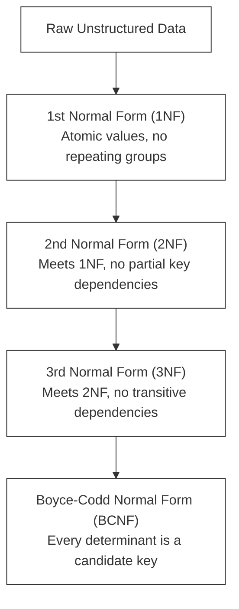

# F-03: SQL Deep Dive (MySQL & PostgreSQL)

Welcome to the Database Engineering lab! Data is the most valuable asset of any enterprise. Knowing how to design relational schemas, write high-performance queries, and manage transactional integrity is a core skill for any professional backend engineer. In this handbook, you will dive deep into relational database design and advanced SQL.

---

## 1. Relational Database Principles & Normalization

A **Relational Database Management System (RDBMS)** stores data in tables (relations) consisting of rows (tuples) and columns (attributes). To prevent data redundancy and anomaly errors (insertion, update, deletion anomalies), we apply **Database Normalization**.

### L1 — What Normalization Is
Normalization is a systematic process of organizing a database schema to **reduce data redundancy** and **improve data integrity**. It does this by decomposing tables that have update anomalies into smaller, well-structured tables.

### L2 — Why Anomalies Are Dangerous

```sql
-- ❌ Unnormalized table (violations of all normal forms):
-- OrdersFlat: order_id, customer_name, customer_email, product1, product2, price1, price2

-- Insertion anomaly: Cannot add a customer without an order
-- Deletion anomaly: Deleting the only order for a customer deletes customer data too
-- Update anomaly: Changing a customer's email requires updating EVERY row for that customer
```



### The Normal Forms in Detail

*   **First Normal Form (1NF)**:
    *   Each table cell must contain a single, atomic value.
    *   No repeating groups or arrays of values in columns.
    *   Each row must have a unique identifier (Primary Key).

```sql
-- ❌ Violates 1NF (multi-valued column):
-- books: book_id=1, title='Clean Code', authors='Martin,Fowler,Bloch'

-- ✅ 1NF compliant:
CREATE TABLE books (
    book_id INT PRIMARY KEY,
    title VARCHAR(255) NOT NULL
);
CREATE TABLE book_authors (
    book_id INT REFERENCES books(book_id),
    author_name VARCHAR(150) NOT NULL,
    PRIMARY KEY (book_id, author_name)
);
```

*   **Second Normal Form (2NF)**:
    *   Must be in 1NF.
    *   All non-key columns must depend entirely on the **whole primary key** (no partial dependency). This is relevant when you have composite primary keys.

```sql
-- ❌ Violates 2NF (partial dependency on composite key):
-- order_items: order_id, product_id, quantity, product_name
-- product_name depends only on product_id, not on (order_id, product_id)

-- ✅ 2NF compliant: Extract product_name into its own table
CREATE TABLE products (
    product_id INT PRIMARY KEY,
    product_name VARCHAR(255) NOT NULL,
    unit_price DECIMAL(10,2) NOT NULL
);
CREATE TABLE order_items (
    order_id INT,
    product_id INT REFERENCES products(product_id),
    quantity INT NOT NULL,
    PRIMARY KEY (order_id, product_id)
);
```

*   **Third Normal Form (3NF)**:
    *   Must be in 2NF.
    *   No non-key column can depend on another non-key column (no transitive dependency). Every attribute must depend on "the key, the whole key, and nothing but the key, so help me Codd."

```sql
-- ❌ Violates 3NF (transitive dependency):
-- employees: employee_id, department_id, department_name
-- department_name depends on department_id (not on employee_id directly)

-- ✅ 3NF compliant:
CREATE TABLE departments (
    department_id INT PRIMARY KEY,
    department_name VARCHAR(100) NOT NULL
);
CREATE TABLE employees (
    employee_id INT PRIMARY KEY,
    name VARCHAR(150) NOT NULL,
    department_id INT REFERENCES departments(department_id)
);
```

---

## 2. Under the Hood: Indexes & Query Performance

Without indexes, a database must perform a **Full Table Scan** (reading every single row on disk) to find a record, which is `O(N)` complexity. An index reduces this to `O(log N)` using a balanced search tree (**B-Tree**).

### L2 — How B-Tree Indexes Work Internally

```
          [ Root Node: 50 ]
             /         \
   [ Branch: 25 ]     [ Branch: 75 ]
     /      \          /       \
  [10, 20] [30, 40] [60, 70]  [80, 90]  <-- Leaf Nodes (contain row data or pointers)
```

When you search `WHERE id = 60`:
1. Read root node → 60 > 50 → go right
2. Read branch 75 → 60 < 75 → go left
3. Read leaf [60, 70] → found! → return data pointer

This is **3 disk reads** instead of scanning all rows (potentially thousands).

### Clustered vs. Non-Clustered Indexes

*   **Clustered Index**:
    *   Determines the physical order in which data is stored on disk.
    *   Only **one** clustered index can exist per table (automatically created on the Primary Key).
    *   Leaf nodes contain the actual data rows.
*   **Non-Clustered Index**:
    *   A separate structure from the table rows.
    *   Leaf nodes contain the index key columns and pointers (RID or primary key values) to the actual data rows.
    *   You can create multiple non-clustered indexes on search query columns (e.g. `email`, `last_name`).

```sql
-- Clustered Index (implicit on PRIMARY KEY):
CREATE TABLE members (
    member_id INT AUTO_INCREMENT PRIMARY KEY,  -- Clustered index created automatically
    email VARCHAR(150) UNIQUE NOT NULL,
    first_name VARCHAR(100) NOT NULL
);

-- Non-Clustered Index (explicit, for search queries):
CREATE INDEX idx_members_email ON members(email);
CREATE INDEX idx_members_lastname ON members(last_name);

-- Composite Index (for multi-column WHERE clauses):
CREATE INDEX idx_loans_member_date ON loans(member_id, loan_date);
-- This speeds up: WHERE member_id = 5 AND loan_date > '2026-01-01'
-- Also speeds up: WHERE member_id = 5 (leftmost prefix)
-- Does NOT speed up: WHERE loan_date > '2026-01-01' (no leftmost prefix)
```

> [!TIP]
> **Composite Indexes**: When querying using multiple conditions (e.g. `WHERE first_name = 'x' AND last_name = 'y'`), create a composite index on `(first_name, last_name)`. Remember the **Leftmost Prefix Rule**: an index on `(A, B)` will speed up queries on `A` or `(A, B)`, but NOT queries exclusively on `B`!

### Index Overhead — When NOT to Index

```sql
-- ❌ Over-indexing causes performance problems:
-- Every INSERT/UPDATE/DELETE must update ALL indexes on the table.
-- Tables with heavy write loads suffer from over-indexing.

-- Rules of thumb:
-- ✅ Index columns that appear in WHERE, JOIN ON, and ORDER BY clauses
-- ✅ Index foreign key columns (join performance)
-- ❌ Don't index columns with very low cardinality (e.g., boolean gender column)
-- ❌ Don't index columns rarely used in queries
```

---

## 3. Transactional Integrity: ACID & Isolation Levels

A database **Transaction** is a sequence of SQL statements executed as a single logical unit of work. To maintain reliability, databases enforce **ACID** properties:

### L1 — What ACID Means

1.  **Atomicity**: "All or nothing." If any statement in the transaction fails, the entire transaction is rolled back.
2.  **Consistency**: A transaction takes the database from one valid state to another, maintaining all constraints (foreign keys, uniques, checks).
3.  **Isolation**: Determines how concurrent transactions see changes made by other transactions.
4.  **Durability**: Once a transaction is committed, it remains saved even in the event of a power failure or system crash (achieved via Write-Ahead Logging).

### L2 — How Atomicity Works (WAL — Write-Ahead Logging)

```
Transaction lifecycle:

BEGIN TRANSACTION
  [All SQL statements are written to the WAL log FIRST]
  [Data pages in memory are updated]
COMMIT
  [WAL log is flushed to disk]
  [Database marks transaction as committed]
  [Memory changes are eventually flushed to data files]

If system crashes BEFORE commit:
  [On restart, database reads WAL log]
  [Incomplete transactions are ROLLED BACK]
  [Data is in consistent pre-transaction state]
```

```sql
-- Example: Bank transfer (classic ACID demonstration)
BEGIN;

UPDATE accounts SET balance = balance - 500 WHERE account_id = 1;  -- Debit Alice
UPDATE accounts SET balance = balance + 500 WHERE account_id = 2;  -- Credit Bob

-- If we crash here, BOTH updates are rolled back. Alice keeps her $500.
COMMIT;
-- Only after both succeed do we commit. If UPDATE #2 fails, UPDATE #1 is also undone.
```

### Concurrency Anomalies & Isolation Levels
When multiple transactions execute concurrently, they can cause anomalies:
*   **Dirty Read**: Reading uncommitted data from another transaction.
*   **Non-Repeatable Read**: Re-reading a row within a transaction and finding different values because another transaction modified and committed it.
*   **Phantom Read**: Re-running a query returning a set of rows and finding new rows added by another transaction.

| Isolation Level | Dirty Read | Non-Repeatable Read | Phantom Read |
| :--- | :---: | :---: | :---: |
| **Read Uncommitted** | Allowed | Allowed | Allowed |
| **Read Committed** | Prevented | Allowed | Allowed |
| **Repeatable Read** | Prevented | Prevented | Allowed |
| **Serializable** | Prevented | Prevented | Prevented |

> [!NOTE]
> Higher isolation levels prevent more anomalies but reduce concurrency performance by locking more resources. PostgreSQL defaults to **Read Committed**, while MySQL defaults to **Repeatable Read**.

```sql
-- Setting isolation level in PostgreSQL:
SET TRANSACTION ISOLATION LEVEL SERIALIZABLE;
BEGIN;
SELECT * FROM inventory WHERE product_id = 42 FOR UPDATE;  -- Lock the row
UPDATE inventory SET quantity = quantity - 1 WHERE product_id = 42;
COMMIT;

-- Setting isolation level in MySQL:
SET SESSION TRANSACTION ISOLATION LEVEL READ COMMITTED;
```

---

## 🔧 Hands-on Lab: Library Database

In this hands-on lab, you will design a schema for a digital library, write complex analytics queries, and analyze query performance using `EXPLAIN`.

### Step 1: Core Schema Setup
Create tables for `books`, `authors`, `members`, and `loans`.

```sql
-- PostgreSQL / MySQL compatible schema
CREATE TABLE authors (
    author_id INT AUTO_INCREMENT PRIMARY KEY,
    name VARCHAR(150) NOT NULL,
    nationality VARCHAR(100)
);

CREATE TABLE books (
    book_id INT AUTO_INCREMENT PRIMARY KEY,
    title VARCHAR(255) NOT NULL,
    isbn VARCHAR(20) UNIQUE NOT NULL,
    author_id INT,
    published_year INT,
    FOREIGN KEY (author_id) REFERENCES authors(author_id) ON DELETE SET NULL
);

CREATE TABLE members (
    member_id INT AUTO_INCREMENT PRIMARY KEY,
    first_name VARCHAR(100) NOT NULL,
    last_name VARCHAR(100) NOT NULL,
    email VARCHAR(150) UNIQUE NOT NULL,
    join_date DATE NOT NULL
);

CREATE TABLE loans (
    loan_id INT AUTO_INCREMENT PRIMARY KEY,
    book_id INT NOT NULL,
    member_id INT NOT NULL,
    loan_date DATE NOT NULL,
    return_date DATE,
    FOREIGN KEY (book_id) REFERENCES books(book_id),
    FOREIGN KEY (member_id) REFERENCES members(member_id)
);
```

### Step 2: Seed the Tables
Populate the database with test data:
```sql
INSERT INTO authors (name, nationality) VALUES 
('Martin Fowler', 'British'),
('Joshua Bloch', 'American'),
('Robert C. Martin', 'American');

INSERT INTO books (title, isbn, author_id, published_year) VALUES 
('Refactoring', '978-0134757599', 1, 2018),
('Effective Java', '978-0134685991', 2, 2017),
('Clean Code', '978-0132350884', 3, 2008);

INSERT INTO members (first_name, last_name, email, join_date) VALUES 
('Alice', 'Smith', 'alice@library.org', '2025-01-15'),
('Bob', 'Johnson', 'bob@library.org', '2025-02-10'),
('Charlie', 'Brown', 'charlie@library.org', '2025-03-01');

INSERT INTO loans (book_id, member_id, loan_date, return_date) VALUES 
(1, 1, '2026-05-01', '2026-05-15'),
(2, 1, '2026-05-16', NULL),
(3, 2, '2026-05-10', '2026-05-20'),
(1, 3, '2026-05-21', NULL);
```

### Step 3: Write Complex Analytics Queries

#### Query 1: Find Active Loans with Author & Member Details
Using explicit `JOIN` operations:
```sql
SELECT 
    l.loan_id,
    m.first_name,
    m.last_name,
    b.title,
    a.name AS author_name,
    l.loan_date
FROM loans l
INNER JOIN members m ON l.member_id = m.member_id
INNER JOIN books b ON l.book_id = b.book_id
INNER JOIN authors a ON b.author_id = a.author_id
WHERE l.return_date IS NULL;
```

**Step-by-step query walkthrough:**

```
1. FROM loans l           → Start with the loans table as the base (left side of all JOINs)
2. INNER JOIN members m   → For each loan row, match the member row (only rows with matches survive)
3. INNER JOIN books b     → For each matched row, attach the book data
4. INNER JOIN authors a   → For each matched row, attach the author data (via books.author_id)
5. WHERE return_date IS NULL → Filter: keep only loans that haven't been returned yet
6. SELECT columns         → Project only the columns we need from the joined result

Expected output:
loan_id | first_name | last_name | title          | author_name      | loan_date
--------|------------|-----------|----------------|------------------|----------
2       | Alice      | Smith     | Effective Java | Joshua Bloch     | 2026-05-16
4       | Charlie    | Brown     | Refactoring    | Martin Fowler    | 2026-05-21
```

#### Query 2: Ranking Members by Loan Counts (Window Functions)
Find which members have borrowed the most books using `DENSE_RANK()`:
```sql
SELECT 
    m.member_id,
    m.first_name,
    m.last_name,
    COUNT(l.loan_id) AS total_loans,
    DENSE_RANK() OVER (ORDER BY COUNT(l.loan_id) DESC) AS loan_rank
FROM members m
LEFT JOIN loans l ON m.member_id = l.member_id
GROUP BY m.member_id, m.first_name, m.last_name;
```

**Window function anatomy:**

```sql
DENSE_RANK() OVER (ORDER BY COUNT(l.loan_id) DESC)
-- ^^^^^^^^^^^^     ^^^^^^^^^^^^^^^^^^^^^^^^^^^^^^^^
-- Function         Window definition
--                  (how to partition and order the window)

-- Other common window functions:
-- ROW_NUMBER()   → Unique sequential numbers (no ties)
-- RANK()         → Leaves gaps when there are ties (1, 2, 2, 4...)
-- DENSE_RANK()   → No gaps on ties (1, 2, 2, 3...)
-- LAG(col, n)    → Value of column n rows behind current row
-- LEAD(col, n)   → Value of column n rows ahead of current row
-- SUM() OVER ()  → Running total

-- Example: Running total of loans per day:
SELECT 
    loan_date,
    COUNT(*) AS daily_loans,
    SUM(COUNT(*)) OVER (ORDER BY loan_date) AS running_total
FROM loans
GROUP BY loan_date
ORDER BY loan_date;
```

#### Query 3: Find Authors with Multi-book Loans (Common Table Expressions - CTE)
Using a CTE to isolate borrower history:
```sql
WITH MemberLoanCount AS (
    SELECT 
        member_id,
        COUNT(loan_id) AS active_loans
    FROM loans
    WHERE return_date IS NULL
    GROUP BY member_id
)
SELECT 
    m.first_name,
    m.last_name,
    mlc.active_loans
FROM MemberLoanCount mlc
INNER JOIN members m ON mlc.member_id = m.member_id
WHERE mlc.active_loans >= 2;
```

**CTE anatomy and when to use them:**

```sql
-- CTEs: Named subquery blocks that can be referenced multiple times
-- Benefit 1: Readability — complex logic decomposed into named steps
-- Benefit 2: Reusability — reference the same CTE multiple times in one query
-- Benefit 3: Recursive queries (e.g., org chart traversal)

-- Example: Chained CTEs for multi-step analytics
WITH 
-- Step 1: Get active loans
ActiveLoans AS (
    SELECT member_id, COUNT(*) AS cnt
    FROM loans WHERE return_date IS NULL
    GROUP BY member_id
),
-- Step 2: Classify members
MemberTiers AS (
    SELECT 
        m.first_name, m.last_name,
        al.cnt AS active_loans,
        CASE 
            WHEN al.cnt >= 3 THEN 'Power Reader'
            WHEN al.cnt = 2 THEN 'Regular Reader'
            ELSE 'Casual Reader'
        END AS reader_tier
    FROM members m
    LEFT JOIN ActiveLoans al ON m.member_id = al.member_id
)
-- Step 3: Final result
SELECT * FROM MemberTiers ORDER BY active_loans DESC;
```

#### Query 4: Books Never Borrowed (LEFT JOIN Anti-Join Pattern)

```sql
-- Find all books that have NEVER been borrowed
SELECT b.book_id, b.title, a.name AS author_name
FROM books b
INNER JOIN authors a ON b.author_id = a.author_id
LEFT JOIN loans l ON b.book_id = l.book_id
WHERE l.loan_id IS NULL;  -- NULL means no matching loan row was found

-- Alternative using NOT EXISTS (often better performance):
SELECT b.book_id, b.title
FROM books b
WHERE NOT EXISTS (
    SELECT 1 FROM loans l WHERE l.book_id = b.book_id
);
```

#### Query 5: Overdue Loans (Date Arithmetic)

```sql
-- Find loans overdue by more than 14 days
SELECT 
    m.first_name,
    m.last_name,
    b.title,
    l.loan_date,
    CURRENT_DATE - l.loan_date AS days_overdue  -- PostgreSQL syntax
FROM loans l
INNER JOIN members m ON l.member_id = m.member_id
INNER JOIN books b ON l.book_id = b.book_id
WHERE l.return_date IS NULL
  AND l.loan_date < CURRENT_DATE - INTERVAL '14 days';

-- MySQL equivalent:
-- WHERE l.return_date IS NULL
-- AND DATEDIFF(CURDATE(), l.loan_date) > 14
```

---

## 4. Query Analysis: EXPLAIN Plans

To understand how your database optimizer plans to execute a query, prepend your query with `EXPLAIN`:

```sql
EXPLAIN SELECT * FROM members WHERE email = 'alice@library.org';
```

### Deciphering the EXPLAIN output

*   **PostgreSQL**: Look for `Scan` types:
    *   `Seq Scan`: Sequential full table scan (slow, `O(N)`).
    *   `Index Scan` or `Index Only Scan`: Using the B-Tree index (fast, `O(log N)`).
*   **MySQL**: Look for the `type` column:
    *   `ALL`: Full table scan (bad!).
    *   `ref` or `const`: Utilizing index to find matching keys (optimal!).
    *   `rows`: The estimated number of rows examined before returning results.

### PostgreSQL EXPLAIN ANALYZE — Full Walkthrough

```sql
-- EXPLAIN ANALYZE actually runs the query and shows real timing:
EXPLAIN ANALYZE
SELECT m.first_name, m.last_name, b.title
FROM loans l
INNER JOIN members m ON l.member_id = m.member_id
INNER JOIN books b ON l.book_id = b.book_id
WHERE l.return_date IS NULL;
```

**Reading the output:**

```
Nested Loop  (cost=0.00..24.53 rows=2 width=120) (actual time=0.023..0.041 rows=2 loops=1)
  -> Seq Scan on loans l  (cost=0.00..1.05 rows=2 width=8) (actual time=0.009..0.014 rows=2)
       Filter: (return_date IS NULL)
       Rows Removed by Filter: 2
  -> Index Scan using members_pkey on members m  (cost=0.00..8.27 rows=1 width=68)
       Index Cond: (member_id = l.member_id)
  -> Index Scan using books_pkey on books b  (cost=0.00..8.27 rows=1 width=52)
       Index Cond: (book_id = l.book_id)
Planning Time: 0.182 ms
Execution Time: 0.098 ms

Interpretation:
  ✅ loans: Seq Scan (OK — table is tiny, full scan is fine)
  ✅ members: Index Scan using primary key (optimal!)
  ✅ books: Index Scan using primary key (optimal!)
  ✅ Execution time < 1ms (excellent for 4 rows)
  ⚠️ If Seq Scan appears on a large table, consider adding an index.
```

### Adding Indexes to Fix Slow Queries

```sql
-- Before: Seq Scan on loans(member_id) — checking every loan row
EXPLAIN SELECT * FROM loans WHERE member_id = 1;
-- Output: Seq Scan on loans (cost=0.00..1.05 rows=2...)

-- Add index:
CREATE INDEX idx_loans_member_id ON loans(member_id);

-- After: Index Scan — direct lookup
EXPLAIN SELECT * FROM loans WHERE member_id = 1;
-- Output: Index Scan using idx_loans_member_id on loans (cost=0.00..8.27 rows=1...)
```

---

## 5. Stored Procedures & Functions

```sql
-- PostgreSQL: Create a function to calculate overdue fee
CREATE OR REPLACE FUNCTION calculate_overdue_fee(
    p_loan_id INT,
    p_daily_rate DECIMAL DEFAULT 0.50
)
RETURNS DECIMAL AS $$
DECLARE
    v_days_overdue INT;
    v_fee DECIMAL;
BEGIN
    SELECT GREATEST(0, CURRENT_DATE - loan_date - 14)
    INTO v_days_overdue
    FROM loans
    WHERE loan_id = p_loan_id AND return_date IS NULL;
    
    v_fee := v_days_overdue * p_daily_rate;
    RETURN v_fee;
END;
$$ LANGUAGE plpgsql;

-- Usage:
SELECT loan_id, calculate_overdue_fee(loan_id) AS fee
FROM loans
WHERE return_date IS NULL;
```

---

## 6. Common Pitfalls & Anti-Patterns

### Anti-Pattern 1: SELECT * in Production Code

```sql
-- ❌ Bad: Fetches ALL columns (including large text/blob columns you don't need)
SELECT * FROM books;

-- ✅ Good: Explicitly name the columns you need
SELECT book_id, title, isbn FROM books;

-- Reasons: Network overhead, prevents schema evolution issues,
-- breaks queries if column order changes
```

### Anti-Pattern 2: N+1 Query Problem

```sql
-- ❌ Bad: App code loops and fires one query per loan (N+1 queries):
SELECT * FROM loans WHERE member_id = 1;      -- Query 1
-- Loop over results:
SELECT * FROM books WHERE book_id = 2;        -- Query 2
SELECT * FROM books WHERE book_id = 3;        -- Query 3
-- If there are 100 loans: 101 queries total!

-- ✅ Good: Single JOIN query:
SELECT l.loan_id, b.title, b.isbn
FROM loans l
INNER JOIN books b ON l.book_id = b.book_id
WHERE l.member_id = 1;
-- 1 query total, regardless of how many loans exist
```

### Anti-Pattern 3: Forgetting WHERE in UPDATE/DELETE

```sql
-- ❌ Career-ending mistake:
UPDATE members SET email = 'newemail@example.com';  -- Updates EVERY member's email!
DELETE FROM loans;                                   -- Deletes ALL loans!

-- ✅ Always verify your WHERE clause with a SELECT first:
SELECT COUNT(*) FROM members WHERE member_id = 5;   -- Verify target row count
UPDATE members SET email = 'newemail@example.com' WHERE member_id = 5;

-- Use transactions as a safety net:
BEGIN;
UPDATE members SET email = 'newemail@example.com' WHERE member_id = 5;
SELECT * FROM members WHERE member_id = 5;  -- Verify change looks correct
COMMIT;  -- Or ROLLBACK if something looks wrong
```

### Anti-Pattern 4: Using Functions on Indexed Columns in WHERE

```sql
-- ❌ Bad: Function call on indexed column prevents index use (forces Seq Scan)
WHERE UPPER(email) = 'ALICE@LIBRARY.ORG'   -- Index on email is ignored!
WHERE YEAR(join_date) = 2026                -- Index on join_date is ignored!

-- ✅ Good: Transform the comparison value instead:
WHERE email = LOWER('ALICE@LIBRARY.ORG')   -- Index on email is used!
WHERE join_date >= '2026-01-01' AND join_date < '2027-01-01'  -- Range scan works!
```

### Anti-Pattern 5: Missing Foreign Keys

```sql
-- ❌ Bad: No referential integrity enforcement
CREATE TABLE loans (
    loan_id INT PRIMARY KEY,
    book_id INT,    -- No FK constraint!
    member_id INT   -- No FK constraint!
);
-- Result: loans can reference non-existent books/members — orphaned records!

-- ✅ Good: Enforce referential integrity at the database level
CREATE TABLE loans (
    loan_id INT PRIMARY KEY,
    book_id INT NOT NULL REFERENCES books(book_id) ON DELETE CASCADE,
    member_id INT NOT NULL REFERENCES members(member_id) ON DELETE RESTRICT
);
```

---

## 🚀 Post-Lab Checklist
- [x] Can you explain 1NF, 2NF, and 3NF in simple terms?
- [x] What is the difference between a clustered and a non-clustered index?
- [x] What are the four transactional anomalies, and how do database isolation levels solve them?
- [x] How do you identify a slow sequential query scan using `EXPLAIN`?
- [x] Can you write a query using CTEs, window functions, and a LEFT JOIN anti-join pattern?
- [x] What is the N+1 query problem, and how do you fix it with a JOIN?
- [x] Why should you never use a function on an indexed column in a WHERE clause?

---

## 📚 Key Takeaways

| Concept | One-Line Summary |
|---|---|
| 1NF | Atomic values, no repeating groups, each row uniquely identifiable |
| 2NF | No partial dependency — all columns depend on the WHOLE primary key |
| 3NF | No transitive dependency — all columns depend ONLY on the primary key |
| B-Tree Index | Balanced tree enabling O(log N) lookups instead of O(N) full scans |
| Clustered Index | One per table; determines physical row order on disk (usually PK) |
| Composite Index | Multi-column index; obeys leftmost prefix rule |
| ACID | Atomicity, Consistency, Isolation, Durability — guarantees for transactions |
| Isolation Levels | Trade-off between anomaly prevention and concurrency throughput |
| EXPLAIN ANALYZE | Shows actual query execution plan and timing — your tuning compass |
| CTE | Named subquery blocks for readability and reusability |
| Window Functions | Aggregate calculations without collapsing rows (RANK, LAG, LEAD, SUM OVER) |
| N+1 Problem | Querying in a loop; fix with a single JOIN query |
| SELECT * | Never in production — expensive, fragile, opaque |

> [!TIP]
> Before optimizing any query: run `EXPLAIN ANALYZE` first. Don't guess at bottlenecks — the query planner will show you exactly where the cost is. Add indexes only after confirming a Seq Scan on a large table is the actual culprit.
