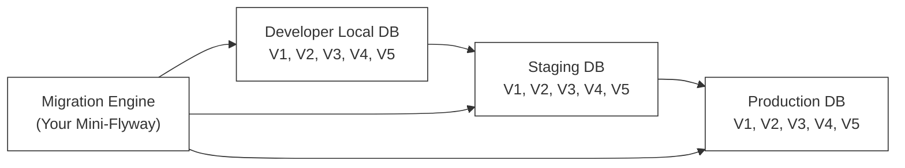
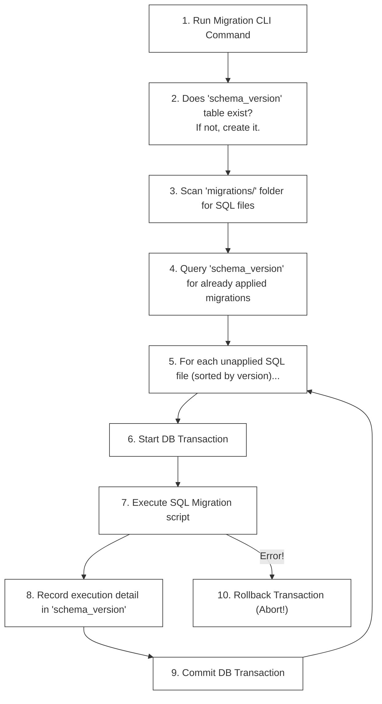

# F-04: Database Migration Engine (Mini-Flyway)

In an enterprise environment (at scale), you never run raw `CREATE TABLE` or `ALTER TABLE` queries directly on production databases. Instead, database schema changes are managed as **Versioned Migrations** that execute automatically within your CI/CD pipeline.

In this hands-on project, you will build a lightweight **Database Migration Engine** (similar to **Flyway** or **Liquibase**) from scratch using Python or Node.js.

---

## 1. What are Database Migrations?

A **Database Migration** is a versioned SQL script that represents a delta transition in your database schema. By treating database changes as code, migrations ensure that all database instances (Local Dev, Staging, Production) are structurally identical and predictable.

```
migrations/
├── V1__create_users_table.sql
├── V2__add_email_index.sql
└── V3__create_orders_table.sql
```

### L1 — Why Migrations Exist

Without migrations, schema management is chaos:
- Developer A runs `ALTER TABLE` on their local DB and forgets to tell anyone.
- Staging gets a schema change applied manually by a DBA who is now on vacation.
- Production fails during deployment because nobody kept track of what changed and when.

**Migrations solve this** by making schema changes versioned, ordered, reproducible, and auditable — just like application code in git.

### L2 — The Core Problem: Schema Drift

**Schema drift** occurs when different environments (dev, staging, prod) have subtly different database schemas. This leads to:

```
Developer's local DB:       Staging DB:              Production DB:
users table:                users table:             users table:
- id                        - id                     - id
- email                     - email                  - email  
- created_at                - created_at             - created_at
- phone_number ← EXISTS     ← MISSING!               ← MISSING!
                            - last_login ← EXISTS    ← MISSING!
```

A migration engine eliminates drift by **enforcing that every environment runs exactly the same migration scripts in exactly the same order**.



### The Migration Lifecycle



---

## 2. Core Architectural Components

To build your migration engine, you must implement three primary components:

### A. Metadata Tracking Table (`schema_version`)
Your engine must create and maintain this table in the target database to keep track of which migration scripts have already been applied:

```sql
CREATE TABLE schema_version (
    installed_rank INT PRIMARY KEY,
    version VARCHAR(50) NOT NULL,
    description VARCHAR(200) NOT NULL,
    script VARCHAR(255) UNIQUE NOT NULL,
    checksum VARCHAR(64) NOT NULL,
    installed_on TIMESTAMP DEFAULT CURRENT_TIMESTAMP,
    execution_time_ms INT NOT NULL,
    success BOOLEAN NOT NULL
);
```

*   `checksum`: SHA-256 hash of the SQL script file. If a developer secretly alters a migration script that has already run, your engine must catch this mismatch and crash immediately to prevent schema drifting!

**What a populated `schema_version` table looks like:**

```sql
SELECT * FROM schema_version;

-- installed_rank | version | description         | script                    | checksum   | installed_on        | execution_time_ms | success
-- 1              | 1       | create users table  | V1__create_users_table.sql| a3f8b2...  | 2026-05-01 09:00:00 | 42                | true
-- 2              | 2       | add email index     | V2__add_email_index.sql   | d9c1e4...  | 2026-05-01 09:00:01 | 8                 | true
-- 3              | 3       | create orders table | V3__create_orders_table.sql| b7a2f1... | 2026-05-01 09:00:01 | 67                | true
```

### B. Transaction-Wrapped Execution
A migration script might contain multiple SQL queries. If query #1 (creating a table) succeeds, but query #2 (creating an invalid index) fails, the database is left in a corrupted "half-applied" state.
*   **The Rule**: You must execute every SQL migration file inside a **Database Transaction** (`START TRANSACTION` / `COMMIT` / `ROLLBACK`). If any statement inside a script fails, you must invoke a `ROLLBACK` immediately to revert the database back to its previous clean state.

### C. File Discovery & Execution Order
Your CLI runner must scan a directory, parse file names (e.g. `V1__init.sql` -> version `1`), sort them numerically, filter out versions already listed in `schema_version`, and execute the remaining scripts.

**Naming convention:**

```
V{version}__{description}.sql

Examples:
  V1__create_users_table.sql      → version: 1
  V2__add_email_index.sql         → version: 2
  V10__add_shipping_address.sql   → version: 10 (MUST sort after V2, not after V1!)
  V1.1__hotfix_user_constraint.sql → version: 1.1
```

> [!WARNING]
> Numeric sort must treat `V10` as version 10, not as lexicographic string "V10" (which would sort before "V2"). Use numeric parsing, not alphabetic string sort.

---

## 3. Project Roadmap: Step-by-Step Implementation

You can write this engine using either **Python (psycopg2 / mysql-connector)** or **Node.js (pg / mysql2)**.

### Phase A: Scanner & DB Connection Setup

1.  Establish a secure database connection using environment variables (`DB_HOST`, `DB_PORT`, `DB_USER`, `DB_PASSWORD`, `DB_NAME`).
2.  Scan a local `./migrations` directory, discover all `.sql` files, and parse their version strings. Ensure that you sort the files numerically by version (e.g., `V10` must execute *after* `V2`).

**Python implementation reference:**

```python
import os
import re
import hashlib
import psycopg2
import time

# ── Configuration ──────────────────────────────────────────────────────────────
DB_CONFIG = {
    "host": os.environ.get("DB_HOST", "localhost"),
    "port": int(os.environ.get("DB_PORT", 5432)),
    "user": os.environ.get("DB_USER", "postgres"),
    "password": os.environ.get("DB_PASSWORD", ""),
    "dbname": os.environ.get("DB_NAME", "mydb"),
}

MIGRATIONS_DIR = "./migrations"

# ── File Discovery ─────────────────────────────────────────────────────────────
def discover_migration_files(migrations_dir: str) -> list[dict]:
    """
    Scans the migrations directory and parses each .sql file.
    Returns a list of migration descriptors sorted by version number.
    
    Each descriptor contains:
      - path: absolute file path
      - filename: base filename
      - version: numeric version (float for sub-versions like 1.1)
      - description: human-readable description from filename
      - checksum: SHA-256 hex digest of file contents
    """
    pattern = re.compile(r'^V(\d+(?:\.\d+)?)__(.+)\.sql$', re.IGNORECASE)
    migrations = []
    
    for filename in os.listdir(migrations_dir):
        match = pattern.match(filename)
        if not match:
            continue
        
        version_str, description = match.groups()
        version = float(version_str)
        filepath = os.path.join(migrations_dir, filename)
        
        with open(filepath, 'r', encoding='utf-8') as f:
            content = f.read()
        
        checksum = hashlib.sha256(content.encode('utf-8')).hexdigest()
        
        migrations.append({
            "path": filepath,
            "filename": filename,
            "version": version,
            "description": description.replace('_', ' '),
            "content": content,
            "checksum": checksum,
        })
    
    # Sort numerically — V10 comes after V2, not after V1
    return sorted(migrations, key=lambda m: m["version"])
```

### Phase B: Metadata Sync & Dry Run

1.  Check if the `schema_version` metadata table exists. If not, execute the DDL to create it.
2.  Compare the local directory file checksums against already-executed migrations in the database. If a local file has a checksum that differs from the DB record, raise an error: **"Validation failed: Checksum mismatch on V1__init.sql!"** and abort.

```python
# ── Schema Version Table ────────────────────────────────────────────────────────
SCHEMA_VERSION_DDL = """
CREATE TABLE IF NOT EXISTS schema_version (
    installed_rank SERIAL PRIMARY KEY,
    version VARCHAR(50) NOT NULL,
    description VARCHAR(200) NOT NULL,
    script VARCHAR(255) UNIQUE NOT NULL,
    checksum VARCHAR(64) NOT NULL,
    installed_on TIMESTAMP DEFAULT CURRENT_TIMESTAMP,
    execution_time_ms INT NOT NULL,
    success BOOLEAN NOT NULL
);
"""

def ensure_schema_version_table(conn) -> None:
    """Creates the schema_version table if it does not exist."""
    with conn.cursor() as cur:
        cur.execute(SCHEMA_VERSION_DDL)
    conn.commit()

def get_applied_migrations(conn) -> dict[str, dict]:
    """
    Fetches all migration records from schema_version.
    Returns a dict keyed by script filename.
    """
    with conn.cursor() as cur:
        cur.execute(
            "SELECT script, checksum, success FROM schema_version"
        )
        return {row[0]: {"checksum": row[1], "success": row[2]} 
                for row in cur.fetchall()}

def validate_checksums(local_migrations: list, applied: dict) -> None:
    """
    For every migration that has already been applied, verifies the local
    file checksum matches the stored checksum. Raises an exception on mismatch.
    This prevents silent schema drift from file tampering.
    """
    for migration in local_migrations:
        filename = migration["filename"]
        if filename in applied:
            stored_checksum = applied[filename]["checksum"]
            if stored_checksum != migration["checksum"]:
                raise ValueError(
                    f"Validation failed: Checksum mismatch on {filename}!\n"
                    f"  Stored:  {stored_checksum}\n"
                    f"  Current: {migration['checksum']}\n"
                    f"Migration files must never be modified after execution."
                )
```

### Phase C: Transaction Runner & CLI Output

1.  Open a database transaction for each unapplied migration script.
2.  Read the raw SQL contents of the file, execute it against the database, calculate the execution duration in milliseconds, and insert the record into `schema_version` as `success = true`.
3.  Implement global error handling: if an SQL error occurs, trigger a rollback, log the failed migration in `schema_version` with `success = false`, and abort the runner.

```python
# ── Transaction Runner ─────────────────────────────────────────────────────────
def run_migration(conn, migration: dict, installed_rank: int) -> None:
    """
    Executes a single migration script inside a database transaction.
    
    On success: records the migration in schema_version with success=true.
    On failure: rolls back ALL statements in the script, records with success=false,
                and raises the original exception to abort the runner.
    """
    print(f"  ▶ Migrating: {migration['filename']} (version {migration['version']})")
    start_time = time.time()
    
    try:
        with conn.cursor() as cur:
            # Execute the migration script (may contain multiple SQL statements)
            cur.execute(migration["content"])
            
            # Record successful execution in metadata table
            execution_time_ms = int((time.time() - start_time) * 1000)
            cur.execute("""
                INSERT INTO schema_version 
                    (installed_rank, version, description, script, checksum, 
                     execution_time_ms, success)
                VALUES (%s, %s, %s, %s, %s, %s, %s)
            """, (
                installed_rank,
                str(migration["version"]),
                migration["description"],
                migration["filename"],
                migration["checksum"],
                execution_time_ms,
                True
            ))
        
        conn.commit()  # Commit: both migration + metadata tracking succeed together
        print(f"  ✅ Applied: {migration['filename']} ({execution_time_ms}ms)")
    
    except Exception as e:
        conn.rollback()  # Roll back: neither migration nor metadata record is kept
        
        # Attempt to record the failure (in a new transaction)
        try:
            execution_time_ms = int((time.time() - start_time) * 1000)
            with conn.cursor() as cur:
                cur.execute("""
                    INSERT INTO schema_version
                        (installed_rank, version, description, script, checksum,
                         execution_time_ms, success)
                    VALUES (%s, %s, %s, %s, %s, %s, %s)
                """, (
                    installed_rank,
                    str(migration["version"]),
                    migration["description"],
                    migration["filename"],
                    migration["checksum"],
                    execution_time_ms,
                    False
                ))
            conn.commit()
        except Exception:
            pass  # If failure recording also fails, just propagate original error
        
        raise RuntimeError(
            f"Migration FAILED: {migration['filename']}\n"
            f"Error: {e}\n"
            f"All changes from this script have been rolled back."
        ) from e


# ── Main Runner ────────────────────────────────────────────────────────────────
def run_migrations() -> None:
    """Entry point: connects to DB, validates checksums, applies pending migrations."""
    print("🔄 Migration Engine starting...")
    
    conn = psycopg2.connect(**DB_CONFIG)
    conn.autocommit = False  # All commits must be explicit
    
    try:
        # Step 1: Ensure metadata table exists
        ensure_schema_version_table(conn)
        
        # Step 2: Discover local migration files
        local_migrations = discover_migration_files(MIGRATIONS_DIR)
        print(f"📁 Found {len(local_migrations)} migration file(s)")
        
        # Step 3: Fetch already-applied migrations
        applied = get_applied_migrations(conn)
        
        # Step 4: Validate checksums (fail fast on tampering)
        validate_checksums(local_migrations, applied)
        
        # Step 5: Run pending migrations
        pending = [m for m in local_migrations if m["filename"] not in applied]
        
        if not pending:
            print("✅ Database is up to date. No migrations to apply.")
            return
        
        print(f"📋 {len(pending)} pending migration(s) to apply:")
        
        installed_rank = len(applied) + 1
        for migration in pending:
            run_migration(conn, migration, installed_rank)
            installed_rank += 1
        
        print(f"\n✅ Successfully applied {len(pending)} migration(s).")
    
    finally:
        conn.close()


if __name__ == "__main__":
    run_migrations()
```

### Node.js Implementation Reference

```javascript
// migration-engine.js (Node.js with 'pg' driver)
const { Client } = require('pg');
const fs = require('fs');
const path = require('path');
const crypto = require('crypto');

/**
 * Computes the SHA-256 checksum of a string.
 * @param {string} content - Raw SQL file content
 * @returns {string} Hex-encoded SHA-256 hash
 */
function computeChecksum(content) {
  return crypto.createHash('sha256').update(content, 'utf8').digest('hex');
}

/**
 * Discovers and parses migration files from the given directory.
 * Files must follow the naming convention: V{version}__{description}.sql
 * Returns an array of migration descriptors sorted numerically by version.
 *
 * @param {string} migrationsDir - Path to the migrations directory
 * @returns {Array<{filename, version, description, content, checksum}>}
 */
function discoverMigrations(migrationsDir) {
  const pattern = /^V(\d+(?:\.\d+)?)__(.+)\.sql$/i;
  
  return fs.readdirSync(migrationsDir)
    .filter(f => pattern.test(f))
    .map(filename => {
      const [, versionStr, description] = pattern.exec(filename);
      const content = fs.readFileSync(path.join(migrationsDir, filename), 'utf8');
      return {
        filename,
        version: parseFloat(versionStr),
        description: description.replace(/_/g, ' '),
        content,
        checksum: computeChecksum(content),
      };
    })
    .sort((a, b) => a.version - b.version);  // Numeric sort: V10 > V2
}

/**
 * Main migration runner.
 * Connects to PostgreSQL, ensures schema_version exists, validates checksums,
 * and applies all pending migrations inside individual transactions.
 */
async function runMigrations() {
  const client = new Client({
    host: process.env.DB_HOST || 'localhost',
    port: parseInt(process.env.DB_PORT || '5432'),
    user: process.env.DB_USER,
    password: process.env.DB_PASSWORD,
    database: process.env.DB_NAME,
  });

  await client.connect();
  
  try {
    // Ensure metadata table
    await client.query(`
      CREATE TABLE IF NOT EXISTS schema_version (
        installed_rank SERIAL PRIMARY KEY,
        version VARCHAR(50) NOT NULL,
        description VARCHAR(200) NOT NULL,
        script VARCHAR(255) UNIQUE NOT NULL,
        checksum VARCHAR(64) NOT NULL,
        installed_on TIMESTAMP DEFAULT NOW(),
        execution_time_ms INT NOT NULL,
        success BOOLEAN NOT NULL
      )
    `);

    const localMigrations = discoverMigrations('./migrations');
    const { rows: appliedRows } = await client.query('SELECT script, checksum FROM schema_version');
    const applied = Object.fromEntries(appliedRows.map(r => [r.script, r.checksum]));

    // Validate checksums
    for (const m of localMigrations) {
      if (applied[m.filename] && applied[m.filename] !== m.checksum) {
        throw new Error(`Checksum mismatch on ${m.filename}! Migration files must not be modified after execution.`);
      }
    }

    const pending = localMigrations.filter(m => !applied[m.filename]);
    if (pending.length === 0) {
      console.log('✅ Database is up to date.');
      return;
    }

    let installedRank = Object.keys(applied).length + 1;
    for (const migration of pending) {
      const startTime = Date.now();
      await client.query('BEGIN');
      try {
        await client.query(migration.content);
        const executionTimeMs = Date.now() - startTime;
        await client.query(
          `INSERT INTO schema_version (installed_rank, version, description, script, checksum, execution_time_ms, success)
           VALUES ($1,$2,$3,$4,$5,$6,$7)`,
          [installedRank, String(migration.version), migration.description, migration.filename, migration.checksum, executionTimeMs, true]
        );
        await client.query('COMMIT');
        console.log(`✅ Applied: ${migration.filename} (${executionTimeMs}ms)`);
        installedRank++;
      } catch (err) {
        await client.query('ROLLBACK');
        throw new Error(`Migration FAILED: ${migration.filename}\n${err.message}`);
      }
    }
  } finally {
    await client.end();
  }
}

runMigrations().catch(err => { console.error(err.message); process.exit(1); });
```

---

## 4. Sample Migration Files

```sql
-- migrations/V1__create_users_table.sql
CREATE TABLE users (
    user_id SERIAL PRIMARY KEY,
    email VARCHAR(150) UNIQUE NOT NULL,
    password_hash VARCHAR(255) NOT NULL,
    created_at TIMESTAMP DEFAULT CURRENT_TIMESTAMP
);

-- migrations/V2__add_email_index.sql
CREATE INDEX idx_users_email ON users(email);

-- migrations/V3__create_orders_table.sql
CREATE TABLE orders (
    order_id SERIAL PRIMARY KEY,
    user_id INT NOT NULL REFERENCES users(user_id) ON DELETE CASCADE,
    total_amount DECIMAL(12, 2) NOT NULL,
    status VARCHAR(50) NOT NULL DEFAULT 'pending',
    created_at TIMESTAMP DEFAULT CURRENT_TIMESTAMP
);

-- migrations/V4__add_order_status_index.sql
CREATE INDEX idx_orders_status ON orders(status);
CREATE INDEX idx_orders_user_id ON orders(user_id);
```

---

## 5. Common Pitfalls & Anti-Patterns

### Anti-Pattern 1: Editing Applied Migration Files

```
❌ Never modify a migration file that has already been applied to ANY environment.

What happens:
  Local file V2__add_email_index.sql changes
  → Checksum no longer matches schema_version record
  → Migration engine aborts with "Checksum mismatch"
  → Production deployment fails

✅ Correct approach:
  If you need to change something V2 did, create V5__fix_email_index.sql
  This preserves the immutable audit trail.
```

### Anti-Pattern 2: Running Migrations Without Transactions

```python
# ❌ Bad: No transaction wrapping — partial execution leaves DB corrupted
cur.execute("CREATE TABLE orders (...)")
cur.execute("CREATE INDEX INVALID_SYNTAX")  # Fails here
# orders table now exists but no index — half-applied state!

# ✅ Good: Wrap in a transaction — either everything succeeds or nothing does
conn.autocommit = False
try:
    cur.execute("CREATE TABLE orders (...)")
    cur.execute("CREATE INDEX INVALID_SYNTAX")  # Fails
    conn.commit()
except:
    conn.rollback()  # Reverts the CREATE TABLE as well
```

### Anti-Pattern 3: Skipping Version Numbers

```
❌ Bad version sequence: V1, V2, V5, V10
   Gaps confuse team members about what happened between versions.
   
✅ Good version sequence: V1, V2, V3, V4, V5
   Or use timestamps: V20260501_001__create_users.sql
```

### Anti-Pattern 4: Running DDL and DML in the Same Migration

```sql
-- ❌ Risky: Structural change AND data migration in one transaction
-- In some databases (MySQL), DDL auto-commits, making rollback impossible!

-- V5__rename_column_and_backfill.sql
ALTER TABLE users RENAME COLUMN username TO display_name;  -- DDL (auto-commit risk)
UPDATE users SET display_name = email WHERE display_name IS NULL;  -- DML

-- ✅ Better: Split into two migrations
-- V5__rename_column.sql
ALTER TABLE users RENAME COLUMN username TO display_name;

-- V6__backfill_display_name.sql
UPDATE users SET display_name = email WHERE display_name IS NULL;
```

### Anti-Pattern 5: Hardcoded Connection Strings

```python
# ❌ Never hardcode database credentials:
conn = psycopg2.connect("host=prod-db user=admin password=secret123")

# ✅ Always use environment variables:
import os
conn = psycopg2.connect(
    host=os.environ["DB_HOST"],
    user=os.environ["DB_USER"],
    password=os.environ["DB_PASSWORD"],
    dbname=os.environ["DB_NAME"]
)
```

---

## 🔧 TDD Checklist for Your Implementation

When implementing, your code should satisfy these behavior-focused test specifications:

- [ ] **Specs: DB Initialization**
  - [ ] Connects cleanly to the target database.
  - [ ] Automatically creates `schema_version` if it is missing.
  - [ ] `schema_version` creation is idempotent (running twice does not error).

- [ ] **Specs: Versioning & Ordering**
  - [ ] Correctly identifies file naming structures (e.g. `V1.1__name.sql`).
  - [ ] Sorts migrations numerically by version (ensure `V2` runs before `V10`).
  - [ ] Ignores files that do not match the `V{n}__{desc}.sql` naming pattern.

- [ ] **Specs: Validation & Checksums**
  - [ ] Skips files that have already been executed with matching checksums.
  - [ ] Throws an exception and halts execution if a previously executed migration file's checksum has changed.
  - [ ] Reports which specific file caused the checksum failure.

- [ ] **Specs: Transactions & Atomicity**
  - [ ] Runs each migration script in an isolated database transaction block.
  - [ ] Rolls back all statements inside a script if a single statement fails.
  - [ ] Records migration failures in `schema_version` to block subsequent executions until resolved.
  - [ ] A failed migration does NOT prevent the engine from recording the failure in `schema_version`.

- [ ] **Specs: Metadata Auditing**
  - [ ] Accurately records metadata attributes (`installed_rank`, `checksum`, `execution_time_ms`, `success`) on execution.
  - [ ] `installed_rank` increments sequentially across all migrations.
  - [ ] `execution_time_ms` reflects the actual elapsed time of the migration script.

- [ ] **Specs: Edge Cases**
  - [ ] Handles an empty migrations directory gracefully (prints "up to date", exits 0).
  - [ ] Handles a migrations directory with only already-applied migrations (no-op run).
  - [ ] Handles a migration file that contains multiple SQL statements (separated by `;`).
  - [ ] Does not apply migrations out of version order even if file system returns them alphabetically.

---

## 📚 Key Takeaways

| Concept | One-Line Summary |
|---|---|
| Schema Drift | Different DB environments have different schemas — migrations prevent this |
| Migration File | Versioned, immutable SQL script representing a delta schema change |
| `schema_version` table | Audit log of every migration ever applied to the database |
| Checksum | SHA-256 of the migration file content — detects silent tampering |
| Transaction Wrapping | Each migration script runs inside BEGIN/COMMIT — no half-applied states |
| Versioned Naming | `V{n}__{desc}.sql` — numeric sort ensures correct execution order |
| Numeric Sort | V10 must execute after V2 — parse as float, not lexicographic string |
| Idempotency | Running the engine twice has no effect if already up to date |
| Immutability | Applied migration files must NEVER be changed — create a new version instead |
| Failure Recording | Failed migrations are recorded in schema_version to block re-runs until fixed |

> [!TIP]
> Think of your migration engine as a **database version control system**. Just as git tracks code changes with commit hashes, your engine tracks schema changes with version numbers and SHA-256 checksums. The golden rule: **migration files are append-only — never edit the past**.
