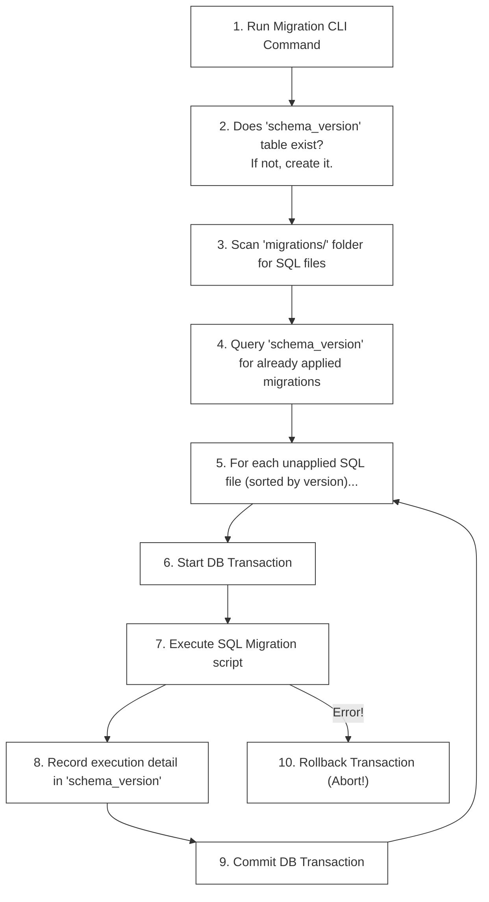

# F-04: Database Migration Engine (Mini-Flyway)

In an enterprise environment (at scale), you never run raw `CREATE TABLE` or `ALTER TABLE` queries directly on production databases. Instead, database schema changes are managed as **Versioned Migrations** that execute automatically within your CI/CD pipeline. 

In this hands-on project, you will build a lightweight **Database Migration Engine** (similar to **Flyway** or **Liquibase**) from scratch using Python or Node.js.

---

## 1. What are Database Migrations?

A **Database Migration** is a versioned SQL script that represents a delta transition in your database schema. By treating database changes as code, migrations ensure that all database instances (Local Dev, Staging, Production) are structurally identical and predictable.

```
migrations/
├── V1__create_users_table.sql
├── V2__add_email_index.sql
└── V3__create_orders_table.sql
```

### The Migration Lifecycle



---

## 2. Core Architectural Components

To build your migration engine, you must implement three primary components:

### A. Metadata Tracking Table (`schema_version`)
Your engine must create and maintain this table in the target database to keep track of which migration scripts have already been applied:

```sql
CREATE TABLE schema_version (
    installed_rank INT PRIMARY KEY,
    version VARCHAR(50) NOT NULL,
    description VARCHAR(200) NOT NULL,
    script VARCHAR(255) UNIQUE NOT NULL,
    checksum VARCHAR(64) NOT NULL,
    installed_on TIMESTAMP DEFAULT CURRENT_TIMESTAMP,
    execution_time_ms INT NOT NULL,
    success BOOLEAN NOT NULL
);
```
*   `checksum`: SHA-256 hash of the SQL script file. If a developer secretly alters a migration script that has already run, your engine must catch this mismatch and crash immediately to prevent schema drifting!

### B. Transaction-Wrapped Execution
A migration script might contain multiple SQL queries. If query #1 (creating a table) succeeds, but query #2 (creating an invalid index) fails, the database is left in a corrupted "half-applied" state. 
*   **The Rule**: You must execute every SQL migration file inside a **Database Transaction** (`START TRANSACTION` / `COMMIT` / `ROLLBACK`). If any statement inside a script fails, you must invoke a `ROLLBACK` immediately to revert the database back to its previous clean state.

### C. File Discovery & Execution Order
Your CLI runner must scan a directory, parse file names (e.g. `V1__init.sql` -> version `1`), sort them numerically, filter out versions already listed in `schema_version`, and execute the remaining scripts.

---

## 3. Project Roadmap: Step-by-Step Implementation

You can write this engine using either **Python (psycopg2 / mysql-connector)** or **Node.js (pg / mysql2)**.

### Phase A: Scanner & DB Connection Setup
1.  Establish a secure database connection using environment variables (`DB_HOST`, `DB_PORT`, `DB_USER`, `DB_PASSWORD`, `DB_NAME`).
2.  Scan a local `./migrations` directory, discover all `.sql` files, and parse their version strings. Ensure that you sort the files numerically by version (e.g., `V10` must execute *after* `V2`).

### Phase B: Metadata Sync & Dry Run
1.  Check if the `schema_version` metadata table exists. If not, execute the DDL to create it.
2.  Compare the local directory file checksums against already-executed migrations in the database. If a local file has a checksum that differs from the DB record, raise an error: **"Validation failed: Checksum mismatch on V1__init.sql!"** and abort.

### Phase C: Transaction Runner & CLI Output
1.  Open a database transaction for each unapplied migration script.
2.  Read the raw SQL contents of the file, execute it against the database, calculate the execution duration in milliseconds, and insert the record into `schema_version` as `success = true`.
3.  Implement global error handling: if an SQL error occurs, trigger a rollback, log the failed migration in `schema_version` with `success = false`, and abort the runner.

---

## 🔧 TDD Checklist for Your Implementation

When implementing, your code should satisfy these behavior-focused test specifications:

- [ ] **Specs: DB Initialization**
  - [ ] Connects cleanly to the target database.
  - [ ] Automatically creates `schema_version` if it is missing.
- [ ] **Specs: Versioning & Ordering**
  - [ ] Correctly identifies file naming structures (e.g. `V1.1__name.sql`).
  - [ ] Sorts migrations numerically by version (ensure `V2` runs before `V10`).
- [ ] **Specs: Validation & Checksums**
  - [ ] Skips files that have already been executed with matching checksums.
  - [ ] Throws an exception and halts execution if a previously executed migration file's checksum has changed.
- [ ] **Specs: Transactions & Atomicity**
  - [ ] Runs each migration script in an isolated database transaction block.
  - [ ] Rolls back all statements inside a script if a single statement fails.
  - [ ] Records migration failures in `schema_version` to block subsequent executions until resolved.
- [ ] **Specs: Metadata Auditing**
  - [ ] Accurately records metadata attributes (`installed_rank`, `checksum`, `execution_time_ms`, `success`) on execution.
