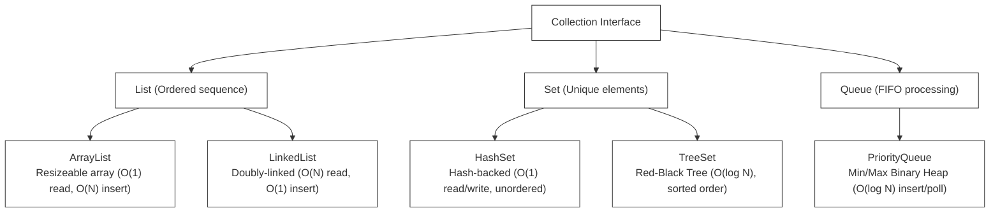

# L-00: Java Core Fundamentals (CLI Task Manager)

Welcome to Phase 2: Language Deep-Dives! Java is a powerful, statically-typed, object-oriented language that serves as the backbone of DP World's high-scale backend ecosystem. In this handbook, you will master the core foundations of Java—from memory mechanics to advanced collections—and design a clean, command-line **Task Manager** from scratch.

---

## 1. Under the Hood: JVM, JRE, & JDK

Understanding how Java code runs on a machine is critical for performance tuning and memory management.

```
+-------------------------------------------------------------+
|                        JDK (Development Kit)                |
|   Contains compiler (javac), debugger, packaging tools      |
|   +-----------------------------------------------------+   |
|   |                    JRE (Runtime Environment)        |   |
|   |   Contains standard class libraries, loader         |   |
|   |   +---------------------------------------------+   |   |
|   |   |                  JVM (Virtual Machine)      |   |   |
|   |   |   Executes bytecode, manages memory (GC)    |   |   |
|   |   +---------------------------------------------+   |   |
|   +-----------------------------------------------------+   |
+-------------------------------------------------------------+
```

### The Compilation Workflow
1.  **Source Code (`.java`)**: The human-readable code you write.
2.  **Bytecode (`.class`)**: When you run `javac MyClass.java`, the compiler translates your source code into an optimized, platform-independent intermediate format called bytecode.
3.  **JVM Execution**: The Virtual Machine loads the `.class` files, compiles bytecode to native machine code on-the-fly using the **JIT (Just-In-Time) Compiler**, and executes it.

### Java Memory Management: Stack vs. Heap
*   **Stack Memory**:
    *   Stores local variables, primitive values, and references to objects.
    *   Highly optimized, LIFO (Last In, First Out) order, managed automatically on method calls/returns.
    *   Thread-safe: each thread maintains its own private Stack.
*   **Heap Memory**:
    *   Stores all objects (instantiated using the `new` keyword).
    *   Shared across all threads.
    *   Objects remain on the Heap until they are no longer referenced, at which point they are collected by the **Garbage Collector (GC)**.

---

## 2. Deep Dive: Java Collections Framework

Using the correct data structure is the difference between a high-performance system and a sluggish server. The Collections Framework is organized into a clean interface hierarchy:



### Map Interface (Key-Value Storage)
*   **HashMap**: High-performance key-value mapping (`O(1)` read/write). Unordered. Uses hash functions and bucket arrays to resolve collisions.
*   **TreeMap**: Red-black tree implementation (`O(log N)` operations). Keys are sorted in natural or custom comparator order.

---

## 3. Streams API & Functional Programming

Introduced in Java 8, the **Streams API** enables declarative, functional-style transformations of data collections, drastically reducing boilerplate code.

```java
List<String> activeTasks = tasks.stream()
    .filter(task -> task.getStatus().equals("ACTIVE"))  // Intermediate: filter
    .map(Task::getTitle)                                 // Intermediate: transform
    .sorted()                                           // Intermediate: sort
    .collect(Collectors.toList());                       // Terminal: gather results
```

### Key Stream Rules
1.  **Streams do not modify the source**: They return a new stream stream pipeline.
2.  **Lazy Evaluation**: Intermediate operations (`filter`, `map`) are not executed until a terminal operation (`collect`, `forEach`, `count`) is invoked.

---

## 4. Exception Handling & Try-With-Resources

Java classifies exceptions into a strict hierarchy:

```
                  [ Throwable ]
                  /           \
           [ Error ]       [ Exception ]
         (JVM Crashes)     /           \
                 [ Checked Exception ]  [ Unchecked Exception (RuntimeException) ]
                 (Checked at compile)        (Checked at runtime - NullPointer, etc.)
```

*   **Checked Exceptions** (e.g. `IOException`, `SQLException`): Must be caught or declared in the method signature (`throws`) at compile time.
*   **Unchecked Exceptions** (e.g. `NullPointerException`, `IllegalArgumentException`): Represent programming flaws and do not need compile-time checks.

### Try-With-Resources (Automatic Resource Management)
When opening files, database connections, or sockets, always use try-with-resources. It guarantees that the resource is automatically closed, preventing memory leaks:

```java
try (BufferedReader reader = new BufferedReader(new FileReader("tasks.txt"))) {
    String line;
    while ((line = reader.readLine()) != null) {
        System.out.println(line);
    }
} catch (IOException e) {
    System.err.println("Failed to read file: " + e.getMessage());
}
// Reader is automatically closed here!
```

---

## 5. Build Automation with Maven

**Maven** is the standard build automation and dependency management tool for Java. It manages project configuration in a XML file: `pom.xml` (Project Object Model).

### The Standard Maven Lifecycle
When you execute Maven commands, they trigger sequential phases:
1.  `mvn clean`: Deletes the `target/` build output directory.
2.  `mvn compile`: Compiles source code (`.java` -> `.class`) to `target/classes`.
3.  `mvn test`: Runs unit tests using test frameworks like JUnit.
4.  `mvn package`: Packs compiled class files into a JAR or WAR archive file.
5.  `mvn install`: Installs the packaged archive into your local Maven cache repository (`~/.m2`).

---

## 🔧 Hands-on Project: CLI Task Manager

You will build a command-line Task Manager that handles task creation, priorities, and disk persistence using a structured, object-oriented design.

### Core Architecture
To practice clean SOLID design, separate your concerns into distinct classes:
1.  `Task`: Represents the data model (id, title, priority, status).
2.  `TaskManager`: Handles core business logic (adding, completing, listing tasks).
3.  `TaskStorage`: Handles reading and writing tasks to a text file.
4.  `App`: The CLI interactive entry point.

```
src/main/java/org/dpworld/
├── model/
│   └── Task.java
├── service/
│   └── TaskManager.java
├── storage/
│   └── TaskStorage.java
└── App.java
```

---

## 🔧 TDD Checklist for Your Implementation

Your codebase must implement a clean, behavior-driven design satisfying these JUnit specifications:

- [ ] **Specs: Task Creation**
  - [ ] A task can be instantiated with a title, priority level (LOW, MEDIUM, HIGH), and status (TODO).
  - [ ] Automatically generates a unique UUID for each task.
  - [ ] Throws an `IllegalArgumentException` if the title is empty or null.
- [ ] **Specs: Core Task Manager Service**
  - [ ] Adds new tasks to an in-memory collection.
  - [ ] Correctly fetches active tasks sorted dynamically by Priority (HIGH -> MEDIUM -> LOW). (Hint: use a `PriorityQueue` or custom stream comparator).
  - [ ] Marks an active task as COMPLETED by ID.
  - [ ] Throws a `NoSuchElementException` if attempting to complete a non-existent task ID.
- [ ] **Specs: Persistence Storage**
  - [ ] Writes the complete task list to a text file in a structured format (e.g. CSV: `id,title,priority,completed`).
  - [ ] Reads tasks from a text file, parses values, and correctly reconstructs the `Task` object model.
  - [ ] Gracefully handles missing files by returning an empty list rather than crashing.
