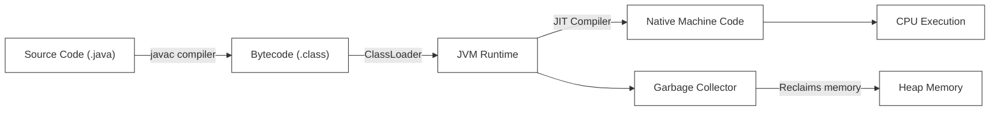
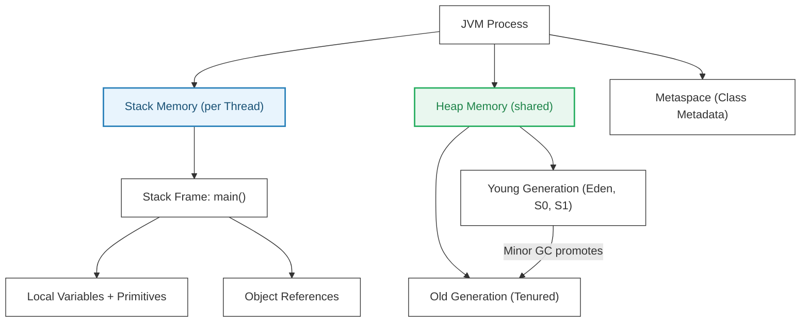
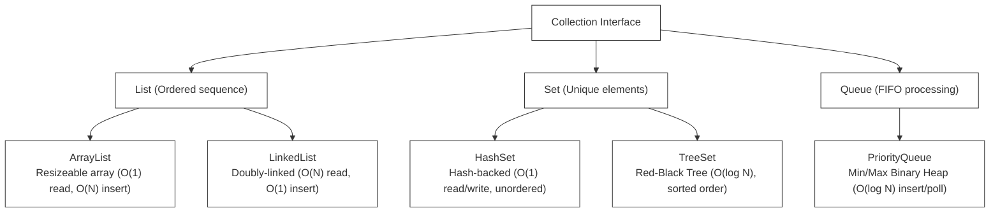
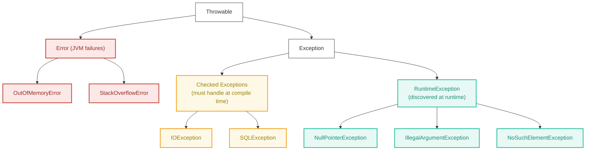
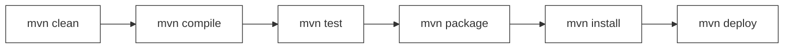
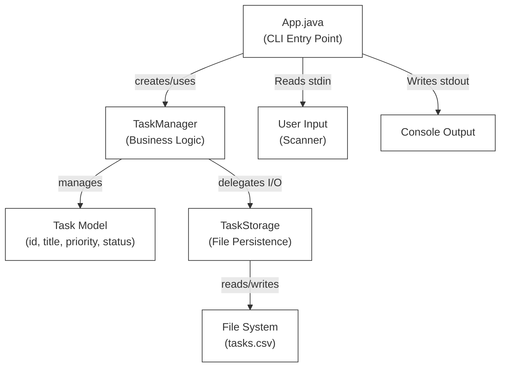

# L-00: Java Core Fundamentals (CLI Task Manager)

Welcome to Phase 2: Language Deep-Dives! Java is a powerful, statically-typed, object-oriented language that serves as the backbone of high-scale enterprise backend ecosystems. In this handbook, you will master the core foundations of Java—from memory mechanics to advanced collections—and design a clean, command-line **Task Manager** from scratch.

---

## 1. Under the Hood: JVM, JRE, & JDK

Understanding how Java code runs on a machine is critical for performance tuning and memory management.

```
+-------------------------------------------------------------+
|                        JDK (Development Kit)                |
|   Contains compiler (javac), debugger, packaging tools      |
|   +-----------------------------------------------------+   |
|   |                    JRE (Runtime Environment)        |   |
|   |   Contains standard class libraries, loader         |   |
|   |   +---------------------------------------------+   |   |
|   |   |                  JVM (Virtual Machine)      |   |   |
|   |   |   Executes bytecode, manages memory (GC)    |   |   |
|   |   +---------------------------------------------+   |   |
|   +-----------------------------------------------------+   |
+-------------------------------------------------------------+
```

### The Compilation Workflow
1.  **Source Code (`.java`)**: The human-readable code you write.
2.  **Bytecode (`.class`)**: When you run `javac MyClass.java`, the compiler translates your source code into an optimized, platform-independent intermediate format called bytecode.
3.  **JVM Execution**: The Virtual Machine loads the `.class` files, compiles bytecode to native machine code on-the-fly using the **JIT (Just-In-Time) Compiler**, and executes it.



### L1 — What It Is
The **JVM (Java Virtual Machine)** is the runtime environment that interprets compiled Java bytecode. It is platform-specific (there are JVMs for Windows, Linux, macOS) but the bytecode it runs is platform-neutral — this gives Java its "Write Once, Run Anywhere" guarantee.

### L2 — How It Works Internally
When the JVM starts:
1. **Class Loading Phase**: The `ClassLoader` searches the classpath, reads `.class` binary files, and loads class metadata into the **Method Area** of the JVM's memory.
2. **Bytecode Verification**: The verifier ensures the bytecode is type-safe and doesn't violate Java's access control rules, preventing rogue code execution.
3. **JIT Compilation**: Initially, the JVM **interprets** bytecode line-by-line (slow). After detecting a "hot path" (code executed frequently), the JIT compiler compiles that path into native CPU instructions and caches them, dramatically speeding up repeated execution.

**Real-world analogy**: Think of the JVM as a universal translation booth. The bytecode is a language that the booth understands regardless of which country you're in (OS). The booth then speaks native to that country's citizens (CPU).

### Java Memory Management: Stack vs. Heap



*   **Stack Memory**:
    *   Stores local variables, primitive values, and references to objects.
    *   Highly optimized, LIFO (Last In, First Out) order, managed automatically on method calls/returns.
    *   Thread-safe: each thread maintains its own private Stack.
    *   **StackOverflowError** occurs when recursion is too deep (stack fills up).

*   **Heap Memory**:
    *   Stores all objects (instantiated using the `new` keyword).
    *   Shared across all threads.
    *   Objects remain on the Heap until they are no longer referenced, at which point they are collected by the **Garbage Collector (GC)**.
    *   The **Young Generation** holds newly created objects. Frequent **Minor GC** events collect short-lived objects here.
    *   Objects that survive several Minor GC cycles are promoted to the **Old Generation**, cleaned by rarer, more expensive **Major GC** events.

```java
// Stack holds primitive 'x' and reference 'task'
// Heap holds the actual Task object
public void process() {
    int x = 42;                     // stored on Stack
    Task task = new Task("Build");  // 'task' reference on Stack; Task object on Heap
    System.out.println(task.getTitle());
}   // task goes out of scope here; object becomes GC-eligible
```

---

## 2. Deep Dive: Java Collections Framework

Using the correct data structure is the difference between a high-performance system and a sluggish server. The Collections Framework is organized into a clean interface hierarchy:



### L1 — What It Is
Java's **Collections Framework** is a unified architecture of interfaces (`List`, `Set`, `Queue`, `Map`) and concrete implementations. Each interface models a different **data access pattern**.

### L2 — How They Work Internally

| Collection | Internal Structure | Key Property |
|---|---|---|
| `ArrayList` | Dynamic Object array; doubles capacity when full | O(1) index access, O(N) insert at middle |
| `LinkedList` | Doubly-linked list of Node objects | O(1) head/tail insert, O(N) random access |
| `HashMap` | Array of linked-list "buckets" + tree on collision | O(1) average, O(N) worst (all keys hash to same bucket) |
| `TreeMap` | Self-balancing Red-Black Tree | O(log N) all operations; keys always sorted |
| `PriorityQueue` | Binary Min-Heap array | O(log N) insert/remove; O(1) peek minimum |
| `HashSet` | Backed by `HashMap` (value is dummy Object) | O(1) contains check |

**When to use which — production example:**
```java
// SCENARIO: Task Manager backend

// ArrayList — Iterate through all tasks to display in order
List<Task> displayList = new ArrayList<>(taskStorage.loadAll());

// HashMap — O(1) task lookup by ID for REST GET /tasks/{id}
Map<String, Task> taskIndex = new HashMap<>();
taskIndex.put(task.getId(), task);

// PriorityQueue — Process tasks in priority order (HIGH first)
PriorityQueue<Task> workQueue = new PriorityQueue<>(
    Comparator.comparingInt(t -> -t.getPriority().ordinal())
);

// TreeMap — Display tasks sorted alphabetically by title
TreeMap<String, Task> sortedByTitle = new TreeMap<>();
```

### Map Interface (Key-Value Storage)
*   **HashMap**: High-performance key-value mapping (`O(1)` read/write). Unordered. Uses hash functions and bucket arrays to resolve collisions. In Java 8+, buckets with >8 entries convert to Red-Black Trees for O(log N) worst-case.
*   **TreeMap**: Red-black tree implementation (`O(log N)` operations). Keys are sorted in natural or custom comparator order. Use when you need sorted iteration.
*   **ConcurrentHashMap**: Thread-safe variant of HashMap using segment-level locking. Essential in multi-threaded servers.

---

## 3. Streams API & Functional Programming

Introduced in Java 8, the **Streams API** enables declarative, functional-style transformations of data collections, drastically reducing boilerplate code.

```java
List<String> activeTasks = tasks.stream()
    .filter(task -> task.getStatus().equals("ACTIVE"))  // Intermediate: filter
    .map(Task::getTitle)                                 // Intermediate: transform
    .sorted()                                           // Intermediate: sort
    .collect(Collectors.toList());                       // Terminal: gather results
```

### L1 — What It Is
A **Stream** is not a data structure — it is a processing pipeline. You declaratively describe *what* transformations to apply, and the stream lazily processes elements through the pipeline when a terminal operation is invoked.

### L2 — Internal Mechanics: The Lazy Pipeline

```mermaid
graph LR
    classDef default fill:#ffffff,stroke:#333333,stroke-width:1px,color:#333333;

    Source["Collection Source<br>(List/Set/Array)"] -->|"stream()"| Pipeline["Stream Pipeline"]
    Pipeline --> F["filter() — Stateless Intermediate"]
    F --> M["map() — Stateless Intermediate"]
    M --> S["sorted() — Stateful Intermediate"]
    S --> C["collect() — Terminal Operation"]
    C -->|"triggers execution"| Result["New Collection Result"]
```



**Key Stream Rules**
1.  **Streams do not modify the source**: They return a new stream pipeline.
2.  **Lazy Evaluation**: Intermediate operations (`filter`, `map`) are not executed until a terminal operation (`collect`, `forEach`, `count`) is invoked.
3.  **Single-use**: A stream can only be consumed once. Attempting to reuse a consumed stream throws `IllegalStateException`.
4.  **Parallel Streams**: Call `.parallelStream()` to split work across CPU cores automatically — powerful but introduces thread-safety concerns for stateful operations.

```java
// Advanced Stream examples for the Task Manager

// Group tasks by priority level
Map<Priority, List<Task>> grouped = tasks.stream()
    .collect(Collectors.groupingBy(Task::getPriority));

// Count completed tasks
long completedCount = tasks.stream()
    .filter(Task::isCompleted)
    .count();

// Find highest-priority incomplete task
Optional<Task> next = tasks.stream()
    .filter(t -> !t.isCompleted())
    .max(Comparator.comparing(Task::getPriority));
```

---

## 4. Exception Handling & Try-With-Resources

Java classifies exceptions into a strict hierarchy:

```
                  [ Throwable ]
                  /           \
           [ Error ]       [ Exception ]
         (JVM Crashes)     /           \
                 [ Checked Exception ]  [ Unchecked Exception (RuntimeException) ]
                 (Checked at compile)        (Checked at runtime - NullPointer, etc.)
```



*   **Checked Exceptions** (e.g. `IOException`, `SQLException`): Must be caught or declared in the method signature (`throws`) at compile time.
*   **Unchecked Exceptions** (e.g. `NullPointerException`, `IllegalArgumentException`): Represent programming flaws and do not need compile-time checks.

### Try-With-Resources (Automatic Resource Management)
When opening files, database connections, or sockets, always use try-with-resources. It guarantees that the resource is automatically closed, preventing memory leaks:

```java
try (BufferedReader reader = new BufferedReader(new FileReader("tasks.txt"))) {
    String line;
    while ((line = reader.readLine()) != null) {
        System.out.println(line);
    }
} catch (IOException e) {
    System.err.println("Failed to read file: " + e.getMessage());
}
// Reader is automatically closed here!
```

**Why this matters in production**: Without try-with-resources, a thrown exception in the processing block would bypass the `close()` call, leaking a file descriptor. A server that leaks file descriptors will eventually exhaust the OS limit and crash.

### Creating Custom Exceptions
For business-domain errors, always create typed custom exceptions:

```java
// Domain-specific unchecked exception
public class TaskNotFoundException extends RuntimeException {
    private final String taskId;

    public TaskNotFoundException(String taskId) {
        super("No task found with ID: " + taskId);
        this.taskId = taskId;
    }

    public String getTaskId() { return taskId; }
}

// Usage in service layer
public Task getTaskById(String id) {
    return tasks.stream()
        .filter(t -> t.getId().equals(id))
        .findFirst()
        .orElseThrow(() -> new TaskNotFoundException(id));
}
```

---

## 5. Build Automation with Maven

**Maven** is the standard build automation and dependency management tool for Java. It manages project configuration in a XML file: `pom.xml` (Project Object Model).

### The Standard Maven Lifecycle
When you execute Maven commands, they trigger sequential phases:
1.  `mvn clean`: Deletes the `target/` build output directory.
2.  `mvn compile`: Compiles source code (`.java` -> `.class`) to `target/classes`.
3.  `mvn test`: Runs unit tests using test frameworks like JUnit.
4.  `mvn package`: Packs compiled class files into a JAR or WAR archive file.
5.  `mvn install`: Installs the packaged archive into your local Maven cache repository (`~/.m2`).



### Sample `pom.xml` for the Task Manager

```xml
<?xml version="1.0" encoding="UTF-8"?>
<project xmlns="http://maven.apache.org/POM/4.0.0"
         xmlns:xsi="http://www.w3.org/2001/XMLSchema-instance"
         xsi:schemaLocation="http://maven.apache.org/POM/4.0.0 https://maven.apache.org/xsd/maven-4.0.0.xsd">
    <modelVersion>4.0.0</modelVersion>

    <groupId>org.learning</groupId>
    <artifactId>cli-task-manager</artifactId>
    <version>1.0.0</version>

    <properties>
        <java.version>17</java.version>
        <maven.compiler.source>17</maven.compiler.source>
        <maven.compiler.target>17</maven.compiler.target>
    </properties>

    <dependencies>
        <!-- JUnit 5 for TDD -->
        <dependency>
            <groupId>org.junit.jupiter</groupId>
            <artifactId>junit-jupiter</artifactId>
            <version>5.10.2</version>
            <scope>test</scope>
        </dependency>
    </dependencies>

    <build>
        <plugins>
            <plugin>
                <groupId>org.apache.maven.plugins</groupId>
                <artifactId>maven-surefire-plugin</artifactId>
                <version>3.2.5</version>
            </plugin>
        </plugins>
    </build>
</project>
```

---

## 6. Java Generics & Type Safety

Generics allow you to write type-safe, reusable code that works across different types without losing compile-time guarantees.

### L1 — What It Is
A **Generic** type parameter (e.g. `<T>`) is a placeholder that is filled in with a concrete type at compile time. This eliminates the need for unsafe casting.

### L2 — Under the Hood: Type Erasure
Java implements generics through **type erasure**. At runtime, the generic type parameter `<T>` is erased and replaced with `Object` (or the upper bound if constrained). This means `List<String>` and `List<Integer>` are the same class at runtime — only the compiler enforces type safety.

```java
// Generic Repository pattern — reusable across any entity type
public interface Repository<T, ID> {
    void save(T entity);
    Optional<T> findById(ID id);
    List<T> findAll();
    void delete(ID id);
}

// Concrete implementation for Task
public class InMemoryTaskRepository implements Repository<Task, String> {
    private final Map<String, Task> store = new HashMap<>();

    @Override
    public void save(Task task) {
        store.put(task.getId(), task);
    }

    @Override
    public Optional<Task> findById(String id) {
        return Optional.ofNullable(store.get(id));
    }

    @Override
    public List<Task> findAll() {
        return new ArrayList<>(store.values());
    }

    @Override
    public void delete(String id) {
        store.remove(id);
    }
}
```

---

## 7. Enums & the Strategy Pattern

Java's `enum` is more powerful than in most languages — enums can have fields, methods, and even implement interfaces.

```java
public enum Priority {
    LOW(1), MEDIUM(5), HIGH(10);

    private final int weight;

    Priority(int weight) {
        this.weight = weight;
    }

    public int getWeight() { return weight; }
}

// Usage: sort tasks by priority weight descending
tasks.sort(Comparator.comparingInt(
    (Task t) -> t.getPriority().getWeight()
).reversed());
```

---

## 🔧 Hands-on Project: CLI Task Manager

You will build a command-line Task Manager that handles task creation, priorities, and disk persistence using a structured, object-oriented design.

### Core Architecture

To practice clean SOLID design, separate your concerns into distinct classes:
1.  `Task`: Represents the data model (id, title, priority, status).
2.  `TaskManager`: Handles core business logic (adding, completing, listing tasks).
3.  `TaskStorage`: Handles reading and writing tasks to a text file.
4.  `App`: The CLI interactive entry point.

```
src/main/java/org/learning/
├── model/
│   └── Task.java
├── service/
│   └── TaskManager.java
├── storage/
│   └── TaskStorage.java
└── App.java
```

### Component Interaction Diagram



### Complete Task Model Implementation

```java
package org.learning.model;

import java.util.UUID;

public class Task {
    private final String id;
    private String title;
    private Priority priority;
    private boolean completed;

    /**
     * Creates a new Task with a unique ID.
     * @throws IllegalArgumentException if title is null or blank
     */
    public Task(String title, Priority priority) {
        if (title == null || title.isBlank()) {
            throw new IllegalArgumentException("Task title cannot be null or empty");
        }
        this.id = UUID.randomUUID().toString();
        this.title = title;
        this.priority = priority;
        this.completed = false;
    }

    // Used for deserialization from storage
    public Task(String id, String title, Priority priority, boolean completed) {
        this.id = id;
        this.title = title;
        this.priority = priority;
        this.completed = completed;
    }

    public String getId() { return id; }
    public String getTitle() { return title; }
    public Priority getPriority() { return priority; }
    public boolean isCompleted() { return completed; }
    public void markCompleted() { this.completed = true; }

    // CSV serialization format: id,title,priority,completed
    public String toCsv() {
        return String.join(",", id, title, priority.name(), String.valueOf(completed));
    }

    public static Task fromCsv(String csvLine) {
        String[] parts = csvLine.split(",", 4);
        return new Task(parts[0], parts[1], Priority.valueOf(parts[2]), Boolean.parseBoolean(parts[3]));
    }
}
```

---

## ⚠️ Common Pitfalls & Anti-Patterns

### Pitfall 1: Modifying a Collection While Iterating
**Problem**: Calling `list.remove()` inside a `for-each` loop throws `ConcurrentModificationException`.
```java
// ❌ WRONG — will throw ConcurrentModificationException
for (Task task : tasks) {
    if (task.isCompleted()) tasks.remove(task);
}

// ✅ CORRECT — use removeIf or collect to new list
tasks.removeIf(Task::isCompleted);
```

### Pitfall 2: Using `==` to Compare Strings
**Problem**: `==` compares object references, not content. Two distinct `String` objects with the same content will return `false`.
```java
String a = new String("hello");
String b = new String("hello");
System.out.println(a == b);      // false (different references)
System.out.println(a.equals(b)); // true (same content)
```

### Pitfall 3: Swallowing Exceptions Silently
```java
// ❌ WRONG — hides bugs
try {
    storage.save(tasks);
} catch (IOException e) {
    // nothing here — failure is invisible!
}

// ✅ CORRECT — log and rethrow or recover
try {
    storage.save(tasks);
} catch (IOException e) {
    System.err.println("Failed to save tasks: " + e.getMessage());
    throw new RuntimeException("Persistence failure", e);
}
```

### Pitfall 4: Creating Unnecessary Objects in Loops
```java
// ❌ WRONG — creates a new StringBuilder on every iteration
for (Task t : tasks) {
    String result = new StringBuilder().append(t.getId()).append(",").append(t.getTitle()).toString();
}

// ✅ CORRECT — reuse the StringBuilder
StringBuilder sb = new StringBuilder();
for (Task t : tasks) {
    sb.setLength(0); // clear without re-allocation
    sb.append(t.getId()).append(",").append(t.getTitle());
    String result = sb.toString();
}
```

### Pitfall 5: Not Closing Resources (Resource Leak)
```java
// ❌ WRONG — FileWriter never closed if exception is thrown mid-write
FileWriter writer = new FileWriter("tasks.csv");
for (Task t : tasks) writer.write(t.toCsv() + "\n");
writer.close(); // never reached if exception thrown above

// ✅ CORRECT — try-with-resources guarantees close()
try (FileWriter writer = new FileWriter("tasks.csv")) {
    for (Task t : tasks) writer.write(t.toCsv() + "\n");
}
```

---

## 🔧 TDD Checklist for Your Implementation

Your codebase must implement a clean, behavior-driven design satisfying these JUnit specifications:

- [ ] **Specs: Task Creation**
  - [ ] A task can be instantiated with a title, priority level (LOW, MEDIUM, HIGH), and status (TODO).
  - [ ] Automatically generates a unique UUID for each task.
  - [ ] Throws an `IllegalArgumentException` if the title is empty or null.
  - [ ] Two tasks created with identical titles must have different IDs.
- [ ] **Specs: Core Task Manager Service**
  - [ ] Adds new tasks to an in-memory collection.
  - [ ] Correctly fetches active tasks sorted dynamically by Priority (HIGH -> MEDIUM -> LOW). (Hint: use a `PriorityQueue` or custom stream comparator)
  - [ ] Marks an active task as COMPLETED by ID.
  - [ ] Throws a `NoSuchElementException` if attempting to complete a non-existent task ID.
  - [ ] Attempting to complete an already-completed task throws `IllegalStateException`.
- [ ] **Specs: Persistence Storage**
  - [ ] Writes the complete task list to a text file in a structured format (e.g. CSV: `id,title,priority,completed`).
  - [ ] Reads tasks from a text file, parses values, and correctly reconstructs the `Task` object model.
  - [ ] Gracefully handles missing files by returning an empty list rather than crashing.
  - [ ] Handles corrupt/malformed CSV lines without crashing (skip and log the bad line).
- [ ] **Specs: Edge Cases**
  - [ ] Creating 1000 tasks generates 1000 unique IDs (UUID collision test).
  - [ ] Task titles with commas are preserved correctly through CSV round-trip serialization.

### Sample JUnit 5 Test Patterns

```java
import org.junit.jupiter.api.*;
import static org.junit.jupiter.api.Assertions.*;

class TaskManagerTest {

    private TaskManager manager;

    @BeforeEach
    void setUp() {
        manager = new TaskManager();
    }

    @Test
    @DisplayName("Adding a task with blank title should throw IllegalArgumentException")
    void shouldRejectBlankTitle() {
        assertThrows(IllegalArgumentException.class,
            () -> manager.addTask("", Priority.HIGH));
    }

    @Test
    @DisplayName("Completing a non-existent task ID should throw NoSuchElementException")
    void shouldThrowOnMissingTaskComplete() {
        assertThrows(NoSuchElementException.class,
            () -> manager.completeTask("non-existent-uuid"));
    }

    @Test
    @DisplayName("Tasks should be returned ordered HIGH > MEDIUM > LOW priority")
    void shouldReturnTasksInPriorityOrder() {
        manager.addTask("Low priority task", Priority.LOW);
        manager.addTask("High priority task", Priority.HIGH);
        manager.addTask("Medium priority task", Priority.MEDIUM);

        List<Task> sorted = manager.getActiveTasks();
        assertEquals(Priority.HIGH, sorted.get(0).getPriority());
        assertEquals(Priority.MEDIUM, sorted.get(1).getPriority());
        assertEquals(Priority.LOW, sorted.get(2).getPriority());
    }
}
```

---

## 🔑 Key Takeaways

1. **JVM = Platform Independence**: Java bytecode is portable. JIT compilation converts frequently-used bytecode to native code at runtime for performance.
2. **Choose Collections Wisely**: `ArrayList` for indexed access, `HashMap` for O(1) key lookup, `TreeMap` for sorted order, `PriorityQueue` for priority-based processing.
3. **Streams are Lazy Pipelines**: Intermediate operations build a description; terminal operations trigger execution. This enables short-circuit optimizations.
4. **Always Use Try-With-Resources**: Any class implementing `AutoCloseable` must be opened in a `try()` block to prevent resource leaks in production.
5. **Checked vs. Unchecked**: Use checked exceptions for recoverable conditions (file not found). Use unchecked exceptions for programming errors (null input, invalid state).
6. **SOLID Architecture Pays Off**: Splitting `Task`, `TaskManager`, and `TaskStorage` into separate classes makes unit testing straightforward — each class can be tested in complete isolation.
7. **Maven Standardizes Builds**: Resist the urge to compile manually. `mvn test` is the single command that compiles, tests, and reports.

## 📚 Further Reading

- [Oracle Java Collections Tutorial](https://docs.oracle.com/javase/tutorial/collections/)
- [Java Stream API Documentation](https://docs.oracle.com/en/java/docs/api/java.base/java/util/stream/Stream.html)
- [JUnit 5 User Guide](https://junit.org/junit5/docs/current/user-guide/)
- [Effective Java (Joshua Bloch)](https://www.oreilly.com/library/view/effective-java/9780134686097/) — Items 54-58 on Collections
- [Java Memory Model Deep Dive](https://docs.oracle.com/javase/specs/jls/se17/html/jls-17.html)
