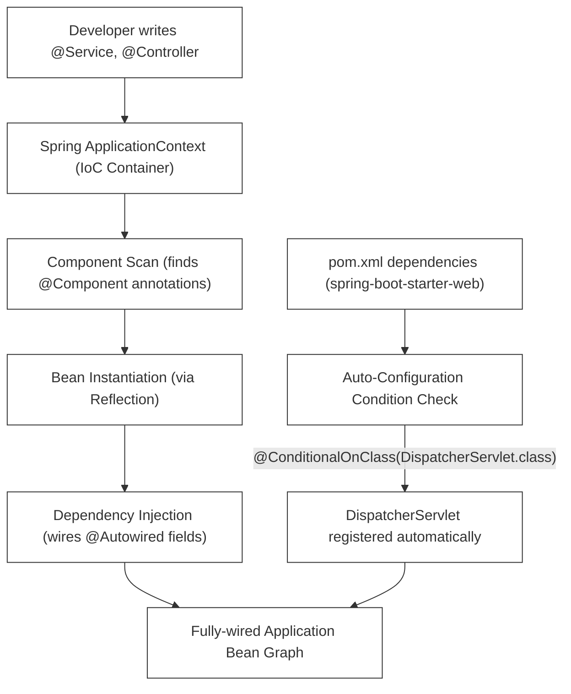
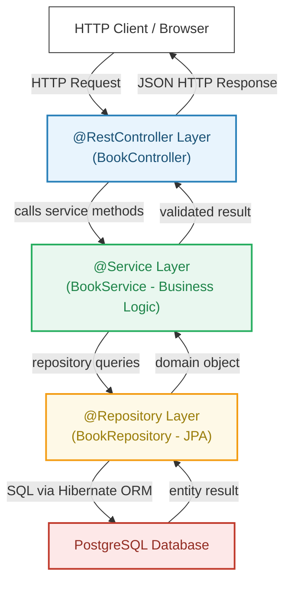

# L-01: Java Spring Boot Essentials (Bookstore REST API)

Spring Boot is the premier corporate framework for building production-grade, highly-scalable, and secure enterprise microservices in Java. This step-by-step study guide walks you through bootstrap setups, database integrations, layered logic design, and test validation.

---

## 🧭 Conceptual Foundation: What Is Spring Boot?

### L1 — What It Is
**Spring Boot** is an opinionated wrapper around the Spring Framework that **auto-configures** most application components based on what dependencies are present on the classpath. Instead of writing hundreds of lines of XML configuration (as the old Spring required), you get a production-grade application server embedded directly in your JAR file.

### L2 — How It Works Internally: Auto-Configuration & IoC

Spring Boot's magic comes from two core mechanisms:

1. **Inversion of Control (IoC) Container**: Rather than your code instantiating its dependencies, the Spring **ApplicationContext** (the IoC Container) creates and manages all "bean" objects. Your classes declare their dependencies; Spring wires them together.

2. **Auto-Configuration**: Spring Boot reads `META-INF/spring/org.springframework.boot.autoconfigure.AutoConfiguration.imports` from each starter JAR. This file lists configuration classes that are applied *conditionally* — if the right class is on the classpath, the configuration activates automatically.

**Real-world analogy**: Spring Boot is like a smart office manager. You hire new team members (add dependencies to `pom.xml`), and the office manager automatically assigns them desks, computers, and assigns them to the right teams — no manual setup required.



---

## 🗺️ The Layered Architecture

Enterprise REST APIs follow a strict **Layered Architecture** pattern. Each layer has a single responsibility and communicates only with the adjacent layer:



| Layer | Responsibility | Spring Annotation |
|---|---|---|
| Controller | HTTP routing, request parsing, response serialization | `@RestController` |
| Service | Business rules, validation, transaction management | `@Service` |
| Repository | Database queries, ORM mapping | `@Repository` |
| Entity/Model | Data structure mapped to DB table | `@Entity` |

---

## 🛠️ Step-by-Step Implementation Guide

---

### Step 1: Project Bootstrapping & Dependencies
To start, configure your Maven build file (`pom.xml`) with the core starters for Web, Data JPA, PostgreSQL, and Validation.

Create `pom.xml` in the root of `languages/l01-spring-boot/starter/`:
```xml
<?xml version="1.0" encoding="UTF-8"?>
<project xmlns="http://maven.apache.org/POM/4.0.0"
         xmlns:xsi="http://www.w3.org/2001/XMLSchema-instance"
         xsi:schemaLocation="http://maven.apache.org/POM/4.0.0 https://maven.apache.org/xsd/maven-4.0.0.xsd">
    <modelVersion>4.0.0</modelVersion>
    
    <parent>
        <groupId>org.springframework.boot</groupId>
        <artifactId>spring-boot-starter-parent</artifactId>
        <version>3.2.5</version>
        <relativePath/> <!-- lookup parent from repository -->
    </parent>
    
    <groupId>org.learning</groupId>
    <artifactId>bookstore-api</artifactId>
    <version>1.0.0</version>
    <name>bookstore-api</name>
    <description>Enterprise Bookstore REST API Laboratory</description>
    
    <properties>
        <java.version>17</java.version>
    </properties>
    
    <dependencies>
        <!-- Core Web starter for REST APIs -->
        <dependency>
            <groupId>org.springframework.boot</groupId>
            <artifactId>spring-boot-starter-web</artifactId>
        </dependency>
        
        <!-- JPA starter using Hibernate ORM -->
        <dependency>
            <groupId>org.springframework.boot</groupId>
            <artifactId>spring-boot-starter-data-jpa</artifactId>
        </dependency>
        
        <!-- Validation starter for JSR-380 input checks -->
        <dependency>
            <groupId>org.springframework.boot</groupId>
            <artifactId>spring-boot-starter-validation</artifactId>
        </dependency>
        
        <!-- PostgreSQL driver -->
        <dependency>
            <groupId>org.postgresql</groupId>
            <artifactId>postgresql</artifactId>
            <scope>runtime</scope>
        </dependency>
        
        <!-- Testing starter (JUnit 5, Mockito, AssertJ, MockMvc) -->
        <dependency>
            <groupId>org.springframework.boot</groupId>
            <artifactId>spring-boot-starter-test</artifactId>
            <scope>test</scope>
        </dependency>
    </dependencies>
    
    <build>
        <plugins>
            <plugin>
                <groupId>org.springframework.boot</groupId>
                <artifactId>spring-boot-maven-plugin</artifactId>
            </plugin>
        </plugins>
    </build>
</project>
```

---

### Step 2: Database Setup & Local Connection
To run PostgreSQL locally and for free, create a `docker-compose.yml` file in your project starter root:

```yaml
version: '3.8'

services:
  postgres:
    image: postgres:15-alpine
    container_name: dpw-bookstore-db
    ports:
      - "5432:5432"
    environment:
      POSTGRES_USER: bookstore_user
      POSTGRES_PASSWORD: bookstore_password
      POSTGRES_DB: bookstore_db
    volumes:
      - pgdata:/var/lib/postgresql/data

volumes:
  pgdata:
```

Now, configure Spring Boot to connect to this database by creating `src/main/resources/application.properties`:

```properties
# Spring Boot DB Configuration
spring.datasource.url=jdbc:postgresql://localhost:5432/bookstore_db
spring.datasource.username=bookstore_user
spring.datasource.password=bookstore_password
spring.datasource.driver-class-name=org.postgresql.Driver

# JPA/Hibernate Configurations
spring.jpa.database-platform=org.hibernate.dialect.PostgreSQLDialect
spring.jpa.hibernate.ddl-auto=update
spring.jpa.show-sql=true
spring.jpa.properties.hibernate.format_sql=true
```
*   `spring.jpa.hibernate.ddl-auto=update`: Automatically updates database schemas to match entity code changes.
*   `spring.jpa.show-sql=true`: Prints SQL commands in the console for analysis.

**What happens under the hood**: Spring Boot reads these properties and auto-configures a `DataSource` bean (HikariCP connection pool by default), a `EntityManagerFactory`, and a `TransactionManager` — all without any manual Java code.

---

### Step 3: Designing the Domain Entity

**L1 — What an Entity Is**: An `@Entity` class is a Java object that is **mapped** to a relational database table. Each instance corresponds to a row. Hibernate (the JPA implementation) generates and executes SQL to persist and retrieve these objects automatically.

**L2 — ORM Lifecycle**: When you call `repository.save(book)`, Hibernate:
1. Checks if the entity is **new** (no ID) → generates an `INSERT` statement.
2. If the entity has an ID and is **managed** (tracked in the current transaction) → generates an `UPDATE` statement.
3. The SQL is sent to the DB via a JDBC connection from the HikariCP pool.

Create `src/main/java/org/learning/bookstore/model/Book.java`:
```java
package org.learning.bookstore.model;

import jakarta.persistence.*;
import jakarta.validation.constraints.*;

@Entity
@Table(name = "books")
public class Book {
    @Id
    @GeneratedValue(strategy = GenerationType.IDENTITY)
    private Long id;

    @NotBlank(message = "Title is required")
    @Size(max = 255, message = "Title cannot exceed 255 characters")
    @Column(nullable = false)
    private String title;

    @NotBlank(message = "ISBN is required")
    @Pattern(regexp = "^(97(8|9))?\\d{9}(\\d|X)$", message = "Invalid ISBN-13 format")
    @Column(unique = true, nullable = false)
    private String isbn;

    @NotNull(message = "Price is required")
    @Min(value = 0, message = "Price cannot be negative")
    @Column(nullable = false)
    private Double price;

    // Standard constructor requirements
    public Book() {}

    public Book(String title, String isbn, Double price) {
        this.title = title;
        this.isbn = isbn;
        this.price = price;
    }

    // Getters and Setters...
    public Long getId() { return id; }
    public void setId(Long id) { this.id = id; }
    public String getTitle() { return title; }
    public void setTitle(String title) { this.title = title; }
    public String getIsbn() { return isbn; }
    public void setIsbn(String isbn) { this.isbn = isbn; }
    public Double getPrice() { return price; }
    public void setPrice(Double price) { this.price = price; }
}
```

**Annotation deep-dive**:
- `@Id` + `@GeneratedValue(IDENTITY)`: Delegates ID generation to the database's auto-increment column. PostgreSQL uses a `SEQUENCE` under the hood.
- `@Column(unique = true)`: Instructs Hibernate to add a `UNIQUE` constraint to the database column DDL.
- `@NotBlank` (Bean Validation): Triggers validation when `@Valid` is used on a controller parameter. Validation runs *before* the method body executes.

---

### Step 4: Writing the JPA Repository
Create an interface extending `JpaRepository` to manage database operations.

**L1 — What JpaRepository Is**: It is a Spring Data interface that provides 30+ CRUD and paging methods out of the box — all without writing a single SQL query.

**L2 — How Derived Queries Work**: Spring Data parses method names like `findByIsbn` using a **method name parsing strategy**. It reads the method name tokens (`findBy`, `Isbn`) and generates a JPQL query at startup: `SELECT b FROM Book b WHERE b.isbn = :isbn`. This happens entirely at application startup, not at query time.

Create `src/main/java/org/learning/bookstore/repository/BookRepository.java`:
```java
package org.learning.bookstore.repository;

import org.learning.bookstore.model.Book;
import org.springframework.data.jpa.repository.JpaRepository;
import org.springframework.stereotype.Repository;
import java.util.Optional;
import java.util.List;

@Repository
public interface BookRepository extends JpaRepository<Book, Long> {
    // Derived query: checks database for duplicates using ISBN
    Optional<Book> findByIsbn(String isbn);

    // Derived query: find all books priced below a threshold
    List<Book> findByPriceLessThan(Double maxPrice);

    // Custom JPQL query for partial title search
    @org.springframework.data.jpa.repository.Query("SELECT b FROM Book b WHERE LOWER(b.title) LIKE LOWER(CONCAT('%', :keyword, '%'))")
    List<Book> searchByTitleKeyword(@org.springframework.data.repository.query.Param("keyword") String keyword);
}
```

---

### Step 5: Implementing Custom Exceptions
When validation or check exceptions occur, we throw specialized class models to represent conflict errors.

Create `src/main/java/org/learning/bookstore/exception/DuplicateIsbnException.java`:
```java
package org.learning.bookstore.exception;

public class DuplicateIsbnException extends RuntimeException {
    public DuplicateIsbnException(String message) {
        super(message);
    }
}
```

Create `src/main/java/org/learning/bookstore/exception/ResourceNotFoundException.java`:
```java
package org.learning.bookstore.exception;

public class ResourceNotFoundException extends RuntimeException {
    public ResourceNotFoundException(String message) {
        super(message);
    }
}
```

**Why RuntimeException?**: Business exceptions extend `RuntimeException` (unchecked) because Spring's `@Transactional` mechanism rolls back transactions automatically only for unchecked exceptions by default. Checked exceptions propagate without triggering rollback.

---

### Step 6: Coding the Service Layer
The service coordinates data transactions and isolates core business logic validations.

**L1 — Why a Service Layer Exists**: Controllers should not contain business logic — they are routing mechanisms. The Service layer enforces business rules (e.g., "you can't have duplicate ISBNs") and manages database transactions. This separation enables unit testing the business logic without spinning up HTTP infrastructure.

**L2 — How `@Transactional` Works**: When Spring sees `@Transactional` on a method, it wraps the method in a proxy. Before the method runs, Spring calls `entityManager.getTransaction().begin()`. After the method completes successfully, it calls `commit()`. If an unchecked exception propagates out, Spring calls `rollback()` automatically.

Create `src/main/java/org/learning/bookstore/service/BookService.java`:
```java
package org.learning.bookstore.service;

import org.learning.bookstore.model.Book;
import org.learning.bookstore.repository.BookRepository;
import org.learning.bookstore.exception.DuplicateIsbnException;
import org.learning.bookstore.exception.ResourceNotFoundException;
import org.springframework.stereotype.Service;
import org.springframework.transaction.annotation.Transactional;
import java.util.List;

@Service
public class BookService {
    private final BookRepository bookRepository;

    // Constructor Injection
    public BookService(BookRepository bookRepository) {
        this.bookRepository = bookRepository;
    }

    @Transactional(readOnly = true)
    public List<Book> getAllBooks() {
        return bookRepository.findAll();
    }

    @Transactional(readOnly = true)
    public Book getBookById(Long id) {
        return bookRepository.findById(id)
            .orElseThrow(() -> new ResourceNotFoundException("Book not found with ID: " + id));
    }

    @Transactional
    public Book createBook(Book book) {
        if (bookRepository.findByIsbn(book.getIsbn()).isPresent()) {
            throw new DuplicateIsbnException("ISBN " + book.getIsbn() + " already exists.");
        }
        return bookRepository.save(book);
    }

    @Transactional
    public Book updateBook(Long id, Book updatedData) {
        Book existing = getBookById(id);
        // Only update ISBN if it changed AND new ISBN doesn't belong to another book
        if (!existing.getIsbn().equals(updatedData.getIsbn()) &&
            bookRepository.findByIsbn(updatedData.getIsbn()).isPresent()) {
            throw new DuplicateIsbnException("ISBN " + updatedData.getIsbn() + " already belongs to another book.");
        }
        existing.setTitle(updatedData.getTitle());
        existing.setIsbn(updatedData.getIsbn());
        existing.setPrice(updatedData.getPrice());
        return bookRepository.save(existing);
    }

    @Transactional
    public void deleteBook(Long id) {
        Book book = getBookById(id); // validates existence first
        bookRepository.delete(book);
    }
}
```

---

### Step 7: Configuring REST Controller Routing
Set up the HTTP communication routes. We validate payloads using `@Valid`.

**HTTP Method Conventions** (REST best practices):
| HTTP Method | Endpoint | Semantics | Response Code |
|---|---|---|---|
| `GET` | `/api/books` | Fetch all books | `200 OK` |
| `GET` | `/api/books/{id}` | Fetch single book | `200 OK` / `404 Not Found` |
| `POST` | `/api/books` | Create new book | `201 Created` |
| `PUT` | `/api/books/{id}` | Replace entire book | `200 OK` |
| `DELETE` | `/api/books/{id}` | Delete book | `204 No Content` |

Create `src/main/java/org/learning/bookstore/controller/BookController.java`:
```java
package org.learning.bookstore.controller;

import jakarta.validation.Valid;
import org.learning.bookstore.model.Book;
import org.learning.bookstore.service.BookService;
import org.springframework.http.HttpStatus;
import org.springframework.http.ResponseEntity;
import org.springframework.web.bind.annotation.*;
import java.util.List;

@RestController
@RequestMapping("/api/books")
public class BookController {
    private final BookService bookService;

    public BookController(BookService bookService) {
        this.bookService = bookService;
    }

    @GetMapping
    public ResponseEntity<List<Book>> getAllBooks() {
        return ResponseEntity.ok(bookService.getAllBooks());
    }

    @GetMapping("/{id}")
    public ResponseEntity<Book> getBookById(@PathVariable Long id) {
        return ResponseEntity.ok(bookService.getBookById(id));
    }

    @PostMapping
    public ResponseEntity<Book> createBook(@Valid @RequestBody Book book) {
        Book created = bookService.createBook(book);
        return ResponseEntity.status(HttpStatus.CREATED).body(created);
    }

    @PutMapping("/{id}")
    public ResponseEntity<Book> updateBook(@PathVariable Long id, @Valid @RequestBody Book book) {
        return ResponseEntity.ok(bookService.updateBook(id, book));
    }

    @DeleteMapping("/{id}")
    public ResponseEntity<Void> deleteBook(@PathVariable Long id) {
        bookService.deleteBook(id);
        return ResponseEntity.noContent().build();
    }
}
```

---

### Step 8: Creating Global Interceptors for Custom Errors
Map our business validation and checking exceptions cleanly into JSON output payloads.

**L1 — What `@ControllerAdvice` Is**: A cross-cutting concern interceptor. It registers exception handler methods that apply globally to ALL controllers in the application — not just one. Without this, exceptions would bubble up as raw 500 errors with Java stack traces exposed to the client.

**L2 — How Spring Routes Exceptions**: When an exception propagates out of a controller method, Spring's `DispatcherServlet` searches for an `@ExceptionHandler` method (in any `@ControllerAdvice` class) that matches the exception type using an inheritance-aware lookup. The most specific match wins.

Create `src/main/java/org/learning/bookstore/exception/GlobalExceptionHandler.java`:
```java
package org.learning.bookstore.exception;

import org.springframework.http.HttpStatus;
import org.springframework.http.ResponseEntity;
import org.springframework.validation.FieldError;
import org.springframework.web.bind.MethodArgumentNotValidException;
import org.springframework.web.bind.annotation.*;
import java.time.LocalDateTime;
import java.util.HashMap;
import java.util.Map;

@ControllerAdvice
public class GlobalExceptionHandler {

    @ExceptionHandler(DuplicateIsbnException.class)
    public ResponseEntity<Object> handleDuplicateIsbn(DuplicateIsbnException ex) {
        Map<String, Object> body = new HashMap<>();
        body.put("timestamp", LocalDateTime.now());
        body.put("status", HttpStatus.CONFLICT.value());
        body.put("error", "Conflict");
        body.put("message", ex.getMessage());
        return new ResponseEntity<>(body, HttpStatus.CONFLICT);
    }

    @ExceptionHandler(ResourceNotFoundException.class)
    public ResponseEntity<Object> handleNotFound(ResourceNotFoundException ex) {
        Map<String, Object> body = new HashMap<>();
        body.put("timestamp", LocalDateTime.now());
        body.put("status", HttpStatus.NOT_FOUND.value());
        body.put("error", "Not Found");
        body.put("message", ex.getMessage());
        return new ResponseEntity<>(body, HttpStatus.NOT_FOUND);
    }

    @ExceptionHandler(MethodArgumentNotValidException.class)
    public ResponseEntity<Object> handleValidation(MethodArgumentNotValidException ex) {
        Map<String, Object> body = new HashMap<>();
        body.put("timestamp", LocalDateTime.now());
        body.put("status", HttpStatus.BAD_REQUEST.value());
        body.put("error", "Validation Failed");

        Map<String, String> errors = new HashMap<>();
        ex.getBindingResult().getAllErrors().forEach((error) -> {
            String fieldName = ((FieldError) error).getField();
            String errorMessage = error.getDefaultMessage();
            errors.put(fieldName, errorMessage);
        });
        body.put("validationErrors", errors);

        return new ResponseEntity<>(body, HttpStatus.BAD_REQUEST);
    }
}
```

---

### Step 9: Writing and Executing the Integration Test Suite
To verify the application end-to-end, write an integration test suite.

**L1 — What MockMvc Does**: `MockMvc` performs HTTP request/response cycles **without** starting a real server. It simulates the full Spring MVC processing pipeline (DispatcherServlet → Controller → Service → etc.) in memory, making tests much faster than real HTTP calls.

**L2 — `@SpringBootTest` vs `@WebMvcTest`**:
- `@SpringBootTest`: Loads the entire ApplicationContext. Slower but tests full stack integration.
- `@WebMvcTest(BookController.class)`: Loads **only** the web layer (controllers + exception handlers). Service is mocked. Faster for unit testing controller logic.

Create `src/test/java/org/learning/bookstore/BookstoreApplicationTests.java`:
```java
package org.learning.bookstore;

import com.fasterxml.jackson.databind.ObjectMapper;
import org.learning.bookstore.model.Book;
import org.learning.bookstore.repository.BookRepository;
import org.junit.jupiter.api.BeforeEach;
import org.junit.jupiter.api.DisplayName;
import org.junit.jupiter.api.Test;
import org.springframework.beans.factory.annotation.Autowired;
import org.springframework.boot.test.autoconfigure.web.servlet.AutoConfigureMockMvc;
import org.springframework.boot.test.context.SpringBootTest;
import org.springframework.http.MediaType;
import org.springframework.test.web.servlet.MockMvc;

import static org.springframework.test.web.servlet.request.MockMvcRequestBuilders.*;
import static org.springframework.test.web.servlet.result.MockMvcResultMatchers.*;

@SpringBootTest
@AutoConfigureMockMvc
public class BookstoreApplicationTests {

    @Autowired
    private MockMvc mockMvc;

    @Autowired
    private BookRepository bookRepository;

    @Autowired
    private ObjectMapper objectMapper;

    @BeforeEach
    void setUp() {
        bookRepository.deleteAll(); // Clear state before each test run
    }

    @Test
    @DisplayName("POST /api/books — should create a book and return 201 Created with body")
    void shouldCreateBookSuccessfully() throws Exception {
        Book book = new Book("Effective Java", "978-0134685991", 45.00);

        mockMvc.perform(post("/api/books")
                .contentType(MediaType.APPLICATION_JSON)
                .content(objectMapper.writeValueAsString(book)))
                .andExpect(status().isCreated())
                .andExpect(jsonPath("$.id").exists())
                .andExpect(jsonPath("$.title").value("Effective Java"));
    }

    @Test
    @DisplayName("POST /api/books — duplicate ISBN should return 409 Conflict with error body")
    void shouldReturnConflictOnDuplicateIsbn() throws Exception {
        Book book1 = new Book("Clean Code", "978-0132350884", 40.00);
        bookRepository.save(book1); // Persist baseline

        Book book2 = new Book("Clean Code (Copy)", "978-0132350884", 42.00);

        mockMvc.perform(post("/api/books")
                .contentType(MediaType.APPLICATION_JSON)
                .content(objectMapper.writeValueAsString(book2)))
                .andExpect(status().isConflict())
                .andExpect(jsonPath("$.error").value("Conflict"))
                .andExpect(jsonPath("$.message").value("ISBN 978-0132350884 already exists."));
    }

    @Test
    @DisplayName("GET /api/books/{id} — unknown ID should return 404 Not Found")
    void shouldReturn404ForUnknownId() throws Exception {
        mockMvc.perform(get("/api/books/999999"))
                .andExpect(status().isNotFound())
                .andExpect(jsonPath("$.error").value("Not Found"));
    }

    @Test
    @DisplayName("POST /api/books — blank title should return 400 with validation errors")
    void shouldRejectBlankTitle() throws Exception {
        Book book = new Book("", "978-0134685991", 45.00);

        mockMvc.perform(post("/api/books")
                .contentType(MediaType.APPLICATION_JSON)
                .content(objectMapper.writeValueAsString(book)))
                .andExpect(status().isBadRequest())
                .andExpect(jsonPath("$.validationErrors.title").exists());
    }

    @Test
    @DisplayName("POST /api/books — negative price should return 400 validation error")
    void shouldRejectNegativePrice() throws Exception {
        Book book = new Book("Valid Title", "978-0134685991", -5.00);

        mockMvc.perform(post("/api/books")
                .contentType(MediaType.APPLICATION_JSON)
                .content(objectMapper.writeValueAsString(book)))
                .andExpect(status().isBadRequest())
                .andExpect(jsonPath("$.validationErrors.price").exists());
    }

    @Test
    @DisplayName("DELETE /api/books/{id} — should remove book and return 204 No Content")
    void shouldDeleteBookSuccessfully() throws Exception {
        Book saved = bookRepository.save(new Book("To Delete", "978-0000000001", 10.00));

        mockMvc.perform(delete("/api/books/" + saved.getId()))
                .andExpect(status().isNoContent());

        mockMvc.perform(get("/api/books/" + saved.getId()))
                .andExpect(status().isNotFound());
    }
}
```

To run this test suite using Maven CLI:
```bash
mvn test
```
This compilation, bootstrapping, and test suite execution verifies that your bookstore application functions as specified!

---

## ⚠️ Common Pitfalls & Anti-Patterns

### Pitfall 1: Returning Entities Directly from Controllers
**Problem**: Exposing JPA entities directly in API responses creates tight coupling and may inadvertently serialize lazy-loaded collections, causing `LazyInitializationException` or infinite recursion with bidirectional relationships.
```java
// ❌ WRONG — entity exposed directly
@GetMapping("/{id}")
public Book getBook(@PathVariable Long id) {
    return bookRepository.findById(id).get();
}

// ✅ CORRECT — use a DTO (Data Transfer Object)
@GetMapping("/{id}")
public BookResponseDto getBook(@PathVariable Long id) {
    Book book = bookService.getBookById(id);
    return new BookResponseDto(book.getId(), book.getTitle(), book.getPrice());
}
```

### Pitfall 2: Missing `@Transactional` on Write Operations
**Problem**: Without `@Transactional`, multiple repository calls in a service method run in separate transactions. If the second call fails, the first call's changes are NOT rolled back — leaving data in an inconsistent state.
```java
// ❌ WRONG — no transaction wrapping both operations
public void transferBook(Long fromId, Long toId) {
    bookRepository.delete(fromId);        // Transaction 1 (committed)
    bookRepository.save(newBook(toId));   // Transaction 2 fails — book is lost!
}

// ✅ CORRECT — both operations in one atomic transaction
@Transactional
public void transferBook(Long fromId, Long toId) {
    bookRepository.delete(fromId);
    bookRepository.save(newBook(toId));
} // If save() throws, delete() is rolled back automatically
```

### Pitfall 3: Using Field Injection Instead of Constructor Injection
```java
// ❌ WRONG — field injection (hides dependencies, untestable)
@Service
public class BookService {
    @Autowired
    private BookRepository bookRepository; // can't mock in plain unit tests
}

// ✅ CORRECT — constructor injection (explicit, testable, immutable)
@Service
public class BookService {
    private final BookRepository bookRepository;

    public BookService(BookRepository bookRepository) {
        this.bookRepository = bookRepository;
    }
}
```

### Pitfall 4: Using `ddl-auto=create-drop` in Production
**Problem**: `spring.jpa.hibernate.ddl-auto=create-drop` **drops all tables** when the application shuts down. Accidentally running this in production destroys all data.
- **Development**: Use `create-drop` or `update`
- **Production**: Use `validate` (only validates schema, no changes) or `none` (use Flyway/Liquibase for migrations)

### Pitfall 5: `N+1 Query Problem`
**Problem**: Fetching a list of 100 books and then accessing a lazy-loaded `@OneToMany` `reviews` collection triggers 100 additional SQL queries.
```java
// ❌ WRONG — N+1 queries
List<Book> books = bookRepository.findAll(); // 1 query
books.forEach(b -> System.out.println(b.getReviews().size())); // 100 more queries!

// ✅ CORRECT — JOIN FETCH in repository
@Query("SELECT b FROM Book b LEFT JOIN FETCH b.reviews")
List<Book> findAllWithReviews();
```

---

## 🔑 Key Takeaways

1. **IoC Container Manages Beans**: Spring creates, configures, and wires all `@Component`/`@Service`/`@Repository` beans. You never call `new` for Spring-managed classes.
2. **Layered Architecture Is Non-Negotiable**: Controller → Service → Repository. Never skip layers or let repositories be called from controllers.
3. **`@Transactional` = Atomicity**: Wrap multi-step DB operations in `@Transactional` to guarantee either all succeed or all roll back.
4. **`@Valid` = Free Input Sanitization**: Annotate controller parameters with `@Valid` and use JSR-380 annotations on entities for automatic validation before business logic runs.
5. **`@ControllerAdvice` Centralizes Error Handling**: One global exception handler maps all business exceptions to clean HTTP responses — no try-catch blocks inside controllers.
6. **MockMvc Tests Are Fast Integration Tests**: They test the full MVC pipeline without an actual HTTP server — the best trade-off between speed and coverage.
7. **Never Expose Entities in API Responses**: Use DTOs to decouple your internal domain model from your public API contract.

## 📚 Further Reading

- [Spring Boot Reference Documentation](https://docs.spring.io/spring-boot/docs/current/reference/html/)
- [Spring Data JPA Documentation](https://docs.spring.io/spring-data/jpa/docs/current/reference/html/)
- [Bean Validation (JSR-380) Guide](https://jakarta.ee/specifications/bean-validation/3.0/)
- [MockMvc Documentation](https://docs.spring.io/spring-framework/docs/current/reference/html/testing.html#spring-mvc-test-framework)
- [Baeldung Spring Boot REST API Tutorial](https://www.baeldung.com/building-a-restful-web-service-with-spring-and-java-based-configuration)
