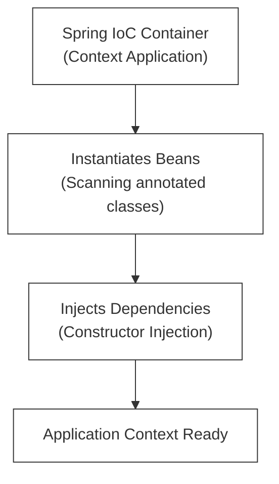

# L-01: Java Spring Boot Essentials (Bookstore REST API)

Spring Boot is the premier corporate framework for building production-grade, highly-scalable, and secure enterprise microservices in Java. In this handbook, you will master the core architectural patterns of Spring Boot—including **Inversion of Control (IoC)**, **Dependency Injection (DI)**, and **Object-Relational Mapping (ORM)**—and design a complete **Bookstore REST API** backed by PostgreSQL.

---

## 1. Core Architecture: IoC & Dependency Injection

At the heart of the Spring Framework is the **Inversion of Control (IoC) Container**. Instead of your classes manually instantiating their own dependent classes (`new HelperClass()`), the framework instantiates, manages, and wires them together at startup. This process is called **Dependency Injection (DI)**.



### The Concept of a "Bean"
A **Bean** is simply an object that is instantiated, assembled, and managed by the Spring IoC Container. You register classes as Beans using class-level annotations:
*   `@Component`: Declares a generic, auto-discoverable component bean.
*   `@Service`: Represents business logic services.
*   `@Repository`: Represents database access components (Spring Data).
*   `@Controller` / `@RestController`: Represents HTTP/REST web controllers.

### Why Constructor Injection is the Gold Standard
While field injection (`@Autowired` directly on fields) is common, **Constructor Injection** is the industry best practice:
```java
// ✅ Clean, Testable, Immutable Constructor Injection
@Service
public class BookService {
    private final BookRepository bookRepository; // Final makes it immutable

    public BookService(BookRepository bookRepository) {
        this.bookRepository = bookRepository;
    }
}
```
*   **The Benefit**: It guarantees that the service cannot be instantiated without its dependencies. It also enables trivial unit testing—you can simply pass in mock objects directly to the constructor in your test cases without spinning up a heavy Spring Context!

---

## 2. The Layered Clean Architecture

To maintain codebases that are easy to reason about and modify, Spring Boot enforces a strict **Layered Architecture**:

```
+-------------------------------------------------------------+
|                     HTTP REQUEST                            |
+------------------------------+------------------------------+
                               |
+------------------------------v------------------------------+
|   CONTROLLER LAYER (@RestController)                       |
|   - Handles HTTP routing, input validation, serialization  |
+------------------------------+------------------------------+
                               |
+------------------------------v------------------------------+
|   SERVICE LAYER (@Service)                                  |
|   - Coordinates business logic, transactions, exceptions    |
+------------------------------+------------------------------+
                               |
+------------------------------v------------------------------+
|   REPOSITORY LAYER (@Repository / JpaRepository)            |
|   - Handles direct SQL queries, CRUD, DB mapping            |
+------------------------------+------------------------------+
                               |
+------------------------------v------------------------------+
|                     POSTGRESQL DATABASE                     |
+-------------------------------------------------------------+
```

---

## 3. Spring Data JPA & Entity Mapping

**Object-Relational Mapping (ORM)** maps Java objects to SQL tables. **Java Persistence API (JPA)** is the specification, and **Hibernate** is the default underlying implementation.

### Mapping a Database Entity
```java
@Entity
@Table(name = "books")
public class Book {
    @Id
    @GeneratedValue(strategy = GenerationType.IDENTITY)
    private Long id;

    @Column(nullable = false)
    private String title;

    @Column(unique = true, nullable = false)
    private String isbn;

    @Column(nullable = false)
    private Double price;
    
    // Constructors, Getters, Setters...
}
```

### Writing a Repository
Spring Data JPA completely eliminates SQL boilerplate. By extending `JpaRepository`, you get full CRUD capabilities automatically:
```java
@Repository
public interface BookRepository extends JpaRepository<Book, Long> {
    // Spring automatically generates this SQL query from the method name!
    Optional<Book> findByIsbn(String isbn);
}
```

---

## 🔧 Hands-on Project: Bookstore REST API

You will build a complete, production-grade REST API for managing a bookstore catalog.

### The API Endpoints Specification

| HTTP Method | Route | Request Body | Status Code | Action |
| :--- | :--- | :--- | :---: | :--- |
| **GET** | `/api/books` | *None* | `200 OK` | Fetch all books |
| **GET** | `/api/books/{id}` | *None* | `200 OK` / `404` | Fetch a single book |
| **POST** | `/api/books` | Book JSON | `201 Created` | Add a new book |
| **PUT** | `/api/books/{id}` | Book JSON | `200 OK` / `404` | Update an existing book |
| **DELETE** | `/api/books/{id}` | *None* | `204 No Content` | Delete a book |

---

## 🔧 TDD Checklist for Your Implementation

Your Spring Boot application must satisfy these test specifications (verified using JUnit 5 and MockMvc):

- [ ] **Specs: REST Controller & Validation**
  - [ ] `POST /api/books` successfully creates a book and returns `201 Created`.
  - [ ] Returns `400 Bad Request` if attempting to create a book with an empty title, negative price, or malformed ISBN.
  - [ ] `GET /api/books/{id}` returns the correct book details.
  - [ ] Returns `404 Not Found` if a book ID does not exist in the database.
- [ ] **Specs: Service Layer & Exceptions**
  - [ ] The service layer must handle checking for duplicate ISBN entries before save.
  - [ ] Throws a custom `DuplicateIsbnException` if an ISBN already exists in the system.
  - [ ] Uses a global `@ControllerAdvice` handler to intercept this exception and return a clean, structured JSON error response to the client:
    ```json
    {
      "error": "Conflict",
      "message": "ISBN 978-0132350884 already exists."
    }
    ```
- [ ] **Specs: Repository & Integration**
  - [ ] Successfully integrates with a local PostgreSQL database configured via `application.properties` / `application.yml`.
  - [ ] Exposes a custom repository finder query (`findByIsbn`).
  - [ ] Integration tests use a real running database (or Testcontainers) to confirm complete round-trip schema operations.
