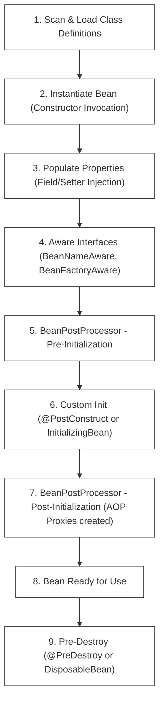

# L-01: Java Spring Boot Essentials (Bookstore REST API)

Spring Boot is the premier corporate framework for building production-grade, highly-scalable, and secure enterprise microservices in Java. This handbook is a deep-dive, comprehensive guide to the inner workings of Spring Boot. You will master the physics of the **Spring Application Context**, the lifecycle of **Beans**, the mechanics of **Dependency Injection (DI)**, and design a fully-tested **Bookstore REST API** backed by PostgreSQL.

---

## 1. Deep-Dive: Spring Boot Core & Context Lifecycles

Understanding what happens when you press "Run" is what separates junior coders from senior engineers.

### A. Annotations Decoded: What is `@SpringBootApplication`?
The entry point of any Spring Boot application is annotated with `@SpringBootApplication`. This is not a single annotation, but a **meta-annotation** composed of three core configurations:

```java
@Target(ElementType.TYPE)
@Retention(RetentionPolicy.RUNTIME)
@Documented
@Inherited
@SpringBootConfiguration      // 1. Declares this class as a source of bean definitions
@EnableAutoConfiguration       // 2. Guesses and configures beans based on classpath dependencies
@ComponentScan                // 3. Scans for annotated component beans in the current package and subpackages
public @interface SpringBootApplication { ... }
```

1.  **`@SpringBootConfiguration`**: A specialized form of `@Configuration` that designates the class as a configuration source. It allows you to declare custom beans using the `@Bean` annotation inside methods.
2.  **`@EnableAutoConfiguration`**: The "magic" engine. It tells Spring Boot to look at the libraries present on your classpath (defined in `pom.xml`). For example, if `postgresql-driver` and `spring-boot-starter-data-jpa` are found, it automatically instantiates and configures a PostgreSQL `DataSource`, `EntityManagerFactory`, and `TransactionManager` without you writing a single line of boilerplate!
3.  **`@ComponentScan`**: Directs Spring to scan the classpath starting from the package containing this class. It looks for classes annotated with `@Component`, `@Service`, `@Repository`, `@RestController`, and `@Configuration`, instantiates them, and registers them as **Beans** in the Application Context.

---

### B. The Application Context & Bean Lifecycle

The **Application Context** is Spring's registry of all active objects (Beans). The lifecycle of a bean goes through a strict sequence managed by the container:



*   **BeanPostProcessors**: These interceptors modify bean instances before and after initialization. For example, Spring uses them to wrap your repository or service beans in **AOP (Aspect-Oriented Programming) Proxies** to automatically manage database transactions (`@Transactional`).
*   **Scopes**: Beans can have different lifecycles:
    *   `Singleton` (Default): Only **one** instance of the bean is created per Application Context. It is shared among all threads.
    *   `Prototype`: A **new** instance is created every time the bean is requested.
    *   `Request` / `Session` (Web apps): A new instance is created per HTTP request or session.

---

## 2. Coding Patterns: Layered Clean Architecture In-Depth

To prevent architectural decay, we partition our code into specialized layers. Here is the concrete, code-level implementation blueprint of each layer:

### A. The Domain Model (Entity)
The **Entity** is a plain Java class mapped directly to a database table row:
```java
package org.dpworld.bookstore.model;

import jakarta.persistence.*;
import jakarta.validation.constraints.*;

@Entity
@Table(name = "books")
public class Book {
    @Id
    @GeneratedValue(strategy = GenerationType.IDENTITY)
    private Long id;

    @NotBlank(message = "Title is required")
    @Size(max = 255, message = "Title cannot exceed 255 characters")
    @Column(nullable = false)
    private String title;

    @NotBlank(message = "ISBN is required")
    @Pattern(regexp = "^(97(8|9))?\\d{9}(\\d|X)$", message = "Invalid ISBN-13 format")
    @Column(unique = true, nullable = false)
    private String isbn;

    @NotNull(message = "Price is required")
    @Min(value = 0, message = "Price cannot be negative")
    @Column(nullable = false)
    private Double price;

    // Constructors, Getters, Setters (Ensure a no-arg constructor is present for JPA!)
    public Book() {}

    public Book(String title, String isbn, Double price) {
        this.title = title;
        this.isbn = isbn;
        this.price = price;
    }

    // Getters and Setters...
}
```

### B. The Repository Layer (JPA Access)
The Repository interface handles direct database communications. By extending `JpaRepository`, Spring automatically implements standard CRUD operations:
```java
package org.dpworld.bookstore.repository;

import org.dpworld.bookstore.model.Book;
import org.springframework.data.jpa.repository.JpaRepository;
import org.springframework.stereotype.Repository;
import java.util.Optional;

@Repository
public interface BookRepository extends JpaRepository<Book, Long> {
    // Dynamic Query Derivation: Spring parses this name and generates:
    // SELECT * FROM books WHERE isbn = ?
    Optional<Book> findByIsbn(String isbn);
}
```

### C. The Service Layer (Business Logic & Transactions)
The Service class implements the business rules and marks operations as transactional:
```java
package org.dpworld.bookstore.service;

import org.dpworld.bookstore.model.Book;
import org.dpworld.bookstore.repository.BookRepository;
import org.dpworld.bookstore.exception.DuplicateIsbnException;
import org.dpworld.bookstore.exception.ResourceNotFoundException;
import org.springframework.stereotype.Service;
import org.springframework.transaction.annotation.Transactional;
import java.util.List;

@Service
public class BookService {
    private final BookRepository bookRepository;

    // Constructor Injection (Enables clean Mockito testing without Spring)
    public BookService(BookRepository bookRepository) {
        this.bookRepository = bookRepository;
    }

    @Transactional(readOnly = true)
    public List<Book> getAllBooks() {
        return bookRepository.findAll();
    }

    @Transactional(readOnly = true)
    public Book getBookById(Long id) {
        return bookRepository.findById(id)
            .orElseThrow(() -> new ResourceNotFoundException("Book not found with ID: " + id));
    }

    @Transactional
    public Book createBook(Book book) {
        if (bookRepository.findByIsbn(book.getIsbn()).isPresent()) {
            throw new DuplicateIsbnException("ISBN " + book.getIsbn() + " already exists.");
        }
        return bookRepository.save(book);
    }
}
```

### D. The Controller Layer (REST Endpoints)
The REST Controller handles serialization/deserialization, input validation, and routes requests to the Service layer:
```java
package org.dpworld.bookstore.controller;

import jakarta.validation.Valid;
import org.dpworld.bookstore.model.Book;
import org.dpworld.bookstore.service.BookService;
import org.springframework.http.HttpStatus;
import org.springframework.http.ResponseEntity;
import org.springframework.web.bind.annotation.*;
import java.util.List;

@RestController
@RequestMapping("/api/books")
public class BookController {
    private final BookService bookService;

    public BookController(BookService bookService) {
        this.bookService = bookService;
    }

    @GetMapping
    public ResponseEntity<List<Book>> getAllBooks() {
        return ResponseEntity.ok(bookService.getAllBooks());
    }

    @GetMapping("/{id}")
    public ResponseEntity<Book> getBookById(@PathVariable Long id) {
        return ResponseEntity.ok(bookService.getBookById(id));
    }

    @PostMapping
    public ResponseEntity<Book> createBook(@Valid @RequestBody Book book) {
        Book created = bookService.createBook(book);
        return ResponseEntity.status(HttpStatus.CREATED).body(created);
    }
}
```

---

## 3. Global Exception Handling & Validation Errors

When an validation constraint fails, or when a service throws an exception (like `DuplicateIsbnException`), we must return a clean, structured JSON format instead of a raw stack trace.

```java
package org.dpworld.bookstore.exception;

import org.springframework.http.HttpStatus;
import org.springframework.http.ResponseEntity;
import org.springframework.validation.FieldError;
import org.springframework.web.bind.MethodArgumentNotValidException;
import org.springframework.web.bind.annotation.*;
import java.time.LocalDateTime;
import java.util.HashMap;
import java.util.Map;

@ControllerAdvice // Intercepts exceptions thrown across all REST controllers
public class GlobalExceptionHandler {

    @ExceptionHandler(DuplicateIsbnException.class)
    public ResponseEntity<Object> handleDuplicateIsbn(DuplicateIsbnException ex) {
        Map<String, Object> body = new HashMap<>();
        body.put("timestamp", LocalDateTime.now());
        body.put("status", HttpStatus.CONFLICT.value());
        body.put("error", "Conflict");
        body.put("message", ex.getMessage());
        return new ResponseEntity<>(body, HttpStatus.CONFLICT);
    }

    @ExceptionHandler(MethodArgumentNotValidException.class)
    public ResponseEntity<Object> handleValidationExceptions(MethodArgumentNotValidException ex) {
        Map<String, Object> body = new HashMap<>();
        body.put("timestamp", LocalDateTime.now());
        body.put("status", HttpStatus.BAD_REQUEST.value());
        body.put("error", "Validation Failed");

        Map<String, String> errors = new HashMap<>();
        ex.getBindingResult().getAllErrors().forEach((error) -> {
            String fieldName = ((FieldError) error).getField();
            String errorMessage = error.getDefaultMessage();
            errors.put(fieldName, errorMessage);
        });
        body.put("validationErrors", errors);

        return new ResponseEntity<>(body, HttpStatus.BAD_REQUEST);
    }
}
```

---

## 🔧 TDD MockMvc Testing Specification

To practice strict TDD, your test suite must execute requests through the web layer using `MockMvc` without instantiating a real server port. Here is an example of an integration test structure you will find in your starter project:

```java
package org.dpworld.bookstore;

import com.fasterxml.jackson.databind.ObjectMapper;
import org.dpworld.bookstore.model.Book;
import org.dpworld.bookstore.repository.BookRepository;
import org.junit.jupiter.api.BeforeEach;
import org.junit.jupiter.api.Test;
import org.springframework.beans.factory.annotation.Autowired;
import org.springframework.boot.test.autoconfigure.web.servlet.AutoConfigureMockMvc;
import org.springframework.boot.test.context.SpringBootTest;
import org.springframework.http.MediaType;
import org.springframework.test.web.servlet.MockMvc;

import static org.springframework.test.web.servlet.request.MockMvcRequestBuilders.*;
import static org.springframework.test.web.servlet.result.MockMvcResultMatchers.*;

@SpringBootTest
@AutoConfigureMockMvc
public class BookstoreApplicationTests {

    @Autowired
    private MockMvc mockMvc;

    @Autowired
    private BookRepository bookRepository;

    @Autowired
    private ObjectMapper objectMapper; // Serializes objects to JSON

    @BeforeEach
    void setUp() {
        bookRepository.deleteAll(); // Start each test in a clean database state
    }

    @Test
    void shouldCreateBookSuccessfully() throws Exception {
        Book book = new Book("Effective Java", "978-0134685991", 45.00);

        mockMvc.perform(post("/api/books")
                .contentType(MediaType.APPLICATION_JSON)
                .content(objectMapper.writeValueAsString(book)))
                .andExpect(status().isCreated())
                .andExpect(jsonPath("$.id").exists())
                .andExpect(jsonPath("$.title").value("Effective Java"))
                .andExpect(jsonPath("$.isbn").value("978-0134685991"));
    }

    @Test
    void shouldReturnBadRequestOnInvalidInput() throws Exception {
        Book invalidBook = new Book("", "invalid-isbn", -10.00); // Empty title, bad ISBN, negative price

        mockMvc.perform(post("/api/books")
                .contentType(MediaType.APPLICATION_JSON)
                .content(objectMapper.writeValueAsString(invalidBook)))
                .andExpect(status().isBadRequest())
                .andExpect(jsonPath("$.validationErrors.title").exists())
                .andExpect(jsonPath("$.validationErrors.isbn").exists())
                .andExpect(jsonPath("$.validationErrors.price").exists());
    }
}
```

---

## 🚀 Post-Lab Reflection Questions
- [x] What is the difference between a Bean and a standard Java Object?
- [x] How does `@EnableAutoConfiguration` dynamically configure your application data layer?
- [x] Why should field injection (`@Autowired` on variables) be avoided in favor of Constructor Injection?
- [x] What is the exact sequence of the Bean Lifecycle from scanning to destruction?
