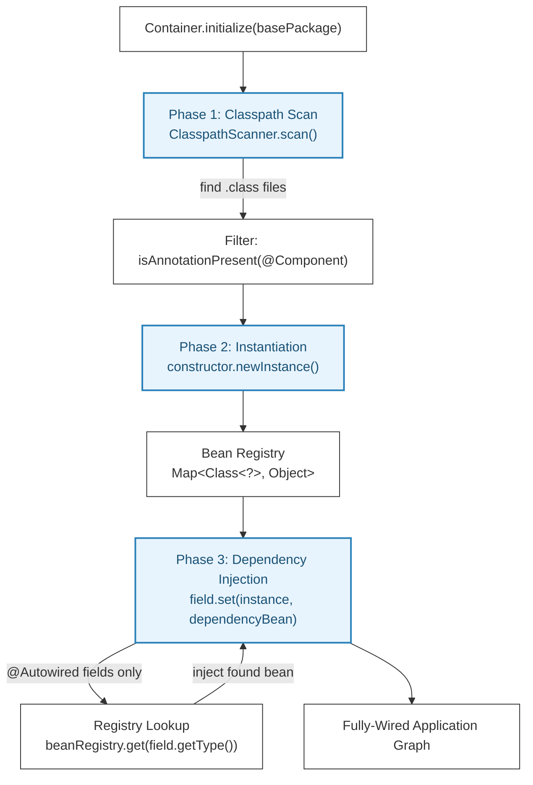
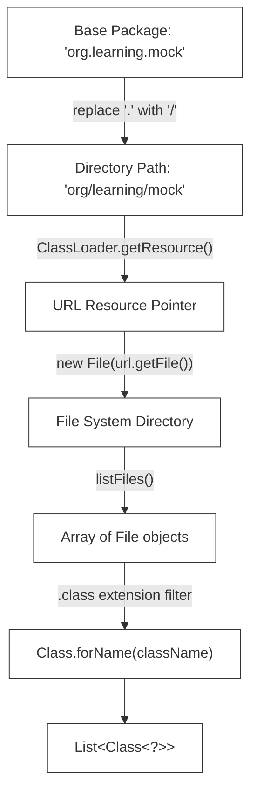
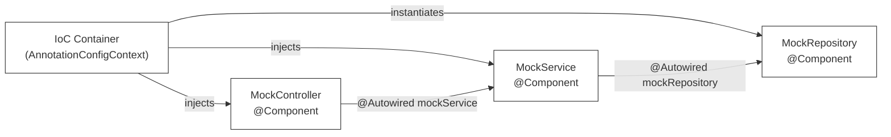

# L-02: Custom Dependency Injection Container (Mini-Spring IoC)

Spring Boot makes building applications feel like magic. Annotating a class with `@Component` and another field with `@Autowired` makes dependencies appear out of thin air. This step-by-step study guide walks you through building your own **Inversion of Control (IoC) & Dependency Injection (DI) Container** from scratch in raw Java using the **Reflection API**.

---

## 🧭 Conceptual Foundation: Inversion of Control

### L1 — What Is IoC?
**Inversion of Control** is a design principle where the control of object creation and lifecycle is *inverted* — instead of your code creating its dependencies (`new Repository()`), an external framework (the "Container") creates them and hands them to your code.

**Before IoC (traditional coupling):**
```java
public class OrderService {
    // OrderService directly controls how its dependency is created
    private OrderRepository repository = new OrderRepository(); // tightly coupled!

    public void placeOrder(Order order) {
        repository.save(order);
    }
}
```

**After IoC (loose coupling via DI):**
```java
public class OrderService {
    private final OrderRepository repository;

    // The Container provides the dependency — OrderService has no idea how it's created
    public OrderService(OrderRepository repository) {
        this.repository = repository;
    }
}
```

**Real-world analogy**: IoC is like ordering a pizza delivery. In the old model, you go to the store, buy ingredients, and cook it yourself (you control creation). With IoC, you call a delivery service (the Container). You specify *what* you want (a dependency), and the container figures out *how* to fulfill it.

### L2 — How Dependency Injection Works Internally

There are three types of DI:
1. **Constructor Injection**: Dependencies passed via constructor (recommended — enforces required dependencies)
2. **Field Injection**: Dependencies set directly on private fields via Reflection (Spring's `@Autowired`)
3. **Setter Injection**: Dependencies provided through setter methods



---

## 🔬 The Java Reflection API

### L1 — What It Is
The **Reflection API** (`java.lang.reflect`) allows Java code to **inspect and manipulate** classes, fields, methods, and constructors at **runtime** — even private members. This is the mechanism that makes all annotation-driven frameworks possible.

### L2 — How It Works
When you compile a Java class, the JVM stores its metadata (class name, superclasses, interfaces, field names and types, method signatures, annotations) in the `.class` binary. The Reflection API reads this metadata at runtime through the `Class<?>` object.

```java
// Example: inspecting a class at runtime
Class<?> clazz = OrderService.class;

// Check if @Component annotation is present
boolean isComponent = clazz.isAnnotationPresent(Component.class); // true/false

// Get all declared fields (including private ones)
Field[] fields = clazz.getDeclaredFields();
for (Field field : fields) {
    if (field.isAnnotationPresent(Autowired.class)) {
        field.setAccessible(true); // bypass private access modifier
        field.set(targetInstance, resolvedDependency); // inject!
    }
}

// Invoke a private no-arg constructor
Constructor<?> constructor = clazz.getDeclaredConstructor();
constructor.setAccessible(true);
Object instance = constructor.newInstance(); // creates the object
```

**Security note**: `setAccessible(true)` is a powerful but dangerous capability. In production frameworks, it is used under a controlled context. Java 17+ module system (`--add-opens`) restricts its use across module boundaries.

---

## 🛠️ Step-by-Step Implementation Guide

---

### Step 1: Project Setup (Maven Configuration)
Create a raw Java project structure without Spring dependencies. We only need the JUnit test starters.

Create `pom.xml` in the root of `languages/l02-custom-di/starter/`:
```xml
<?xml version="1.0" encoding="UTF-8"?>
<project xmlns="http://maven.apache.org/POM/4.0.0"
         xmlns:xsi="http://www.w3.org/2001/XMLSchema-instance"
         xsi:schemaLocation="http://maven.apache.org/POM/4.0.0 https://maven.apache.org/xsd/maven-4.0.0.xsd">
    <modelVersion>4.0.0</modelVersion>
    
    <groupId>org.learning</groupId>
    <artifactId>mini-ioc-container</artifactId>
    <version>1.0.0</version>
    <name>mini-ioc-container</name>
    <description>Custom Dependency Injection Laboratory</description>
    
    <properties>
        <java.version>17</java.version>
    </properties>
    
    <dependencies>
        <!-- JUnit 5 Engine for unit testing our container -->
        <dependency>
            <groupId>org.junit.jupiter</groupId>
            <artifactId>junit-jupiter-api</artifactId>
            <version>5.10.2</version>
            <scope>test</scope>
        </dependency>
        <dependency>
            <groupId>org.junit.jupiter</groupId>
            <artifactId>junit-jupiter-engine</artifactId>
            <version>5.10.2</version>
            <scope>test</scope>
        </dependency>
    </dependencies>
</project>
```

---

### Step 2: Defining Custom Annotations
Create the custom annotations that instruct our scanner which classes to manage and which fields to inject.

**How Annotations Work**: An annotation is a marker. With `@Retention(RetentionPolicy.RUNTIME)`, the marker is preserved in the compiled `.class` binary and can be read at runtime using Reflection. Without RUNTIME retention, the annotation is erased after compilation.

Create `src/main/java/org/learning/ioc/annotation/Component.java`:
```java
package org.learning.ioc.annotation;

import java.lang.annotation.ElementType;
import java.lang.annotation.Retention;
import java.lang.annotation.RetentionPolicy;
import java.lang.annotation.Target;

@Target(ElementType.TYPE) // Applicable only to classes, interfaces, or enums
@Retention(RetentionPolicy.RUNTIME) // Preserved in binary compilation and inspectable at runtime
public @interface Component {
}
```

Create `src/main/java/org/learning/ioc/annotation/Autowired.java`:
```java
package org.learning.ioc.annotation;

import java.lang.annotation.ElementType;
import java.lang.annotation.Retention;
import java.lang.annotation.RetentionPolicy;
import java.lang.annotation.Target;

@Target(ElementType.FIELD) // Applicable only to object variables/fields
@Retention(RetentionPolicy.RUNTIME)
public @interface Autowired {
}
```

**Annotation retention comparison:**

| Retention | Visible to compiler | Visible in `.class` | Visible at runtime |
|---|---|---|---|
| `SOURCE` | ✅ | ❌ | ❌ |
| `CLASS` (default) | ✅ | ✅ | ❌ |
| `RUNTIME` | ✅ | ✅ | ✅ ← Required for DI |

---

### Step 3: Defining the Context Lookup Interface
The context interface provides a standard retrieval lookup.

Create `src/main/java/org/learning/ioc/context/ApplicationContext.java`:
```java
package org.learning.ioc.context;

public interface ApplicationContext {
    /**
     * Look up and return the fully-wired singleton instance of a managed bean class.
     */
    <T> T getBean(Class<T> beanClass);
}
```

**Why an interface?**: This decouples client code from the concrete implementation. A client only knows about `ApplicationContext`, not `AnnotationConfigContext`. Tomorrow you could add an `XmlConfigContext` implementation without changing any client code — the Open/Closed Principle in action.

---

### Step 4: Implementing the Classpath Directory Scanner
The scanner traverses the local compiled directory, transforms package mappings into directory resources, and loads `.class` definitions dynamically.

**L2 — How the Scanner Maps Packages to File System Paths**:
- Package `org.learning.app` translates to directory `org/learning/app/`
- The JVM's `ClassLoader` exposes this directory via `getResource("org/learning/app")`
- We recursively walk the directory tree, loading each `.class` file dynamically



Create `src/main/java/org/learning/ioc/scanner/ClasspathScanner.java`:
```java
package org.learning.ioc.scanner;

import java.io.File;
import java.net.URL;
import java.util.ArrayList;
import java.util.List;

public class ClasspathScanner {

    public static List<Class<?>> scan(String basePackage) {
        List<Class<?>> classes = new ArrayList<>();
        try {
            // Transform package dot notation: "org.learning.app" -> "org/learning/app"
            String path = basePackage.replace('.', '/');
            ClassLoader classLoader = Thread.currentThread().getContextClassLoader();
            URL resource = classLoader.getResource(path);
            
            if (resource == null) {
                return classes; // Return empty if package resource path doesn't exist
            }
            
            File directory = new File(resource.getFile());
            if (directory.exists() && directory.isDirectory()) {
                scanDirectory(directory, basePackage, classes);
            }
        } catch (Exception e) {
            throw new RuntimeException("Failed to scan classpath directory", e);
        }
        return classes;
    }

    private static void scanDirectory(File directory, String packageName, List<Class<?>> classes) throws ClassNotFoundException {
        File[] files = directory.listFiles();
        if (files == null) return;

        for (File file : files) {
            if (file.isDirectory()) {
                // Recursively scan subfolders, updating package name
                scanDirectory(file, packageName + "." + file.getName(), classes);
            } else if (file.getName().endsWith(".class")) {
                // Remove ".class" suffix to isolate name
                String className = packageName + "." + file.getName().substring(0, file.getName().length() - 6);
                classes.add(Class.forName(className)); // Load class dynamically
            }
        }
    }
}
```

---

### Step 5: Implementing Instantiation & Bean Registry
The core context class processes scanned definitions, checks for `@Component`, and calls no-argument constructors via reflection.

**The Singleton Pattern**: Each `@Component` class is instantiated exactly once. The same instance is returned every time `getBean(SomeClass.class)` is called. This is how Spring's default scope (`@Scope("singleton")`) works.

Create `src/main/java/org/learning/ioc/context/AnnotationConfigContext.java`:
```java
package org.learning.ioc.context;

import org.learning.ioc.annotation.Component;
import org.learning.ioc.annotation.Autowired;
import org.learning.ioc.scanner.ClasspathScanner;
import java.lang.reflect.Field;
import java.util.*;

public class AnnotationConfigContext implements ApplicationContext {
    // Bean registry maps the Class type to the instantiated Singleton Object
    private final Map<Class<?>, Object> beanRegistry = new HashMap<>();

    public AnnotationConfigContext(String basePackage) {
        initialize(basePackage);
    }

    private void initialize(String basePackage) {
        try {
            // Step 1: Scan package for compiled class files
            List<Class<?>> scannedClasses = ClasspathScanner.scan(basePackage);

            // Step 2: Instantiation (Create Singleton instances for all Component beans)
            for (Class<?> clazz : scannedClasses) {
                if (clazz.isAnnotationPresent(Component.class)) {
                    // Call default private or public constructor
                    var constructor = clazz.getDeclaredConstructor();
                    constructor.setAccessible(true); // Bypass visibility locks
                    Object instance = constructor.newInstance();
                    beanRegistry.put(clazz, instance);
                }
            }

            // Step 3: Injection (Wire dependencies together)
            for (Object beanInstance : beanRegistry.values()) {
                injectDependencies(beanInstance);
            }
        } catch (Exception e) {
            throw new RuntimeException("DI Context Initialization Failed", e);
        }
    }
```

---

### Step 6: Implementing Dependency Injection (Wiring)
Add the low-level wiring loop inside `AnnotationConfigContext.java`. It checks fields for `@Autowired`, gets active beans from the registry, overrides private visibility locks, and injects them.

Continue editing `src/main/java/org/learning/ioc/context/AnnotationConfigContext.java`:
```java
    private void injectDependencies(Object targetInstance) throws IllegalAccessException {
        Class<?> clazz = targetInstance.getClass();
        Field[] fields = clazz.getDeclaredFields();

        for (Field field : fields) {
            if (field.isAnnotationPresent(Autowired.class)) {
                Class<?> dependencyType = field.getType();
                Object dependencyInstance = beanRegistry.get(dependencyType);

                // Crash early if the requested dependency bean is missing from the container
                if (dependencyInstance == null) {
                    throw new NoSuchElementException("Unsatisfied dependency: no bean of type " 
                        + dependencyType.getName() + " registered for " + clazz.getName());
                }

                field.setAccessible(true); // Overrides private variables lock
                field.set(targetInstance, dependencyInstance); // Dynamically set value!
            }
        }
    }

    @Override
    @SuppressWarnings("unchecked")
    public <T> T getBean(Class<T> beanClass) {
        T bean = (T) beanRegistry.get(beanClass);
        if (bean == null) {
            throw new NoSuchElementException("No bean managed for type: " + beanClass.getName());
        }
        return bean;
    }
}
```

---

### Step 7: Creating a Mock Application to Verify Integration
Create a mock application structure to verify our container.

Create `src/main/java/org/learning/ioc/mock/MockRepository.java`:
```java
package org.learning.ioc.mock;

import org.learning.ioc.annotation.Component;

@Component
public class MockRepository {
    public String findData() {
        return "Real Database Records";
    }
}
```

Create `src/main/java/org/learning/ioc/mock/MockService.java`:
```java
package org.learning.ioc.mock;

import org.learning.ioc.annotation.Component;
import org.learning.ioc.annotation.Autowired;

@Component
public class MockService {
    @Autowired
    private MockRepository mockRepository; // Wired automatically

    public String execute() {
        return "Processed: " + mockRepository.findData();
    }
}
```

Create `src/main/java/org/learning/ioc/mock/MockController.java`:
```java
package org.learning.ioc.mock;

import org.learning.ioc.annotation.Component;
import org.learning.ioc.annotation.Autowired;

@Component
public class MockController {
    @Autowired
    private MockService mockService; // Wired automatically

    public String handleRequest() {
        return "Response: " + mockService.execute();
    }
}
```

**Multi-tier dependency resolution visualization:**


---

### Step 8: Writing and Executing the Verification Test Suite
Create a comprehensive test suite to verify the container's behavior.

Create `src/test/java/org/learning/ioc/ContainerTests.java`:
```java
package org.learning.ioc;

import org.learning.ioc.context.AnnotationConfigContext;
import org.learning.ioc.context.ApplicationContext;
import org.learning.ioc.mock.MockController;
import org.learning.ioc.mock.MockService;
import org.junit.jupiter.api.Test;
import org.junit.jupiter.api.DisplayName;
import java.util.NoSuchElementException;

import static org.junit.jupiter.api.Assertions.*;

public class ContainerTests {

    @Test
    @DisplayName("Container should scan package and instantiate all @Component beans")
    void shouldScanAndInstantiateBeans() {
        ApplicationContext context = new AnnotationConfigContext("org.learning.ioc.mock");
        
        MockController controller = context.getBean(MockController.class);
        assertNotNull(controller, "Bean should be instantiated and registered");
    }

    @Test
    @DisplayName("Container should return identical instance for repeated getBean() calls (Singleton)")
    void shouldRegisterBeansAsSingletons() {
        ApplicationContext context = new AnnotationConfigContext("org.learning.ioc.mock");
        
        MockService service1 = context.getBean(MockService.class);
        MockService service2 = context.getBean(MockService.class);
        
        assertSame(service1, service2, "Beans must be registered as singletons");
    }

    @Test
    @DisplayName("Container should wire multi-tier dependency chains end-to-end")
    void shouldInjectDependenciesRecursively() {
        ApplicationContext context = new AnnotationConfigContext("org.learning.ioc.mock");
        
        MockController controller = context.getBean(MockController.class);
        
        String result = controller.handleRequest();
        assertEquals("Response: Processed: Real Database Records", result, 
            "Dependencies must be fully wired and functional");
    }

    @Test
    @DisplayName("getBean() for unregistered type should throw NoSuchElementException")
    void shouldThrowOnMissingBeanRequest() {
        ApplicationContext context = new AnnotationConfigContext("org.learning.ioc.mock");
        
        assertThrows(NoSuchElementException.class, () -> {
            context.getBean(String.class); // Request an unmanaged type
        });
    }

    @Test
    @DisplayName("Scanning an empty or non-existent package should return an empty container")
    void shouldHandleEmptyPackageGracefully() {
        // Should not throw — returns an empty context with no beans registered
        ApplicationContext context = new AnnotationConfigContext("org.learning.ioc.nonexistent");
        assertThrows(NoSuchElementException.class, () -> context.getBean(MockService.class));
    }

    @Test
    @DisplayName("Multiple context initializations of same package should produce independent bean instances")
    void shouldProduceIndependentContextInstances() {
        ApplicationContext ctx1 = new AnnotationConfigContext("org.learning.ioc.mock");
        ApplicationContext ctx2 = new AnnotationConfigContext("org.learning.ioc.mock");

        MockService svc1 = ctx1.getBean(MockService.class);
        MockService svc2 = ctx2.getBean(MockService.class);

        // Same class but different contexts → different instances
        assertNotSame(svc1, svc2, "Different contexts should produce independent bean instances");
    }
}
```

To run this custom DI test suite:
```bash
mvn test
```
This execution validates that the classpath scanner dynamically loads classes, allocates singleton mappings, overrides private field access, and resolves multi-tier dependency chains successfully under TDD rules!

---

## ⚠️ Common Pitfalls & Anti-Patterns

### Pitfall 1: Circular Dependencies
**Problem**: If Bean A depends on Bean B, and Bean B depends on Bean A, our simple container will stack overflow or fail to inject (since A can't be created without B, and B can't be created without A).

```
MockServiceA @Autowired -> MockServiceB
MockServiceB @Autowired -> MockServiceA   // CIRCULAR!
```

**Real Spring Solution**: Spring detects circular constructor injection and throws `BeanCurrentlyInCreationException`. For field/setter injection, Spring uses a **three-phase** initialization: eagerly register a partial "bean factory" reference to break the cycle.

**Our Container Solution**: Add cycle detection using a `Set<Class<?>> inProgress` during the injection phase. If a class appears in the set while processing, throw `CircularDependencyException`.

### Pitfall 2: Interface-Typed Fields
**Problem**: Our container looks up beans by *exact class type*. If a field is declared as an interface:
```java
@Autowired
private DataRepository repository; // DataRepository is an interface!
```
The registry lookup `beanRegistry.get(DataRepository.class)` will return `null` because the bean is stored under its concrete implementation class `InMemoryDataRepository`.

**Solution**: Iterate all registered beans and check if they implement the requested interface using `dependencyType.isAssignableFrom(candidateClass)`.

### Pitfall 3: Not Registering Beans for All Their Interfaces
```java
// ❌ WRONG — only registers under MockRepository.class
beanRegistry.put(clazz, instance);

// ✅ BETTER — also register under any implemented interfaces
beanRegistry.put(clazz, instance);
for (Class<?> iface : clazz.getInterfaces()) {
    beanRegistry.put(iface, instance);
}
```

### Pitfall 4: Not Handling Superclass Fields
**Problem**: `getDeclaredFields()` only returns fields declared **directly** on the class. Fields inherited from a superclass are not returned.
```java
// ❌ WRONG — misses inherited @Autowired fields
Field[] fields = clazz.getDeclaredFields();

// ✅ CORRECT — walk up the inheritance hierarchy
Class<?> current = clazz;
while (current != null && current != Object.class) {
    for (Field field : current.getDeclaredFields()) {
        // process field
    }
    current = current.getSuperclass();
}
```

---

## 🔑 Key Takeaways

1. **IoC Decouples Creation from Use**: Classes no longer instantiate their own dependencies. This enables swapping implementations without modifying callers — the foundation of testability.
2. **Reflection Is the Engine of Annotation Frameworks**: `Class.getDeclaredFields()`, `field.setAccessible(true)`, and `constructor.newInstance()` are the three core Reflection operations that power all modern Java frameworks.
3. **Annotations Need `RUNTIME` Retention**: Without `@Retention(RetentionPolicy.RUNTIME)`, annotations are invisible at runtime and your scanner will find nothing.
4. **Singleton Scope = One Instance Per Container**: Store all beans in a `Map<Class<?>, Object>` and return the same instance for every `getBean()` call on the same class.
5. **The Two-Phase Approach Prevents Injection Order Bugs**: First instantiate ALL beans (Phase 1), THEN inject all dependencies (Phase 2). This ensures every bean exists in the registry before any injection attempts to look it up.
6. **Circular Dependencies Are a Design Problem**: If A needs B and B needs A, extract the shared responsibility into a third component C that both A and B depend on.

## 📚 Further Reading

- [Java Reflection API Official Tutorial](https://docs.oracle.com/javase/tutorial/reflect/)
- [Spring Framework IoC Container Internals](https://docs.spring.io/spring-framework/docs/current/reference/html/core.html#beans)
- [Martin Fowler - Inversion of Control Containers and the Dependency Injection Pattern](https://martinfowler.com/articles/injection.html)
- [A Philosophy of Software Design (John Ousterhout)](https://www.goodreads.com/book/show/39996759-a-philosophy-of-software-design) — Deep Modules concept
