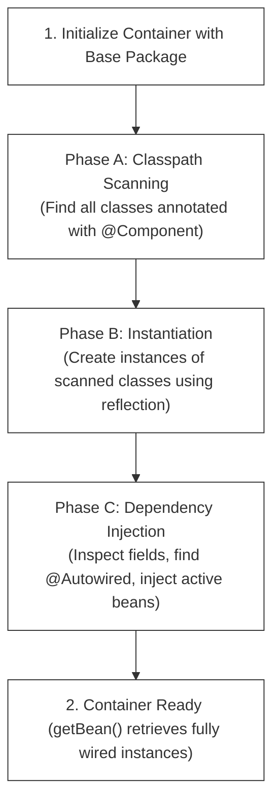

# L-02: Custom Dependency Injection Container (Mini-Spring IoC)

Spring Boot makes building applications feel like magic. Annotating a class with `@Component` and another field with `@Autowired` makes dependencies appear out of thin air. In this advanced hands-on lab, you will write a fully functional **Dependency Injection (DI) & Inversion of Control (IoC) Container** from scratch in raw Java using the **Reflection API**. 

By building this container, you will completely demystify the internal physics of the Spring Framework, mastering how classpaths are scanned, how annotations are read, and how objects are instantiated and wired dynamically at runtime.

---

## 1. The Core Architecture of an IoC Container

An Inversion of Control container manages the lifecycles, configurations, and dependency resolution of application components. The operation of our custom `ApplicationContext` goes through three strict phases during initialization:



*   **Phase A: Classpath Scanning**: The container is initialized with a base package name (e.g. `org.dpworld.app`). It scans the local filesystem, finds all compiled class files under that package directory, loads them dynamically, and checks if they are marked with our custom `@Component` annotation.
*   **Phase B: Instantiation**: For every scanned class, the container invokes its constructor using reflection and registers the resulting object (the "Bean") inside an in-memory map: `Map<Class<?>, Object> beanRegistry`.
*   **Phase C: Dependency Injection (Wiring)**: The container inspects the fields of every registered bean. If a field is annotated with `@Autowired`, it looks up the corresponding instance from the `beanRegistry` and injects it directly into the field.

---

## 2. Java Reflection API Fundamentals

To write this container, you must master the **Java Reflection API** (`java.lang.reflect`). Reflection allows a program to inspect and manipulate its own structures (classes, fields, methods, constructors) dynamically at runtime.

### A. Dynamic Class Loading
To convert a string filepath into an inspectable Java Class object:
```java
Class<?> clazz = Class.forName("org.dpworld.app.service.BookService");
```

### B. Inspecting Annotations
You can inspect if a class or field is marked with a specific annotation:
```java
if (clazz.isAnnotationPresent(Component.class)) {
    System.out.println(clazz.getSimpleName() + " is marked as a Component!");
}
```

### C. Dynamic Instantiation
To create an instance of a class dynamically using its default, no-argument constructor:
```java
Constructor<?> constructor = clazz.getDeclaredConstructor();
constructor.setAccessible(true); // Allows instantiating private/protected constructors!
Object instance = constructor.newInstance();
```

### D. Dynamic Field Manipulation (Wiring)
To inject a dependency into a field, even if that field is declared as `private`:
```java
Field field = clazz.getDeclaredField("bookRepository");
field.setAccessible(true); // bypasses private visibility locks!

// Inject 'repositoryInstance' into 'serviceInstance'
field.set(serviceInstance, repositoryInstance);
```

---

## 3. Designing Our Mini-Spring: The Code Blueprint

We will design our custom container with five distinct components:

```
src/main/java/org/dpworld/ioc/
├── annotation/
│   ├── Component.java       // Custom class annotation
│   └── Autowired.java       // Custom field annotation
├── context/
│   ├── ApplicationContext.java      // Interface
│   └── AnnotationConfigContext.java // Core Engine implementation
└── scanner/
    └── ClasspathScanner.java        // Local directory class discoverer
```

---

### A. Custom Annotations Setup
Our annotations must be discoverable at **runtime**, so we declare them with a `RUNTIME` retention policy:

```java
package org.dpworld.ioc.annotation;

import java.lang.annotation.*;

@Target(ElementType.TYPE) // Can only be applied to Classes
@Retention(RetentionPolicy.RUNTIME) // Must be preserved at runtime
public @interface Component {
}
```

```java
package org.dpworld.ioc.annotation;

import java.lang.annotation.*;

@Target(ElementType.FIELD) // Can only be applied to Fields
@Retention(RetentionPolicy.RUNTIME)
public @interface Autowired {
}
```

---

### B. The ApplicationContext Interface
This defines the public API of our container:
```java
package org.dpworld.ioc.context;

public interface ApplicationContext {
    /**
     * Retrieves the fully-wired active bean instance managed by the container.
     */
    <T> T getBean(Class<T> beanClass);
}
```

---

### C. The Core Container Engine (`AnnotationConfigContext`)
Here is the core logic that orchestrates the three execution phases:
```java
package org.dpworld.ioc.context;

import org.dpworld.ioc.annotation.Component;
import org.dpworld.ioc.annotation.Autowired;
import org.dpworld.ioc.scanner.ClasspathScanner;
import java.lang.reflect.Field;
import java.util.*;

public class AnnotationConfigContext implements ApplicationContext {
    // Our bean registry maps Class types to active Object instances
    private final Map<Class<?>, Object> beanRegistry = new HashMap<>();

    public AnnotationConfigContext(String basePackage) {
        initialize(basePackage);
    }

    private void initialize(String basePackage) {
        try {
            // Phase A: Classpath scanning
            List<Class<?>> scannedClasses = ClasspathScanner.scan(basePackage);

            // Phase B: Instantiation
            for (Class<?> clazz : scannedClasses) {
                if (clazz.isAnnotationPresent(Component.class)) {
                    Object instance = clazz.getDeclaredConstructor().newInstance();
                    beanRegistry.put(clazz, instance);
                }
            }

            // Phase C: Dependency Injection (Wiring)
            for (Object beanInstance : beanRegistry.values()) {
                injectDependencies(beanInstance);
            }

        } catch (Exception e) {
            throw new RuntimeException("Failed to initialize Dependency Injection Context", e);
        }
    }

    private void injectDependencies(Object targetInstance) throws IllegalAccessException {
        Class<?> clazz = targetInstance.getClass();
        Field[] fields = clazz.getDeclaredFields();

        for (Field field : fields) {
            if (field.isAnnotationPresent(Autowired.class)) {
                Class<?> dependencyType = field.getType();
                Object dependencyInstance = beanRegistry.get(dependencyType);

                if (dependencyInstance == null) {
                    throw new RuntimeException("No active bean found of type: " + dependencyType.getName());
                }

                field.setAccessible(true);
                field.set(targetInstance, dependencyInstance); // Dynamically set the private field!
            }
        }
    }

    @Override
    @SuppressWarnings("unchecked")
    public <T> T getBean(Class<T> beanClass) {
        T bean = (T) beanRegistry.get(beanClass);
        if (bean == null) {
            throw new NoSuchElementException("No bean registered for type: " + beanClass.getName());
        }
        return bean;
    }
}
```

---

## 4. Classpath Scanner Internals

Discovering class files on the filesystem from a Java package name requires navigating directories. Your `ClasspathScanner` utility must perform the following transformations:

```
Package name: "org.dpworld.app" 
  ==> Convert to Folder Path: "org/dpworld/app"
  ==> Resolve absolute URL on your computer: "file:///D:/DP World/target/classes/org/dpworld/app"
  ==> Scan files for ".class" extensions: "BookService.class"
  ==> Reconstruct Fully Qualified Class Name: "org.dpworld.app.service.BookService"
  ==> Load class definition: Class.forName(...)
```

---

## 🔧 TDD Checklist for Your Implementation

To verify that your custom DI container operates with absolute correctness, your JUnit 5 test suite must satisfy these specific behaviors:

- [ ] **Specs: Annotation Recognition**
  - [ ] Scans packages and accurately instantiates classes marked with `@Component`.
  - [ ] Ensures classes NOT marked with `@Component` are completely ignored and never instantiated.
- [ ] **Specs: Bean Registry Retrieval**
  - [ ] `getBean(Class<T>)` returns the correct registered singleton bean instance.
  - [ ] Requesting the same bean class twice returns the **exact same** singleton object reference (`assertSame()`).
  - [ ] Throws a `NoSuchElementException` if requesting a class that is not managed as a bean.
- [ ] **Specs: Dependency Wiring**
  - [ ] Successfully wires dependencies into fields annotated with `@Autowired`.
  - [ ] Verifies that private fields are successfully injected with their active bean instances.
  - [ ] Successfully executes multi-tier dependency wiring chains (e.g., `Controller` depends on `Service` which depends on `Repository` — all must be fully wired!).
- [ ] **Specs: Failure Handling**
  - [ ] Throws a meaningful exception at startup if a class requests an `@Autowired` dependency type that is not registered as a `@Component` in the context (Unsatisfied Dependency).
  - [ ] Gracefully handles empty packages without throwing crash exceptions.
