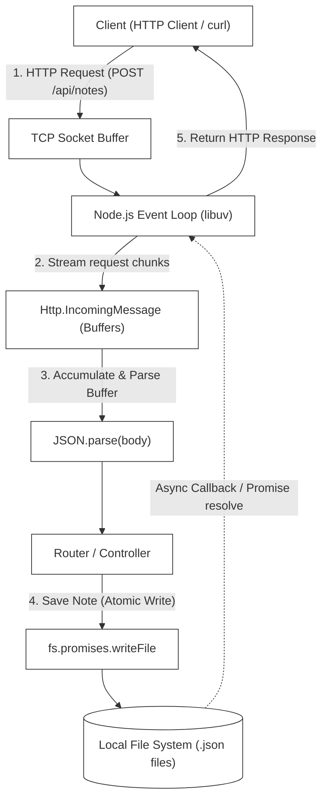

# L-03: File-based Notes API (Node.js Core)

Welcome to the Node.js Core Laboratory! Node.js revolutionized server-side development by bringing JavaScript out of the browser and equipping it with a high-performance, non-blocking I/O event model. 

In this laboratory, you will bypass high-level web frameworks like Express or Fastify to build a raw, robust, file-persisted **Notes API** from scratch using only Node.js core modules (`http`, `fs`, `path`, `url`). 

---

## 🗺️ Architectural Blueprint & Data Flow

At the center of Node.js is the **Event Loop**, a single-threaded runtime engine that delegates blocking tasks (like disk reads/writes and network routing) to the system kernel or background threads via `libuv`.



---

## 🔬 Core Learning Objectives

### 1. The Node.js Event Loop & Non-Blocking I/O
Understand how a single-threaded JavaScript process handles millions of concurrent requests. Master the microtask queue (`process.nextTick`, Promises) and macrotask phases of the `libuv` event loop:
- **Timers Phase**: Executes callbacks scheduled by `setTimeout()` and `setInterval()`.
- **Pending Callbacks Phase**: Executes I/O callbacks deferred from previous iterations.
- **Poll Phase**: Retrieves new I/O events; executes I/O-related callbacks.
- **Check Phase**: Executes `setImmediate()` callbacks.
- **Close Callbacks Phase**: Executes close handlers (e.g., `socket.on('close')`).

### 2. Stream & Buffer Manipulation
HTTP request bodies do not arrive in one piece. They arrive as a stream of raw binary **Buffers**. You will learn to:
- Listen to stream chunk events (`req.on('data')`).
- Buffer and merge binary chunks safely (`Buffer.concat()`).
- Handle stream completion (`req.on('end')`) and stream aborts/errors (`req.on('error')`).

### 3. Asynchronous Thread Safety & Atomic File Operations
When multiple clients attempt to write to or modify files concurrently:
- **Race conditions** can corrupt data if one write overrides another.
- **File locking** or **Atomic writes** (writing to a temporary file first, then performing a fast rename) are critical for preventing data corruption in file-based storage systems.

---

## 📂 Laboratory Directory Structure

You will develop the Notes API in the `/starter` workspace with the following layout:

```
languages/l03-nodejs/
├── README.md (This Handbook)
└── starter/
    ├── package.json (Project metadata & scripts)
    ├── tsconfig.json (TypeScript configurations)
    ├── src/
    │   ├── index.ts (HTTP Server & Routing)
    │   └── noteService.ts (Notes Filesystem Storage Service)
    └── test/
        └── notes.test.ts (Vitest Integration & Unit Tests)
```

---

## 🛠️ Step-by-Step Implementation Guide

### Phase 1: Initialize the Project Skeletons
Set up your typescript, package dependencies, and testing configurations under the `starter` directory.

#### `starter/package.json`
```json
{
  "name": "nodejs-core-notes-api",
  "version": "1.0.0",
  "description": "File-based Notes API using Raw Node.js Core Modules",
  "main": "src/index.ts",
  "type": "module",
  "scripts": {
    "dev": "tsx watch src/index.ts",
    "test": "vitest run",
    "test:watch": "vitest"
  },
  "devDependencies": {
    "@types/node": "^20.11.0",
    "tsx": "^4.7.1",
    "typescript": "^5.3.3",
    "vitest": "^1.2.1"
  }
}
```

#### `starter/tsconfig.json`
```json
{
  "compilerOptions": {
    "target": "ES2022",
    "module": "NodeNext",
    "moduleResolution": "NodeNext",
    "esModuleInterop": true,
    "strict": true,
    "skipLibCheck": true,
    "forceConsistentCasingInFileNames": true,
    "outDir": "./dist"
  },
  "include": ["src/**/*", "test/**/*"]
}
```

---

### Phase 2: Design the Note Service (`noteService.ts`)
The `NoteService` handles saving notes as single JSON files in a dedicated storage directory. It must ensure that I/O operations are fully asynchronous and safe against file corruptions.

- **Storage Location**: Create and use a dynamic local folder, e.g., `./data/`.
- **Note Model**:
  ```typescript
  export interface Note {
    id: string;
    title: string;
    content: string;
    createdAt: string;
  }
  ```

#### Core Methods to Implement:
1.  **`getAllNotes(): Promise<Note[]>`**:
    - Scans the directory using `fs.promises.readdir`.
    - Reads and parses each `.json` file asynchronously using `fs.promises.readFile`.
    - Returns a list sorted by `createdAt` descending.
2.  **`getNoteById(id: string): Promise<Note | null>`**:
    - Reads `./data/${id}.json`. Handles `ENOENT` (file not found) gracefully by returning `null`.
3.  **`createNote(title: string, content: string): Promise<Note>`**:
    - Generates a unique `id` (e.g. using `crypto.randomUUID()`).
    - Performs an **Atomic Write**:
      1. Write the JSON string to a temporary file `./data/${id}.tmp`.
      2. Atomically rename `./data/${id}.tmp` to `./data/${id}.json` using `fs.promises.rename`.
4.  **`deleteNote(id: string): Promise<boolean>`**:
    - Unlinks the file using `fs.promises.unlink`. Returns `true` on success, `false` if the file did not exist.

---

### Phase 3: The HTTP Routing Engine (`index.ts`)
Create the raw HTTP server using `http.createServer`. It must handle:
- **Routing Table**:
  - `GET /api/notes` - Fetch all notes
  - `GET /api/notes/:id` - Fetch single note by ID
  - `POST /api/notes` - Create a new note
  - `DELETE /api/notes/:id` - Delete a note
- **Incoming Buffer Aggregation**:
  To capture request payloads (e.g., in `POST /api/notes`), chunk chunks on `req.on('data')` and combine them into a single string during the `req.on('end')` trigger.
- **Error Boundaries**:
  - Catch malformed JSON payloads gracefully (respond with `400 Bad Request`).
  - Return `404 Not Found` for routes that don't match or notes that do not exist.
  - Wrap routing logic in a global `try-catch` to avoid process crashes. Return `500 Internal Server Error`.

---

## 🧪 The Verification Suite (`test/notes.test.ts`)

To ensure clean TDD implementation, the tests must be written to verify behavior, not implementation details.

```typescript
import { describe, it, expect, beforeEach, afterEach } from 'vitest';
import http from 'http';
import fs from 'fs/promises';
import path from 'path';
import { NoteService } from '../src/noteService.js';

const DATA_DIR = path.resolve('./data');

describe('Notes System Integration Tests', () => {
  beforeEach(async () => {
    // Ensure clean state: delete and recreate data directory
    await fs.rm(DATA_DIR, { recursive: true, force: true });
    await fs.mkdir(DATA_DIR, { recursive: true });
  });

  afterEach(async () => {
    await fs.rm(DATA_DIR, { recursive: true, force: true });
  });

  it('should create and retrieve notes successfully', async () => {
    const service = new NoteService();
    const note = await service.createNote('Hello World', 'This is my first note');
    
    expect(note.id).toBeDefined();
    expect(note.title).toBe('Hello World');
    expect(note.content).toBe('This is my first note');

    const retrieved = await service.getNoteById(note.id);
    expect(retrieved).not.toBeNull();
    expect(retrieved?.title).toBe('Hello World');
  });

  it('should return null for non-existent notes', async () => {
    const service = new NoteService();
    const retrieved = await service.getNoteById('invalid-id');
    expect(retrieved).toBeNull();
  });

  it('should list all notes ordered by date descending', async () => {
    const service = new NoteService();
    const n1 = await service.createNote('First', 'Content');
    // Force a small delay to separate timestamps
    await new Promise((r) => setTimeout(r, 10));
    const n2 = await service.createNote('Second', 'Content');

    const list = await service.getAllNotes();
    expect(list.length).toBe(2);
    expect(list[0].id).toBe(n2.id); // Descending order
    expect(list[1].id).toBe(n1.id);
  });
});
```

---

## 🚀 Advanced Challenges (For Elite Engineers)
Want to level up your Node.js understanding? Try implementing these features:

1.  **Request Timeout Middleware**:
    If a client takes too long to upload a payload (e.g. Slowloris attack), terminate the connection after 5 seconds of inactivity.
2.  **Streaming Files instead of JSON.parse**:
    If you need to return massive files, stream them chunk-by-chunk to the client using `fs.createReadStream` and piping it directly to `res`.
3.  **Cross-Origin Resource Sharing (CORS)**:
    Implement CORS pre-flight pre-processing (`OPTIONS` method) returning appropriate access headers so that browser clients can access your API.
