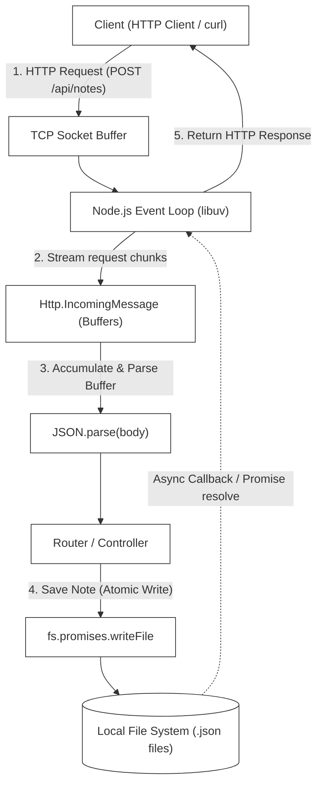
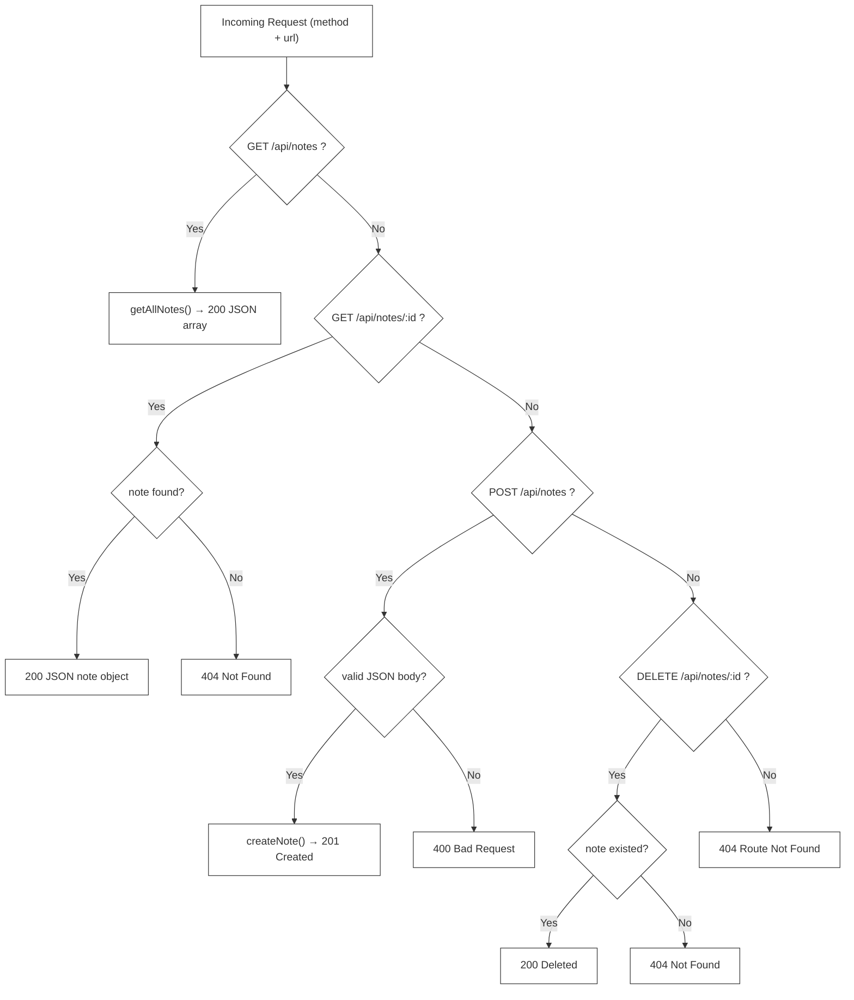

# L-03: File-based Notes API (Node.js Core)

Welcome to the Node.js Core Laboratory! Node.js revolutionized server-side development by bringing JavaScript out of the browser and equipping it with a high-performance, non-blocking I/O event model. 

In this laboratory, you will bypass high-level web frameworks like Express or Fastify to build a raw, robust, file-persisted **Notes API** from scratch using only Node.js core modules (`http`, `fs`, `path`, `url`). 

---

## 🗺️ Architectural Blueprint & Data Flow

At the center of Node.js is the **Event Loop**, a single-threaded runtime engine that delegates blocking tasks (like disk reads/writes and network routing) to the system kernel or background threads via `libuv`.



---

## 🔬 Core Learning Objectives

### 1. The Node.js Event Loop & Non-Blocking I/O

**L1 — What It Is**: Node.js runs JavaScript in a single thread. To avoid blocking this thread on slow operations (disk reads, network calls), it uses an **asynchronous, non-blocking I/O model**. When a blocking operation is requested, Node.js delegates it to `libuv` (a C library that interfaces with the OS kernel's async I/O facilities) and immediately moves on to process other events.

**L2 — Event Loop Phases**: The event loop cycles through multiple phases, each with its own queue of callbacks to execute:

```mermaid
graph LR
    classDef default fill:#ffffff,stroke:#333333,stroke-width:1px,color:#333333;
    classDef phase fill:#e8f4fd,stroke:#2980b9,stroke-width:2px,color:#1a5276;
    classDef micro fill:#e9f7ef,stroke:#27ae60,stroke-width:2px,color:#1e8449;

    Timer["Timers Phase<br>setTimeout, setInterval"]:::phase
    Pending["Pending I/O Callbacks<br>(deferred from last tick)"]:::phase
    Idle["Idle / Prepare<br>(internal use)"]:::phase
    Poll["Poll Phase<br>(retrieve new I/O events)"]:::phase
    Check["Check Phase<br>setImmediate()"]:::phase
    Close["Close Callbacks<br>socket.on('close')"]:::phase
    Micro["Microtask Queue<br>Promise.then, process.nextTick"]:::micro

    Timer --> Pending --> Idle --> Poll --> Check --> Close --> Timer
    Micro -->|"drain BEFORE each phase"| Timer
```



Understanding the Event Loop is critical when ordering async operations:
```typescript
// Priority order: process.nextTick > Promise.then > setImmediate > setTimeout
process.nextTick(() => console.log('1: nextTick'));
Promise.resolve().then(() => console.log('2: Promise'));
setImmediate(() => console.log('3: setImmediate'));
setTimeout(() => console.log('4: setTimeout'), 0);
console.log('0: Synchronous code');
// Output order: 0, 1, 2, 3, 4
```

Understand how a single-threaded JavaScript process handles millions of concurrent requests. Master the microtask queue (`process.nextTick`, Promises) and macrotask phases of the `libuv` event loop:
- **Timers Phase**: Executes callbacks scheduled by `setTimeout()` and `setInterval()`.
- **Pending Callbacks Phase**: Executes I/O callbacks deferred from previous iterations.
- **Poll Phase**: Retrieves new I/O events; executes I/O-related callbacks.
- **Check Phase**: Executes `setImmediate()` callbacks.
- **Close Callbacks Phase**: Executes close handlers (e.g., `socket.on('close')`).

### 2. Stream & Buffer Manipulation

**L1 — What They Are**: HTTP request bodies do not arrive in one piece. They arrive as a stream of raw binary **Buffers**. A `Buffer` is a fixed-size chunk of memory allocated outside the V8 heap, used for raw binary data.

**L2 — How Streams Work**: Node.js `http.IncomingMessage` (the `req` object) is a **Readable Stream**. Data arrives in chunks and is emitted via events:

```typescript
// Raw buffer accumulation pattern
const chunks: Buffer[] = [];

req.on('data', (chunk: Buffer) => {
    chunks.push(chunk);             // collect raw Buffer chunks
});

req.on('end', () => {
    // Buffer.concat merges all chunks into one Buffer
    const rawBody = Buffer.concat(chunks).toString('utf8');
    const parsed = JSON.parse(rawBody);
    // proceed with parsed data
});

req.on('error', (err) => {
    // Handle stream errors (connection reset, etc.)
    res.writeHead(400);
    res.end(JSON.stringify({ error: 'Stream error: ' + err.message }));
});
```

You will learn to:
- Listen to stream chunk events (`req.on('data')`).
- Buffer and merge binary chunks safely (`Buffer.concat()`).
- Handle stream completion (`req.on('end')`) and stream aborts/errors (`req.on('error')`).

### 3. Asynchronous Thread Safety & Atomic File Operations

**L1 — The Race Condition Problem**: When multiple clients attempt to write to or modify files concurrently, a **race condition** can occur:
```
Client A: reads notes.json → [note1, note2]
Client B: reads notes.json → [note1, note2]
Client A: writes [note1, note2, noteA] → file saved ✅
Client B: writes [note1, note2, noteB] → overwrites Client A's write! noteA is LOST ❌
```

**L2 — The Atomic Write Solution**: Write to a temporary file, then rename:
```typescript
// Step 1: Write to temp file (may fail midway — partially written)
await fs.promises.writeFile(`${id}.tmp`, JSON.stringify(note));

// Step 2: Rename is an atomic OS operation — it either fully succeeds or fails
// The file system rename() syscall is guaranteed to be atomic on POSIX systems
await fs.promises.rename(`${id}.tmp`, `${id}.json`);
// Now the file either has the complete new content or the old content — never a partial state
```

**Why rename is atomic**: On Linux/macOS, `rename()` is a POSIX system call guaranteed by the OS to be atomic. The directory entry is updated in a single operation. On Windows, this requires `MoveFileEx` with `MOVEFILE_REPLACE_EXISTING`.

---

## 📂 Laboratory Directory Structure

You will develop the Notes API in the `/starter` workspace with the following layout:

```
languages/l03-nodejs/
├── README.md (This Handbook)
└── starter/
    ├── package.json (Project metadata & scripts)
    ├── tsconfig.json (TypeScript configurations)
    ├── src/
    │   ├── index.ts (HTTP Server & Routing)
    │   └── noteService.ts (Notes Filesystem Storage Service)
    └── test/
        └── notes.test.ts (Vitest Integration & Unit Tests)
```

---

## 🛠️ Step-by-Step Implementation Guide

### Phase 1: Initialize the Project Skeletons
Set up your typescript, package dependencies, and testing configurations under the `starter` directory.

#### `starter/package.json`
```json
{
  "name": "nodejs-core-notes-api",
  "version": "1.0.0",
  "description": "File-based Notes API using Raw Node.js Core Modules",
  "main": "src/index.ts",
  "type": "module",
  "scripts": {
    "dev": "tsx watch src/index.ts",
    "test": "vitest run",
    "test:watch": "vitest"
  },
  "devDependencies": {
    "@types/node": "^20.11.0",
    "tsx": "^4.7.1",
    "typescript": "^5.3.3",
    "vitest": "^1.2.1"
  }
}
```

#### `starter/tsconfig.json`
```json
{
  "compilerOptions": {
    "target": "ES2022",
    "module": "NodeNext",
    "moduleResolution": "NodeNext",
    "esModuleInterop": true,
    "strict": true,
    "skipLibCheck": true,
    "forceConsistentCasingInFileNames": true,
    "outDir": "./dist"
  },
  "include": ["src/**/*", "test/**/*"]
}
```

---

### Phase 2: Design the Note Service (`noteService.ts`)
The `NoteService` handles saving notes as single JSON files in a dedicated storage directory. It must ensure that I/O operations are fully asynchronous and safe against file corruptions.

- **Storage Location**: Create and use a dynamic local folder, e.g., `./data/`.
- **Note Model**:
  ```typescript
  export interface Note {
    id: string;
    title: string;
    content: string;
    createdAt: string;
  }
  ```

#### Core Methods to Implement:
1.  **`getAllNotes(): Promise<Note[]>`**:
    - Scans the directory using `fs.promises.readdir`.
    - Reads and parses each `.json` file asynchronously using `fs.promises.readFile`.
    - Returns a list sorted by `createdAt` descending.
2.  **`getNoteById(id: string): Promise<Note | null>`**:
    - Reads `./data/${id}.json`. Handles `ENOENT` (file not found) gracefully by returning `null`.
3.  **`createNote(title: string, content: string): Promise<Note>`**:
    - Generates a unique `id` (e.g. using `crypto.randomUUID()`).
    - Performs an **Atomic Write**:
      1. Write the JSON string to a temporary file `./data/${id}.tmp`.
      2. Atomically rename `./data/${id}.tmp` to `./data/${id}.json` using `fs.promises.rename`.
4.  **`deleteNote(id: string): Promise<boolean>`**:
    - Unlinks the file using `fs.promises.unlink`. Returns `true` on success, `false` if the file did not exist.

---

### Phase 3: The HTTP Routing Engine (`index.ts`)
Create the raw HTTP server using `http.createServer`. It must handle:
- **Routing Table**:
  - `GET /api/notes` - Fetch all notes
  - `GET /api/notes/:id` - Fetch single note by ID
  - `POST /api/notes` - Create a new note
  - `DELETE /api/notes/:id` - Delete a note
- **Incoming Buffer Aggregation**:
  To capture request payloads (e.g., in `POST /api/notes`), chunk chunks on `req.on('data')` and combine them into a single string during the `req.on('end')` trigger.
- **Error Boundaries**:
  - Catch malformed JSON payloads gracefully (respond with `400 Bad Request`).
  - Return `404 Not Found` for routes that don't match or notes that do not exist.
  - Wrap routing logic in a global `try-catch` to avoid process crashes. Return `500 Internal Server Error`.

**Routing logic illustration:**


---

## 🧪 The Verification Suite (`test/notes.test.ts`)

To ensure clean TDD implementation, the tests must be written to verify behavior, not implementation details.

```typescript
import { describe, it, expect, beforeEach, afterEach } from 'vitest';
import http from 'http';
import fs from 'fs/promises';
import path from 'path';
import { NoteService } from '../src/noteService.js';

const DATA_DIR = path.resolve('./data');

describe('Notes System Integration Tests', () => {
  beforeEach(async () => {
    // Ensure clean state: delete and recreate data directory
    await fs.rm(DATA_DIR, { recursive: true, force: true });
    await fs.mkdir(DATA_DIR, { recursive: true });
  });

  afterEach(async () => {
    await fs.rm(DATA_DIR, { recursive: true, force: true });
  });

  it('should create and retrieve notes successfully', async () => {
    const service = new NoteService();
    const note = await service.createNote('Hello World', 'This is my first note');
    
    expect(note.id).toBeDefined();
    expect(note.title).toBe('Hello World');
    expect(note.content).toBe('This is my first note');

    const retrieved = await service.getNoteById(note.id);
    expect(retrieved).not.toBeNull();
    expect(retrieved?.title).toBe('Hello World');
  });

  it('should return null for non-existent notes', async () => {
    const service = new NoteService();
    const retrieved = await service.getNoteById('invalid-id');
    expect(retrieved).toBeNull();
  });

  it('should list all notes ordered by date descending', async () => {
    const service = new NoteService();
    const n1 = await service.createNote('First', 'Content');
    // Force a small delay to separate timestamps
    await new Promise((r) => setTimeout(r, 10));
    const n2 = await service.createNote('Second', 'Content');

    const list = await service.getAllNotes();
    expect(list.length).toBe(2);
    expect(list[0].id).toBe(n2.id); // Descending order
    expect(list[1].id).toBe(n1.id);
  });
});
```

---

## 🚀 Advanced Challenges (For Elite Engineers)
Want to level up your Node.js understanding? Try implementing these features:

1.  **Request Timeout Middleware**:
    If a client takes too long to upload a payload (e.g. Slowloris attack), terminate the connection after 5 seconds of inactivity.
2.  **Streaming Files instead of JSON.parse**:
    If you need to return massive files, stream them chunk-by-chunk to the client using `fs.createReadStream` and piping it directly to `res`.
3.  **Cross-Origin Resource Sharing (CORS)**:
    Implement CORS pre-flight pre-processing (`OPTIONS` method) returning appropriate access headers so that browser clients can access your API.

---

## ⚠️ Common Pitfalls & Anti-Patterns

### Pitfall 1: Blocking the Event Loop with Synchronous FS Operations
```typescript
// ❌ WRONG — fs.readFileSync blocks the ENTIRE Node.js process
// While reading, NO other request can be processed!
const data = fs.readFileSync('./data/note.json', 'utf8');

// ✅ CORRECT — fs.promises is non-blocking; event loop continues
const data = await fs.promises.readFile('./data/note.json', 'utf8');
```

### Pitfall 2: Not Handling `ENOENT` Errors Explicitly
```typescript
// ❌ WRONG — throws unhandled error if file doesn't exist
const data = await fs.promises.readFile('./data/missing.json', 'utf8');

// ✅ CORRECT — check error code explicitly
try {
  const data = await fs.promises.readFile('./data/missing.json', 'utf8');
  return JSON.parse(data);
} catch (err: any) {
  if (err.code === 'ENOENT') return null; // graceful not-found
  throw err; // re-throw unexpected errors
}
```

### Pitfall 3: Missing `await` on Async File Operations
```typescript
// ❌ WRONG — the unlink is not awaited; response is sent before deletion completes
async function deleteNote(id: string) {
  fs.promises.unlink(`./data/${id}.json`); // fire-and-forget BUG!
  return true; // lies to the caller
}

// ✅ CORRECT — always await async operations
async function deleteNote(id: string) {
  await fs.promises.unlink(`./data/${id}.json`);
  return true;
}
```

### Pitfall 4: Not Handling `req.on('error')` in POST Handlers
A slow or aborted client POST can leave the stream in an error state. If unhandled, Node.js emits an `uncaughtException` and crashes the process:
```typescript
req.on('error', (err) => {
    console.error('Request stream error:', err);
    res.writeHead(400);
    res.end(JSON.stringify({ error: 'Request stream aborted' }));
});
```

### Pitfall 5: Using `JSON.parse` Without Try-Catch on User Input
```typescript
// ❌ WRONG — malformed JSON from client crashes the handler
const body = JSON.parse(rawBody);

// ✅ CORRECT — always guard user-supplied JSON
try {
  const body = JSON.parse(rawBody);
  // proceed
} catch {
  res.writeHead(400);
  res.end(JSON.stringify({ error: 'Invalid JSON body' }));
  return;
}
```

---

## 🔑 Key Takeaways

1. **Event Loop = Concurrency Without Threads**: Node.js handles thousands of simultaneous requests on one thread by delegating I/O to the OS and continuing execution. Never block this thread with synchronous operations.
2. **`fs.promises` Over `fs` Callbacks**: Always use the `fs/promises` module (`fs.promises.readFile`, etc.) with `async/await` for clean, readable async code. The callback-based `fs.readFile` API is legacy.
3. **Atomic Writes Prevent Data Corruption**: Write to `.tmp` then rename. The rename syscall is atomic — the file is either the old version or the new version, never half-written.
4. **Buffers Are Raw Memory**: HTTP request bodies are streams of `Buffer` objects. Always `Buffer.concat()` all chunks before parsing with `JSON.parse` — a single chunk may be truncated.
5. **Always Handle Stream Events**: Register `req.on('data')`, `req.on('end')`, and `req.on('error')` for every POST/PUT request body.
6. **`ENOENT` Is Normal**: "File not found" is an expected outcome, not an exception worth crashing over. Check `err.code === 'ENOENT'` and return a graceful response.
7. **A Single Global `try-catch` Is Your Last Defense**: Wrap your routing switch in a top-level `try-catch` to prevent any unexpected error from crashing the server with an unhandled rejection.

## 📚 Further Reading

- [Node.js Event Loop Explained](https://nodejs.org/en/docs/guides/event-loop-timers-and-nexttick)
- [Node.js `fs` Module Reference](https://nodejs.org/api/fs.html)
- [Understanding Streams in Node.js](https://nodejs.org/api/stream.html)
- [Atomic File Operations Explained](https://rcrowley.org/2010/01/06/things-unix-can-do-atomically.html)
- [Vitest Documentation](https://vitest.dev/guide/)
