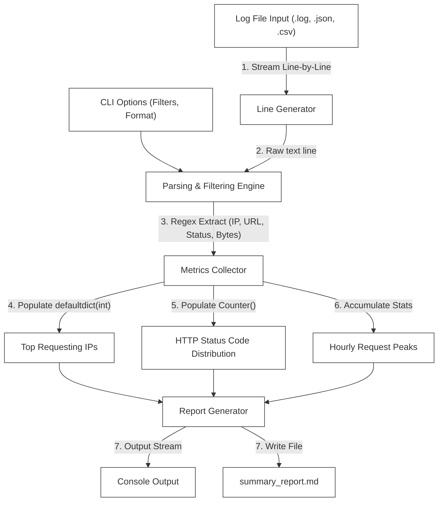
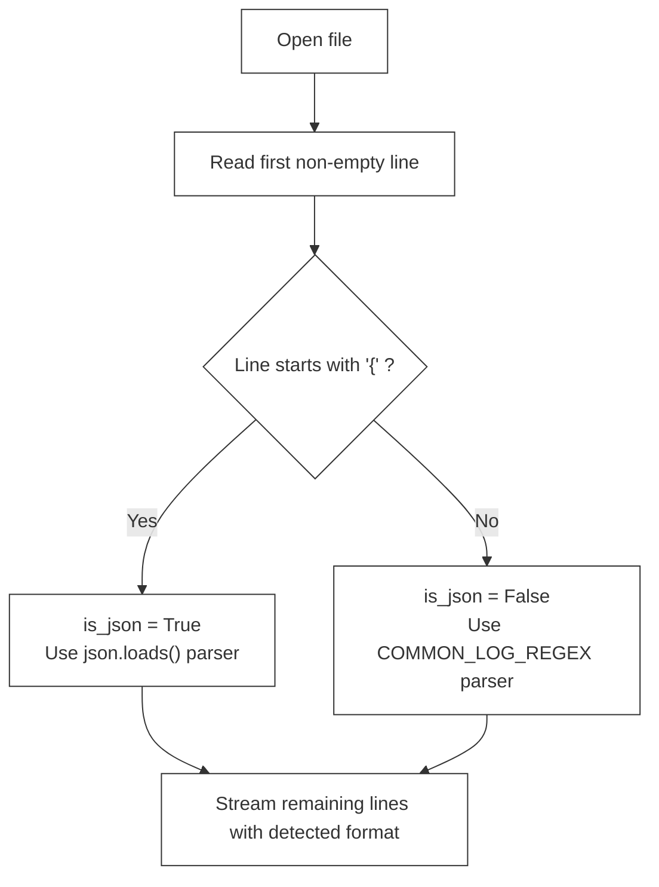

# L-04: Log File Analyzer (Python Automation)

Welcome to the Python Automation Laboratory! Python is the industry-standard language for system scripting, automation, data processing, and DevOps tasks due to its powerful standard library and highly readable syntax.

In this laboratory, you will build a command-line **Log File Analyzer** from scratch. This tool will parse high-volume web server access logs (supporting both Apache Common Log Format and JSON logs), aggregate critical performance and traffic metrics, and generate human-readable console and file reports.

---

## 🗺️ Architectural Blueprint & Data Flow

Your Log File Analyzer operates as a Unix-style data pipeline: consuming raw input streams, parsing structures, aggregating stats in-memory, and outputting formatted reports.



---

## 🔬 Core Learning Objectives

### 1. High-Performance Text Processing & Regular Expressions

**L1 — What It Is**: Web access logs can scale to gigabytes. Reading entire log files into memory will crash your script. Python's **generator functions** (using `yield`) solve this by processing one line at a time, keeping memory usage constant regardless of file size.

**L2 — Generator Internals**: A generator function returns a **Generator Object** instead of executing the function body immediately. Each call to `next()` on the generator (which `for` loops do automatically) resumes execution from the last `yield` statement until the next one.

```python
# Regular function — loads ALL lines into memory at once
def load_all_lines(path):
    with open(path) as f:
        return f.readlines()  # could be 50GB in memory!

# Generator function — yields ONE line at a time (O(1) memory)
def stream_lines(path):
    with open(path) as f:
        for line in f:
            yield line.strip()  # execution pauses here each iteration

# Usage — identical from caller's perspective
for line in stream_lines('huge_access.log'):  # processes 50GB with ~1KB memory!
    process(line)
```

**Compiled Regex for Performance**: Compiling a regex pattern once with `re.compile()` is significantly faster than passing the pattern string to `re.match()` every time, because compilation (parsing the pattern into an internal NFA/DFA state machine) happens only once.

```python
import re

# ❌ SLOW — pattern is recompiled on every loop iteration (O(N) compilations)
for line in lines:
    match = re.match(r'(\d+\.\d+\.\d+\.\d+)', line)

# ✅ FAST — pattern compiled once, reused N times
IP_PATTERN = re.compile(r'(\d+\.\d+\.\d+\.\d+)')
for line in lines:
    match = IP_PATTERN.match(line)
```

You will learn to:
- Use **generators** to yield and process logs line-by-line (`yield` keyword).
- Construct complex, compiled regular expressions (`re.compile`) to parse fields like IP addresses, timestamps, HTTP methods, paths, and status codes.

### 2. Argument Parsing & CLI Architecture

**L1 — What `argparse` Is**: Python's built-in `argparse` module transforms command-line argument strings into a structured `Namespace` object with typed attributes. It also auto-generates `--help` documentation.

**L2 — How Argument Parsing Works**: When your script runs with `python analyzer.py access.log --status 200`, Python's `sys.argv` is `['analyzer.py', 'access.log', '--status', '200']`. `argparse` reads this list and:
1. Matches positional arguments by position
2. Matches optional arguments by `--flag` prefix
3. Converts values to the specified `type=int` etc.
4. Validates required arguments are present

```python
import argparse

parser = argparse.ArgumentParser(
    description="High-performance CLI Log Analyzer",
    formatter_class=argparse.RawDescriptionHelpFormatter,
    epilog="Examples:\n  python -m analyzer access.log\n  python -m analyzer access.log --status 404 --output report.md"
)
parser.add_argument("log_file", help="Path to the log file to analyze")
parser.add_argument("--output", "-o", help="Output path for Markdown report")
parser.add_argument("--status", type=int, help="Filter by HTTP status code (e.g. 404)")
parser.add_argument("--method", choices=["GET","POST","PUT","DELETE"], help="Filter by HTTP method")
parser.add_argument("--top", type=int, default=5, help="Number of top results to display (default: 5)")

# python -m analyzer access.log --status 404 --top 10
args = parser.parse_args()
print(f"Analyzing {args.log_file} for status {args.status}")
```

Create professional CLI utilities using the standard library's `argparse` module:
- Define positional arguments (file inputs) and optional flags (date range filters, output formats, output file targets).
- Display customized `--help` menus.

### 3. Advanced Collections & Aggregations

**L1 — What `Counter` and `defaultdict` Are**: Specialized container types from Python's `collections` module that eliminate boilerplate counting logic.

**L2 — Internal Mechanics**:

```python
from collections import Counter, defaultdict

# Counter — dict subclass that auto-initializes counts at 0
ip_hits = Counter()
for entry in log_entries:
    ip_hits[entry.ip] += 1        # No KeyError if ip not yet seen
# ip_hits.most_common(5) → [('192.168.1.1', 847), ('10.0.0.5', 312), ...]

# defaultdict — dict that calls a factory function for missing keys
status_bytes = defaultdict(int)   # factory = int() = 0
for entry in log_entries:
    status_bytes[entry.status] += entry.bytes_sent
# status_bytes[200] → total bytes for 200 responses

# Real-world example: group paths by status code
paths_by_status = defaultdict(list)
for entry in log_entries:
    paths_by_status[entry.status].append(entry.path)
# paths_by_status[404] → ['/api/users/999', '/api/products/abc', ...]
```

Avoid manual counting loops by utilizing Python's specialized container datatypes from the `collections` module:
- **`Counter`**: Easily identify the top 10 most frequent request paths or client IPs.
- **`defaultdict`**: Dynamically group response latencies or request volumes by status codes or hours without manual key checking.

---

## 📂 Laboratory Directory Structure

You will develop the Log File Analyzer in the `/starter` workspace with the following layout:

```
languages/l04-python/
├── README.md (This Handbook)
└── starter/
    ├── requirements.txt (Dependencies for testing)
    ├── pyproject.toml (Pytest configurations)
    ├── analyzer/
    │   ├── __init__.py
    │   └── log_analyzer.py (Core Parser & Aggregator)
    └── tests/
        ├── __init__.py
        └── test_analyzer.py (Pytest Suite)
```

---

## 🛠️ Step-by-Step Implementation Guide

### Phase 1: Initialize Python Environments & Configurations
Navigate to the `starter` directory and configure the project.

#### `starter/requirements.txt`
```text
pytest>=7.4.0
```

#### `starter/pyproject.toml`
```toml
[tool.pytest.ini_options]
minversion = "7.0"
addopts = "-ra -q"
testpaths = [
    "tests"
]
pythonpath = ["."]
```

To initialize your local virtual environment:
```bash
python -m venv .venv
source .venv/bin/activate  # On Windows: .venv\Scripts\activate
pip install -r requirements.txt
```

---

### Phase 2: Design the Log Entry Parser
Define a data model representing parsed entries.

**Why `@dataclass`?**: Python's `@dataclass` decorator auto-generates `__init__`, `__repr__`, and `__eq__` methods, eliminating dozens of lines of boilerplate. Unlike plain dicts, dataclasses give you type hints and IDE autocompletion.

```python
from dataclasses import dataclass
from datetime import datetime

@dataclass
class LogEntry:
    ip: str
    timestamp: datetime
    method: str
    path: str
    status: int
    bytes_sent: int
```

#### Core Parsing Logic to Implement:
1.  **Apache Common Log Format Parser**:
    - Raw sample: `127.0.0.1 - - [21/May/2026:16:45:00 +0000] "GET /index.html HTTP/1.1" 200 1043`
    - Construct a compiled regular expression:
      ```python
      COMMON_LOG_REGEX = re.compile(
          r'(?P<ip>\S+) \S+ \S+ \[(?P<date>.*?)\] "(?P<method>\S+) (?P<path>\S+) \S+" (?P<status>\d+) (?P<bytes>\S+)'
      )
      ```
    - Parse timestamps using `datetime.strptime(date_str, "%d/%b/%Y:%H:%M:%S %z")`.
    - Handle missing bytes (`-` represented as `0`).

2.  **JSON Format Parser**:
    - Raw sample: `{"ip": "127.0.0.1", "timestamp": "2026-05-21T16:45:00Z", "method": "GET", "path": "/index.html", "status": 200, "bytes": 1043}`
    - Safely load each line with `json.loads(line)`.

**Format auto-detection strategy:**


---

### Phase 3: The Aggregation Engine (`log_analyzer.py`)
Implement the `LogAnalyzer` class. It must process files line-by-line to handle extremely large log inputs without crashing.

#### Core Methods to Implement:
1.  **`stream_entries(file_path: str)`**:
    - A generator that yields `LogEntry` objects. Reads the file line-by-line using a standard `with open(...)` context.
    - Autodetects format (Common Log vs JSON) by inspecting the first non-empty line of the file.
2.  **`analyze(file_path: str, filters: dict = None) -> dict`**:
    - Processes the stream and applies filters (e.g., filter by status code, date range, or request method).
    - Aggregates stats using `collections.Counter` and `collections.defaultdict`:
      - Total request count.
      - Total bytes transferred.
      - Top 5 requesting IP addresses.
      - Top 5 requested pages/endpoints.
      - HTTP status code distribution (e.g., `200`, `404`, `500`).
3.  **`generate_markdown_report(analysis_results: dict, output_path: str)`**:
    - Writes a beautifully formatted Markdown file (`summary_report.md`) detailing the compiled statistics.

---

### Phase 4: Command-Line Interface (CLI) Entrypoint
Integrate the engine with `argparse` so it can be called from the console:

```python
import argparse

def main():
    parser = argparse.ArgumentParser(description="High-performance CLI Log Analyzer")
    parser.add_argument("log_file", help="Path to the log file to analyze")
    parser.add_argument("--output", help="Path to write the markdown summary report")
    parser.add_argument("--status", type=int, help="Filter requests by HTTP status code")
    parser.add_argument("--method", help="Filter requests by HTTP method (e.g., GET, POST)")
    
    args = parser.parse_args()
    # TODO: Invoke LogAnalyzer and print/write reports.
```

---

## 🧪 The Verification Suite (`tests/test_analyzer.py`)

Verify your log parsing and aggregation engine with TDD behavior tests.

```python
import pytest
from datetime import datetime, timezone
from analyzer.log_analyzer import LogAnalyzer, LogEntry

def test_parse_common_log_line():
    analyzer = LogAnalyzer()
    line = '192.168.1.1 - - [21/May/2026:16:45:00 +0000] "GET /api/users HTTP/1.1" 200 512'
    entry = analyzer.parse_line(line, is_json=False)
    
    assert entry is not None
    assert entry.ip == "192.168.1.1"
    assert entry.method == "GET"
    assert entry.path == "/api/users"
    assert entry.status == 200
    assert entry.bytes_sent == 512
    assert entry.timestamp.year == 2026

def test_parse_json_log_line():
    analyzer = LogAnalyzer()
    line = '{"ip": "10.0.0.5", "timestamp": "2026-05-21T16:45:00Z", "method": "POST", "path": "/checkout", "status": 201, "bytes": 1024}'
    entry = analyzer.parse_line(line, is_json=True)
    
    assert entry is not None
    assert entry.ip == "10.0.0.5"
    assert entry.method == "POST"
    assert entry.status == 201
    assert entry.bytes_sent == 1024

def test_aggregation_metrics(tmp_path):
    # Setup dummy log file
    log_content = (
        '192.168.1.1 - - [21/May/2026:16:45:00 +0000] "GET /index.html HTTP/1.1" 200 100\n'
        '192.168.1.1 - - [21/May/2026:16:46:00 +0000] "GET /index.html HTTP/1.1" 200 100\n'
        '10.0.0.1 - - [21/May/2026:16:47:00 +0000] "POST /api/login HTTP/1.1" 401 50\n'
    )
    log_file = tmp_path / "access.log"
    log_file.write_text(log_content)
    
    analyzer = LogAnalyzer()
    results = analyzer.analyze(str(log_file))
    
    assert results["total_requests"] == 3
    assert results["total_bytes"] == 250
    assert results["status_distribution"][200] == 2
    assert results["status_distribution"][401] == 1
    assert results["top_ips"][0] == ("192.168.1.1", 2)
```

---

## 🚀 Advanced Challenges (For Elite Engineers)
Take your log file processing skills to a production scale:

1.  **Handling Gzip Compressed Logs**:
    Using Python's built-in `gzip` module, write your generator to seamlessly read `.log` files and compressed `.log.gz` archives without requiring pre-extraction on the filesystem.
2.  **IP Geolocation Resolution**:
    Allow an optional `--geoip` flag. If set, parse the client IPs and resolve them to countries using a local MaxMind GeoLite2 DB (mocked or integrated).
3.  **Real-Time Tail Aggregator (`tail -f`)**:
    Implement a continuous tail generator that reads lines appended to a active log file in real-time, displaying updated dashboards every 2 seconds.

---

## ⚠️ Common Pitfalls & Anti-Patterns

### Pitfall 1: Reading Entire Files Into Memory
```python
# ❌ WRONG — crashes on 10GB log files
with open('huge.log') as f:
    lines = f.readlines()  # loads 10GB into RAM

# ✅ CORRECT — generator processes one line at a time
def stream_lines(path):
    with open(path) as f:
        for line in f:
            yield line.strip()
```

### Pitfall 2: Not Using Compiled Regex in Loops
```python
# ❌ WRONG — recompiles the pattern 1 million times (slow!)
for line in log_lines:
    match = re.match(r'(?P<ip>\S+) ...', line)

# ✅ CORRECT — compile once at module level, reuse always
LOG_PATTERN = re.compile(r'(?P<ip>\S+) ...')
for line in log_lines:
    match = LOG_PATTERN.match(line)
```

### Pitfall 3: Silently Skipping Parse Errors
```python
# ❌ WRONG — bare except swallows all errors including bugs
try:
    entry = parse_line(line)
except:
    pass

# ✅ CORRECT — log the error and skip only expected failures
try:
    entry = parse_line(line)
except ValueError as e:
    print(f"Skipping malformed line: {e}", file=sys.stderr)
    continue
```

### Pitfall 4: Mutable Default Arguments
```python
# ❌ WRONG — Python creates the dict ONCE and reuses it across calls!
def analyze(file_path, filters={}):
    filters['processed'] = True  # modifies the SHARED dict

# ✅ CORRECT — use None as default, create fresh dict inside
def analyze(file_path, filters=None):
    if filters is None:
        filters = {}
```

### Pitfall 5: Not Using `with` Statement for File Handles
```python
# ❌ WRONG — file never closed if exception raised during processing
f = open('log.txt')
for line in f:
    process(line)
f.close()  # never reached on exception!

# ✅ CORRECT — 'with' guarantees close() even on exceptions
with open('log.txt') as f:
    for line in f:
        process(line)
```

---

## 🔑 Key Takeaways

1. **Generators = Infinite Scalability**: A generator that `yield`s one line at a time can process a 100GB log file using only kilobytes of memory. Always stream, never bulk-load.
2. **Pre-Compile Regex**: Call `re.compile()` once at module or class level. The compiled `Pattern` object is 10-50x faster than re-compiling per-line in a million-row loop.
3. **`Counter` and `defaultdict` Replace Boilerplate**: These specialized containers auto-initialize keys, eliminating `if key not in dict` guard code.
4. **`@dataclass` Over Raw Dicts**: A `LogEntry` dataclass gives you type safety, IDE support, and auto-generated equality — use it instead of raw `dict` for structured data.
5. **`argparse` for Professional CLIs**: Use `argparse` to build self-documenting command-line tools with typed arguments, default values, and auto-generated `--help` pages.
6. **Always Handle Parse Failures Gracefully**: Real-world logs are messy. Catch `ValueError`/`JSONDecodeError`, log the bad line to `stderr`, and continue processing.
7. **`tmp_path` Fixture for File Tests**: pytest's `tmp_path` fixture provides a unique temporary directory per test — never hardcode `/tmp/test.log` in tests.

## 📚 Further Reading

- [Python Generators Tutorial](https://docs.python.org/3/howto/functional.html#generators)
- [Python `re` Module Reference](https://docs.python.org/3/library/re.html)
- [Python `collections` Module](https://docs.python.org/3/library/collections.html)
- [Python `argparse` Tutorial](https://docs.python.org/3/howto/argparse.html)
- [pytest Documentation](https://docs.pytest.org/en/stable/)
- [Python `dataclasses` Guide](https://docs.python.org/3/library/dataclasses.html)
