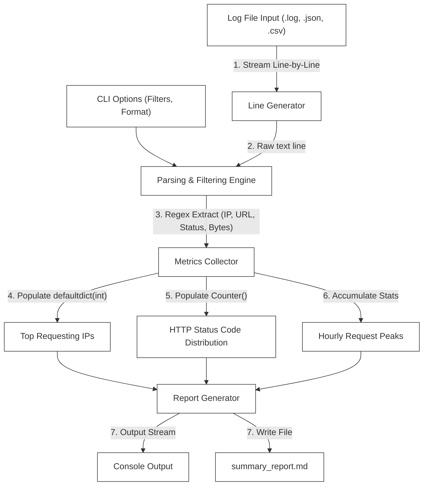

# L-04: Log File Analyzer (Python Automation)

Welcome to the Python Automation Laboratory! Python is the industry-standard language for system scripting, automation, data processing, and DevOps tasks due to its powerful standard library and highly readable syntax.

In this laboratory, you will build a command-line **Log File Analyzer** from scratch. This tool will parse high-volume web server access logs (supporting both Apache Common Log Format and JSON logs), aggregate critical performance and traffic metrics, and generate human-readable console and file reports.

---

## 🗺️ Architectural Blueprint & Data Flow

Your Log File Analyzer operates as a Unix-style data pipeline: consuming raw input streams, parsing structures, aggregating stats in-memory, and outputting formatted reports.



---

## 🔬 Core Learning Objectives

### 1. High-Performance Text Processing & Regular Expressions
Web access logs can scale to gigabytes. Reading entire log files into memory will crash your script. You will learn to:
- Use **generators** to yield and process logs line-by-line (`yield` keyword).
- Construct complex, compiled regular expressions (`re.compile`) to parse fields like IP addresses, timestamps, HTTP methods, paths, and status codes.

### 2. Argument Parsing & CLI Architecture
Create professional CLI utilities using the standard library's `argparse` module:
- Define positional arguments (file inputs) and optional flags (date range filters, output formats, output file targets).
- Display customized `--help` menus.

### 3. Advanced Collections & Aggregations
Avoid manual counting loops by utilizing Python’s specialized container datatypes from the `collections` module:
- **`Counter`**: Easily identify the top 10 most frequent request paths or client IPs.
- **`defaultdict`**: Dynamically group response latencies or request volumes by status codes or hours without manual key checking.

---

## 📂 Laboratory Directory Structure

You will develop the Log File Analyzer in the `/starter` workspace with the following layout:

```
languages/l04-python/
├── README.md (This Handbook)
└── starter/
    ├── requirements.txt (Dependencies for testing)
    ├── pyproject.toml (Pytest configurations)
    ├── analyzer/
    │   ├── __init__.py
    │   └── log_analyzer.py (Core Parser & Aggregator)
    └── tests/
        ├── __init__.py
        └── test_analyzer.py (Pytest Suite)
```

---

## 🛠️ Step-by-Step Implementation Guide

### Phase 1: Initialize Python Environments & Configurations
Navigate to the `starter` directory and configure the project.

#### `starter/requirements.txt`
```text
pytest>=7.4.0
```

#### `starter/pyproject.toml`
```toml
[tool.pytest.ini_options]
minversion = "7.0"
addopts = "-ra -q"
testpaths = [
    "tests"
]
pythonpath = ["."]
```

To initialize your local virtual environment:
```bash
python -m venv .venv
source .venv/bin/activate  # On Windows: .venv\Scripts\activate
pip install -r requirements.txt
```

---

### Phase 2: Design the Log Entry Parser
Define a data model representing parsed entries.

```python
from dataclasses import dataclass
from datetime import datetime

@dataclass
class LogEntry:
    ip: str
    timestamp: datetime
    method: str
    path: str
    status: int
    bytes_sent: int
```

#### Core Parsing Logic to Implement:
1.  **Apache Common Log Format Parser**:
    - Raw sample: `127.0.0.1 - - [21/May/2026:16:45:00 +0000] "GET /index.html HTTP/1.1" 200 1043`
    - Construct a compiled regular expression:
      ```python
      COMMON_LOG_REGEX = re.compile(
          r'(?P<ip>\S+) \S+ \S+ \[(?P<date>.*?)\] "(?P<method>\S+) (?P<path>\S+) \S+" (?P<status>\d+) (?P<bytes>\S+)'
      )
      ```
    - Parse timestamps using `datetime.strptime(date_str, "%d/%b/%Y:%H:%M:%S %z")`.
    - Handle missing bytes (`-` represented as `0`).

2.  **JSON Format Parser**:
    - Raw sample: `{"ip": "127.0.0.1", "timestamp": "2026-05-21T16:45:00Z", "method": "GET", "path": "/index.html", "status": 200, "bytes": 1043}`
    - Safely load each line with `json.loads(line)`.

---

### Phase 3: The Aggregation Engine (`log_analyzer.py`)
Implement the `LogAnalyzer` class. It must process files line-by-line to handle extremely large log inputs without crashing.

#### Core Methods to Implement:
1.  **`stream_entries(file_path: str)`**:
    - A generator that yields `LogEntry` objects. Reads the file line-by-line using a standard `with open(...)` context.
    - Autodetects format (Common Log vs JSON) by inspecting the first non-empty line of the file.
2.  **`analyze(file_path: str, filters: dict = None) -> dict`**:
    - Processes the stream and applies filters (e.g., filter by status code, date range, or request method).
    - Aggregates stats using `collections.Counter` and `collections.defaultdict`:
      - Total request count.
      - Total bytes transferred.
      - Top 5 requesting IP addresses.
      - Top 5 requested pages/endpoints.
      - HTTP status code distribution (e.g., `200`, `404`, `500`).
3.  **`generate_markdown_report(analysis_results: dict, output_path: str)`**:
    - Writes a beautifully formatted Markdown file (`summary_report.md`) detailing the compiled statistics.

---

### Phase 4: Command-Line Interface (CLI) Entrypoint
Integrate the engine with `argparse` so it can be called from the console:

```python
import argparse

def main():
    parser = argparse.ArgumentParser(description="High-performance CLI Log Analyzer")
    parser.add_argument("log_file", help="Path to the log file to analyze")
    parser.add_argument("--output", help="Path to write the markdown summary report")
    parser.add_argument("--status", type=int, help="Filter requests by HTTP status code")
    parser.add_argument("--method", help="Filter requests by HTTP method (e.g., GET, POST)")
    
    args = parser.parse_args()
    # TODO: Invoke LogAnalyzer and print/write reports.
```

---

## 🧪 The Verification Suite (`tests/test_analyzer.py`)

Verify your log parsing and aggregation engine with TDD behavior tests.

```python
import pytest
from datetime import datetime, timezone
from analyzer.log_analyzer import LogAnalyzer, LogEntry

def test_parse_common_log_line():
    analyzer = LogAnalyzer()
    line = '192.168.1.1 - - [21/May/2026:16:45:00 +0000] "GET /api/users HTTP/1.1" 200 512'
    entry = analyzer.parse_line(line, is_json=False)
    
    assert entry is not None
    assert entry.ip == "192.168.1.1"
    assert entry.method == "GET"
    assert entry.path == "/api/users"
    assert entry.status == 200
    assert entry.bytes_sent == 512
    assert entry.timestamp.year == 2026

def test_parse_json_log_line():
    analyzer = LogAnalyzer()
    line = '{"ip": "10.0.0.5", "timestamp": "2026-05-21T16:45:00Z", "method": "POST", "path": "/checkout", "status": 201, "bytes": 1024}'
    entry = analyzer.parse_line(line, is_json=True)
    
    assert entry is not None
    assert entry.ip == "10.0.0.5"
    assert entry.method == "POST"
    assert entry.status == 201
    assert entry.bytes_sent == 1024

def test_aggregation_metrics(tmp_path):
    # Setup dummy log file
    log_content = (
        '192.168.1.1 - - [21/May/2026:16:45:00 +0000] "GET /index.html HTTP/1.1" 200 100\n'
        '192.168.1.1 - - [21/May/2026:16:46:00 +0000] "GET /index.html HTTP/1.1" 200 100\n'
        '10.0.0.1 - - [21/May/2026:16:47:00 +0000] "POST /api/login HTTP/1.1" 401 50\n'
    )
    log_file = tmp_path / "access.log"
    log_file.write_text(log_content)
    
    analyzer = LogAnalyzer()
    results = analyzer.analyze(str(log_file))
    
    assert results["total_requests"] == 3
    assert results["total_bytes"] == 250
    assert results["status_distribution"][200] == 2
    assert results["status_distribution"][401] == 1
    assert results["top_ips"][0] == ("192.168.1.1", 2)
```

---

## 🚀 Advanced Challenges (For Elite Engineers)
Take your log file processing skills to a production scale:

1.  **Handling Gzip Compressed Logs**:
    Using Python's built-in `gzip` module, write your generator to seamlessly read `.log` files and compressed `.log.gz` archives without requiring pre-extraction on the filesystem.
2.  **IP Geolocation Resolution**:
    Allow an optional `--geoip` flag. If set, parse the client IPs and resolve them to countries using a local MaxMind GeoLite2 DB (mocked or integrated).
3.  **Real-Time Tail Aggregator (`tail -f`)**:
    Implement a continuous tail generator that reads lines appended to a active log file in real-time, displaying updated dashboards every 2 seconds.
