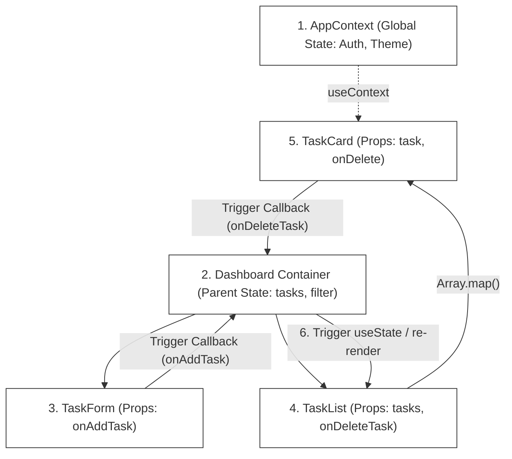

# L-05: Interactive Task Dashboard (React UI)

Welcome to the React UI Laboratory! React revolutionized frontend web development by introducing a declarative, component-driven architecture backed by an in-memory Virtual DOM representation that optimizes UI rendering cycles.

In this laboratory, you will build a modern, high-fidelity, interactive **Task Dashboard** using **React 18** and **TypeScript** bundled with **Vite**. You will master state management, the component life cycle, unidirectional data flow, context APIs, and frontend unit testing using **Vitest** and **React Testing Library**.

---

## 🗺️ Architectural Blueprint & Data Flow

React apps operate under a strict **Unidirectional Data Flow** pattern. State is updated via actions, triggering a re-render of components from top-to-bottom.



---

## 🔬 Core Learning Objectives

### 1. Declarative UI & The Virtual DOM
Understand the difference between imperative DOM manipulation (e.g., vanilla JS `document.createElement`) and React's declarative state-driven model. Learn how React builds a Virtual DOM tree, performs a diffing algorithm (Reconciliation), and batches updates to the physical DOM.

### 2. State vs. Props
- **Props**: Immutable data passed down from a parent component to a child component.
- **State**: Mutable data managed locally within a component using `useState`. Learn the rules of state mutation: always treat state as read-only and update it using the provided state modifier function.

### 3. Component Lifecycle & Hook Mastery
Deep dive into standard React hooks:
- **`useState`**: Hook into component local state.
- **`useEffect`**: Execute side effects (e.g., API calls, document title updates, event listener registrations). Master the dependency array to control exactly when side effects trigger.
- **`useContext`**: Share global state (like active user info or dark mode preferences) across deep component trees without "prop drilling".
- **`useRef`**: Persist mutable references across renders without triggering UI updates (e.g., targeting input focus).

### 4. Component-Driven Testing
Learn how to test UI features in isolation using **React Testing Library**. Write tests that simulate real user interactions (typing in inputs, clicking submit buttons) and verify output assertions on the virtual screen.

---

## 📂 Laboratory Directory Structure

You will develop the React Task Dashboard in the `/starter` workspace with the following layout:

```
languages/l05-react/
├── README.md (This Handbook)
└── starter/
    ├── package.json (Dependency definitions)
    ├── tsconfig.json (TypeScript rules)
    ├── vite.config.ts (Vite configurations)
    ├── index.html (Root HTML mount point)
    ├── src/
    │   ├── main.tsx (React app entrypoint)
    │   ├── App.tsx (Root structure & Theme context)
    │   ├── context/
    │   │   └── ThemeContext.tsx (Global theme context)
    │   ├── components/
    │   │   ├── Dashboard.tsx (Core dashboard container)
    │   │   ├── TaskForm.tsx (Inputs & Validation form)
    │   │   └── TaskCard.tsx (Individual task view card)
    │   └── index.css (Core styling rules)
    └── src/__tests__/
        └── Dashboard.test.tsx (React Testing Library suite)
```

---

## 🛠️ Step-by-Step Implementation Guide

### Phase 1: Initialize Project Configuration
Navigate to the `starter` directory and create the core configuration files.

#### `starter/package.json`
```json
{
  "name": "react-task-dashboard",
  "private": true,
  "version": "1.0.0",
  "type": "module",
  "scripts": {
    "dev": "vite",
    "build": "tsc && vite build",
    "test": "vitest run",
    "test:watch": "vitest"
  },
  "dependencies": {
    "react": "^18.2.0",
    "react-dom": "^18.2.0"
  },
  "devDependencies": {
    "@testing-library/jest-dom": "^6.2.0",
    "@testing-library/react": "^14.1.2",
    "@testing-library/user-event": "^14.5.2",
    "@types/react": "^18.2.43",
    "@types/react-dom": "^18.2.17",
    "@vitejs/plugin-react": "^4.2.1",
    "jsdom": "^23.2.0",
    "typescript": "^5.2.2",
    "vite": "^5.0.8",
    "vitest": "^1.1.0"
  }
}
```

#### `starter/vite.config.ts`
```typescript
import { defineConfig } from 'vite';
import react from '@vitejs/plugin-react';

export default defineConfig({
  plugins: [react()],
  test: {
    globals: true,
    environment: 'jsdom',
    setupFiles: './src/setupTests.ts',
  },
});
```

---

### Phase 2: Design the Global Theme Context (`ThemeContext.tsx`)
Create a custom React context that provides a dark/light mode state and a toggle function to any nested component.

#### Core Context Signature:
```typescript
export type Theme = 'light' | 'dark';

export interface ThemeContextType {
  theme: Theme;
  toggleTheme: () => void;
}
```

---

### Phase 3: Create Component Structures
Implement components under `src/components/`.

1.  **`TaskCard.tsx`**:
    - Receives a `task` object and callbacks (`onDelete`, `onToggleComplete`) via props.
    - Shows title, description, priority (Low, Medium, High), and completion status.
    - Uses conditional styling (e.g. graying out text when a task is completed).
2.  **`TaskForm.tsx`**:
    - Manages local input states for title, description, and priority.
    - Handles form validation (e.g., title must not be empty).
    - Submits inputs to the parent container using a passed callback prop.
3.  **`Dashboard.tsx`**:
    - The orchestrator component containing the core state array: `tasks`.
    - Implements **`useEffect`** to load/save task arrays to the browser's `localStorage` so data survives refreshes.
    - Provides filters to show "All", "Active", or "Completed" tasks.

---

## 🧪 The Verification Suite (`src/__tests__/Dashboard.test.tsx`)

Verify your React UI logic with component testing that mocks browser rendering.

```typescript
import React from 'react';
import { render, screen, fireEvent } from '@testing-library/react';
import '@testing-library/jest-dom';
import Dashboard from '../components/Dashboard';

describe('React Task Dashboard Unit Tests', () => {
  it('should render the dashboard successfully with empty state', () => {
    render(<Dashboard />);
    expect(screen.getByText(/Task Dashboard/i)).toBeInTheDocument();
    expect(screen.getByText(/No tasks available/i)).toBeInTheDocument();
  });

  it('should allow users to add a new task', () => {
    render(<Dashboard />);
    
    // Simulate user typing in input fields
    const titleInput = screen.getByPlaceholderText(/Task title/i);
    const descInput = screen.getByPlaceholderText(/Task description/i);
    const addButton = screen.getByText(/Add Task/i);

    fireEvent.change(titleInput, { target: { value: 'Learn React Hooks' } });
    fireEvent.change(descInput, { target: { value: 'Master useState and useEffect' } });
    fireEvent.click(addButton);

    // Verify task is added to the screen
    expect(screen.getByText('Learn React Hooks')).toBeInTheDocument();
    expect(screen.getByText('Master useState and useEffect')).toBeInTheDocument();
  });

  it('should allow users to delete a task', () => {
    render(<Dashboard />);
    
    // Add a task
    const titleInput = screen.getByPlaceholderText(/Task title/i);
    const addButton = screen.getByText(/Add Task/i);
    fireEvent.change(titleInput, { target: { value: 'Discardable Task' } });
    fireEvent.click(addButton);

    expect(screen.getByText('Discardable Task')).toBeInTheDocument();

    // Click delete
    const deleteButton = screen.getByRole('button', { name: /Delete/i });
    fireEvent.click(deleteButton);

    // Verify task is removed
    expect(screen.queryByText('Discardable Task')).not.toBeInTheDocument();
  });
});
```

---

## 🚀 Advanced Challenges (For Elite Engineers)
Take your React UI knowledge further:

1.  **Custom Hooks (`useLocalStorage`)**:
    Refactor the `localStorage` logic into a reusable custom hook:
    `const [tasks, setTasks] = useLocalStorage<Task[]>('tasks', [])`.
2.  **Drag and Drop Sorting**:
    Implement visual Drag-and-Drop functionality using the browser's HTML5 Drag and Drop API (without external libraries) to sort task priority cards.
3.  **Keyboard Accessibility & Accessibility Standards (a11y)**:
    Ensure the task form and dashboard are fully keyboard-navigable (`Tab` key shifting, `Enter` key activations) and include robust `aria-*` tags for screen readers.
