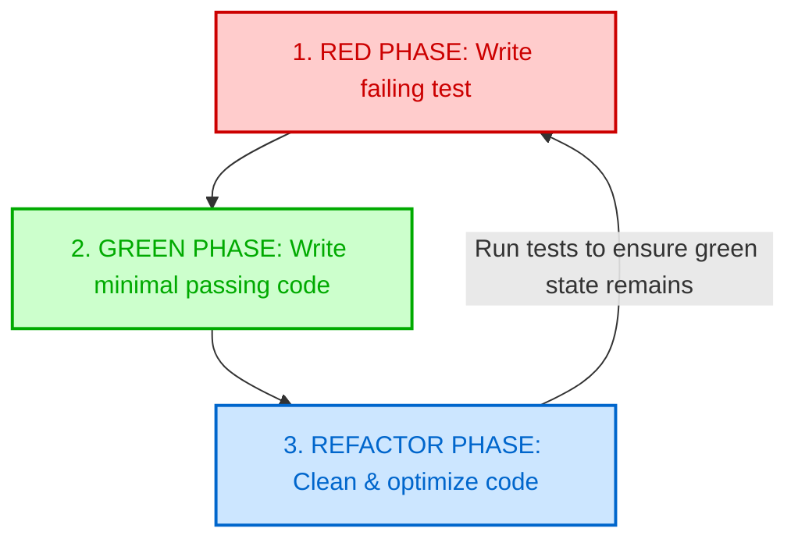

# L-06: Testing Frameworks & TDD Survey

Welcome to the Testing Frameworks & TDD Survey Laboratory! Software verification is not an afterthought; it is the blueprint of secure, maintainable engineering systems. 

In this laboratory, you will master the conceptual foundations of the **Testing Pyramid**, learn to identify boundaries between different testing types, and survey the syntax of top-tier verification frameworks across **Java (JUnit 5)**, **Node.js (Vitest)**, and **Python (pytest)**. You will also practice the rigorous, behavioral lifecycle of **Test-Driven Development (TDD)**.

---

## 🗺️ Architectural Blueprint: The Testing Pyramid

Elite engineering teams distribute their verification workloads across three core levels. This ensures rapid developer feedback loops combined with strong release-grade coverage.

```
       / \
      /   \      1. END-TO-END (E2E) TESTS (~5%)
     / E2E \     Validates entire system flows from UI to database.
    /-------\    High confidence, slow execution, brittle to changes.
   /         \
  /  INTEG   \   2. INTEGRATION TESTS (~25%)
 /------------\  Validates interaction between two or more modules (e.g. Service + DB).
/              \
/     UNIT     \  3. UNIT TESTS (~70%)
/______________\  Validates isolated functions/methods using pure inputs & mocks.
                  Near-instant feedback, resilient to infrastructure failures.
```

### The TDD Red-Green-Refactor Cycle
Test-Driven Development flips the traditional development process: you write the test *before* the implementation.



---

## 🔬 Core Learning Objectives

### 1. Test Classifications & Boundaries
- **Unit Testing**: Tests a single class or pure function in isolation. External dependencies (like networks or database connections) are replaced with **Mocks** or **Stubs** to prevent test slow-downs and flakiness.
- **Integration Testing**: Verifies that modules work together. Real dependencies (such as local PostgreSQL databases running in Docker) are typically utilized.
- **End-to-End (E2E) Testing**: Simulates real user flows (e.g. using Cypress or Playwright) to test the application exactly as a customer would.

### 2. The Golden Rules of TDD
- **Rule 1**: You are not allowed to write any production code unless it is to make a failing unit test pass.
- **Rule 2**: You are not allowed to write more of a unit test than is sufficient to fail (and not compiling is failing).
- **Rule 3**: You are not allowed to write more production code than is sufficient to pass the currently failing unit test.

### 3. Syntax Survey Across Languages
Learn to recognize and formulate assertions across modern enterprise ecosystems:
- **Java (JUnit 5 + Mockito)**: Statically typed annotations (`@Test`, `@BeforeEach`, `@ExtendWith`).
- **Node.js (Vitest / Jest)**: Behavior-driven assertion trees (`describe()`, `it()`, `expect().toBe()`).
- **Python (pytest)**: Simple, Pythonic assertions utilizing raw `assert` statements and powerful fixtures.

---

## 📂 Laboratory Directory Structure

You will develop the Testing and TDD Survey in the `/starter` workspace with the following layout:

```
languages/l06-testing-survey/
├── README.md (This Handbook)
└── starter/
    ├── nodejs/ (Vitest Lab)
    │   ├── package.json
    │   ├── tsconfig.json
    │   ├── calculator.ts (Core logic)
    │   └── calculator.test.ts
    ├── python/ (pytest Lab)
    │   ├── requirements.txt
    │   ├── pyproject.toml
    │   ├── user_service.py (Core logic)
    │   └── test_user_service.py
    └── java/ (JUnit 5 Lab)
        ├── pom.xml
        └── src/
            ├── main/java/org/learning/survey/TaskService.java
            └── test/java/org/learning/survey/TaskServiceTest.java
```

---

## 🛠️ Step-by-Step Implementation Guide

### Part 1: Node.js (Vitest) - The Red-Green Calculator
Implement a simple calculator module in Node.js using TDD:
- **First Test Case**: A method `add(expression: string): number` that parses comma-separated numbers (e.g. `"1,2"` should return `3`).
- **TDD Loop**:
  1. Write a failing test matching `expect(calculator.add("2,3")).toBe(5)`.
  2. Implement *just enough* code to return the hardcoded sum.
  3. Expand tests with edge cases (empty strings return `0`, handles custom delimiters) and refactor the code under green state!

---

### Part 2: Python (pytest) - Mocking external API integrations
Implement a `UserService` that fetches user data from a remote REST API.
- Since we want **Unit Testing**, we must mock the external network boundary using pytest's `unittest.mock.patch` feature.

#### Target Skeleton (`user_service.py`):
```python
import requests

class UserService:
    def get_user_avatar(self, user_id: int) -> str:
        # TODO: Send request to "https://api.github.com/users/{user_id}"
        # TODO: Extract and return the "avatar_url" string.
        # TODO: Raise ValueError on non-200 responses.
        pass
```

---

### Part 3: Java (JUnit 5 + Mockito) - Stubbing Database Repositories
Implement a `TaskService` that depends on a `TaskRepository` interface to query tasks.
- **Goal**: Mock the data persistence tier using **Mockito** to verify business rules:
  - If a task is completed, throwing an `IllegalStateException` on modification.

#### Target Skeleton (`TaskService.java`):
```java
package org.learning.survey;

public interface TaskRepository {
    boolean isTaskCompleted(String taskId);
}

public class TaskService {
    private final TaskRepository repository;

    public TaskService(TaskRepository repository) {
        this.repository = repository;
    }

    public void updateTask(String taskId, String newContent) {
        // TODO: Query repository. If isTaskCompleted(taskId) is true, throw IllegalStateException.
    }
}
```

---

## 🧪 The Multi-Language Verification Suite

Verify all three skeletons independently under their respective folders:

### 1. Node.js Tests (`calculator.test.ts`)
```typescript
import { describe, it, expect } from 'vitest';
import { Calculator } from './calculator.js';

describe('Calculator TDD Lab', () => {
  it('should return 0 for an empty string', () => {
    const calc = new Calculator();
    expect(calc.add("")).toBe(0);
  });

  it('should return the sum of two comma-separated numbers', () => {
    const calc = new Calculator();
    expect(calc.add("1,2")).toBe(3);
  });
});
```

### 2. Python Tests (`test_user_service.py`)
```python
import pytest
from unittest.mock import patch, Mock
from user_service import UserService

@patch('user_service.requests.get')
def test_get_user_avatar_success(mock_get):
    # Setup mock response
    mock_response = Mock()
    mock_response.status_code = 200
    mock_response.json.return_ok = lambda: {"avatar_url": "https://avatar.url/123"}
    mock_get.return_value = mock_response

    service = UserService()
    avatar = service.get_avatar(123)
    
    assert avatar == "https://avatar.url/123"
```

### 3. Java Tests (`TaskServiceTest.java`)
```java
package org.learning.survey;

import org.junit.jupiter.api.Test;
import org.junit.jupiter.api.extension.ExtendWith;
import org.mockito.InjectMocks;
import org.mockito.Mock;
import org.mockito.junit.jupiter.MockitoExtension;

import static org.junit.jupiter.api.Assertions.*;
import static org.mockito.Mockito.*;

@ExtendWith(MockitoExtension.class)
public class TaskServiceTest {

    @Mock
    private TaskRepository repository;

    @InjectMocks
    private TaskService service;

    @Test
    public void shouldThrowOnCompletedTaskModification() {
        when(repository.isTaskCompleted("123")).thenReturn(true);

        assertThrows(IllegalStateException.class, () -> {
            service.updateTask("123", "New Content");
        });
    }
}
```

---

## 🚀 Advanced Challenges (For Elite Engineers)
Level up your testing strategies:

1.  **Mutation Testing**:
    Research **Mutation Testing** (e.g. using Stryker Mutator or PITest). Learn how mutants inject bugs into production code to verify if your test suite is strong enough to catch them.
2.  **Database Integration with Testcontainers**:
    Refactor your Java Integration tests to spin up a real PostgreSQL database instance dynamically inside a Docker container using **Testcontainers**.
3.  **Property-Based Testing**:
    Instead of hardcoding inputs, implement **Property-Based Testing** (e.g. using fast-check in Node.js or Hypothesis in Python) to verify logical invariants across 1,000 auto-generated inputs.
