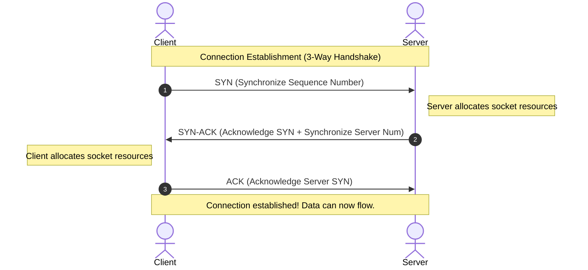

# 🔬 Lab 00: Implement TCP from Scratch

In this laboratory, you will explore the foundational layer of modern web communication: **TCP (Transmission Control Protocol)** at the transport layer. You will understand how computers establish a reliable stream of bytes over an unreliable network, how the operating system handles connections, and how to write a raw TCP listener and client wrapper.

---

## 1. 💡 The Core Concepts

To build on top of TCP, you must understand how the operating system and the hardware work together to manage network connections.

### What is a Socket?
At its simplest, a **Socket** is a software abstraction provided by the operating system kernel that represents an endpoint for sending or receiving data across a network. 

In Unix-like systems, **everything is a file**. A socket is managed by the kernel as a **File Descriptor (FD)**. When your application creates a socket, the OS returns an integer representing that socket in the process's file descriptor table.
- **Port**: An addressable 16-bit number (0 - 65535) used to distinguish different services on a single physical machine.
- **Socket**: The combination of an IP address and a Port (e.g., `127.0.0.1:8080`).
- **Connection**: A unique quad-tuple of: `(Source IP, Source Port, Destination IP, Destination Port)`. This is why a single port (like `80` or `443`) can handle tens of thousands of concurrent connections simultaneously!

### The Three-Way Handshake (Connection Establishment)
Before any data can flow, TCP must establish a connection. This is done through a synchronized sequence of packet exchanges:



1. **SYN**: The client sends a segment with the `SYN` flag set, containing an Initial Sequence Number (ISN) to synchronize sequence tracking.
2. **SYN-ACK**: The server responds with `SYN` and `ACK` flags set, acknowledging the client's sequence number and sending its own server ISN.
3. **ACK**: The client sends an `ACK` segment, acknowledging the server's sequence number. The connection is now in the `ESTABLISHED` state.

---

## 2. 🌍 Real-Life Production Applications

Every single time you visit a website (HTTP), query a PostgreSQL database, or fetch a key from Redis, a TCP connection is active under the hood:
- **HTTP/1.1 and HTTP/2**: Rely strictly on persistent TCP connections.
- **Database Connection Pools**: Maintain a hot pool of active TCP connections to bypass the expensive 3-way handshake on every query.
- **EMFILE (Too Many Open Files)**: In production systems under high load, you may encounter `Error: EMFILE`. This occurs when your application has opened more sockets than the operating system's configured per-process file descriptor limit (`ulimit -n`).

---

## 3. ⚙️ Advanced System Design Add-Ons

To truly master TCP, you must understand the optimizations and limits that govern high-performance network programming:

### A. Backpressure & The Sliding Window
What happens if a fast client sends 100MB of data, but the server is slow and can only process 1MB per second?
TCP manages this using the **Sliding Window Buffer**.
- Every socket has an operating system **Read Buffer** and **Write Buffer**.
- The server advertises its remaining read buffer size (the "Receive Window" or `win`) inside every TCP header it sends back to the client.
- If the server's read buffer fills up, the advertised window drops to `0`. The client's TCP stack automatically stops sending packets, pausing the transmission until the server's application reads data and empties the buffer.
- This automatic throttling is called **Backpressure**. If you ignore backpressure in your code (e.g. reading forever without checking if your consumer is saturated), your application will run out of memory (OOM).

### B. Nagle's Algorithm vs. TCP_NODELAY
By default, TCP tries to minimize network overhead by combining small outgoing packets into a single larger packet before sending them. This is known as **Nagle's Algorithm**.
- While Nagle's algorithm is excellent for bandwidth efficiency, it introduces a delay (up to 200ms) waiting for the buffer to fill or an ACK to arrive.
- For low-latency systems (e.g. real-time chat, multiplayer games, Redis queries), Nagle's algorithm is disastrous.
- **The Solution**: Set `TCP_NODELAY` to `true`. This disables Nagle's algorithm, forcing the socket to flush packets immediately as soon as they are written.

### C. TCP Keep-Alive vs. Half-Open Connections
If a client abruptly loses internet connection (e.g. runs out of battery or drives into a tunnel) without sending a closing `FIN` packet, the server's TCP connection remains open forever. This is a **Half-Open Connection**.
- Over time, these dead connections accumulate, leaking file descriptors and server memory.
- **The Solution**: **TCP Keep-Alive**. The operating system periodically sends empty probe packets to the client. If the client fails to acknowledge them after a threshold, the kernel marks the connection as dead and frees the socket descriptor.

---

## 🛠️ Laboratory Challenge: Implement a Reliable TCP Client-Server

### The Goal
Your challenge is to implement a raw TCP Server and Client using low-level socket streams. You will:
1. Handle incoming raw byte streams.
2. Implement **backpressure** using stream drains.
3. Manage active connection state.
4. Disable Nagle's algorithm via `TCP_NODELAY` to optimize for sub-millisecond response times.

### Step-by-Step Implementation Guide
1. Open the `starter` folder.
2. Check out `index.ts` to see the structure:
   - `TCPServer`: Binds to a port, maintains a list of active client sockets, and exposes events for `connection`, `data`, and `close`.
   - `TCPClient`: Establishes a raw connection, handles reconnects, and safely writes chunked data.
3. Write your implementations and run the TDD tests using:
   ```bash
   npm test
   ```
4. Watch the red failing tests turn **GREEN**!
