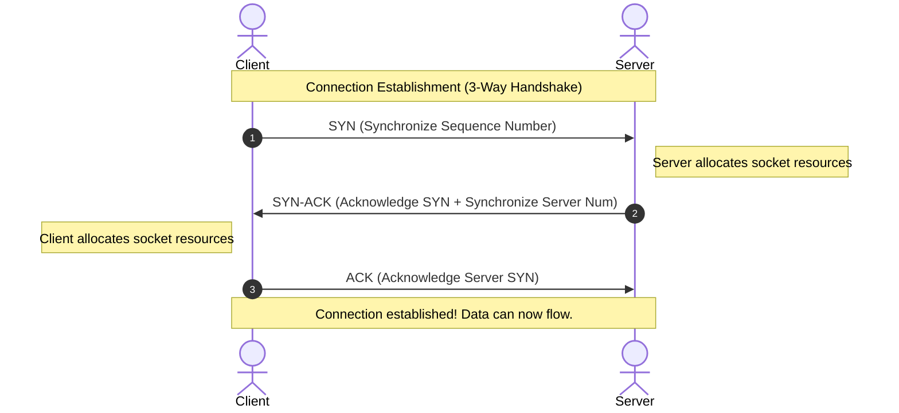
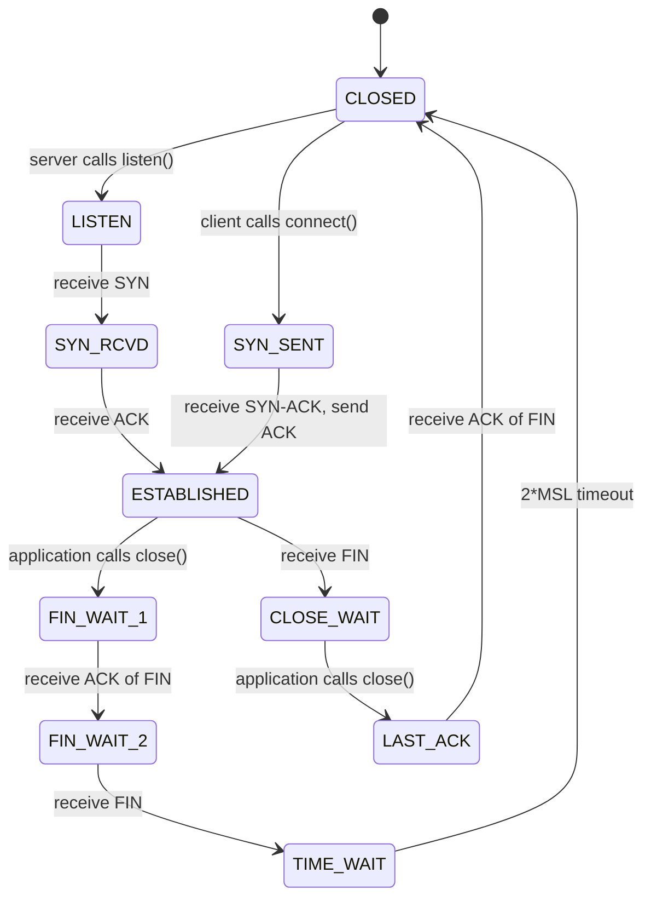
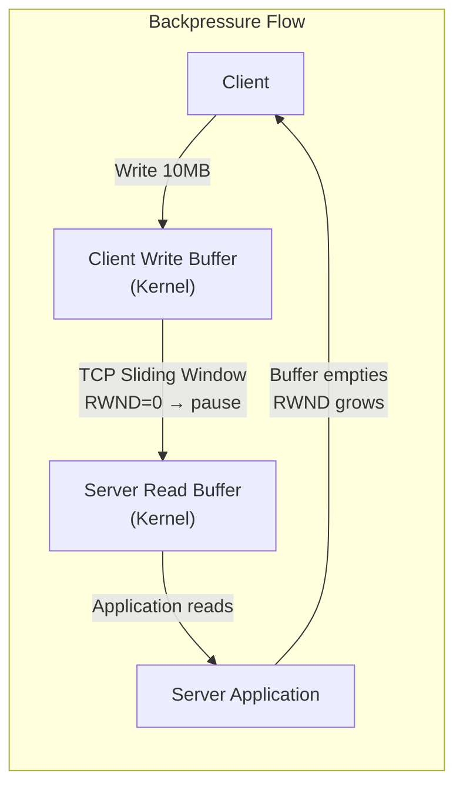

# 🔬 Lab 00: Implement TCP from Scratch

In this laboratory, you will explore the foundational layer of modern web communication: **TCP (Transmission Control Protocol)** at the transport layer. You will understand how computers establish a reliable stream of bytes over an unreliable network, how the operating system handles connections, and how to write a raw TCP listener and client wrapper.

---

## 1. 💡 The Core Concepts

To build on top of TCP, you must understand how the operating system and the hardware work together to manage network connections.

### What is a Socket?
At its simplest, a **Socket** is a software abstraction provided by the operating system kernel that represents an endpoint for sending or receiving data across a network. 

In Unix-like systems, **everything is a file**. A socket is managed by the kernel as a **File Descriptor (FD)**. When your application creates a socket, the OS returns an integer representing that socket in the process's file descriptor table.
- **Port**: An addressable 16-bit number (0 - 65535) used to distinguish different services on a single physical machine.
- **Socket**: The combination of an IP address and a Port (e.g., `127.0.0.1:8080`).
- **Connection**: A unique quad-tuple of: `(Source IP, Source Port, Destination IP, Destination Port)`. This is why a single port (like `80` or `443`) can handle tens of thousands of concurrent connections simultaneously!

#### L2: How the OS Manages Sockets Internally

```
Process File Descriptor Table:
┌────────────────────────────────────┐
│ FD 0  -> stdin                     │
│ FD 1  -> stdout                    │
│ FD 2  -> stderr                    │
│ FD 3  -> socket (127.0.0.1:8080)   │  <-- server listening socket
│ FD 4  -> socket (client-conn-1)    │  <-- per-client socket
│ FD 5  -> socket (client-conn-2)    │
└────────────────────────────────────┘
```

When you call `net.createServer()` in Node.js, the OS kernel:
1. Allocates a new socket file descriptor.
2. Binds it to the specified IP:Port pair (`bind` syscall).
3. Sets it to listening mode (`listen` syscall) — creating a kernel-managed **accept queue** of pending connection SYN requests.
4. On every accepted connection, the OS creates a brand new dedicated FD for that specific client — the original listening socket stays free for new connections.

```typescript
// Node.js internally wraps these OS syscalls:
import * as net from 'net';

const server = net.createServer((socket) => {
  // `socket` here is a brand-new FD for this client
  console.log(`New connection from ${socket.remoteAddress}:${socket.remotePort}`);
  socket.setNoDelay(true); // Disables Nagle's Algorithm (TCP_NODELAY)
});

server.listen(8080, '127.0.0.1', () => {
  console.log('Server listening on 127.0.0.1:8080');
});
```

---

### The Three-Way Handshake (Connection Establishment)
Before any data can flow, TCP must establish a connection. This is done through a synchronized sequence of packet exchanges:



1. **SYN**: The client sends a segment with the `SYN` flag set, containing an Initial Sequence Number (ISN) to synchronize sequence tracking.
2. **SYN-ACK**: The server responds with `SYN` and `ACK` flags set, acknowledging the client's sequence number and sending its own server ISN.
3. **ACK**: The client sends an `ACK` segment, acknowledging the server's sequence number. The connection is now in the `ESTABLISHED` state.

#### L2: TCP State Machine — The Full Picture



> **Why `TIME_WAIT` lasts 2 × MSL (Maximum Segment Lifetime)?**  
> The last ACK packet the client sends might be lost in transit. The server will retransmit its FIN. If the client already closed, the server would get a RST, causing confusion. The `TIME_WAIT` window (typically 60–120 seconds) ensures any last packets are absorbed before the port is reused.

---

## 2. 🌍 Real-Life Production Applications

Every single time you visit a website (HTTP), query a PostgreSQL database, or fetch a key from Redis, a TCP connection is active under the hood:
- **HTTP/1.1 and HTTP/2**: Rely strictly on persistent TCP connections.
- **Database Connection Pools**: Maintain a hot pool of active TCP connections to bypass the expensive 3-way handshake on every query.
- **EMFILE (Too Many Open Files)**: In production systems under high load, you may encounter `Error: EMFILE`. This occurs when your application has opened more sockets than the operating system's configured per-process file descriptor limit (`ulimit -n`).

### Real-World Example: Database Connection Pooling

```typescript
// Without pooling: 3-way handshake PER QUERY (3-30ms overhead!)
const result = await openTCPConnection('postgres:5432');
await query(result, 'SELECT * FROM orders');
await closeTCPConnection(result); // 4-way FIN teardown overhead

// With pooling: connections stay open in ESTABLISHED state
const pool = createPool({ host: 'postgres', port: 5432, max: 10 });
const conn = await pool.acquire(); // Instantly reuse idle socket
await query(conn, 'SELECT * FROM orders');
pool.release(conn); // Return socket back to pool — NOT closed!
```

---

## 3. ⚙️ Advanced System Design Add-Ons

To truly master TCP, you must understand the optimizations and limits that govern high-performance network programming:

### A. Backpressure & The Sliding Window
What happens if a fast client sends 100MB of data, but the server is slow and can only process 1MB per second?
TCP manages this using the **Sliding Window Buffer**.
- Every socket has an operating system **Read Buffer** and **Write Buffer**.
- The server advertises its remaining read buffer size (the "Receive Window" or `win`) inside every TCP header it sends back to the client.
- If the server's read buffer fills up, the advertised window drops to `0`. The client's TCP stack automatically stops sending packets, pausing the transmission until the server's application reads data and empties the buffer.
- This automatic throttling is called **Backpressure**. If you ignore backpressure in your code (e.g. reading forever without checking if your consumer is saturated), your application will run out of memory (OOM).



```typescript
// Correct backpressure handling:
public send(data: string | Buffer): Promise<void> {
  return new Promise((resolve, reject) => {
    if (!this.socket) return reject(new Error('Not connected'));
    
    const canContinue = this.socket.write(data);
    
    if (canContinue) {
      resolve(); // OS buffer has space — wrote immediately
    } else {
      // OS write buffer is FULL. Wait for 'drain' event before resolving.
      // The 'drain' event fires when the kernel has flushed data to the network
      // and there's room in the write buffer again.
      this.socket.once('drain', resolve);
    }
  });
}
```

### B. Nagle's Algorithm vs. TCP_NODELAY
By default, TCP tries to minimize network overhead by combining small outgoing packets into a single larger packet before sending them. This is known as **Nagle's Algorithm**.
- While Nagle's algorithm is excellent for bandwidth efficiency, it introduces a delay (up to 200ms) waiting for the buffer to fill or an ACK to arrive.
- For low-latency systems (e.g. real-time chat, multiplayer games, Redis queries), Nagle's algorithm is disastrous.
- **The Solution**: Set `TCP_NODELAY` to `true`. This disables Nagle's algorithm, forcing the socket to flush packets immediately as soon as they are written.

```typescript
// Disable Nagle's Algorithm immediately on each accepted socket:
server.on('connection', (socket) => {
  socket.setNoDelay(true); // TCP_NODELAY = 1 at the OS level
  // Now every socket.write() immediately sends a packet
});
```

### C. TCP Keep-Alive vs. Half-Open Connections
If a client abruptly loses internet connection (e.g. runs out of battery or drives into a tunnel) without sending a closing `FIN` packet, the server's TCP connection remains open forever. This is a **Half-Open Connection**.
- Over time, these dead connections accumulate, leaking file descriptors and server memory.
- **The Solution**: **TCP Keep-Alive**. The operating system periodically sends empty probe packets to the client. If the client fails to acknowledge them after a threshold, the kernel marks the connection as dead and frees the socket descriptor.

```typescript
// Enable TCP Keep-Alive: probe every 60s, after 10s idle
socket.setKeepAlive(true, 10000); // 10,000ms initial idle delay

// The OS will then send probes. If client doesn't respond
// within the kernel's probe timeout, socket is auto-destroyed.
```

---

## 🚨 Common Pitfalls & Anti-Patterns

### 1. Not Handling the `'error'` Event
If you don't attach an `'error'` listener to a socket, any network error will crash the Node.js process with an uncaught exception.
```typescript
// ❌ Wrong — unhandled error will crash the process
const client = new net.Socket();
client.connect(8080, 'localhost');

// ✅ Correct — always handle socket errors
client.on('error', (err) => {
  console.error('Socket error:', err.message);
});
```

### 2. Ignoring Backpressure
```typescript
// ❌ Wrong — ignores backpressure, causes OOM
for (const chunk of largeData) {
  socket.write(chunk); // Returns false but we don't care!
}

// ✅ Correct — awaits drain before next write
for (const chunk of largeData) {
  const ok = socket.write(chunk);
  if (!ok) await new Promise((r) => socket.once('drain', r));
}
```

### 3. Not Tracking `activeSockets`
```typescript
// ❌ Wrong — server.close() only stops new connections.
//    Existing sockets stay open forever, preventing process exit.
server.close();

// ✅ Correct — manually destroy all active client sockets
activeSockets.forEach((socket) => socket.destroy());
server.close();
```

### 4. Port Reuse Errors (EADDRINUSE)
In tests, if the previous test server doesn't fully shut down before the next test binds to the same port, you'll see `Error: EADDRINUSE`. Fix by using unique ports per test or awaiting complete shutdown.

---

## 🛠️ Laboratory Challenge: Implement a Reliable TCP Client-Server

### The Goal
Your challenge is to implement a raw TCP Server and Client using low-level socket streams. You will:
1. Handle incoming raw byte streams.
2. Implement **backpressure** using stream drains.
3. Manage active connection state.
4. Disable Nagle's algorithm via `TCP_NODELAY` to optimize for sub-millisecond response times.

### Step-by-Step Implementation Guide
1. Open the `starter` folder.
2. Check out `index.ts` to see the structure:
   - `TCPServer`: Binds to a port, maintains a list of active client sockets, and exposes events for `connection`, `data`, and `close`.
   - `TCPClient`: Establishes a raw connection, handles reconnects, and safely writes chunked data.
3. Write your implementations and run the TDD tests using:
   ```bash
   npm test
   ```
4. Watch the red failing tests turn **GREEN**!

### Detailed Implementation Roadmap

#### TCPServer.start()
```typescript
// 1. Create the server with net.createServer()
// 2. On each connection:
//    a. Call socket.setNoDelay(true)
//    b. Add socket to activeSockets Set
//    c. Call onConnectionCallback if set
//    d. Register socket 'data' event -> onDataCallback
//    e. Register socket 'close' event -> remove from activeSockets, call onCloseCallback
//    f. Register socket 'error' event -> socket.destroy() to prevent leaks
// 3. server.listen(port, host, () => resolve())
// 4. server.on('error', reject)
```

#### TCPClient.send() with Backpressure
```typescript
// 1. Guard: if socket is null, reject with Error
// 2. const flushed = this.socket.write(data)
// 3. if (flushed) -> resolve() immediately
// 4. else -> this.socket.once('drain', resolve) to wait for buffer to empty
```

---

## 🔑 Key Takeaways

| Concept | One-Line Summary |
|:---|:---|
| **Socket = FD** | A socket is just a file descriptor managed by the OS kernel |
| **3-Way Handshake** | SYN → SYN-ACK → ACK establishes reliable sequence tracking |
| **Backpressure** | TCP sliding window prevents fast senders from OOMing slow receivers |
| **TCP_NODELAY** | Disables Nagle's algorithm for sub-millisecond latency-critical systems |
| **Keep-Alive** | OS probes detect half-open (zombie) connections and frees their FDs |
| **TIME_WAIT** | Lingering state ensures last ACK is safely absorbed before port reuse |

## 📚 Further Reading
- [RFC 9293 – Transmission Control Protocol](https://www.rfc-editor.org/rfc/rfc9293)
- [Beej's Guide to Network Programming](https://beej.us/guide/bgnet/)
- [Linux `man 7 tcp`](https://man7.org/linux/man-pages/man7/tcp.7.html) — detailed TCP socket options
- [Node.js `net` module documentation](https://nodejs.org/api/net.html)
