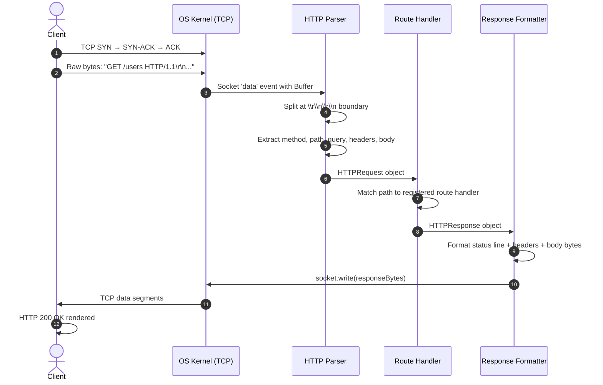
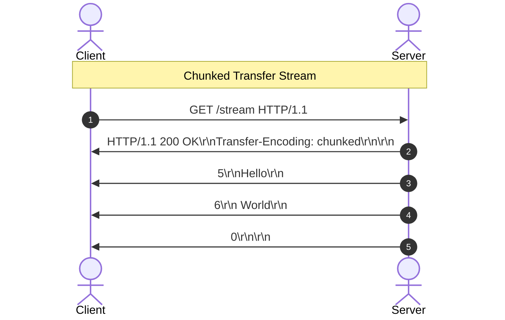
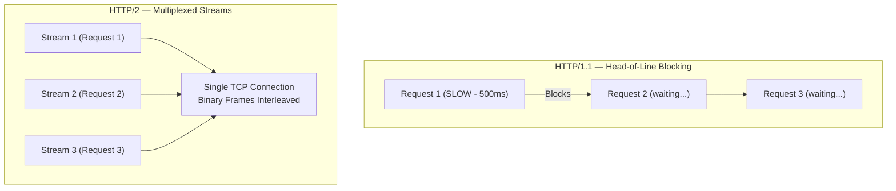

# 🔬 Lab 01: HTTP/1.1 Server from Scratch

In this laboratory, you will step up from raw transport byte streams (TCP) to the application layer: **HTTP (Hypertext Transfer Protocol)**. You will build a raw HTTP/1.1 compliant web server from scratch, parsing incoming headers and request lines, and formatting standard-compliant response byte streams.

---

## 1. 💡 The Core Concepts

HTTP/1.1 is a text-based request-response protocol defined under **RFC 2616** and **RFC 7230**. It operates on top of TCP and is governed by strict parsing boundaries.

### The Anatomy of an HTTP Request
An HTTP request is a sequence of characters separated by carriage return and line feed characters (`\r\n`, also known as CRLF).

```
[Request Line]       ->  GET /index.html HTTP/1.1\r\n
[Headers]            ->  Host: localhost:8080\r\n
                         User-Agent: Mozilla/5.0\r\n
                         Content-Length: 12\r\n
[Empty Line]         ->  \r\n
[Request Body]       ->  Hello World!
```

### The Anatomy of an HTTP Response

```
[Status Line]        ->  HTTP/1.1 200 OK\r\n
[Headers]            ->  Content-Type: application/json\r\n
                         Content-Length: 27\r\n
                         Connection: keep-alive\r\n
[Empty Line]         ->  \r\n
[Body]               ->  {"status":"success","id":1}
```

---

### Parsing the Stream

#### L1: The High-Level Algorithm

When a client sends an HTTP request over a TCP socket, the server receives a raw stream of bytes. To parse it:
1. **Find the Headers Boundary**: Find the first occurrence of double CRLF (`\r\n\r\n`). Everything before this boundary represents the headers block; everything after is the body payload.
2. **Parse the Request Line**: The first line of the header block. Split it by spaces to extract:
   - **Method**: (e.g. `GET`, `POST`, `PUT`, `DELETE`).
   - **Request-URI**: The target path and query string (e.g. `/users?id=42`).
   - **HTTP Version**: Must be `HTTP/1.1`.
3. **Parse Headers**: Split the remaining lines in the header block by `\r\n`. Each line represents a `Key: Value` pair. Lowercase the keys for case-insensitive lookup (as required by the HTTP spec!).
4. **Determine Body Length**: Look for the `Content-Length` header (specifying the exact number of bytes in the body) or `Transfer-Encoding: chunked`. Read exactly that number of bytes from the socket.

#### L2: Step-by-Step Parsing with Code

```typescript
// Step 1: Find the header boundary
const DOUBLE_CRLF = '\r\n\r\n';
const boundaryIndex = rawRequest.indexOf(DOUBLE_CRLF);
// Everything before boundary = headers block
const headersBlock = rawRequest.substring(0, boundaryIndex);
// Everything after boundary = potential body
const bodyRaw = rawRequest.substring(boundaryIndex + DOUBLE_CRLF.length);

// Step 2: Split header block into lines
const lines = headersBlock.split('\r\n');
// lines[0] = Request Line (e.g. "GET /search?q=test HTTP/1.1")
// lines[1..N] = Header key-value pairs

// Step 3: Parse the Request Line
const [method, requestUri, httpVersion] = lines[0].split(' ');

// Step 4: Parse the Request-URI into path + query params
const urlObj = new URL(requestUri, 'http://localhost');
const path = urlObj.pathname;   // "/search"
const query: Record<string, string> = {};
urlObj.searchParams.forEach((val, key) => { query[key] = val; });

// Step 5: Parse headers (lowercase keys!)
const headers: Record<string, string> = {};
for (let i = 1; i < lines.length; i++) {
  const colonIdx = lines[i].indexOf(':');
  if (colonIdx === -1) continue;
  const key = lines[i].substring(0, colonIdx).trim().toLowerCase();
  const value = lines[i].substring(colonIdx + 1).trim();
  headers[key] = value;
}

// Step 6: Extract body based on Content-Length
const contentLength = parseInt(headers['content-length'] || '0', 10);
const body = bodyRaw.substring(0, contentLength);
```

---

### HTTP Request/Response Flow Through the Stack



---

## 2. 🌍 Real-Life Production Applications

Every modern web framework (Express, Flask, Spring Boot, Go's net/http) sits on top of this exact byte-parsing logic:
- **Keep-Alive (Persistent Connections)**: In HTTP/1.0, every request required opening a new TCP connection, leading to massive handshake overhead. HTTP/1.1 introduced `Connection: keep-alive` by default. Sockets remain open after a response, letting clients send subsequent requests down the same channel.
- **Header Injection Vulnerabilities**: If an HTTP parser does not validate CRLF sequences in header inputs, an attacker can inject malicious headers, causing cache poisoning or response splitting.

### Real-World Example: Express.js Under the Hood
```typescript
// What Express does internally for every request:
// 1. Receives raw bytes on a net.Socket
// 2. Buffers bytes until \r\n\r\n boundary
// 3. Calls parseRequest() equivalent
// 4. Routes to handler
// 5. Calls formatResponse() equivalent
// 6. Writes bytes to socket

// Our server does exactly the same — just without the middleware abstraction layer
const server = new HTTPServer();
server.registerRoute('/api/users', (req) => {
  return { statusCode: 200, statusText: 'OK', headers: {}, body: '[]' };
});
```

---

## 3. ⚙️ Advanced System Design Add-Ons

### A. HTTP Chunked Transfer Encoding
What if the server is streaming a massive file or generating a dynamic response, and doesn't know the final size in advance? It cannot send a `Content-Length` header.
- **The Solution**: `Transfer-Encoding: chunked`.
- The body is sent as a series of chunks. Each chunk begins with its size in hex characters, followed by `\r\n`, the chunk bytes, and another `\r\n`.
- A final chunk of size `0` (`0\r\n\r\n`) signals the end of the response.



```
Chunk format:
<size-in-hex>\r\n
<chunk-bytes>\r\n
...
0\r\n
\r\n   <- End of body
```

### B. Connection Pipelines & Multiplexing
- **Pipelining**: An HTTP/1.1 client can send multiple requests down a single socket before waiting for the responses. However, the server *must* respond in the exact order the requests were received. If request #1 is slow, it blocks responses #2 and #3. This is the **Head-of-Line (HoL) Blocking** problem.
- **HTTP/2 & HTTP/3 Solution**: Instead of raw text lines, HTTP/2 breaks communication into binary frames and multiplexes them over a single TCP connection, eliminating HoL blocking at the HTTP layer.



### C. Status Code Semantics — What to Return When

| Scenario | Status Code | Meaning |
|:---|:---:|:---|
| Successful GET | `200 OK` | Resource found and returned |
| Resource created | `201 Created` | POST created a new resource |
| Redirect | `302 Found` | Client should follow `Location` header |
| Bad request format | `400 Bad Request` | Client sent malformed data |
| Auth required | `401 Unauthorized` | No/invalid credentials |
| Forbidden | `403 Forbidden` | Valid credentials, but no permission |
| Not found | `404 Not Found` | Resource doesn't exist |
| Server crashed | `500 Internal Server Error` | Unhandled exception on server |

---

## 🚨 Common Pitfalls & Anti-Patterns

### 1. Not Buffering the Socket Stream
TCP is a byte-stream protocol. A single HTTP request can arrive in multiple `'data'` events. Always buffer until you find the `\r\n\r\n` boundary:
```typescript
// ❌ Wrong — may only have partial headers
socket.on('data', (chunk) => {
  const req = HTTPServer.parseRequest(chunk.toString()); // May fail!
});

// ✅ Correct — buffer until complete headers arrive
let buffer = '';
socket.on('data', (chunk) => {
  buffer += chunk.toString();
  if (buffer.includes('\r\n\r\n')) {
    // Now safe to parse
    const req = HTTPServer.parseRequest(buffer);
    buffer = ''; // Reset for next request (keep-alive)
  }
});
```

### 2. Case-Sensitive Header Lookup
The HTTP spec (RFC 7230) requires header names to be case-insensitive. Always lowercase them during parsing:
```typescript
// ❌ Wrong — breaks with User-Agent vs user-agent
const contentType = headers['Content-Type'];

// ✅ Correct — lowercase all header keys during parsing
const contentType = headers['content-type']; // Always lowercase
```

### 3. Forgetting `Content-Length` in Responses
Browsers and HTTP clients use `Content-Length` to know where the response body ends. Without it on a keep-alive connection, clients hang indefinitely:
```typescript
// ✅ Always include Content-Length in responses
const body = JSON.stringify(data);
return {
  statusCode: 200,
  statusText: 'OK',
  headers: {
    'Content-Type': 'application/json',
    'Content-Length': String(Buffer.byteLength(body)) // Byte count, not char count!
  },
  body
};
```

### 4. Using `String.length` Instead of `Buffer.byteLength`
For `Content-Length`, always use `Buffer.byteLength(str, 'utf8')` — not `str.length`. Multi-byte UTF-8 characters (emoji, Chinese, Arabic) have more bytes than characters:
```typescript
const body = 'こんにちは'; // 5 characters, but 15 UTF-8 bytes!
console.log(body.length);               // 5 ❌ Wrong for Content-Length
console.log(Buffer.byteLength(body));   // 15 ✅ Correct
```

---

## 🛠️ Laboratory Challenge: Implement an HTTP/1.1 Server

### The Goal
Build a raw HTTP/1.1 server that parses client request byte streams and serves routes. You will:
1. Parse Request Lines and headers cleanly.
2. Extract query parameters (e.g. `/search?q=query` -> `{ q: 'query' }`).
3. Handle request bodies using `Content-Length`.
4. Return appropriate status codes (`200 OK`, `404 Not Found`, `400 Bad Request`).
5. Maintain persistent socket channels when `Connection: keep-alive` is set.

### Step-by-Step Implementation Guide

#### `parseRequest(rawRequest: string)` — Static Parser
```
1. Find the index of '\r\n\r\n' in rawRequest
2. Split at the boundary: headersBlock = before, bodyRaw = after
3. Split headersBlock by '\r\n' into lines[]
4. Split lines[0] by ' ' → [method, requestUri, version]
5. Parse requestUri using URL API or manual indexOf('?')
6. For lines[1..N]: split each at first ':' → lowercase key, trimmed value
7. Parse body: bodyRaw.substring(0, parseInt(headers['content-length'] || '0'))
```

#### `formatResponse(res: HTTPResponse)` — Static Formatter
```
1. Construct status line: `HTTP/1.1 ${statusCode} ${statusText}\r\n`
2. Append each header entry: `${key}: ${value}\r\n`
3. Append empty line: '\r\n'
4. Append body string
```

---

## 🔑 Key Takeaways

| Concept | One-Line Summary |
|:---|:---|
| **CRLF Boundary** | `\r\n\r\n` separates HTTP headers from the body |
| **Lowercase Headers** | RFC 7230 requires case-insensitive header lookup |
| **Content-Length** | Always include on responses; use `Buffer.byteLength()` not `.length` |
| **TCP Buffering** | Buffer socket chunks until `\r\n\r\n` is found before parsing |
| **Keep-Alive** | HTTP/1.1 default: one TCP connection, multiple sequential requests |
| **HoL Blocking** | HTTP/1.1 pipelines block on slow responses; HTTP/2 solves this with multiplexing |

## 📚 Further Reading
- [RFC 7230 – HTTP/1.1 Message Syntax and Routing](https://www.rfc-editor.org/rfc/rfc7230)
- [MDN: HTTP Messages](https://developer.mozilla.org/en-US/docs/Web/HTTP/Messages)
- [How Node.js http module parses requests](https://nodejs.org/api/http.html)
- [OWASP: HTTP Response Splitting](https://owasp.org/www-community/attacks/HTTP_Response_Splitting)
