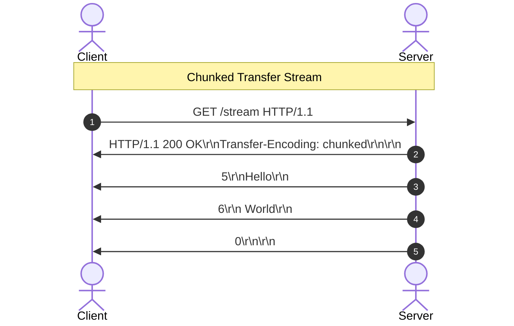

# 🔬 Lab 01: HTTP/1.1 Server from Scratch

In this laboratory, you will step up from raw transport byte streams (TCP) to the application layer: **HTTP (Hypertext Transfer Protocol)**. You will build a raw HTTP/1.1 compliant web server from scratch, parsing incoming headers and request lines, and formatting standard-compliant response byte streams.

---

## 1. 💡 The Core Concepts

HTTP/1.1 is a text-based request-response protocol defined under **RFC 2616** and **RFC 7230**. It operates on top of TCP and is governed by strict parsing boundaries.

### The Anatomy of an HTTP Request
An HTTP request is a sequence of characters separated by carriage return and line feed characters (`\r\n`, also known as CRLF).

```
[Request Line]       ->  GET /index.html HTTP/1.1\r\n
[Headers]            ->  Host: localhost:8080\r\n
                         User-Agent: Mozilla/5.0\r\n
                         Content-Length: 12\r\n
[Empty Line]         ->  \r\n
[Request Body]       ->  Hello World!
```

### Parsing the Stream
When a client sends an HTTP request over a TCP socket, the server receives a raw stream of bytes. To parse it:
1. **Find the Headers Boundary**: Find the first occurrence of double CRLF (`\r\n\r\n`). Everything before this boundary represents the headers block; everything after is the body payload.
2. **Parse the Request Line**: The first line of the header block. Split it by spaces to extract:
   - **Method**: (e.g. `GET`, `POST`, `PUT`, `DELETE`).
   - **Request-URI**: The target path and query string (e.g. `/users?id=42`).
   - **HTTP Version**: Must be `HTTP/1.1`.
3. **Parse Headers**: Split the remaining lines in the header block by `\r\n`. Each line represents a `Key: Value` pair. Lowercase the keys for case-insensitive lookup (as required by the HTTP spec!).
4. **Determine Body Length**: Look for the `Content-Length` header (specifying the exact number of bytes in the body) or `Transfer-Encoding: chunked`. Read exactly that number of bytes from the socket.

---

## 2. 🌍 Real-Life Production Applications

Every modern web framework (Express, Flask, Spring Boot, Go's net/http) sits on top of this exact byte-parsing logic:
- **Keep-Alive (Persistent Connections)**: In HTTP/1.0, every request required opening a new TCP connection, leading to massive handshake overhead. HTTP/1.1 introduced `Connection: keep-alive` by default. Sockets remain open after a response, letting clients send subsequent requests down the same channel.
- **Header Injection Vulnerabilities**: If an HTTP parser does not validate CRLF sequences in header inputs, an attacker can inject malicious headers, causing cache poisoning or response splitting.

---

## 3. ⚙️ Advanced System Design Add-Ons

### A. HTTP Chunked Transfer Encoding
What if the server is streaming a massive file or generating a dynamic response, and doesn't know the final size in advance? It cannot send a `Content-Length` header.
- **The Solution**: `Transfer-Encoding: chunked`.
- The body is sent as a series of chunks. Each chunk begins with its size in hex characters, followed by `\r\n`, the chunk bytes, and another `\r\n`.
- A final chunk of size `0` (`0\r\n\r\n`) signals the end of the response.



### B. Connection Pipelines & Multiplexing
- **Pipelining**: An HTTP/1.1 client can send multiple requests down a single socket before waiting for the responses. However, the server *must* respond in the exact order the requests were received. If request #1 is slow, it blocks responses #2 and #3. This is the **Head-of-Line (HoL) Blocking** problem.
- **HTTP/2 & HTTP/3 Solution**: Instead of raw text lines, HTTP/2 breaks communication into binary frames and multiplexes them over a single TCP connection, eliminating HoL blocking at the HTTP layer.

---

## 🛠️ Laboratory Challenge: Implement an HTTP/1.1 Server

### The Goal
Build a raw HTTP/1.1 server that parses client request byte streams and serves routes. You will:
1. Parse Request Lines and headers cleanly.
2. Extract query parameters (e.g. `/search?q=query` -> `{ q: 'query' }`).
3. Handle request bodies using `Content-Length`.
4. Return appropriate status codes (`200 OK`, `404 Not Found`, `400 Bad Request`).
5. Maintain persistent socket channels when `Connection: keep-alive` is set.
