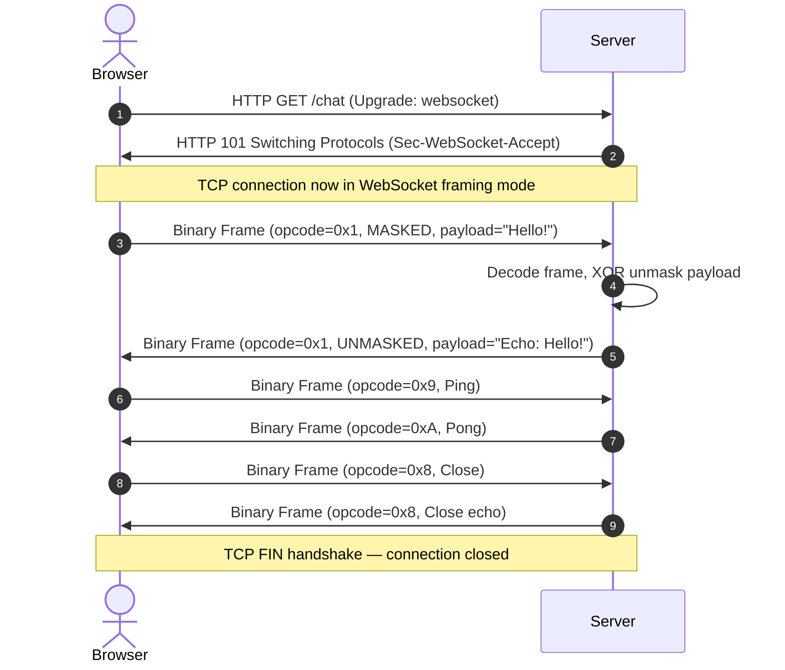
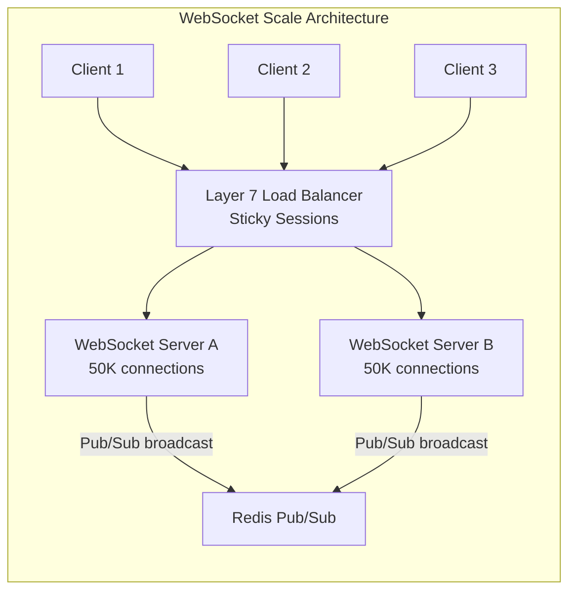

# 🔬 Lab 02: WebSocket Chat Broker from Scratch

In this laboratory, you will build a real-time, bi-directional communication server: **WebSockets** (standardized in **RFC 6455**). You will implement the low-level HTTP handshake upgrade, parse raw binary framing buffers, unmask client payloads using bitwise XOR, and orchestrate a multi-user broadcast chat server.

---

## 1. 💡 The Core Concepts

Traditional HTTP is unidirectional—the client must pull data from the server. WebSockets allow **full-duplex**, persistent, low-overhead communication where either side can push data at any time down a single TCP connection.

### A. The Handshake (HTTP Upgrade)
A WebSocket connection begins as a standard HTTP/1.1 request containing upgrade headers:

```http
GET /chat HTTP/1.1
Host: localhost:8080
Upgrade: websocket
Connection: Upgrade
Sec-WebSocket-Key: dGhlIHNhbXBsZSBub25jZQ==
Sec-WebSocket-Version: 13
```

To accept the handshake, the server must:
1. Concatenate the client's `Sec-WebSocket-Key` with the globally standardized magic UUID string: `258EAFA5-E914-47DA-95CA-C5AB0DC85B11`.
2. Compute the **SHA-1 hash** of this concatenated string.
3. Encode the binary hash output into **Base64**.
4. Return a `101 Switching Protocols` response:

```http
HTTP/1.1 101 Switching Protocols
Upgrade: websocket
Connection: Upgrade
Sec-WebSocket-Accept: s3pPLMBiTxaQ9kYGzzhZRbK+xOo=
```

#### L2: Why SHA-1 + Magic UUID?
The magic UUID is hardcoded into the WebSocket RFC itself. The SHA-1 + Base64 challenge-response mechanism prevents a non-WebSocket-aware reverse proxy from accidentally caching or mangling the response. It proves the server deliberately supports the WebSocket upgrade — a form of **protocol negotiation proof**.

```typescript
import * as crypto from 'crypto';

function generateAcceptKey(clientKey: string): string {
  const MAGIC = '258EAFA5-E914-47DA-95CA-C5AB0DC85B11';
  // Step 1: Concatenate key + magic UUID
  const combined = clientKey + MAGIC;
  // Step 2: SHA-1 hash of the concatenated string
  const hash = crypto.createHash('sha1').update(combined).digest();
  // Step 3: Base64 encode the binary hash
  return hash.toString('base64');
}

// RFC 6455 standard test vector:
// Input:  'dGhlIHNhbXBsZSBub25jZQ=='
// Output: 's3pPLMBiTxaQ9kYGzzhZRbK+xOo='
```

---

### B. The WebSocket Binary Frame Protocol
Once the handshake completes, the connection switches from HTTP text format to the **WebSocket Framing Protocol**. Data is sent in binary packets called **Frames**.

```
  0                   1                   2                   3
  0 1 2 3 4 5 6 7 8 9 0 1 2 3 4 5 6 7 8 9 0 1 2 3 4 5 6 7 8 9 0 1
 +-+-+-+-+-------+-+-------------+-------------------------------+
 |F|R|R|R| opcode|M|     payload |    Extended payload length    |
 |I|S|S|S|  (4b) |A|   len (7b)  |             (16/64)           |
 |N|V|V|V|       |S|             |   (if payload len==126/127)   |
 | |1|2|3|       |K|             |                               |
 +-+-+-+-+-------+-+-------------+ - - - - - - - - - - - - - - - +
 |     Masking-key (4 bytes, client-to-server frames only)       |
 +-------------------------------+ - - - - - - - - - - - - - - - +
 |                          Payload Data                         |
 +---------------------------------------------------------------+
```

- **FIN (Bit 0)**: Indicates if this is the final fragment of the message (`1` = yes).
- **Opcode (Bits 4-7)**: The type of frame:
  - `0x1`: Text Frame.
  - `0x2`: Binary Frame.
  - `0x8`: Connection Close.
  - `0x9`: Ping.
  - `0xA`: Pong (Heartbeat response).
- **MASK (Bit 8)**: Specifies if the payload is masked (`1` = yes). **All client-to-server frames MUST be masked!** Sockets must drop unmasked client frames to prevent cache poisoning attacks.
- **Payload Length (Bits 9-15)**:
  - If `< 126`: The actual payload length.
  - If `== 126`: Next 2 bytes represent the length as a 16-bit unsigned integer.
  - If `== 127`: Next 8 bytes represent the length as a 64-bit unsigned integer.
- **Masking Key**: 4 bytes of random data.
- **Payload Data**: To extract the actual text or binary, you must unmask every byte using bitwise XOR:
  $$\text{OriginalByte}_i = \text{MaskedByte}_i \oplus \text{MaskingKey}_{i \bmod 4}$$

#### L2: Frame Parsing Step-by-Step

```typescript
function decodeFrame(buffer: Buffer): { opcode: number; payload: string | null } {
  // Byte 0: FIN bit + opcode
  const finBit = (buffer[0] >> 7) & 1;       // Bit 7 of byte 0
  const opcode = buffer[0] & 0x0F;            // Lower 4 bits of byte 0
  
  // Byte 1: MASK bit + payload length (7 bits)
  const maskBit = (buffer[1] >> 7) & 1;       // Bit 7 of byte 1
  let payloadLength = buffer[1] & 0x7F;       // Lower 7 bits of byte 1
  let offset = 2;
  
  // Extended payload length handling
  if (payloadLength === 126) {
    payloadLength = buffer.readUInt16BE(offset); // Read 2 more bytes
    offset += 2;
  } else if (payloadLength === 127) {
    // Read 8 more bytes (use last 4 for simplicity — JS numbers are 53-bit)
    payloadLength = buffer.readUInt32BE(offset + 4);
    offset += 8;
  }
  
  // Extract masking key (4 bytes) — only present if mask bit is set
  let maskingKey: Buffer | null = null;
  if (maskBit) {
    maskingKey = buffer.subarray(offset, offset + 4);
    offset += 4;
  }
  
  // Extract and unmask the payload
  const maskedPayload = buffer.subarray(offset, offset + payloadLength);
  if (maskingKey) {
    for (let i = 0; i < maskedPayload.length; i++) {
      maskedPayload[i] ^= maskingKey[i % 4]; // XOR unmask in-place
    }
  }
  
  return {
    opcode,
    payload: opcode === 0x1 ? maskedPayload.toString('utf8') : null
  };
}
```

---

### C. WebSocket Connection Lifecycle



---

## 2. 🌍 Real-Life Production Applications

WebSockets power the real-time web:
- **Collaborative Whiteboards & Editors**: Figma, Google Docs, Notion.
- **Financial Trading Platforms**: Pushing real-time stock and crypto tickers down to web dashboards.
- **Push Notification Brokers**: Maintaining millions of persistent connections in companies like WhatsApp to push immediate notifications with minimal overhead.

---

## 3. ⚙️ Advanced System Design Add-Ons

### A. Connection Scaling (Millions of Connections)
- WebSockets are **stateful**. Unlike stateless HTTP where request/response cycles end, a WebSocket socket remains open. 
- If a server has 100,000 active clients, it must maintain 100,000 open file descriptors.
- **The Solution**: Event-driven I/O models (like epoll in Linux) and highly scalable reverse proxies (like HAProxy or AWS ALB) to offload connection management.



**Critical Problem**: If Client A (on Server A) sends a message, and Client B (on Server B) needs to receive it — how does Server B know? The answer is a **shared Pub/Sub channel** (Redis Pub/Sub or a Message Queue). Server A publishes the message; Server B is subscribed and broadcasts to its local clients.

### B. Heartbeats & Disconnect Detection
If a client socket drops silently (e.g. WiFi disconnects), the TCP socket might not notice immediately.
- **The Solution**: **Ping/Pong Heartbeats**.
- The server periodically sends a `Ping` frame (`0x9`). The client's browser is hardcoded by the spec to immediately return a `Pong` frame (`0xA`). If the server doesn't receive a Pong within a timeout window, it terminates the socket.

```typescript
// Server-side heartbeat pattern:
function setupHeartbeat(socket: net.Socket) {
  const PING_INTERVAL = 30000; // 30 seconds
  const PONG_TIMEOUT = 5000;   // 5 seconds to respond

  const interval = setInterval(() => {
    // Send Ping frame (opcode 0x9)
    socket.write(Buffer.from([0x89, 0x00])); // FIN + Ping + no payload

    const timeout = setTimeout(() => {
      console.log('Client failed heartbeat — destroying socket');
      socket.destroy(); // Half-open connection detected!
    }, PONG_TIMEOUT);

    // Cancel timeout when Pong arrives
    socket.once('pong', () => clearTimeout(timeout));
  }, PING_INTERVAL);

  socket.once('close', () => clearInterval(interval));
}
```

---

## 🚨 Common Pitfalls & Anti-Patterns

### 1. Not Handling Fragmented Frames
A single large WebSocket message may arrive split across multiple TCP packets (`'data'` events). Always buffer until you have enough bytes to read the full frame:
```typescript
// ❌ Wrong — assumes entire frame arrives in one data event
socket.on('data', (chunk) => {
  const { payload } = decodeFrame(chunk); // May fail on partial frame!
});

// ✅ Correct — accumulate buffer until frame is complete
let buffer = Buffer.alloc(0);
socket.on('data', (chunk) => {
  buffer = Buffer.concat([buffer, chunk]);
  // Check if we have enough bytes for the frame header + payload
  while (buffer.length >= 2) {
    const payloadLen = buffer[1] & 0x7F;
    const frameLen = 2 + (buffer[0] & 1 ? 4 : 0) + payloadLen; // simplified
    if (buffer.length < frameLen) break; // Wait for more data
    const frame = buffer.subarray(0, frameLen);
    const decoded = decodeFrame(frame);
    buffer = buffer.subarray(frameLen); // Advance buffer past this frame
    handleMessage(decoded);
  }
});
```

### 2. Sending Masked Frames from Server
Only clients mask frames. Server-to-client frames MUST NOT be masked. Using a mask on server frames causes browsers to throw protocol errors.

### 3. Not Responding to Close Frames
When a client sends a Close frame (`0x8`), the server MUST echo a Close frame before destroying the socket. Skipping this causes the browser to mark the connection as "abnormally closed" and may trigger aggressive reconnect storms.

---

## 🛠️ Laboratory Challenge: Implement a WebSocket Server

### The Goal
Build a raw WebSocket server that upgrades connections, unmasks payloads, handles ping/pong frame loops, and implements a multi-user real-time chat room. You will:
1. Accept incoming HTTP upgrade requests and return compliant `101 Switching Protocols` headers with correct SHA-1 keys.
2. Read binary buffers and parse frame headers (opcodes, masking flags, payload boundaries).
3. Apply the **XOR bitwise masking formula** to extract payloads.
4. Broadcast incoming chat messages to all other connected client sockets.
5. Manage connections by responding to browser Ping events and handling graceful Close frames (`0x8`).

---

## 🔑 Key Takeaways

| Concept | One-Line Summary |
|:---|:---|
| **Upgrade Handshake** | SHA-1(clientKey + MagicUUID) proves server intentionally supports WebSocket |
| **Binary Framing** | Frames carry FIN, opcode, mask bit, variable-length payload + 4-byte masking key |
| **XOR Unmasking** | `originalByte[i] = maskedByte[i] XOR maskKey[i % 4]` |
| **Opcode 0x8/0x9/0xA** | Close / Ping / Pong — control frames for lifecycle management |
| **Heartbeats** | Periodic Ping/Pong detect half-open (zombie) WebSocket connections |
| **Scale with Pub/Sub** | Multiple WebSocket servers must share message state via a shared broker |

## 📚 Further Reading
- [RFC 6455 – The WebSocket Protocol](https://www.rfc-editor.org/rfc/rfc6455)
- [MDN: Writing WebSocket servers](https://developer.mozilla.org/en-US/docs/Web/API/WebSockets_API/Writing_WebSocket_servers)
- [WebSocket frame format visualizer](https://websocketking.com/)
