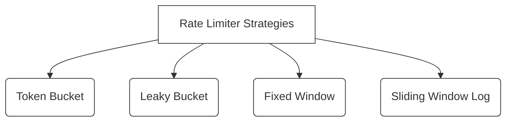
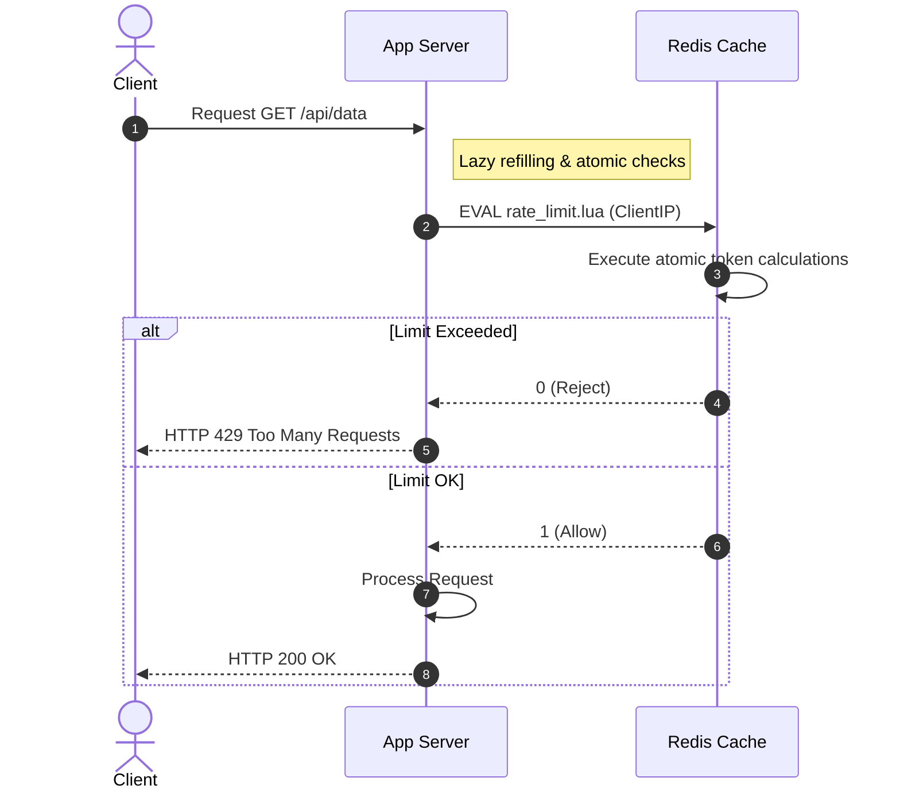

# 🔬 Lab 03: Rate Limiter Engines from Scratch

In this laboratory, you will explore the traffic-control machinery of high-scale web platforms: **Rate Limiters**. You will design and implement the four foundational rate-limiting algorithms, understand their performance trade-offs, and learn how to defend backend systems against DDoS attacks, brute force attempts, and API resource abuse.

---

## 1. 💡 The Core Concepts

A **Rate Limiter** is a system component that monitors incoming request rates and throttles traffic exceeding specified limits. It acts as an orchestrator that decides whether a request should be forwarded (`allow = true`) or rejected with an `HTTP 429 Too Many Requests` error (`allow = false`).

### The 4 Rate Limiting Algorithms

You will implement all four core rate-limiting strategies, each with a different CPU/memory trade-off:



#### A. Token Bucket
- **Concept**: A bucket has a maximum capacity $C$ and is continuously refilled with tokens at a constant rate $R$ tokens per second. Every incoming request consumes 1 token. If the bucket is empty, the request is rejected.
- **Key Advantage**: Supports **burstiness**. If a client is idle, tokens accumulate up to $C$, allowing a rapid burst of requests.
- **Implementation Trick**: Instead of spinning up active background setInterval timers to refill the bucket (which leaks CPU resources!), calculate tokens lazily on request arrival using the timestamp difference:
  $$\text{newTokens} = \min(C, \text{currentTokens} + \Delta t \times R)$$

#### B. Leaky Bucket (Traffic Shaper)
- **Concept**: Requests enter a queue (the "bucket") of capacity $C$ and are processed (the bucket "leaks") at a constant, smooth rate $R$ per second. If the queue is full, new requests are immediately dropped.
- **Key Advantage**: Produces a **perfectly smooth, constant rate** of outgoing traffic. It shapes traffic spikes into a flat line, protecting fragile downstreams.

#### C. Fixed Window Counter
- **Concept**: Divides time into fixed windows (e.g. 1 minute). Each window has a simple integer counter. When a request arrives, if the counter is below the limit, it incremented and approved; otherwise, it is blocked.
- **Key Disadvantage**: **Bursting at boundaries**. If a user sends all their allowed requests at the very end of window $W_1$ and all their requests at the very beginning of window $W_2$, they can double their limit within a short time-slice, overwhelming the server.

#### D. Sliding Window Log
- **Concept**: Solves the boundary bursting issue by keeping a precise record of request timestamps for each user. When a request arrives, look back at the sliding time window (e.g., last 60 seconds), discard timestamps older than the window, and count the remaining items. If the count is below the limit, log the new timestamp and allow; otherwise, reject.
- **Key Disadvantage**: **High Memory Footprint**. Storing timestamps for every single request consumes immense memory under high loads.

---

## 2. 🌍 Real-Life Production Applications

Rate limiters are deployed at multiple layers of infrastructure:
- **Nginx Rate Limiting (`limit_req_zone`)**: Employs the Leaky Bucket algorithm to shape traffic at the edge, protecting application servers.
- **Cloudflare WAF**: Throttles scraping bots and mitigating layer 7 DDoS floods using a distributed token bucket.
- **GitHub / Stripe API Rate Limits**: Use sliding window counters backed by shared Redis instances to enforce hourly API limits on a per-token basis.

---

## 3. ⚙️ Advanced System Design Add-Ons

### Distributed Rate Limiting (The Synchronization Bottleneck)
When scaling out to thousands of instances across multiple servers, a simple local memory rate limiter won't work:
1. **The Shared State Problem**: A client's request #1 hits server A, and request #2 hits server B. The servers must coordinate to count requests accurately.
   - **The Solution**: Use a centralized memory store like **Redis**. Redis has fast, single-threaded processing. We can run atomic operations or Lua scripts (like `INCRBY` and `EXPIRE`) to verify limits in a fraction of a millisecond.
2. **Race Conditions (Locking/Concurrent Increments)**: If two requests hit Redis at the same microsecond, both might read `limit = 9`, increment it, and allow both requests, bypassing the limit.
   - **The Solution**: **Redis Lua Scripts**. By packaging the lookup, compare, and increment operations into a single Lua script, Redis executes it atomically, preventing concurrency races.



---

## 🛠️ Laboratory Challenge: Implement Rate Limiting Engines

### The Goal
Your challenge is to implement the four core rate-limiting algorithms behind a clean, unified TypeScript interface. You will:
1. Implement a lazy-refilling **Token Bucket** without background timers.
2. Implement a constant-drip **Leaky Bucket** queue.
3. Implement a simple **Fixed Window** counter.
4. Implement a high-precision **Sliding Window Log** tracking client-specific timestamps.

### Step-by-Step Implementation Guide
1. Open the `/starter` folder.
2. Examine `index.ts` to see the `RateLimiter` interface and skeleton classes.
3. Write your implementation and run the tests:
   ```bash
   npm test
   ```
4. Watch the TDD tests turn **GREEN**!
