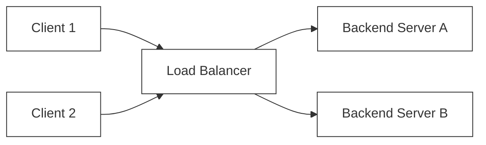

# 🔬 Lab 04: Reverse Proxy & Load Balancer from Scratch

In this laboratory, you will build a central traffic cop of modern systems: a **Layer 7 Reverse Proxy & Load Balancer**. You will implement algorithms to distribute client requests across multiple backend upstream servers, set up active background health checks to detect and eject dead servers, and learn how to forward client headers transparently.

---

## 1. 💡 The Core Concepts

A **Load Balancer** sits between clients and a cluster of backend servers. Its primary responsibilities are to prevent any single server from becoming a bottleneck, mask backend server topologies, and guarantee high availability.



### Layer 4 (L4) vs. Layer 7 (L7) Load Balancing

1. **Layer 4 (Transport Layer)**:
   - Operates strictly on raw TCP/UDP streams and IP addresses.
   - It does *not* read or inspect application-layer payloads. It opens a connection to a backend and routes bytes blindly.
   - **Advantage**: Ultra-fast, low CPU overhead.
2. **Layer 7 (Application Layer)**:
   - Operates on application-layer protocols (HTTP, WebSocket, gRPC).
   - It fully terminates the client's HTTP connection, parses the headers, paths, cookies, and parameters, and opens a *new* request to the chosen backend server.
   - **Advantage**: Smart routing (e.g., route `/api/v1` to Server A, and `/static` to CDN-backed Server B), header injection, SSL/TLS termination, and session stickiness.

---

## 2. 🧮 Upstream Selection Strategies Deep Dive

To choose which backend server handles an incoming request, the load balancer applies selection strategies:

### A. Round Robin (Modulo Cyclic Loop)
Distributes requests sequentially across backends in a cyclic loop.
- **Formula**:
  $$\text{Index} = \text{rrIndex} \pmod{N}$$
  where $N$ is the number of active, healthy backend servers.
- **Example Calculation**:
  Given active servers `[S1, S2, S3]` ($N=3$), starting with `rrIndex = 0`:
  1. Request 1: `rrIndex = 0`, index = $0 \pmod 3 = 0$ $\rightarrow$ **S1**, increment `rrIndex` to 1.
  2. Request 2: `rrIndex = 1`, index = $1 \pmod 3 = 1$ $\rightarrow$ **S2**, increment `rrIndex` to 2.
  3. Request 3: `rrIndex = 2`, index = $2 \pmod 3 = 2$ $\rightarrow$ **S3**, increment `rrIndex` to 3.
  4. Request 4: `rrIndex = 3`, index = $3 \pmod 3 = 0$ $\rightarrow$ **S1**, increment `rrIndex` to 4.

---

### B. Weighted Round Robin (Smooth Interleaving)
Assigns integer weights representing backend capacities. Instead of delivering consecutive requests to the same heavy node (which causes burst loads), Nginx's Smooth Weighted Round Robin algorithm interleaves them evenly.

#### The Algorithm Mechanics
Each server has a static configuration `weight` and a dynamic state `currentWeight`.
1. For every request, add `weight` to each healthy server's `currentWeight`.
2. Find the server with the maximum `currentWeight`. This server is selected for routing.
3. Subtract the `totalWeight` (sum of all healthy servers' static weights) from the selected server's `currentWeight`.
4. Return the selected server.

#### Trace Table Example
Given servers: **A (weight 3)**, **B (weight 1)**, **C (weight 1)**.
`totalWeight = 3 + 1 + 1 = 5`. Starting state `currentWeights = { A: 0, B: 0, C: 0 }`.

| Step | Server Weights Added | `currentWeights` before Choice | Max Weight Node Chosen | `currentWeights` after Subtraction (`-5` to Chosen) | Selected Node |
| :--- | :------------------- | :----------------------------- | :--------------------- | :------------------------------------------------- | :----------- |
| 1    | A: +3, B: +1, C: +1  | A: 3, B: 1, C: 1               | A (3)                  | A: -2, B: 1, C: 1                                  | **A**        |
| 2    | A: +3, B: +1, C: +1  | A: 1, B: 2, C: 2               | B (2) [tiebreaker B/C] | A: 1, B: -3, C: 2                                  | **B**        |
| 3    | A: +3, B: +1, C: +1  | A: 4, B: -2, C: 3              | A (4)                  | A: -1, B: -2, C: 3                                 | **A**        |
| 4    | A: +3, B: +1, C: +1  | A: 2, B: -1, C: 4              | C (4)                  | A: 2, B: -1, C: -1                                 | **C**        |
| 5    | A: +3, B: +1, C: +1  | A: 5, B: 0, C: 0               | A (5)                  | A: 0, B: 0, C: 0                                   | **A**        |

*Result Sequence*: **A, B, A, C, A** (perfectly smooth interleaving, A hits 3 times, B/C 1 time).

---

### C. IP Hashing (Session Stickiness)
Hashes the client's IP address and maps it to a backend index. This guarantees that requests from a specific client IP always land on the *same* backend server, making it excellent for local session state caching.

- **Formula**:
  $$\text{Hash} = \sum_{i=0}^{\text{len}-1} \text{charCodeAt}(i)$$
  $$\text{Index} = \text{Hash} \pmod N$$
- **Example Calculation**:
  Given client IP `'192.168.1.1'` and $N=3$ healthy servers:
  $$\text{Hash} = 49 + 57 + 50 + 46 + 49 + 54 + 56 + 46 + 49 + 46 + 49 = 551$$
  $$\text{Index} = 551 \pmod 3 = 2 \rightarrow \text{routes to } \mathbf{S3}$$

---

## 3. 🔍 HTTP Proxy Headers: Preserving Identity

Since L7 Load Balancers terminate the client's TCP/HTTP connection and open a *new* request to backend upstreams, the backend server sees the load balancer's IP as the caller, losing client identity. To fix this, load balancers inject proxy headers:

- `X-Forwarded-For`: Holds the client's real IP. If multiple proxies are involved, it accumulates client and intermediate proxy IPs: `X-Forwarded-For: client, proxy1, proxy2`.
- `X-Forwarded-Host`: Contains the original `Host` header sent by the client.
- `X-Forwarded-Proto`: Indicates the protocol the client used to connect (`http` or `https`).

---

## 4. ⚡ Health Checks: Guaranteeing High Availability

A load balancer must never forward traffic to a crashed or saturated backend server.
1. **Active Health Checking**: The load balancer runs a background loop that actively "pings" a health endpoint (e.g. `GET /health`) on each backend at regular intervals. If a backend fails several consecutive checks, it is marked as `UNHEALTHY` and removed from the active pool. Once it passes several checks in a row, it is marked `HEALTHY` and restored.
2. **Passive Health Checking**: The load balancer monitors real-world client traffic. If a backend returns consecutive network timeouts or `HTTP 5xx Server Errors` during actual user requests, the load balancer dynamically marks it as unhealthy.

---

## 5. 🌍 Real-Life Production Applications

Every high-traffic application relies on load balancers:
- **Nginx Upstream**: A powerful reverse proxy that supports L7 routing, round-robin, and IP hash balancing with passive health monitoring.
- **HAProxy**: A specialized, highly performant L4/L7 load balancer famous for handling hundreds of thousands of concurrent connections.
- **Envoy Proxy**: A modern service proxy used heavily as a sidecar in service meshes (like Istio) to route L7 microservice traffic.

---

## 6. ⚠️ Common Pitfalls & Anti-Patterns

1. **The Shared-State Modulo Rescaling Crash**: Relying on simple IP Hash modulo math when servers scale up or down. A change in backend count reassigned almost all client IPs, causing a cache stampede. (Solution: Use Consistent Hashing).
2. **Infinite Routing Loop**: Misconfiguring headers or loops where a load balancer proxies a request back to itself instead of a healthy upstream, locking up CPU.
3. **Ignoring Backend Thread Pooling**: Executing active health checks sequentially instead of concurrently using `Promise.all` can block the event loop if multiple backend timeouts occur simultaneously.
4. **Header Spoofing**: Accepting external `X-Forwarded-For` headers without sanitization, allowing clients to masquerade as local system networks.

---

## 📌 Key Takeaways

- **Layer 7** terminates HTTP connections, enabling content-based routing, header injections, and SSL offloading.
- **Smooth Weighted Round Robin** prevents heavy nodes from receiving concentrated burst spikes by distributing load dynamically over time.
- **IP Hashing** provides stateless session stickiness but must be guarded against backend membership scaling issues.
- **Concurrent Health Checks** preserve performance, preventing slow backend timeouts from lagging down balancer loops.

---

## 🛠️ Laboratory Challenge: Implement a L7 Load Balancer

### Step-by-Step Implementation Guide
1. Open the `/starter` folder.
2. Read `index.ts` to examine the interface layout.
3. Write your implementation and run the tests:
   ```bash
   npx vitest run
   ```
4. Watch your load balancer dynamic selector pass the test suite!

