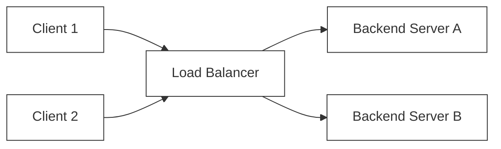
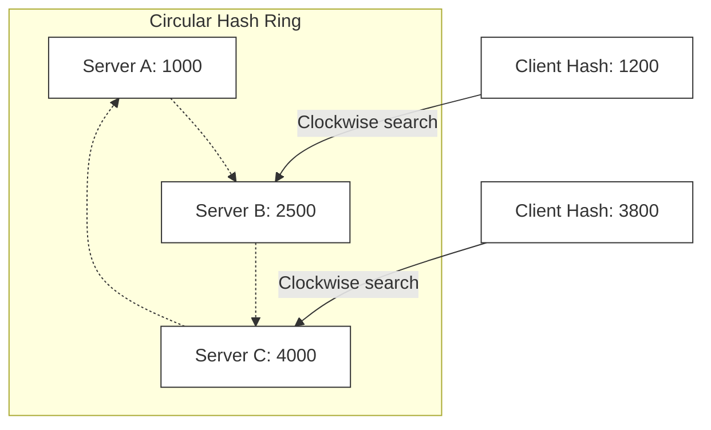

# 🔬 Lab 04: Reverse Proxy & Load Balancer from Scratch

In this laboratory, you will build a central traffic cop of modern systems: a **Layer 7 Reverse Proxy & Load Balancer**. You will implement algorithms to distribute client requests across multiple backend upstream servers, set up active background health checks to detect and eject dead servers, and learn how to forward client headers transparently.

---

## 1. 💡 The Core Concepts

A **Load Balancer** sits between clients and a cluster of backend servers. Its primary responsibilities are to prevent any single server from becoming a bottleneck, mask backend server topologies, and guarantee high availability.



### Layer 4 (L4) vs. Layer 7 (L7) Load Balancing

1. **Layer 4 (Transport Layer)**:
   - Operates strictly on raw TCP/UDP streams and IP addresses.
   - It does *not* read or inspect application-layer payloads. It opens a connection to a backend and routes bytes blindly.
   - **Advantage**: Ultra-fast, low CPU overhead.
2. **Layer 7 (Application Layer)**:
   - Operates on application-layer protocols (HTTP, WebSocket, gRPC).
   - It fully terminates the client's HTTP connection, parses the headers, paths, cookies, and parameters, and opens a *new* request to the chosen backend server.
   - **Advantage**: Smart routing (e.g., route `/api/v1` to Server A, and `/static` to CDN-backed Server B), header injection, SSL/TLS termination, and stickiness.

---

### Upstream Selection Strategies

To choose which backend server handles an incoming request, the load balancer applies selection strategies:

- **Round Robin**: Distributes requests sequentially across backends in a cyclic loop.
- **Weighted Round Robin**: Backends are assigned integer weights representing their processing power. Servers with higher weights receive proportionally more requests.
- **IP Hashing**: Hashes the client's IP address and maps it to a backend index. This guarantees that requests from a specific client IP always land on the *same* backend server, making it excellent for local state caching (Session Stickiness).

---

### Active vs. Passive Health Checks

A load balancer must never forward traffic to a crashed or saturated backend server.
1. **Active Health Checking**: The load balancer runs a background loop that actively "pings" a health endpoint (e.g. `GET /health`) on each backend at regular intervals. If a backend fails several consecutive checks, it is marked as `UNHEALTHY` and removed from the active pool. Once it passes several checks in a row, it is marked `HEALTHY` and restored.
2. **Passive Health Checking**: The load balancer monitors real-world client traffic. If a backend returns consecutive network timeouts or `HTTP 5xx Server Errors` during actual user requests, the load balancer dynamically marks it as unhealthy.

---

## 2. 🌍 Real-Life Production Applications

Every high-traffic application relies on load balancers:
- **Nginx Upstream**: A powerful reverse proxy that supports L7 routing, round-robin, and IP hash balancing with passive health monitoring.
- **HAProxy**: A specialized, highly performant L4/L7 load balancer famous for handling hundreds of thousands of concurrent connections.
- **Envoy Proxy**: A modern service proxy used heavily as a sidecar in service meshes (like Istio) to route L7 microservice traffic.

---

## 3. ⚙️ Advanced System Design Add-Ons

### Consistent Hashing & Backend Scaling
Traditional IP Hashing calculates the backend index using the modulo operator:
$$\text{Index} = \text{Hash}(\text{ClientIP}) \pmod N$$
where $N$ is the number of active backend servers.
- **The Problem**: What happens if a backend server crashes or a new server is added to the pool? $N$ changes. Consequently, the modulo formula changes for almost every client IP, and suddenly all clients get routed to *different* servers. This invalidates all local server-side caches, leading to a massive database cache-stampede.
- **The Solution**: **Consistent Hashing**.
  - We map both the backend servers and client IPs onto a virtual circular ring (a 32-bit integer keyspace from $0$ to $2^{32}-1$).
  - When a client request arrives, we locate the client's hash position on the ring, and walk clockwise until we hit the first backend server hash.
  - If a server is added or removed, **only a small fraction** of the keyspace keys need to be reassigned, leaving the rest of the clients undisturbed and preserving their cached sessions!



---

## 🛠️ Laboratory Challenge: Implement a L7 Load Balancer

### The Goal
Your challenge is to implement a Layer 7 HTTP reverse proxy and load balancer in TypeScript. You will:
1. Parse incoming requests and proxy them to an upstream pool using **Round Robin**, **Weighted Round Robin**, or **IP Hash** strategies.
2. Inject routing headers (like `X-Forwarded-For` and `X-Forwarded-Host`) to ensure upstreams know the true origin.
3. Coordinate active background **Health Checks** to monitor upstream servers, dynamically removing dead instances and restoring recovered ones.

### Step-by-Step Implementation Guide
1. Open the `/starter` folder.
2. Read `index.ts` to examine the interface layout.
3. Write your implementation and run the tests:
   ```bash
   npm test
   ```
4. Watch your load balancer dynamic selector pass the test suite!
