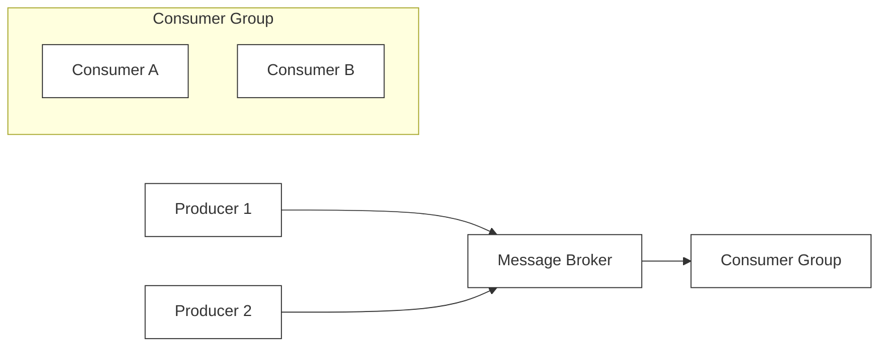

# 🔬 Lab 05: Pub-Sub Message Queue from Scratch

In this laboratory, you will explore the asynchronous nervous system of microservice architectures: a **Pub-Sub Message Queue**. You will design and build a message broker that handles dynamic topics, coordinates multi-consumer groups, tracks consumer read offsets, supports explicit message acknowledgements (ACK/NACK) with visibility timeouts, and automatically routes failed messages to a Dead-Letter Queue (DLQ).

---

## 1. 💡 The Core Concepts

A **Message Queue** is an architectural component used to decouple system processes. By storing messages in an intermediate broker, producers can fire-and-forget requests without waiting for consumer processing, making the system highly resilient to traffic spikes (buffering/load-leveling).



### Key Message Queue Topologies

1. **Point-to-Point (Queue)**:
   - A single message is sent to a queue and is processed by **exactly one** consumer.
   - Used for distributed task processing (worker queues).
2. **Publish-Subscribe (Pub-Sub)**:
   - A producer publishes a message to a **Topic**. The broker automatically duplicates and delivers the message to **all** active subscriber groups registered for that topic.

---

### Partitions, Consumer Groups, and Offsets

To scale message consumption horizontally, modern brokers (like Apache Kafka) employ **Consumer Groups**:
- **Topic Partitions**: A topic is divided into multiple partitions (shards) to distribute storage and load.
- **Consumer Group**: A collection of consumers cooperating to read from a topic.
  - Each partition is assigned to **exactly one** consumer within a group at any given time.
  - If you have 3 partitions and 3 consumers, each consumer reads 1 partition.
  - If you add a 4th consumer, it remains idle because all partitions are allocated (no overlapping reads!).
- **Offsets**: The broker maintains an integer pointer (the `Offset`) for each consumer group representing the last successfully read message index in a partition. This allows consumers to crash and resume exactly where they left off without losing data.

---

### The Reliability Loop: ACK, NACK, and Visibility Timeouts

When a consumer pulls a message, the broker cannot immediately assume it was successfully processed.
- **Visibility Timeout**: When a message is fetched by a consumer, it enters an invisible/locked state. Other consumers cannot see or fetch it for a configured duration (e.g., 30 seconds).
- **ACK (Acknowledge)**: The consumer finishes processing and sends an `ACK` to the broker. The broker permanently deletes the message (or marks it as committed).
- **NACK (Negative Acknowledge) / Timeout**: The consumer encounters an error and sends a `NACK` (or the visibility timeout expires). The broker makes the message visible again, allowing another consumer to fetch and retry it.
- **Dead-Letter Queue (DLQ)**: If a message is NACKed repeatedly (exceeding a maximum retry threshold like 3 attempts), the broker extracts it from the active topic and moves it to a specialized **Dead-Letter Queue** for manual inspection, preventing "poison-pill" messages from blocking the system forever.

---

## 2. 🌍 Real-Life Production Applications

Every robust, event-driven backend ecosystem uses message queues:
- **RabbitMQ**: A highly flexible, standard AMQP message broker that excels in complex message routing, explicit ACK/NACK behaviors, and visibility timeouts.
- **Apache Kafka**: A distributed append-only commit log designed for high-throughput stream processing, relying heavily on topics, partitions, consumer groups, and client-committed offsets.
- **Amazon SQS**: A fully managed queuing service that popularize the visibility timeout and Dead-Letter Queue patterns.

---

## 3. ⚙️ Advanced System Design Add-Ons

### Append-Only Log Persistence (How Kafka Stores Data)
Traditional databases rely on highly complex B-Tree indexes, which require random disk I/O operations and slow down write performance.
- **The Concept**: Write incoming messages strictly to the end of a file: an **Append-Only Log**.
- **Why It is Ultra-Fast**: Appending to a file is a sequential write. Modern disks (even spinning hard drives!) perform sequential writes exceptionally fast, matching RAM speeds in some configurations.
- **The Index**: To read a specific offset $O$, the broker uses a separate index file mapping offset numbers to their precise byte-positions in the large log file, making reads an instant $O(1)$ disk seek.

```
Append-Only File:
[Msg 0: Offset 0] -> [Msg 1: Offset 1] -> [Msg 2: Offset 2] -> [Msg 3: Offset 3] ... (Sequential Writes)
```

---

## 🛠️ Laboratory Challenge: Implement a Event Message Broker

### The Goal
Your challenge is to build an in-memory Pub-Sub Message Broker featuring robust, enterprise-grade reliability patterns. You will:
1. Handle dynamic topic registration and message publishing.
2. Coordinate **Consumer Groups** to balance partition/topic reads.
3. Manage **Offsets** to track read progress.
4. Implement **Visibility Timeouts** and client **ACK/NACK** APIs.
5. Setup a retry counter that automatically routes failing poison-pill messages to a **Dead-Letter Queue (DLQ)**.

### Step-by-Step Implementation Guide
1. Open the `/starter` folder.
2. Read `index.ts` to examine the interface layout.
3. Write your implementation and run the tests:
   ```bash
   npm test
   ```
4. Watch the tests turn **GREEN** as your broker manages asynchronous worker pools safely!
