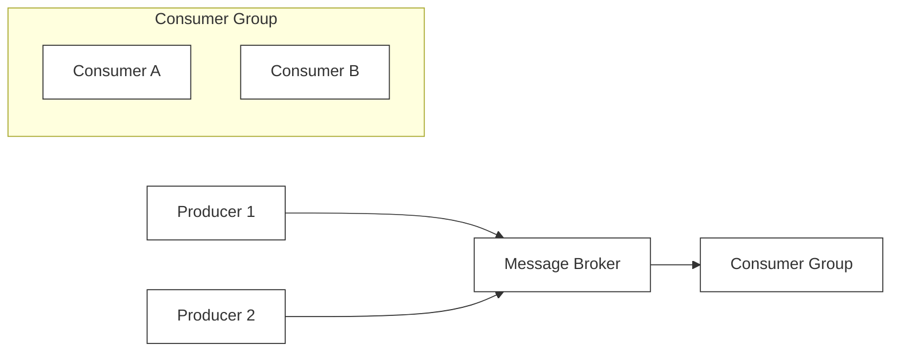

# 🔬 Lab 05: Pub-Sub Message Queue from Scratch

In this laboratory, you will explore the asynchronous nervous system of microservice architectures: a **Pub-Sub Message Queue**. You will design and build a message broker that handles dynamic topics, coordinates multi-consumer groups, tracks consumer read offsets, supports explicit message acknowledgements (ACK/NACK) with visibility timeouts, and automatically routes failed messages to a Dead-Letter Queue (DLQ).

---

## 1. 💡 The Core Concepts

A **Message Queue** is an architectural component used to decouple system processes. By storing messages in an intermediate broker, producers can fire-and-forget requests without waiting for consumer processing, making the system highly resilient to traffic spikes (buffering/load-leveling).



### Key Message Queue Topologies

1. **Point-to-Point (Queue)**:
   - A single message is sent to a queue and is processed by **exactly one** consumer.
   - Used for distributed task processing (worker queues).
2. **Publish-Subscribe (Pub-Sub)**:
   - A producer publishes a message to a **Topic**. The broker automatically duplicates and delivers the message to **all** active subscriber groups registered for that topic.

---

## 2. 🧮 Message Queue Mechanics & Mathematics

A reliable broker must manage visibility states, offsets, and retries strictly.

### A. Visibility Timeout State Transition
When consumer $C$ consumes message $M$ at time $t_{\text{now}}$, the broker locks the message by updating its visibility threshold:
$$t_{\text{visible}} = t_{\text{now}} + T_{\text{visibility}}$$
where $T_{\text{visibility}}$ is the visibility timeout in milliseconds.
- Any consume request at $t_{\text{request}}$ will only be allowed to see and process the message if:
  $$t_{\text{request}} \ge t_{\text{visible}}$$
- Otherwise, the message is locked and hidden from consumers.

---

### B. Consumer Offset Commits
Consumer offsets are represented as an absolute zero-indexed counter. When consumer $C$ acknowledges (`ACK`) a message with offset $O$, the committed consumer offset $O_{\text{committed}}$ increments to ensure the next request reads the subsequent message:
$$O_{\text{committed}} = \max(O_{\text{committed}}, O + 1)$$
This ensures that the next consumed message must satisfy:
$$O_{\text{msg}} \ge O_{\text{committed}}$$

---

### C. DLQ Promotion (Poison-Pill Prevention)
If a consumer processes a message and crashes, the message is either explicitly rejected (`NACK`) or its visibility timeout expires. The broker increments its retry count:
$$\text{retryCount} = \text{retryCount} + 1$$
If the message exceeds the maximum allowed retries:
$$\text{retryCount} \ge \text{maxRetries}$$
the broker extracts it from the active topic queue and appends it to the **Dead-Letter Queue (DLQ)**.

---

## 3. 📝 Step-by-Step State Trace Table

Below is the state transition sequence for a broker configured with:
- `visibilityTimeout = 100ms`
- `maxRetries = 2`
- Topic: `'jobs'`, Consumer: `'worker-1'`

| Step | Action | Message State (`retryCount`, `visibleAfter`) | Worker Offset | DLQ Status | Description |
| :--- | :----- | :------------------------------------------ | :------------ | :--------- | :---------- |
| 1    | **Publish** | `msg-1` (retry: 0, visible: 0)              | Offset: 0     | Empty      | Message published to `'jobs'` topic, instantly visible. |
| 2    | **Consume** at $t=1000$ | `msg-1` (retry: 0, visible: 1100)           | Offset: 0     | Empty      | Message locked for 100ms. Returned to worker. |
| 3    | **Consume** at $t=1050$ | `msg-1` (retry: 0, visible: 1100)           | Offset: 0     | Empty      | Request returned `null` because message is locked ($1050 < 1100$). |
| 4    | **NACK** at $t=1060$ | `msg-1` (retry: 1, visible: 0)              | Offset: 0     | Empty      | Message processing failed; lock released, retry count increments. |
| 5    | **Consume** at $t=1070$ | `msg-1` (retry: 1, visible: 1170)           | Offset: 0     | Empty      | Message re-consumed and locked for another 100ms. |
| 6    | **NACK** at $t=1080$ | `msg-1` (retry: 2, visible: 0)              | Offset: 0     | `[msg-1]`  | Retry count hits `maxRetries = 2`. Message promoted to DLQ, removed from `'jobs'`. |

---

## 4. 🏛️ Architectural Comparison: RabbitMQ vs. Kafka vs. SQS

| Feature | RabbitMQ (AMQP) | Apache Kafka (Log-Centric) | Amazon SQS (Serverless Queue) |
| :------ | :-------------- | :------------------------- | :---------------------------- |
| **Model** | Push-based worker model | Pull-based append-only log | Pull-based message buffer |
| **Ordering** | Guaranteed per-queue | Guaranteed strictly per-partition | Best-effort (Standard) / Strict (FIFO) |
| **Message Lifetime**| Deleted instantly upon ACK | Persisted up to retention limit | Deleted on explicit ACK (up to 14 days) |
| **Scale Limits** | Excellent for complex routing | Massive scale (millions of msgs/sec) | Highly scalable managed serverless |

---

## 5. ⚠️ Common Pitfalls & Anti-Patterns

1. **Visibility Timeout Too Short (Double Processing)**: If $T_{\text{visibility}}$ is shorter than the time it takes a worker to process the message, the lock will expire, allowing another worker to consume the same message concurrently. This results in duplicate executions.
2. **Head-of-Line Blocking**: If a consumer group reads sequentially and encounters a "poison pill" message that crashes the worker, the partition offset is never committed. The worker restarts and consumes the same failing message indefinitely, blocking all subsequent messages. (Solution: Use DLQ).
3. **Array Splicing Shifts**: Splicing an array queue to delete/move dead messages shifts all subsequent indices. If consumers rely on absolute index offsets, this shifts active messages backward, causing consumers to skip messages. (Solution: Track logical `offset` numbers separately from array indices).
4. **Memory Exhaustion (Out of Memory)**: Retaining messages indefinitely in-memory without compaction, limits, or disk flushing will eventually crash the broker process.

---

## 📌 Key Takeaways

- **Decoupling and Buffering** protect fragile downstream microservices from being overwhelmed during unexpected load surges.
- **Visibility Locks** enable concurrent worker scale-out, ensuring a single message is only handled by one worker at any given microsecond.
- **Dead-Letter Queues (DLQ)** provide isolated quarantine zones for persistently failing tasks, ensuring normal traffic continues unhindered.
- **Sequential Offsets** maintain progress checkpoints, allowing systems to safely recover from unexpected crashes and restarts without data loss.

---

## 🛠️ Laboratory Challenge: Implement a Event Message Broker

### Step-by-Step Implementation Guide
1. Open the `/starter` folder.
2. Read `index.ts` to examine the interface layout.
3. Write your implementation and run the tests:
   ```bash
   npx vitest run
   ```
4. Watch the tests turn **GREEN** as your broker manages asynchronous worker pools safely!

