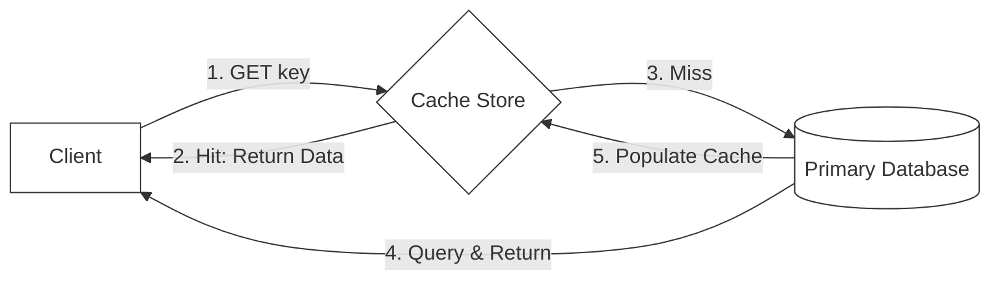

# 🔬 Lab 06: Distributed Cache (Redis Clone) from Scratch

In this laboratory, you will build a high-performance, low-latency in-memory data store: a **Redis Clone**. You will implement the standard **REdis Serialization Protocol (RESP)** to parse incoming network buffers, build an in-memory hash store supporting Time-To-Live (TTL) key expirations, and implement the **Least Recently Used (LRU)** eviction algorithm to limit cache memory bounds.

---

## 1. 💡 The Core Concepts

A **Distributed Cache** stores hot data in fast, volatile system memory (RAM) to avoid expensive database lookups and slow disk I/O, dramatically boosting read speeds.



### The REdis Serialization Protocol (RESP)

Redis communicates over TCP using a simple, highly efficient, text-based serialization protocol called **RESP**. RESP messages are split into lines separated by `\r\n` (CRLF). The first character of a line determines the data type:

- **Simple Strings**: Starts with `+` (e.g. `+OK\r\n`)
- **Errors**: Starts with `-` (e.g. `-ERR unknown command\r\n`)
- **Integers**: Starts with `:` (e.g. `:1000\r\n`)
- **Bulk Strings**: Starts with `$` (binary-safe strings). Specified as `$length\r\ncontent\r\n`. (e.g. `$5\r\nhello\r\n`). A null bulk string is represented as `$-1\r\n`.
- **Arrays**: Starts with `*`. Specified as `*length\r\n`. Followed by `length` other RESP elements.
  - E.g., the command `SET key value` is sent as a RESP array of 3 bulk strings:
    `*3\r\n$3\r\nSET\r\n$3\r\nkey\r\n$5\r\nvalue\r\n`

---

### Key Expirations: Lazy vs. Active Deletion

How does the cache handle keys that have an expiration timer (TTL)?
1. **Lazy Deletion**: When a client requests a key (e.g., `GET key`), the server checks the expiration timestamp. If the current time is greater than the expiration timestamp, the server deletes the key and returns `null` (cache miss).
   - *Problem*: If an expired key is never requested again, it sits in RAM forever, causing a silent memory leak!
2. **Active Deletion**: The server runs an active background worker that periodically polls the database:
   - Randomly samples a set of keys with TTLs.
   - Deletes any expired keys found.
   - If more than 25% of the sampled keys are expired, it repeats the process to quickly reclaim memory.
   - *Alternative*: Maintain a **Min-Heap** of keys ordered by their expiration timestamp. The worker checks the root of the heap; if the root is not expired, no other key is expired, making checks highly efficient ($O(1)$ lookup!).

---

### LRU (Least Recently Used) Eviction Algorithm

What happens when the cache fills up and runs out of allocated memory? It must evict old keys to make room for new ones.
The **LRU** algorithm evicts the key that has not been accessed for the longest duration.
- To implement LRU in **$O(1)$ constant time** for both inserts and retrievals, we combine two data structures:
  1. **Doubly Linked List**: Represents the access order of keys. The most recently accessed key is moved to the `Head`; the oldest accessed key is at the `Tail`.
  2. **Hash Map**: Maps keys to their corresponding nodes in the linked list, allowing instant $O(1)$ lookups.

```
LRU Structure:
Head <-> [Node A: Most Recent] <-> [Node B] <-> [Node C: Least Recent] <-> Tail
                      ^                                ^
                      |---------------- (Hash Map) ----|
```

---

## 2. 🌍 Real-Life Production Applications

In-memory databases dominate high-performance system designs:
- **Redis**: Famous for its single-threaded event loop, which prevents concurrency lock contentions, and its wide array of data structures (Hashes, Sets, Sorted Sets, Streams).
- **Memcached**: A simple, multi-threaded key-value caching system designed purely for object caching, utilizing structured slab memory allocation.

---

## 3. ⚙️ Advanced System Design Add-Ons

### Redis Replication & High Availability
To prevent a single cache crash from taking down an entire platform, Redis supports **Master-Replica Replication**:
1. **Asynchronous Replication**: The Master node handles write commands (`SET`, `DEL`) and asynchronously streams those write bytes down to Replica nodes.
2. **Active Snapshot Sync**: When a replica connects, the master takes a background snapshot of its entire database (RDB snapshot), writes it sequentially to disk, and sends it to the replica. The replica loads this file into memory to synchronize its base state, then applies the streaming updates.
3. **Failover (Sentinel/Raft)**: If the master crashes, monitoring sentinels detect the failure and hold a vote to promote one of the replicas to become the new master, ensuring high availability.

---

## 🛠️ Laboratory Challenge: Implement a Distributed Cache

### The Goal
Your challenge is to build a low-level, high-speed TCP caching server in TypeScript. You will:
1. Parse incoming **RESP Protocol buffers** representing command arrays.
2. Build an in-memory hash cache with a strict **LRU eviction policy** that ejects keys when maximum capacity is exceeded.
3. Implement lazy and active **TTL Key Expirations** using timestamp lookups and min-heap tracking.
4. Support core commands: `GET`, `SET`, `DEL`, and `EXPIRE`.

### Step-by-Step Implementation Guide
1. Open the `/starter` folder.
2. Examine `index.ts` to see the class contracts.
3. Write your implementation and run the tests:
   ```bash
   npm test
   ```
4. Watch your Redis clone parse bytes and manage in-memory storage like a production server!
