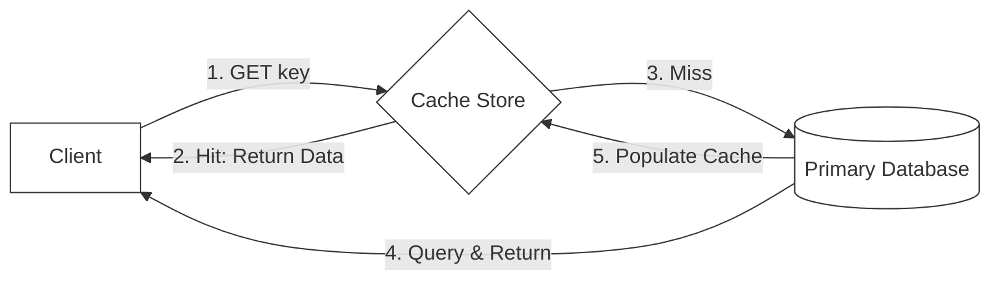

# 🔬 Lab 06: Distributed Cache (Redis Clone) from Scratch

In this laboratory, you will build a high-performance, low-latency in-memory data store: a **Redis Clone**. You will implement the standard **REdis Serialization Protocol (RESP)** to parse incoming network buffers, build an in-memory hash store supporting Time-To-Live (TTL) key expirations, and implement the **Least Recently Used (LRU)** eviction algorithm to limit cache memory bounds.

---

## 1. 💡 The Core Concepts

A **Distributed Cache** stores hot data in fast, volatile system memory (RAM) to avoid expensive database lookups and slow disk I/O, dramatically boosting read speeds.



### The REdis Serialization Protocol (RESP)

Redis communicates over TCP using a simple, highly efficient, text-based serialization protocol called **RESP**. RESP messages are split into lines separated by `\r\n` (CRLF). The first character of a line determines the data type:

- **Simple Strings**: Starts with `+` (e.g. `+OK\r\n`)
- **Errors**: Starts with `-` (e.g. `-ERR unknown command\r\n`)
- **Integers**: Starts with `:` (e.g. `:1000\r\n`)
- **Bulk Strings**: Starts with `$` (binary-safe strings). Specified as `$length\r\ncontent\r\n`. (e.g. `$5\r\nhello\r\n`). A null bulk string is represented as `$-1\r\n`.
- **Arrays**: Starts with `*`. Specified as `*length\r\n`. Followed by `length` other RESP elements.
  - E.g., the command `SET key value` is sent as a RESP array of 3 bulk strings:
    `*3\r\n$3\r\nSET\r\n$3\r\nkey\r\n$5\r\nvalue\r\n`

---

## 2. 🧮 Caching Algorithms & Mathematics

A reliable cache must handle eviction and expirations with strict, predictable logic.

### A. LRU (Least Recently Used) Mechanics
To maintain an $O(1)$ constant time complexity for insertions and lookups, we pair a **Hash Map** with a **Doubly Linked List** representing access recency.

1. **Insert / Touch Node ($x$)**:
   - Remove node $x$ from its current position in the list:
     $$x.\text{prev}.\text{next} = x.\text{next}$$
     $$x.\text{next}.\text{prev} = x.\text{prev}$$
   - Append node $x$ to the head (most recently used position):
     $$x.\text{next} = \text{head}$$
     $$x.\text{prev} = \text{head}.\text{prev}$$
     $$\text{head}.\text{prev}.\text{next} = x$$
     $$\text{head}.\text{prev} = x$$
2. **Eviction**:
   - If the size exceeds capacity, evict the node at the tail (least recently used position):
     $$\text{evictKey} = \text{tail}.\text{prev}.\text{key}$$
     $$\text{tail}.\text{prev} = \text{tail}.\text{prev}.\text{prev}$$
     $$\text{tail}.\text{prev}.\text{next} = \text{tail}$$
   - Delete `evictKey` from the Hash Map.

---

### B. TTL Expirations: Lazy vs. Active
Keys are configured with an absolute expiration epoch timestamp:
$$t_{\text{expires}} = t_{\text{now}} + \text{ttlSeconds} \times 1000$$

1. **Lazy Expiration**: On retrieval (`GET key`), evaluate:
   - If $t_{\text{now}} > t_{\text{expires}}$, invoke `delete(key)` and return `null`.
2. **Active Expiration (Background Worker)**:
   - Periodically sample a set $S$ of $20$ random keys with TTLs.
   - Delete any key where $t_{\text{now}} > t_{\text{expires}}$.
   - If more than 25% of sampled keys were expired ($\ge 5$ keys), repeat immediately to clean RAM aggressively.

---

## 📝 LRU Trace Table Example

Below is the state transitions of an LRU cache with **capacity = 3**:

| Step | Action | Access List (MRU $\rightarrow$ LRU) | Map Keys | Eviction | Description |
| :--- | :----- | :---------------------------------- | :------- | :------- | :---------- |
| 1    | `set(A, 1)` | `[A]`                               | `{A}`    | None     | `A` inserted at the head. |
| 2    | `set(B, 2)` | `[B, A]`                            | `{A, B}` | None     | `B` inserted at the head. |
| 3    | `set(C, 3)` | `[C, B, A]`                         | `{A,B,C}`| None     | `C` inserted at the head. Capacity reached. |
| 4    | `get(A)`    | `[A, C, B]`                         | `{A,B,C}`| None     | `A` read; moved to head (MRU). `B` is now LRU. |
| 5    | `set(D, 4)` | `[D, A, C]`                         | `{A,C,D}`| `B`      | `D` inserted; capacity exceeded. `B` evicted. |

---

## 🏛️ Redis High Availability, Sentinel, and Clustering

To scale cache clusters in production, Redis supports three distinct layouts:

1. **Master-Replica Replication**: Asynchronous data streaming from a master node to multiple read-only replicas to scale read operations.
2. **Redis Sentinel**: A distributed monitoring system that checks node health. If the master fails, Sentinel runs a consensus vote (using a Raft-like protocol) to elect and promote a replica to Master, securing High Availability.
3. **Redis Cluster (Sharding)**: Horizontally splits the key space into exactly **16,384 logical Hash Slots**:
   $$\text{Slot} = \text{CRC16}(\text{key}) \pmod{16384}$$
   - Active slots are divided among multiple master nodes, allowing the cluster to scale writes linearly.

---

## ⚠️ Common Pitfalls & Anti-Patterns

1. **Cache Stampede / Thundering Herd**: When a hot cache key expires, thousands of concurrent requests miss the cache and hit the database simultaneously, crashing it. (Solution: Mutual Exclusion Locking or Early Expiration Refresh).
2. **Cache Penetration**: Malicious clients query non-existent keys (e.g. `GET /user/-9999`) repeatedly, bypass the cache completely, and overwhelm the primary database. (Solution: Cache null values or deploy a **Bloom Filter**).
3. **Cache Avalanche**: Setting the exact same TTL on thousands of hot keys. When they expire at the exact same second, the DB crashes under the sudden load. (Solution: Inject a random **TTL Jitter**).
4. **Slab Memory Fragmentation**: Drastic variations in key-value sizes can cause memory fragmentation in caches like Memcached, wasting RAM.

---

## 📌 Key Takeaways

- **REdis Serialization Protocol (RESP)** is a simple, binary-safe, low-parsing-overhead communication layer.
- **LRU Cache Strategy** maintains strict memory caps by linking a Hash Map with a Doubly Linked List for $O(1)$ operations.
- **Active TTL expiration** samples keys dynamically to prevent dormant keys from leaking RAM.
- **Sentinel and Cluster Sharding** scale writes and guarantee fault tolerance in enterprise networks.

---

## 🛠️ Laboratory Challenge: Implement a Distributed Cache

### Step-by-Step Implementation Guide
1. Open the `/starter` folder.
2. Examine `index.ts` to see the class contracts.
3. Write your implementation and run the tests:
   ```bash
   npx vitest run
   ```
4. Watch your Redis clone parse bytes and manage in-memory storage like a production server!

