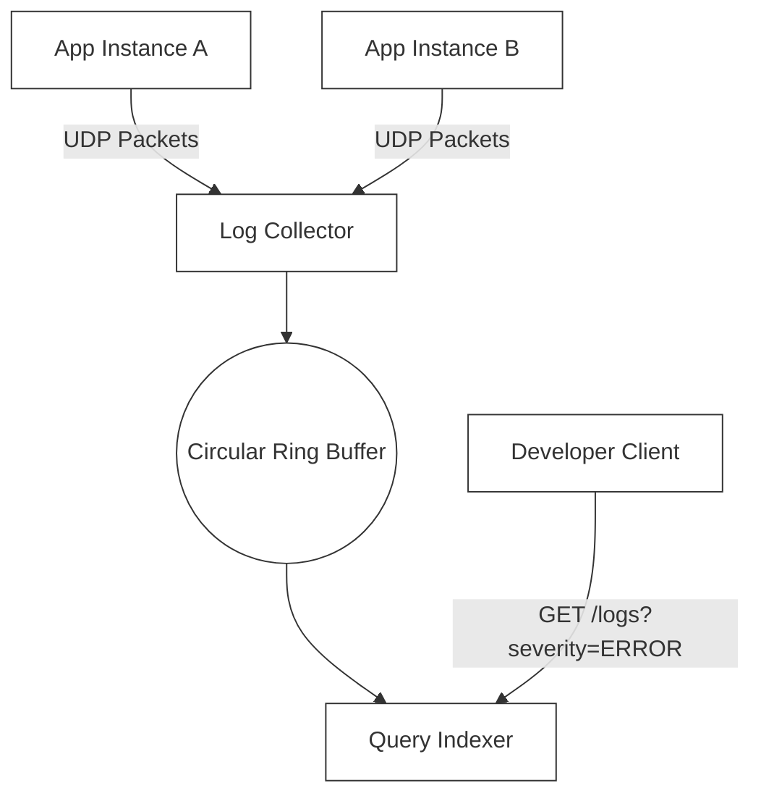

# 🔬 Lab 07: Mini Log Aggregator from Scratch

In this laboratory, you will build a central hub for microservice telemetry: a **High-Performance Log Aggregator**. You will design and implement a UDP-based log ingestion socket that receives streaming logs, writes them sequentially to a memory-backed circular **Ring Buffer** to sustain high write frequencies, and serves structured log searches using dynamic timestamp range and severity level indexes.

---

## 1. 💡 The Core Concepts

A **Log Aggregator** is the backbone of observability. Applications across a cluster send their diagnostic logs (stdout/stderr) to a centralized service, enabling backend engineers to audit errors, track request flows, and diagnose outages.



### Log Shipping: UDP vs. TCP

For high-volume logging under heavy system load, choice of transport protocol is critical:
- **TCP (Transmission Control Protocol)**:
  - Guarantees complete packet delivery and correct ordering.
  - *Problem*: Introduces significant network overhead (handshakes, ACK wait packets). If the network is congested, TCP pauses the sender application to apply backpressure. Throttling your primary application just to send logs is highly undesirable in production!
- **UDP (User Datagram Protocol)**:
  - A connectionless, lightweight "fire-and-forget" protocol.
  - *Advantage*: Zero connection setup overhead, zero transmission stalls. If the log aggregator is overloaded, packets are dropped quietly, letting the main application run at maximum speed.
  - **The Production Choice**: Most log routers (like Datadog agent or StatsD) use UDP or unix sockets for local telemetry delivery!

---

### Circular Ring Buffers (Zero-Allocation Memory Writes)
What happens if your server receives 100,000 log packets per second? Allocating new memory arrays for every single log message will trigger massive Garbage Collection (GC) pauses in Node.js/Python, slowing down the server.
- **The Solution**: A **Circular Ring Buffer**.
  - A pre-allocated, fixed-size memory array of capacity $C$.
  - We maintain two integer pointers: `WritePointer` (where new elements are added) and `ReadPointer`.
  - When new logs arrive, we write them at `WritePointer` and advance it:
    $$\text{WritePointer} = (\text{WritePointer} + 1) \pmod C$$
  - If the buffer is full, new data simply **overwrites** the oldest data, establishing a sliding window of historical logs in memory without allocating new memory segments.

---

## 2. 🌍 Real-Life Production Applications

Production scale telemetry frameworks rely on these structures:
- **Vector (by Datadog)**: A high-performance, Rust-based log agent that routes gigabytes of logs using concurrent ring buffers.
- **Splunk & ELK Stack (Elasticsearch, Logstash, Kibana)**: Systems that ingest streams, index them sequentially, and provide Kibana dashboards for range filtering.
- **rsyslog**: The standard Linux logging daemon which utilizes fast UDP ingestion ports to aggregate system logs across servers.

---

## 3. ⚙️ Advanced System Design Add-Ons

### Log Rotation (Disk Capacity Defenses)
When persisting logs to disk, a system must prevent logs from filling up the partition, which causes the entire OS kernel to crash:
- **Log Rotation**:
  - The active log writer writes to a file `app.log`.
  - Once `app.log` reaches a specific size (e.g. 100MB), the server closes it, renames it to `app.log.1`, compresses it into a `.gz` archive, and opens a fresh, empty `app.log` file.
  - The server maintains a strict limit (e.g. max 10 files). When `app.log.10.gz` is reached, it is permanently deleted, creating a safe, bounded storage cycle.

---

## 🛠️ Laboratory Challenge: Implement a Log Aggregator

### The Goal
Your challenge is to build a low-overhead, central Log Aggregator server in TypeScript. You will:
1. Initialize a **UDP Socket Receiver (`dgram`)** to collect streaming log strings.
2. Store log items in a pre-allocated circular **Ring Buffer** to avoid GC pressure.
3. Extract and parse standard log formats: `<TIMESTAMP> [<SEVERITY>] <MESSAGE>`
4. Build a **Log Indexer** supporting range queries: filter logs by timestamp windows and severity levels (`INFO`, `WARN`, `ERROR`).
5. Serve query results over a clean HTTP JSON endpoint.

### Step-by-Step Implementation Guide
1. Open the `/starter` folder.
2. Check out `index.ts` to examine the UDP socket wrapper and Ring Buffer contract.
3. Write your implementation and run the tests:
   ```bash
   npm test
   ```
4. Watch your aggregator ingest high-speed UDP streams and execute indexed queries successfully!
