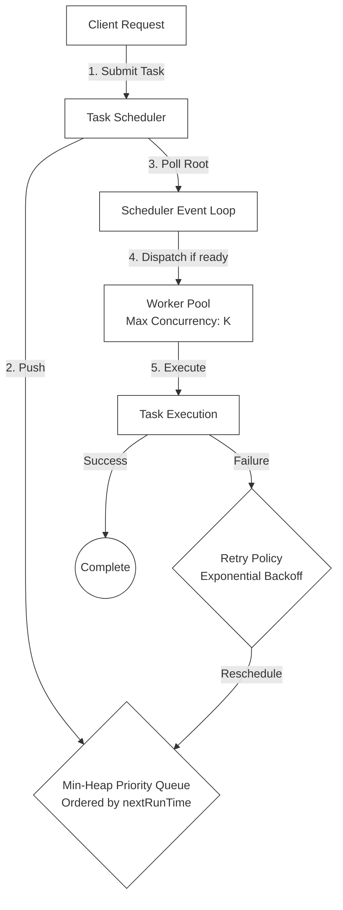

# 🔬 Lab 08: Priority Task Scheduler from Scratch

In this laboratory, you will build a robust, high-performance, asynchronous **Priority Task Scheduler** in TypeScript. You will implement a custom **Min-Heap (Priority Queue)** data structure to track tasks ordered strictly by their next scheduled execution time, design a **Worker Pool** to execute tasks within strict concurrency limits, and build support for **Cron-style recurring triggers** and **Exponential Backoff Retries**.

---

## 1. 💡 The Core Concepts

Asynchronous task schedulers are critical in distributed systems to defer work (e.g., sending emails, generating reports, processing batch files) and ensure reliable execution without blocking the user-facing web servers.



### The Min-Heap (Priority Queue)

To schedule tasks to run at a specific future time (e.g., "run Task A in 5 seconds, Task B in 2 seconds"), a scheduler must quickly identify which task needs to run next.
- **Naïve Approach**: Keep tasks in an array and sort them every tick. This is extremely inefficient, taking $O(N \log N)$ sorting time.
- **Min-Heap Approach**: A binary tree where the parent node is always smaller than or equal to its children. The root of the tree (index `0` in array representation) is always the task with the minimum (earliest) `nextRunTime`.
  - **Peek**: $O(1)$ constant time lookup for the earliest task.
  - **Insert**: $O(\log N)$ logarithmic time to insert a new task and bubble it up to its correct position.
  - **Extract Min**: $O(\log N)$ logarithmic time to remove the root, replace it with the last element, and trickle it down to restore heap properties.

---

### Worker Pool Concurrency Limits

An unrestricted scheduler could try to run 10,000 tasks at the same exact second, exhausting the server's CPU, database connection limits, and RAM, leading to an eventual crash.
A **Worker Pool** manages resource consumption by:
1. Maintaining a counter of currently active executing tasks.
2. Throttling dispatching: If active tasks reach the limit `maxConcurrency` ($K$), no new tasks are popped from the heap.
3. Queueing up remaining tasks in the min-heap until active workers finish.

---

### Exponential Backoff & Retry Policies

In production networks, transient failures (such as temporary external API timeouts or database locks) are common. Schedulers must not immediately discard failed tasks; they should retry them using a robust backoff strategy:
- **Exponential Backoff**: Instead of retrying immediately (which could overwhelm a recovering database), the delay increases exponentially with each failed attempt:
  $$\text{Delay} = \text{initialDelay} \times \text{multiplier}^{\text{attempt}}$$
- **Jitter (Randomness)**: Adding a random offset (e.g., +/- 10%) to the backoff delay to prevent many failing workers from retrying at the exact same millisecond (preventing "thundering herd" issues).

---

## 2. 🌍 Real-Life Production Applications

Production systems use sophisticated schedulers to coordinate complex workloads:
- **BullMQ**: A highly reliable Node.js library backed by Redis. It stores delayed tasks in Redis Sorted Sets (`ZSET`), which act as distributed min-heaps, sorting tasks by their epoch timestamp.
- **Temporal / Cadence**: Orchestration engines that maintain highly robust state histories of workflows, ensuring tasks are executed exactly-once across complex, distributed microservices.
- **Celery / Sidekiq**: Standard task queues for Python and Ruby respectively, widely used to shift heavy operations out of the request-response thread into background worker processes.

---

## 3. ⚙️ Advanced System Design Add-Ons

### Distributed Locks & Exactly-Once Semantics
When scaling your web application, you will run multiple instances of your scheduler service.
If three scheduler servers poll the same database queue, how do you prevent them from running the same task three times?
1. **Pessimistic Locking**: Use a database lock during lookup:
   ```sql
   SELECT * FROM tasks WHERE status = 'PENDING' AND next_run <= NOW() FOR UPDATE SKIP LOCKED LIMIT 10;
   ```
   This reserves the tasks for the specific server instance, skipping already locked rows.
2. **Distributed Mutex**: Use Redis to acquire a short-lived key (using `NX` lock parameters) representing the task ID before running it.

---

## 🛠️ Laboratory Challenge: Implement a Priority Task Scheduler

### The Goal
Your challenge is to build a robust, asynchronous scheduler in TypeScript. You will:
1. Build a low-level **Min-Heap** data structure to hold scheduled task entries.
2. Implement a **Worker Pool** that throttles active executions based on a maximum concurrency limit.
3. Build a **TaskScheduler** engine that runs an execution loop, polls the min-heap, handles cron-like recurrence calculations, and reschedules tasks with exponential backoff on failure.

### Step-by-Step Implementation Guide
1. Open the `/starter` folder.
2. Examine `index.ts` to see the class contracts.
3. Write your implementation and run the tests:
4. Watch your priority queue organize tasks, throttle concurrency, and handle retries seamlessly!
