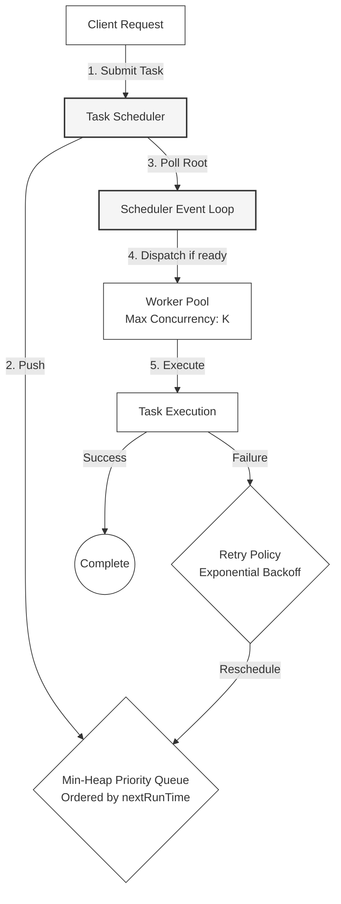

# 🔬 Lab 08: Priority Task Scheduler from Scratch

In this laboratory, you will build a robust, high-performance, asynchronous **Priority Task Scheduler** in TypeScript. You will implement a custom **Min-Heap (Priority Queue)** data structure to track tasks ordered strictly by their next scheduled execution time, design a **Worker Pool** to execute tasks within strict concurrency limits, and build support for **periodic interval recurring triggers** and **Exponential Backoff Retries**.

---

## 1. 💡 The Core Concepts

Asynchronous task schedulers are critical in distributed systems to defer heavy work (e.g., sending emails, generating reports, processing batch files) and ensure reliable execution without blocking the user-facing request thread.

### System Architecture Flow



### The Min-Heap (Priority Queue)

To schedule tasks to run at a specific future time (e.g., "run Task A in 5 seconds, Task B in 2 seconds"), a scheduler must quickly identify which task needs to run next.
- **Naïve Approach**: Keep tasks in an array and sort them every tick. This is extremely inefficient, taking $O(N \log N)$ sorting time.
- **Min-Heap Approach**: A binary tree where the parent node is always smaller than or equal to its children. The root of the tree (index `0` in array representation) is always the task with the minimum (earliest) `nextRunTime`.
  - **Peek**: $O(1)$ constant time lookup for the earliest task.
  - **Insert**: $O(\log N)$ logarithmic time to insert a new task and bubble it up to its correct position.
  - **Extract Min**: $O(\log N)$ logarithmic time to remove the root, replace it with the last element, and trickle it down to restore heap properties.

#### Heap representation in an Array:
For any node at index $i$:
- Left Child: $2i + 1$
- Right Child: $2i + 2$
- Parent Node: $\lfloor \frac{i - 1}{2} \rfloor$

---

### Worker Pool Concurrency Limits

An unrestricted scheduler could try to run 10,000 tasks at the same exact second, exhausting CPU, database connection limits, and RAM, leading to an eventual crash.
A **Worker Pool** manages resource consumption by:
1. Maintaining a counter of currently active executing tasks (`activeWorkers`).
2. Throttling dispatching: If active tasks reach the limit `maxConcurrency` ($K$), no new tasks are popped from the heap.
3. Queueing up remaining tasks in the min-heap until active workers finish.

---

### Exponential Backoff & Retry Policies

In production networks, transient failures (such as temporary external API timeouts or database locks) are common. Schedulers must not immediately discard failed tasks; they should retry them using a robust backoff strategy:
- **Exponential Backoff**: Instead of retrying immediately (which could overwhelm a recovering database), the delay increases exponentially with each failed attempt:
  $$\text{Delay}(c) = \text{initialDelay} \times b^{c}$$
  where:
  - $b$ is the base multiplier (e.g., $2$)
  - $c$ is the current `retryCount`
  - $\text{initialDelay}$ is the seed backoff (e.g., $100\text{ ms}$)

- **With Jitter (Randomness)**: Adding a random offset to the backoff delay prevents a cluster of failing workers from retrying at the exact same millisecond, preventing "thundering herd" issues:
  $$\text{DelayWithJitter}(c) = \text{Delay}(c) \times (1 \pm \text{RandomJitter})$$

---

## 2. 🪐 Detailed Mathematical Models & Mechanics

### Cron & Interval Recurrence Math

Recurring schedules are formulated either via fixed intervals $\Delta t$ or Cron cron expressions:
- **Interval-Based**: When a task completes at $T_{\text{end}}$, the next scheduled time is:
  $$T_{\text{next}} = T_{\text{end}} + \Delta t$$
- **Cron-Style**: Resolves dynamic calendar periods. A cron parser expands the expression `min hour day month day-of-week` to find the minimum upcoming time matching the pattern:
  $$T_{\text{next}} = \min \{ t \in \text{TimeSlots} \mid t > T_{\text{now}} \wedge \text{matches}(t, \text{cronExpr}) \}$$

### Exponential Backoff Delay Table

Assuming $\text{initialDelay} = 100\text{ ms}$ and multiplier base $b = 2$:

| Attempt ($c$) | Formula | Backoff Delay (ms) | Cumulative Delay (ms) |
|---|---|---|---|
| 1 | $100 \times 2^1$ | $200\text{ ms}$ | $200\text{ ms}$ |
| 2 | $100 \times 2^2$ | $400\text{ ms}$ | $600\text{ ms}$ |
| 3 | $100 \times 2^3$ | $800\text{ ms}$ | $1400\text{ ms}$ |
| 4 | $100 \times 2^4$ | $1600\text{ ms}$ | $3000\text{ ms}$ |

---

## 3. 📝 Chronological Execution Trace Table

Here is a worked example trace of a Task Scheduler with `maxConcurrency = 2`:

| Time (ms) | Heap Queue State (Ordered by runAt) | Active Workers | Event Description |
|---|---|---|---|
| **0** | `[T1(runAt: 0), T2(runAt: 10), T3(runAt: 20)]` | 0 | Scheduler starts. T1 popped, active workers increments to 1. |
| **5** | `[T2(runAt: 10), T3(runAt: 20)]` | 1 | T1 is running. |
| **10** | `[T2(runAt: 10), T3(runAt: 20)]` | 1 | T2 is due. Popped, active workers increments to 2. |
| **15** | `[T3(runAt: 20)]` | 2 | Both slots busy. T3 is due in 5ms but cannot run yet (throttled). |
| **30** | `[T3(runAt: 20)]` | 1 | T1 completes successfully. Slot freed, T3 popped instantly, active workers back to 2. |
| **40** | `[]` | 2 | T2 fails. Rescheduled with backoff (+200ms) at time **240ms**. Heap becomes `[T2(runAt: 240)]`. |
| **60** | `[T2(runAt: 240)]` | 0 | T3 completes. Active workers drops to 0. Scheduler goes to sleep until 240ms. |

---

## 4. 🌍 Real-Life Production Applications

Production systems use sophisticated schedulers to coordinate complex workloads:
- **BullMQ**: A highly reliable Node.js library backed by Redis. It stores delayed tasks in Redis Sorted Sets (`ZSET`), which act as distributed min-heaps, sorting tasks by their epoch timestamp.
- **Temporal / Cadence**: Orchestration engines that maintain highly robust state histories of workflows, ensuring tasks are executed exactly-once across complex, distributed microservices.
- **Celery / Sidekiq**: Standard task queues for Python and Ruby respectively, widely used to shift heavy operations out of the request-response thread into background worker processes.

---

## ⚙️ Advanced System Design Add-Ons

### Distributed Locks & Exactly-Once Semantics
When scaling your web application, you will run multiple instances of your scheduler service.
If three scheduler servers poll the same database queue, how do you prevent them from running the same task three times?
1. **Pessimistic Locking**: Use a database lock during lookup:
   ```sql
   SELECT * FROM tasks 
   WHERE status = 'PENDING' AND next_run <= NOW() 
   FOR UPDATE SKIP LOCKED 
   LIMIT 10;
   ```
   This reserves the tasks for the specific server instance, skipping already locked rows.
2. **Distributed Mutex**: Use Redis to acquire a short-lived key (using `NX` lock parameters) representing the task ID before running it.

---

## 🚫 Common Pitfalls & Anti-Patterns

### 1. The Sleep Poll Anti-Pattern
Checking for tasks by polling every $100\text{ ms}$ (e.g., `setInterval`) even when the next task is scheduled $2\text{ hours}$ in the future wastes CPU cycles and database resources.
- **Modern Solution**: Use adaptive timer scheduling. Calculate the delay to the absolute next minimum scheduled time, set a wake-up timer (`setTimeout`), and clear/reschedule the timer if a closer task is scheduled.

### 2. Thundering Herd Problem
When multiple workers or instances retry failed tasks at the exact same epoch millisecond, they can cause cascading outages on downstream databases or downstream APIs.
- **Modern Solution**: Always apply randomized Jitter to the exponential backoff delay to spread out the retry requests over a wider window.

### 3. Out-Of-Memory Heap Growth
Allowing users to submit millions of deferred tasks directly into an in-memory Heap will eventually crash the Node process.
- **Modern Solution**: Store the active scheduled queue in Redis `ZSET` or SQL databases, pulling only a small bounded batch (e.g., the top 100 items) into the local scheduler memory heap.

---

## 🛠️ Laboratory Challenge: Implement a Priority Task Scheduler

### The Goal
Your challenge is to build a robust, asynchronous scheduler in TypeScript. You will:
1. Build a low-level **Min-Heap** data structure to hold scheduled task entries.
2. Implement a **Worker Pool** that throttles active executions based on a maximum concurrency limit.
3. Build a **TaskScheduler** engine that runs an execution loop, polls the min-heap, handles recurrence calculations, and reschedules tasks with exponential backoff on failure.

### Step-by-Step Implementation Guide
1. Open the `/starter` folder.
2. Examine `index.ts` to see the class contracts.
3. Write your implementation and run the tests:
   ```bash
   npm run test
   ```
4. Watch your priority queue organize tasks, throttle concurrency, and handle retries seamlessly!

---

## 🎯 Key Takeaways

1. **Binary Min-Heaps** provide the optimal data structure for scheduled events, offering $O(1)$ peek time and $O(\log N)$ inserts and extractions.
2. **Resource Constraints** must be strictly controlled through **Concurrency Workers Throttling** to protect downstream systems from resource starvation.
3. **Robust Retry Loops** require **Exponential Backoff and Jitter** to ensure highly resilient distributed systems that avoid secondary self-inflicted DDoS events.
