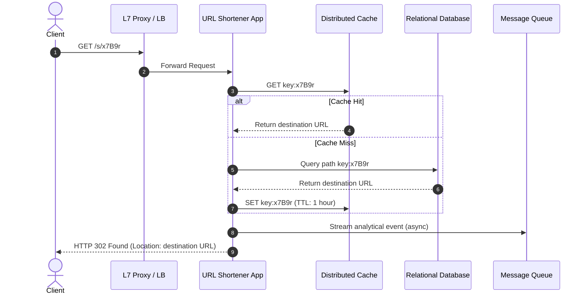

# 🔬 Lab 09: System Design URL Shortener (Syllabus Capstone)

In this final capstone laboratory, you will assemble a complete, production-grade **System Design URL Shortener** in TypeScript. You will build a custom **Base62 Encoder** to generate compact path keys, design a high-throughput **URL Redirection Server** that integrates **Caching** to reduce database read pressure, and implement an asynchronous **Analytics Dispatcher** that streams page-view metrics to a **Message Queue** for offline analysis.

---

## 1. 💡 The Core Concepts

A **URL Shortener** (e.g., bit.ly, tinyurl.com) takes a long destination URL and compresses it into a short, unique link. When a client visits the short link, the server quickly resolves it to the destination URL and performs an HTTP redirect.



---

### The Base62 Encoding System

How do we convert database numeric primary keys (like `ID = 104729`) into compact, human-readable path suffixes?
- We use the **Base62** character set, consisting of 62 alphanumeric characters:
  `0123456789abcdefghijklmnopqrstuvwxyzABCDEFGHIJKLMNOPQRSTUVWXYZ`
- **Why Base62?** Unlike Base64, Base62 does not use `+` or `/` characters, which have special meanings in URL paths and query strings. It is completely safe to embed directly into paths without URL encoding.
- **Scaling Growth**:
  - Suffix length $1$: $62^1 = 62$ unique URLs
  - Suffix length $5$: $62^5 \approx 916$ million unique URLs
  - Suffix length $7$: $62^7 \approx 3.5$ trillion unique URLs!
- **Algorithm**: To encode a 64-bit integer, we perform successive modulo division by 62:
  ```
  125 % 62 = 1  (character at index 1 -> '1')
  125 / 62 = 2
  2 % 62   = 2  (character at index 2 -> '2')
  Result = "21"
  ```

---

### HTTP Redirections: 301 vs. 302

When redirecting the user, which HTTP status code should we choose?

| Metric | `301 Moved Permanently` | `302 Found` (or `307 Temporary`) |
| :--- | :--- | :--- |
| **Browser Caching** | Cached aggressively. Browser never hits the server again for this key. | Never cached. Browser hits the server on every single click. |
| **Server Load** | **Extremely Low**. Requests bypass the shortener after the first lookup. | **Higher**. Every redirection requires server-side routing logic. |
| **Analytics Accuracy**| **Poor**. Schedulers cannot track returning visitors or exact link clicks. | **100% Precise**. Every single click can be audited, geolocated, and counted. |
| **SEO Authority** | Transfers 90-99% of link juice to the destination URL. | Transfers minimal link authority. |

In commercial systems, **302 Found** is highly preferred because link analytics (tracking advertising click-through rates, bot detection, region demographics) are the core business model!

---

### High-Throughput Write & Read Segregation

For global scale, a URL shortener must handle massive read traffic spikes:
1. **Cache-Aside Strategy**: Hot links are stored in an in-memory Cache (Lab 06). Lookups take $< 1\text{ms}$. Only cache misses hit the persistent database.
2. **Write Isolation**: Creating short URLs uses a pre-allocated ID generator (such as Twitter Snowflake or DB auto-increment ranges).
3. **Asynchronous Analytical pipelines**: Incrementing click counts directly in a primary SQL database on every page click causes lock contention and eventually crashes the database. Instead, the application streams click events to a Message Queue (Lab 05) immediately, allowing background consumers to batch-update the database asynchronously.

---

## 2. 🌍 Real-Life Production Applications

- **Bit.ly**: Manages billions of links, utilizing large distributed Redis clusters to cache hot path keys, and Apache Kafka to stream trillions of click events to Hadoop/Spark clusters for offline analytics.
- **TinyURL**: One of the oldest URL shorteners, designed to leverage large MySQL master-replica systems to coordinate sequential auto-incrementing blocks.

---

## 3. ⚙️ Advanced System Design Add-Ons

### Distributed ID Allocation (Snowflake IDs)
If we have 10 web servers generating new short URLs, how do we guarantee they don't generate the same numeric ID without a central database lock?
- **Twitter Snowflake**: Generates a 64-bit unique integer structured as:
  - `1-bit` unused sign bit.
  - `41-bits` timestamp in milliseconds (gives 69 years of capacity).
  - `10-bits` machine ID / datacenter ID (allows up to 1024 unique server nodes).
  - `12-bits` sequence number (local counter incrementing up to 4096 within the same millisecond).
  - This allows servers to generate unique, chronologically ordered, 64-bit IDs fully concurrently without any inter-process communication!

---

## 🛠️ Laboratory Challenge: URL Shortener Capstone

### The Goal
Your challenge is to assemble a complete, production-grade URL Shortener service in TypeScript. You will:
1. Build a custom **Base62 Encoder/Decoder** utility.
2. Create a **URLShortenerService** that integrates:
   - A mockable database layer.
   - An in-memory cache to speed up read redirections.
   - An analytical Message Queue dispatcher to publish click event streams.
3. Build a fully functional **HTTP Server** that serves:
   - `POST /shorten`: Creates a short link key from a long URL.
   - `GET /s/:key`: Instantly resolves the key and issues a `302 Found` redirection.

### Step-by-Step Implementation Guide
1. Open the `/starter` folder.
2. Examine `index.ts` to see the interfaces and class structures.
3. Write your implementation and run the tests:
4. Witness a complete, high-performance, modular system architecture working in unison!
